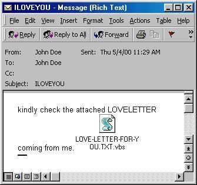

<!-- _class: title -->
# IT-Security

---
<!-- _class: biglist -->
# Inhalte

- CIA-Triade und Grundbegriffe
- Kryptographie
- Identity & Access Management (IAM)
- Secure Software Development Lifecycle (SSDLC)
- Netzwerk- und IoT-Sicherheit
- ISMS - Information Security Management System
- Schwachstellen- und Patchmanagement
- KI-Sicherheit

<!-- _notes:
Die CIA-Triade ist die gemeinsame Sprache der Vorlesungsreihe. Kryptographie schützt unter anderem Vertraulichkeit und Integrität; Identity & Access Management regelt Identitäten und Berechtigungen; sichere Softwareentwicklung und Patchmanagement behandeln Risiken über den Lebenszyklus. Zur Vorbereitung hilft es, jedes spätere Beispiel mindestens einem Schutzziel zuzuordnen.
-->

---
<!-- _class: huge -->
# Sicherheitsmaßnahmen im Unternehmen

Welche Maßnahmen (Prozesse, Regeln, Tools, Schulungen,... ) werden in Ihrem Unternehmen ergriffen, um sich vor IT-Sicherheitsvorfällen zu schützen?

> **Denkanstoß:** Welche Maßnahme verhindert einen Angriff, welche erkennt ihn und welche begrenzt den Schaden?

<!-- _notes:
Sicherheitsmaßnahmen lassen sich nach ihrer Wirkung ordnen: Eine Firewall filtert Verkehr, Schulungen verringern Bedienfehler, Backups unterstützen die Wiederherstellung und Patchmanagement schließt bekannte Schwachstellen. Die Maßnahmen ergänzen sich; keine einzelne davon macht ein Unternehmen vollständig sicher.
-->

---

<!-- _class: chapter -->
# ILOVEYOU
## Der Urknall der IT-Sicherheit

<!-- _notes:
Dieser Abschnitt behandelt Der Urknall der IT-Sicherheit. Die folgenden Beispiele zeigen, wie sich das Thema auf konkrete Sicherheitsentscheidungen anwenden lässt. Zur Vorbereitung ist wichtig, die verwendeten Begriffe an einem eigenen Beispiel erklären zu können. Die Verbreitung benötigte sowohl das Öffnen des Anhangs als auch die Nutzung des Outlook-Adressbuchs.
-->
---
<!-- _class: biglist -->
# Steckbrief: VBS.LoveLetter.A

- **Datum:** 4. Mai 2000 (Ausgangspunkt: Philippinen)
- **Schaden & Ausmaß:** 5–10 Mrd. USD Schaden, ~10 % aller Rechner weltweit infiziert
- **Datei & UI-Falle:** `LOVE-LETTER-FOR-YOU.TXT.vbs`  
  (Endung `.vbs` standardmäßig ausgeblendet $\rightarrow$ wirkte wie `.TXT`)
- **System:** Windows Script Host (WSH) führte VBScript direkt ohne Sandbox aus

<!-- _notes:
Eine "Sandbox" ist eine isolierte Ausführungsumgebung, die einem Programm nur eingeschränkten Zugriff auf das restliche System erlaubt – der Windows Script Host von damals hatte so etwas nicht, ein gestartetes Skript durfte tun, wozu der angemeldete Nutzer berechtigt war (Dateien löschen, E-Mails versenden, Registry ändern). Das macht den zweiten Aufzählungspunkt so gefährlich: Windows blendete die Dateiendung `.vbs` standardmäßig aus, sodass die Datei wie ein harmloser Text (`.TXT`) aussah, beim Doppelklick aber als vollwertiges, uneingeschränktes Skript lief. Diese Kombination aus "UI täuscht" und "keine Ausführungs-Schranken" ist der technische Kern des gesamten Falls und wird im Fazit am Ende wieder aufgegriffen.
-->

---

# Die Köder-Mail

<!-- _notes:
Die E-Mail mit dem Betreff „ILOVEYOU“ nutzte Neugier und Vertrauen, um den Anhang öffnen zu lassen. Die vermeintliche Textdatei endete tatsächlich auf `.vbs` und war damit ein ausführbares Skript. Die Täuschung der Benutzeroberfläche und die weitreichenden Rechte des Skripts wirkten zusammen.
-->

---

# Funktionsweise des Wurms

- **1. Persistenz:**
  - Schreibt sich in den Registry-Autostart (`HKLM\...\Run`)
  - Kopiert sich als `MSKernel32.vbs` ins Windows-Systemverzeichnis
- **2. Schneeball-Verbreitung:**
  - Liest Outlook-Adressbuch (MAPI) aus und mailt sich an alle Kontakte
  - Führte weltweit zum Zusammenbruch von Mail-Servern
- **3. Zerstörung:**
  - Überschreibt Multimediadateien & Skripte (`.jpg`, `.js`, ...) mit eigenem Code
  - Versteckt `.mp3`-Dateien und ersetzt sie durch Wurm-Kopien

<!-- _notes:
MAPI (Messaging Application Programming Interface) ist die Schnittstelle, über die Outlook-Adressbücher und E-Mail-Funktionen von anderen Programmen angesprochen werden können – der Wurm nutzte diese Schnittstelle völlig ungeprüft, um sich selbst an alle gespeicherten Kontakte zu verschicken. Genau das erzeugte den "Schneeball-Effekt": Jeder infizierte Rechner verschickte die Mail an im Schnitt Dutzende neue Opfer, wodurch sich die Verbreitung exponentiell beschleunigte und Mail-Server weltweit unter der Last zusammenbrachen. Die drei Schritte (Persistenz, Verbreitung, Zerstörung) sind ein Muster, das bei vielen späteren Malware-Familien wiederkehrt.
-->

---

# Täter & Rechtliches Nachspiel

- **Täter & Motiv:** 
  - Onel de Guzman (24, Informatikstudent in Manila)
  - Ziel: Passwörter für kostenlosen Internetzugang abgreifen
- **Rechtsvakuum:**
  - Keine Cybercrime-Gesetze auf den Philippinen im Mai 2000
  - Weder klassischer Diebstahl noch Sachbeschädigung lag juristisch vor
- **Konsequenz:**
  - Anklage fallen gelassen (*Nulla poena sine lege*)
  - Beschleunigte Verabschiedung des *E-Commerce Act (RA 8792)*

<!-- _notes:
"Nulla poena sine lege" (lateinisch: "keine Strafe ohne Gesetz") ist ein Grundprinzip des Strafrechts – man kann niemanden für eine Handlung bestrafen, die zum Tatzeitpunkt noch nicht gesetzlich verboten war. Genau das war hier der Fall: Auf den Philippinen gab es 2000 schlicht kein Gesetz, das das Schreiben und Verbreiten von Schadsoftware unter Strafe stellte, daher konnte de Guzman nicht verurteilt werden. RA 8792 (Republic Act 8792) ist die Gesetzesnummer des daraufhin verabschiedeten E-Commerce Act, der diese Lücke schloss. Guter Diskussionspunkt: Recht hinkt Technik oft hinterher – das ist bis heute ein wiederkehrendes Muster bei neuen Angriffsformen.
-->

---
<!-- _class: biglist -->
# Fazit & Lehren

- **Secure by Default:** Gefährliche Skripte dürfen nicht standardmäßig per Doppelklick starten
- **UI-Design ist Security:** Das Verstecken von Dateiendungen täuscht Anwender
- **Schnittstellensicherheit:** Unbeschränkter API-Zugriff (wie Outlook MAPI) ist fatal
- **Awareness:** Technik versagt, wenn Nutzer emotional manipuliert werden

<!-- _notes:
Secure by Default bedeutet, dass riskante Funktionen ohne ausdrückliche Freigabe nicht aktiv sind. Awareness hilft, täuschende Nachrichten zu erkennen, ersetzt aber keine technische Begrenzung. Der ILOVEYOU-Fall zeigt, dass Benutzeroberfläche, Ausführungsrechte und Schnittstellen gemeinsam über den Schaden entscheiden.
-->

---
<!-- _class: chapter -->
# Die CIA-Triade
## Schutzziele & Sicherheitsbegriffe

<!-- _notes:
Dieser Abschnitt behandelt Schutzziele & Sicherheitsbegriffe. Die folgenden Beispiele zeigen, wie sich das Thema auf konkrete Sicherheitsentscheidungen anwenden lässt. Zur Vorbereitung ist wichtig, die verwendeten Begriffe an einem eigenen Beispiel erklären zu können. CIA bezeichnet Confidentiality, Integrity und Availability: Vertraulichkeit, Integrität und Verfügbarkeit.
-->
---
# Angreifer & Motivationen

**Wer greift an?**
- **Cyberkriminelle:** Finanzieller Profit, RaaS, Erpressung
- **Staaten (APTs):** Spionage, Geopolitik, Sabotage
- **Insider:** Sabotage, Datendiebstahl, Rache
- **Hacktivisten & Script Kiddies:** Protest, Aufmerksamkeit, Spieltrieb

**Was sind die Ziele?**
- **Finanzen:** Lösegeld (Ransomware), Konten
- **Know-how:** Wirtschaftsspionage, IP-Diebstahl
- **Disruption:** Produktionsausfall, DoS
- **Macht & Kontrolle:** Botnetze, Persistenz

<!-- _notes:

> **Begriffe:** RaaS = vermietete Erpressungssoftware; APT = langfristig agierende Angreifergruppe; IP = geistiges Eigentum. Die englischen Langformen stehen in den Notes.

RaaS bedeutet „Ransomware as a Service“: Kriminelle bieten Erpressungssoftware und Infrastruktur als Dienstleistung an. APT steht für „Advanced Persistent Threat“ und bezeichnet langfristig agierende Angreifergruppen. „IP-Diebstahl“ meint hier Intellectual Property, also geistiges Eigentum wie Patente oder Konstruktionspläne, nicht Internet Protocol.
-->

---
# Die CIA-Triade – Überblick

- **Confidentiality (Vertraulichkeit):** Schutz vor unbefugter Offenlegung (*Nur wer darf, liest mit*).
- **Integrity (Integrität):** Schutz vor unbefugter Modifikation (*Daten bleiben korrekt & unverfälscht*).
- **Availability (Verfügbarkeit):** Gewährleistung des Zugriffs (*Systeme stehen bei Bedarf bereit*).

<!-- _notes:
Die CIA-Triade (Confidentiality, Integrity, Availability) ist das zentrale Grundmodell der gesamten Vorlesungsreihe – praktisch jedes spätere Thema (Kryptographie, IAM, Netzwerksicherheit) lässt sich einem oder mehreren dieser drei Schutzziele zuordnen. Die drei Merksätze in Klammern sollten sitzen bleiben: "Nur wer darf, liest mit" (C), "Daten bleiben korrekt" (I), "Systeme stehen bereit" (A). Wichtig zu erwähnen: CIA hat nichts mit der US-Behörde zu tun, das ist eine reine Abkürzungskollision.
-->

---
# C: Vertraulichkeit (Confidentiality)

- **Ziel:** Schutz sensibler Informationen vor unbefugtem Zugriff & Abfluss
- **Verschlüsselung in 3 Zuständen:**
  - *Data in Transit:* TLS, HTTPS, VPN (Schutz vor Abhören / Sniffing)
  - *Data at Rest:* AES-256, BitLocker (Schutz bei physischem Verlust / Diebstahl)
  - *Data in Use:* Secure Enclaves / Confidential Computing
- **Schutzmaßnahmen:**
  - **Least Privilege:** Zugriffsberechtigungen auf das absolute Minimum beschränken
  - **Authentifizierung & MFA:** Strenge Identitätsprüfung vor Freigabe
  - **Klassifizierung:** Öffentlich $\rightarrow$ Intern $\rightarrow$ Vertraulich $\rightarrow$ Streng vertraulich

<!-- _notes:

Vertraulichkeit bedeutet, dass nur Berechtigte Daten lesen. Die genannten Produkte und Protokolle sind Beispiele für spätere Vertiefungen.

Die drei Zustände (Data in Transit/at Rest/in Use) sind ein wichtiges Ordnungsprinzip: Daten müssen an jeder Stelle ihres "Lebenszyklus" separat geschützt werden – ein verschlüsselter Transportweg (TLS) nützt nichts, wenn die Datenbank am Ende im Klartext liegt. "Secure Enclaves / Confidential Computing" bedeutet, dass Daten sogar während der Verarbeitung im Arbeitsspeicher in einem abgeschotteten, isolierten Prozessorbereich verarbeitet werden, den selbst der Betreiber des Servers nicht einsehen kann – das ist ein noch recht junges Feld und muss hier nicht vertieft werden.
-->

---
# I: Integrität (Integrity)

- **Ziel:** Korrektheit, Vollständigkeit und Unverfälschtheit von Daten & Systemen
- **Kryptographische Schutzmechanismen:**
  - **Kryptographische Hashes (z.B. SHA-256):** Eindeutige Prüfsummen gegen Manipulation
  - **Digitale Signaturen:** Hash + Asymmetrische Kryptographie (Beweis für Urheberschaft & Unversehrtheit)
  - **Code Signing & SBOM:** Schutz der Software-Lieferkette vor Schadcode
- **Systemische Kontrollen:**
  - Schreib-Zugriffskontrolle & strikte Eingabevalidierung (Input Validation)
  - Transaktionssicherheit (ACID) & revisionssicheres Logging

<!-- _notes:
ACID (Atomicity, Consistency, Isolation, Durability) ist ein Prinzip aus dem Datenbankbereich, das sicherstellt, dass eine Transaktion entweder vollständig oder gar nicht durchgeführt wird – ein Beispiel: Bei einer Überweisung darf niemals nur die Abbuchung, aber nicht die Gutschrift erfolgen.
-->

---
# A: Verfügbarkeit (Availability)

- **Ziel:** Zeitgerechte und verlässliche Erreichbarkeit von Daten und Systemen
- **Wichtige Metriken:**
  - **SLA & Uptime:** 99,9 % (~8,7 h Downtime/Jahr) bis 99,999 % („Five Nines“)
  - **RPO & RTO:** Akzeptabler Datenverlust (RPO) und maximale Wiederanlaufzeit (RTO)
- **Maßnahmen zur Ausfallsicherheit:**
  - **Redundanz:** RAID, Load Balancer, Active/Active-Cluster, Geo-Redundanz
  - **3-2-1-Backup-Regel:** 3 Kopien, 2 verschiedene Medientypen, 1 Offsite (+ Unveränderbarkeit)
  - **DDoS-Abwehr:** Anycast-Netzwerke, Traffic Scrubbing, WAF & Rate Limiting

<!-- _notes:
SLA steht für "Service Level Agreement" – eine vertraglich zugesicherte Verfügbarkeit, z. B. 99,9 %. Wichtig ist das Gefühl für die Größenordnung: 99,9 % klingt nach sehr viel, erlaubt aber immer noch rund 8,7 Stunden Ausfall pro Jahr, während "Five Nines" (99,999 %) nur wenige Minuten Ausfall im Jahr bedeutet – und entsprechend viel teurer in der Umsetzung ist. RAID (Redundant Array of Independent Disks) verteilt Daten auf mehrere Festplatten, damit der Ausfall einer einzelnen Platte nicht zum Datenverlust führt. Die 3-2-1-Regel ist eine einfache Faustregel fürs Backup, die sich gut einprägt und in der Praxis extrem verbreitet ist.
-->

---
# Der Balanceakt (CIA-Trade-Offs)

Die Schutzziele stehen häufig in natürlicher Konkurrenz:

- **C vs. A:**  
  Strikte Verschlüsselung & Isolation verlangsamt oder blockiert Zugriff im Notfall.

- **I vs. A:**  
  Aufwendige Prüfungen und Sperren belasten die Systemperformance.

> **Beispiel:** Ein Notfallzugang verbessert die Verfügbarkeit, kann aber die Vertraulichkeit schwächen. Deshalb braucht er enge Rechte und Protokollierung.

<!-- _notes:
I kann in Konkurrenz stehen (z. B. wenn strikte Verschlüsselung die Prüfung der Datenintegrität durch Dritte erschwert). Kernaussage: Die CIA-Triade ist kein Zustand, den man einmal erreicht und dann hat, sondern ein ständiger Abwägungsprozess – 100% Sicherheit in allen drei Zielen gleichzeitig ist praktisch nicht erreichbar, jede Entscheidung ist ein Kompromiss. Gutes Beispiel für die Diskussion: ein Notfallzugriff auf verschlüsselte Systeme im Krankenhaus, wenn ein Patient akut behandelt werden muss, aber das Passwort nicht griffbereit ist.
-->

---
# Erweiterte Schutzziele

Moderne Sicherheitsmodelle ergänzen die CIA-Triade um zwei Kernaspekte:

- **Authentizität (Authenticity):**  
  - *Echtheit der Identität und des Ursprungs*
  - „Bist du wirklich derjenige, für den du dich ausgibst?“ (MFA, Zertifikate)
- **Zurechenbarkeit / Nicht-Abstreitbarkeit (Non-Repudiation):**  
  - *Beweiskraft von Handlungen*
  - Niemand kann eine getätigte Transaktion leugnen (Signaturen, Audit-Logs)

> **Einordnung:** CIA beschreibt drei grundlegende Schutzziele; Authentizität und Zurechenbarkeit ergänzen das Modell, ersetzen es aber nicht.

<!-- _notes:
Die CIA-Triade beschreibt Vertraulichkeit, Integrität und Verfügbarkeit. Authentizität ergänzt die Frage nach der Echtheit einer Identität oder Nachricht; Nicht-Abstreitbarkeit betrifft die nachweisbare Zuordnung einer Handlung. Digitale Signaturen können Integrität, Authentizität und Zurechenbarkeit unterstützen.
-->

