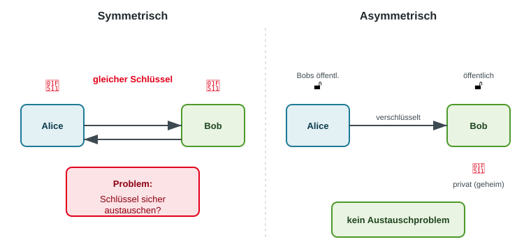
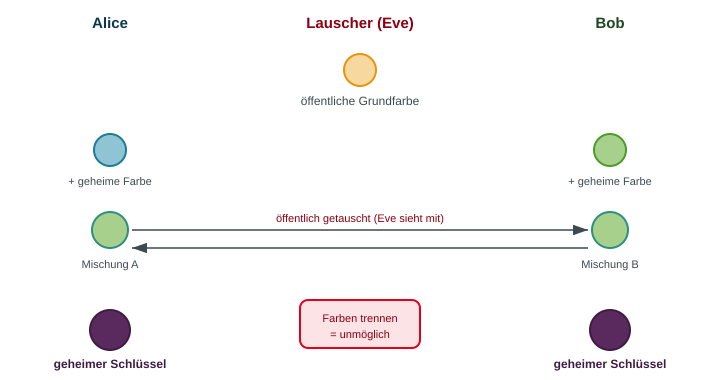
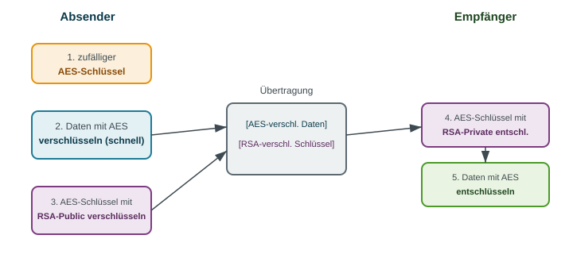
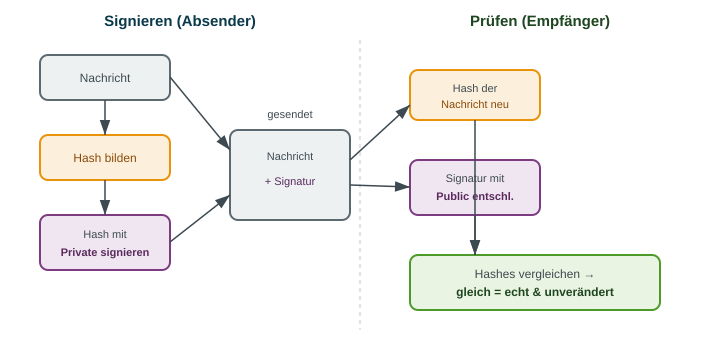

<!-- _class: title -->
# Kryptographie

      

## Von Caesar bis Post-Quantum

<!-- _notes:
Dieser Abschnitt behandelt Von Caesar bis Post-Quantum. Die folgenden Beispiele zeigen, wie sich das Thema auf konkrete Sicherheitsentscheidungen anwenden lässt. Zur Vorbereitung ist wichtig, die verwendeten Begriffe an einem eigenen Beispiel erklären zu können.
-->
---
<!-- _class: biglist -->
# Agenda

- **Grundlagen & Begriffe** – Was ist Krypto, Kerckhoffs, Sym vs. Asym
- **Klassische Verfahren** – Caesar, Vigenère, Kryptoanalyse
- **Exkurs Enigma** – Geniale Maschine, fatale Schwächen
- **Symmetrisch heute** – AES & warum der Modus zählt
- **Schlüsselaustausch & Asymmetrie** – Diffie-Hellman, RSA
- **Kryptographie in der Praxis** – Hybrid, Hashes, Signaturen, PKI
- **Ausblick** – Post-Quantum-Kryptographie

<!-- _notes:
Kurzer Einstieg: Kryptographie ist das Fundament fast aller Sicherheitsmechanismen, die wir in der CIA-Vorlesung kennengelernt haben – TLS, VPN, digitale Signaturen. Roter Faden: Wir folgen der historischen Evolution, weil sich daran die immer gleichen Prinzipien und Fehler am besten zeigen lassen. Überblick, keine Mathe-Vorlesung.
-->

---
<!-- _class: chapter -->
# Grundlagen & Begriffe

## Worum geht es eigentlich?

<!-- _notes:
Dieser Abschnitt behandelt Worum geht es eigentlich?. Die folgenden Beispiele zeigen, wie sich das Thema auf konkrete Sicherheitsentscheidungen anwenden lässt. Zur Vorbereitung ist wichtig, die verwendeten Begriffe an einem eigenen Beispiel erklären zu können.
-->
---
# Kryptographie vs. Kryptoanalyse

- **Kryptographie**: Wissenschaft vom *Entwerfen* sicherer Verfahren
  - Ziel: Nachrichten so schützen, dass Unbefugte sie nicht lesen/verändern können

- **Kryptoanalyse**: Wissenschaft vom *Brechen* dieser Verfahren
  - Ziel: Schwächen finden, Klartext ohne Schlüssel rekonstruieren

- **Kryptologie**: Oberbegriff für beide Disziplinen

> **Merksatz:** Gute Kryptographie entsteht nur im ständigen Wettstreit mit der Kryptoanalyse.

<!-- _notes:
Wichtig für das Verständnis: Die beiden Seiten sind kein Widerspruch, sondern bedingen einander. Ein Verfahren gilt erst dann als sicher, wenn viele kluge Köpfe erfolglos versucht haben, es zu brechen. Analogie: Ein Schloss wird nicht dadurch besser, dass der Hersteller es geheim hält, sondern dadurch, dass Einbrecher weltweit daran gescheitert sind. Das leitet direkt zu Kerckhoffs über.
-->

---
# Ein paar Grundbegriffe

- **Klartext (plaintext)**: die lesbare Ausgangsnachricht
- **Geheimtext (ciphertext)**: die verschlüsselte, unlesbare Form
- **Verschlüsseln / Entschlüsseln**: Umwandlung in beide Richtungen
- **Schlüssel (key)**: geheime Information, die den Vorgang steuert
- **Chiffre (cipher)**: der Algorithmus/das Verfahren selbst

$$\text{Klartext} \xrightarrow[\text{Schl\"ussel}]{\text{Verschl\"usseln}} \text{Geheimtext} \xrightarrow[\text{Schl\"ussel}]{\text{Entschl\"usseln}} \text{Klartext}$$

<!-- _notes:
Diese Begriffe brauchen wir für den Rest der Vorlesung durchgehend. Betonen: Der Algorithmus (Chiffre) und der Schlüssel sind zwei getrennte Dinge. Beispiel geben: Bei einem Zahlenschloss ist der Mechanismus (drehen) bekannt, geheim ist nur die Zahlenkombination.
-->

---
# Was Kryptographie leisten soll

Vier Schutzziele – direkte Verbindung zur CIA-Triade:

- **Vertraulichkeit**: Nur Befugte können mitlesen *(Confidentiality)*
- **Integrität**: Manipulation wird erkannt *(Integrity)*
- **Authentizität**: Der Absender ist wirklich, wer er vorgibt
- **Nicht-Abstreitbarkeit**: Handlungen sind nachweisbar zurechenbar

> Verschlüsselung schützt Vertraulichkeit – aber Integrität, Authentizität & Zurechenbarkeit brauchen *zusätzliche* Bausteine (Hashes, Signaturen).

> **Ausblick:** AES und RSA sind hier nur Namen für Beispiele; ihre Funktionsweise folgt in späteren Kapiteln.

<!-- _notes:
Ein Angreifer kann verschlüsselte Daten immer noch verändern oder sich als jemand anderes ausgeben. Diese vier Ziele sind der Fahrplan – jeden Baustein (Hash, Signatur) ordnen wir später einem Ziel zu. Rückbezug auf CIA-Vorlesung schafft Anknüpfung.
-->

---
# Kerckhoffs' Prinzip (1883)

- **Kernaussage**: Die Sicherheit eines Verfahrens darf **nur vom Schlüssel** abhängen – nicht von der Geheimhaltung des Algorithmus.

- Der Algorithmus darf öffentlich bekannt sein, ohne dass die Sicherheit leidet.

- **Gegenteil**: „Security by Obscurity" – Sicherheit durch Verschleierung

> **Shannon's Maxime:** „Der Feind kennt das System."

<!-- _notes:
Das ist vielleicht das wichtigste Prinzip der ganzen Vorlesung. Begründung: Algorithmen lassen sich reverse-engineeren, Mitarbeiter wechseln den Job, Geheimnisse lecken. Ein Schlüssel dagegen lässt sich einfach austauschen, wenn er kompromittiert ist. Genau deshalb sind moderne Standards wie AES komplett öffentlich dokumentiert und trotzdem – oder gerade deshalb – sicher. Praxisbezug: Proprietäre "Geheim-Verschlüsselungen" von Firmen sind fast immer schnell gebrochen worden (z.B.
-->

---
<!-- _class: normal -->
# Symmetrisch vs. Asymmetrisch

### Symmetrisch
- **Ein** gemeinsamer Schlüssel
- Ver- und Entschlüsseln mit demselben Geheimnis
- Sehr **schnell**
- Problem: Wie tauscht man den Schlüssel sicher aus?
- Beispiel: **AES**

### Asymmetrisch
- **Schlüsselpaar**: öffentlich + privat
- Öffentlicher verschlüsselt, privater entschlüsselt
- Deutlich **langsamer**
- Löst das Austauschproblem
- Beispiel: **RSA**

<!-- _notes:
Das ist die zentrale Unterscheidung der Vorlesung. Analogie symmetrisch: ein Schlüssel für ein Vorhängeschloss, den beide Seiten besitzen – aber wie bekommt der Empfänger den Schlüssel, ohne dass ihn unterwegs jemand kopiert? Analogie asymmetrisch: ein offener Briefkasten, in den jeder einwerfen kann (öffentlicher Schlüssel), aber nur der Besitzer hat den Schlüssel zum Leeren (privater Schlüssel). Dieses Bild später bei RSA wieder aufgreifen. Ankündigen: Wir starten symmetrisch (historisch und praktisch der Ausgangspunkt) und lösen das Austauschproblem später mit Asymmetrie.
-->

---
# Symmetrisch vs. Asymmetrisch – Bild

<!-- _notes:
Die Grafik nochmal in Ruhe erklären: Links teilen sich beide denselben Schlüssel (rot), rechts hat jeder Empfänger ein Paar. Der Knackpunkt links ist der unsichere Kanal, über den der geteilte Schlüssel irgendwie hinkommen muss. Genau dieses Problem motiviert später Diffie-Hellman und RSA. Kurz halten, dient nur der Visualisierung.
-->

---
<!-- _class: chapter -->
# Klassische Verfahren

## Wie alles begann

<!-- _notes:
Dieser Abschnitt behandelt Wie alles begann. Die folgenden Beispiele zeigen, wie sich das Thema auf konkrete Sicherheitsentscheidungen anwenden lässt. Zur Vorbereitung ist wichtig, die verwendeten Begriffe an einem eigenen Beispiel erklären zu können.
-->
---
# Die Caesar-Chiffre

- Jeder Buchstabe wird um eine **feste Zahl** verschoben
- Julius Caesar nutzte eine Verschiebung um **3**

$$\text{A} \rightarrow \text{D}, \quad \text{B} \rightarrow \text{E}, \quad \text{C} \rightarrow \text{F} \ldots$$

- **Beispiel** (Verschiebung 3):
  - Klartext: `HALLO`
  - Geheimtext: `KDOOR`

- **Schlüssel**: die Verschiebung (nur 25 sinnvolle Möglichkeiten!)

<!-- _notes:
Die Antwort: einfach alle 25 Verschiebungen durchprobieren (Brute Force). Das führt zum Begriff des Schlüsselraums – hier winzig. Betonen, dass die Idee der Substitution bis heute in komplexer Form weiterlebt, aber ein zu kleiner Schlüsselraum jedes Verfahren wertlos macht. Eine feste Verschiebung hat nur wenige mögliche Schlüssel; Häufigkeitsanalyse nutzt zusätzlich statistische Eigenschaften der Sprache.
-->

---
# Monoalphabetische Substitution

- Statt fester Verschiebung: **jeder Buchstabe** wird durch einen beliebigen anderen ersetzt
- Schlüsselraum: $26! \approx 4 \times 10^{26}$ Möglichkeiten – riesig!

- **Trotzdem leicht zu brechen.** Warum?
  - Die Struktur der Sprache bleibt erhalten
  - Häufige Buchstaben bleiben häufig – nur unter anderem Namen

<!-- _notes:
Brute Force ist hier unmöglich (10^26!), aber es gibt einen viel klügeren Angriff. Das ist eine der wichtigsten Lektionen der Kryptoanalyse: Man greift nicht die Menge der Schlüssel an, sondern die Struktur des Verfahrens.
-->

---
# Kryptoanalyse: Häufigkeitsanalyse

- Jede Sprache hat eine **typische Buchstabenverteilung**
- Im Deutschen: **E** ist mit Abstand am häufigsten (~17 %), dann N, I, S, R
- Der häufigste Buchstabe im Geheimtext ist also vermutlich das **E**

- **Vorgehen**:
  - Buchstaben im Geheimtext zählen
  - Mit bekannter Sprachstatistik abgleichen
  - Schritt für Schritt das Alphabet rekonstruieren

> Erstmals dokumentiert vom Gelehrten **al-Kindī** (9. Jh.) – die Geburt der Kryptoanalyse.

<!-- _notes:
Die Häufigkeitsanalyse nutzt statistische Merkmale natürlicher Sprache: Im Deutschen tritt beispielsweise E häufig auf. Häufige Zeichen im Geheimtext können daher Hinweise auf Klartextbuchstaben liefern. Ein einzelnes Zeichen beweist noch nichts; weitere Muster wie kurze Wörter und Doppelbuchstaben stützen oder widerlegen die Vermutung.
-->

---
# Die Vigenère-Chiffre

- **Idee**: Verschiebung wechselt pro Buchstabe – gesteuert durch ein **Schlüsselwort**
- Gilt lange als „le chiffre indéchiffrable" (die unknackbare Chiffre)

- **Beispiel** mit Schlüssel `KEY`:

| Klartext | H | A | L | L | O |
|---|---|---|---|---|---|
| Schlüssel | K | E | Y | K | E |
| Geheimtext | R | E | J | V | S |

- Gleicher Klartextbuchstabe → **unterschiedliche** Geheimtextbuchstaben

<!-- _notes:
Der Fortschritt: Das erste L wird zu J, das zweite L zu V – die Häufigkeitsanalyse in ihrer einfachen Form läuft ins Leere, weil E nicht mehr immer gleich aussieht. Man nennt das polyalphabetisch. Das Verfahren galt rund 300 Jahre als sicher. Aber: Es hat eine versteckte Schwäche – das Schlüsselwort wiederholt sich. Genau da setzt der Angriff an.
-->

---
# Auch Vigenère fällt

- **Schwäche**: Das Schlüsselwort **wiederholt sich** periodisch
- Findet man die **Schlüssellänge**, zerfällt Vigenère in mehrere *Caesar*-Chiffren
- Jede davon ist per Häufigkeitsanalyse angreifbar

- **Kasiski-Test (1863)**: Wiederkehrende Muster im Geheimtext verraten die Schlüssellänge

> **Lehre:** „Unknackbar" bedeutet meist nur „noch nicht geknackt".

> **Mini-Beispiel:** Wiederholen sich auffällige Zeichenfolgen im Abstand von 6 und 12 Zeichen, ist eine Schlüssellänge von 3 oder 6 ein möglicher Kandidat.

<!-- _notes:
Wichtige Meta-Lektion: In der Kryptographie ist Vorsicht bei dem Wort "unknackbar" geboten. Vigenère hielt 300 Jahre, dann fand Kasiski (und unabhängig Babbage) die Lücke. Sobald man die Schlüssellänge n kennt, nimmt man jeden n-ten Buchstaben – diese Gruppe wurde mit derselben Verschiebung chiffriert, also wieder simple Häufigkeitsanalyse. Das Muster "clevere Idee, jahrelang sicher, dann doch gebrochen" wird sich bei Enigma wiederholen.
-->

---
<!-- _class: chapter -->
# Exkurs: Die Enigma

## Geniale Maschine, fatale Schwächen

<!-- _notes:
Dieser Abschnitt behandelt Geniale Maschine, fatale Schwächen. Die folgenden Beispiele zeigen, wie sich das Thema auf konkrete Sicherheitsentscheidungen anwenden lässt. Zur Vorbereitung ist wichtig, die verwendeten Begriffe an einem eigenen Beispiel erklären zu können.
-->
---
<!-- _class: biglist -->
# Enigma – Kontext & Bedeutung

- Deutsche Rotor-Chiffriermaschine, im **2. Weltkrieg** militärisch eingesetzt
- Elektromechanische Umsetzung einer **polyalphabetischen** Chiffre
- Galt als praktisch unknackbar – Schlüsselraum von rund $10^{23}$
- Ihr Bruch durch die Alliierten hatte **kriegsentscheidende** Bedeutung

<!-- _notes:
Historischer Rahmen: Die Enigma ist das perfekte Fallbeispiel, weil sie mathematisch enorm stark war, aber durch Konstruktions- und Bedienfehler brach. Der Bruch verkürzte laut Historikern den Krieg um schätzungsweise zwei Jahre. Das Thema ist auch popkulturell bekannt (Film "The Imitation Game") – daran anknüpfen.
-->

---
# Enigma – Tagesschlüssel

- Sicherheit hing an der **Grundeinstellung** (dem „Tagesschlüssel"):
  - Auswahl & Reihenfolge der Walzen
  - Startposition jeder Walze
  - Steckerbrett-Verbindungen

- Verteilt über **gedruckte Codebücher** an alle Funkstellen
- Schlüsselwechsel täglich um Mitternacht

> Kerckhoffs in Reinform: Die Maschine war den Alliierten bekannt – geheim war nur der Tagesschlüssel.

<!-- _notes:
Perfekte Illustration von Kerckhoffs: Die Alliierten besaßen erbeutete Enigmas, kannten also den Algorithmus vollständig. Die Sicherheit ruhte allein auf dem Tagesschlüssel. Das Problem: Diese Schlüssel mussten physisch in Codebüchern verteilt werden – erbeutete Bücher (z.B. von U-Booten) waren Gold wert.
-->

---
# Enigma – Die Schwächen

- **Konstruktionsfehler Reflektor**: Kein Buchstabe konnte auf **sich selbst** abgebildet werden
  - Ein A wurde nie zu einem A → wertvoller Ansatzpunkt für Angreifer

- **Bedienfehler**:
  - Vorhersehbare Nachrichten („Wetterbericht", „Keine besonderen Vorkommnisse")
  - Wiederholte Standardfloskeln als **Cribs** (vermutete Klartextstücke)
  - Schwache, wiederholte Spruchschlüssel der Funker

- **Menschliche Routine** unterlief die geniale Technik

<!-- _notes:
Das ist die Kernbotschaft des Exkurses: Nicht die Mathematik brach, sondern das Drumherum. Die "kein Buchstabe auf sich selbst"-Eigenschaft erlaubte es, falsche Positionen für einen vermuteten Klartext (Crib) schnell auszuschließen. Die berühmten "cribs" wie das tägliche "WETTERBERICHT" gaben den Codebreakern bekannte Klartext-Geheimtext-Paare. Analogie zu heute: Auch modernste Verschlüsselung nützt nichts, wenn Passwörter "123456" sind oder Menschen vorhersehbar handeln. Der Mensch ist oft die schwächste Stelle.
-->

---
<!-- _class: biglist -->
# Enigma – Bletchley Park & Turing

- Britisches Entschlüsselungszentrum **Bletchley Park**
- **Alan Turing** entwickelte die elektromechanische **„Bombe"**
  - Testete systematisch Rotorstellungen und schloss Widersprüche aus
  - Nutzte Cribs, um den Suchraum drastisch zu verkleinern
- Vorarbeiten polnischer Mathematiker (u. a. **Marian Rejewski**)
- Ergebnis: **„Ultra"** – ein entscheidender alliierter Nachrichtenvorteil

<!-- _notes:
Würdigen: Die polnischen Mathematiker um Rejewski hatten die Enigma schon in den 1930ern teilweise gebrochen und ihr Wissen 1939 an Briten und Franzosen weitergegeben – ein oft vergessener Beitrag. Turings Bombe war keine Brute-Force-Maschine, sondern nutzte logische Widersprüche (dank der Reflektor-Schwäche und Cribs), um Millionen Stellungen pro Schritt auszuschließen. Bletchley Park war zugleich die Geburtsstunde der modernen Informatik. Guter Moment für den Filmbezug "The Imitation Game", aber betonen, dass Teamarbeit tausender Menschen dahinterstand.
-->

---
<!-- _class: biglist -->
# Enigma – Was wir lernen

- **Kerckhoffs bestätigt**: Sicherheit lag im Schlüssel, nicht in der geheimen Maschine
- **Komplexität ≠ Sicherheit**: $10^{23}$ Kombinationen halfen nicht gegen kluge Angriffe
- **Der Mensch ist das Risiko**: Bedienfehler brachen die Chiffre, nicht die Mathematik
- **Bekannter Klartext ist gefährlich**: Cribs sind ein realer Angriffsvektor – bis heute

<!-- _notes:
Diese vier Lehren sind zeitlos und gelten für moderne Verfahren genauso. Der "Known-Plaintext-Angriff" (Crib) ist bis heute ein Standard-Angriffsmodell, gegen das moderne Chiffren beweisbar resistent sein müssen. Brücke zur Gegenwart schlagen: Nach dem Krieg wurde klar, dass man Verschlüsselung auf ein solides, öffentlich geprüftes, mathematisches Fundament stellen muss – nicht auf mechanische Tricks. Das führt uns zum modernen symmetrischen Standard: AES.
-->

---
<!-- _class: chapter -->
# Symmetrische Verschlüsselung heute

## Der Standard: AES

<!-- _notes:
Dieser Abschnitt behandelt Der Standard: AES. Die folgenden Beispiele zeigen, wie sich das Thema auf konkrete Sicherheitsentscheidungen anwenden lässt. Zur Vorbereitung ist wichtig, die verwendeten Begriffe an einem eigenen Beispiel erklären zu können.
-->
---

# AES – Advanced Encryption Standard

- **2001** vom US-Institut NIST standardisiert (Vorgänger: DES)
- Gewinner eines **offenen, öffentlichen** Wettbewerbs (Algorithmus „Rijndael")
- **Blockchiffre**: verschlüsselt Daten in Blöcken zu 128 Bit
- Schlüssellängen: **128, 192 oder 256 Bit**
- Weltweiter Standard: TLS, VPN, WLAN (WPA2/3), Festplatten, Messenger

> **Vor dem Modus:** Längere Nachrichten bestehen aus mehreren 128-Bit-Blöcken. Ein Betriebsmodus legt fest, wie diese Blöcke zusammen verarbeitet werden.

<!-- _notes:
AES ist gelebtes Kerckhoffs-Prinzip: Der Algorithmus wurde in einem offenen Wettbewerb ausgewählt, ist vollständig öffentlich und wird seit über 20 Jahren weltweit von den besten Kryptoanalytikern attackiert – ohne praktisch relevanten Erfolg. Anschaulich: Ein Brute-Force-Angriff auf AES-128 würde selbst mit allen Computern der Welt länger dauern als das Universum alt ist.
-->

---
<!-- _class: biglist -->
# AES – warum so vertrauenswürdig?

- **Offen & geprüft**: Über 20 Jahre weltweite Kryptoanalyse ohne praktischen Bruch
- **Schnell**: Moderne CPUs haben AES **in Hardware** eingebaut (AES-NI)
- **Skalierbar**: 128 Bit für fast alles, 256 Bit für höchste Ansprüche
- **Brute Force chancenlos**: $2^{128}$ Schlüssel – astronomisch groß

<!-- _notes:
Der Punkt: AES selbst ist exzellent, aber ein Klartext ist meist länger als 128 Bit. Man muss also viele Blöcke nacheinander verschlüsseln – und WIE man das tut (der "Modus"), ist sicherheitskritisch. Ein perfekter Algorithmus im falschen Modus ist unsicher.
-->

---
# Das Schlüsselverteilungsproblem

- AES ist schnell und sicher – aber **beide Seiten brauchen denselben Schlüssel**
- Wie kommt der Schlüssel sicher zum Empfänger?
  - Persönlich übergeben? Unpraktisch bei Millionen Nutzern
  - Über das Internet schicken? Dann kann ihn jeder abfangen

- Bei $n$ Teilnehmern: $\frac{n(n-1)}{2}$ Schlüssel nötig
  - 1.000 Nutzer → ~500.000 Schlüssel

> **Das zentrale Dilemma der symmetrischen Kryptographie.**

<!-- _notes:
Das ist der Cliffhanger, der die zweite Hälfte der Vorlesung motiviert. Zwei Probleme: (1) Man kann den geheimen Schlüssel nicht sicher über einen unsicheren Kanal schicken – ein Henne-Ei-Problem. (2) Die Zahl der Schlüssel explodiert bei vielen Teilnehmern. Beispiel greifbar machen: Wenn jeder mit jedem sicher kommunizieren will, braucht es quadratisch viele Schlüssel. Genau diese beiden Probleme lösten Mitte der 1970er Jahre zwei bahnbrechende Ideen: Diffie-Hellman und asymmetrische Kryptographie. Das ist einer der größten Durchbrüche der Informatikgeschichte.
-->

---
<!-- _class: chapter -->
# Schlüsselaustausch & Asymmetrie

## Der Durchbruch der 1970er

<!-- _notes:
Dieser Abschnitt behandelt Der Durchbruch der 1970er. Die folgenden Beispiele zeigen, wie sich das Thema auf konkrete Sicherheitsentscheidungen anwenden lässt. Zur Vorbereitung ist wichtig, die verwendeten Begriffe an einem eigenen Beispiel erklären zu können.
-->
---
<!-- _class: biglist -->
# Diffie-Hellman – die Idee

- **Problem gelöst 1976**: Zwei Parteien vereinbaren über einen **öffentlichen** Kanal einen **gemeinsamen geheimen** Schlüssel
- Ein Lauscher, der alles mithört, kann das Geheimnis **trotzdem nicht** berechnen
- Grundlage: eine mathematische **Einwegfunktion** (leicht vorwärts, praktisch unmöglich rückwärts)

> Kein Schlüssel wird je übertragen – er wird auf beiden Seiten **berechnet**.

<!-- _notes:
Zwei Leute schreien sich über einen Marktplatz Zahlen zu, und am Ende teilen sie ein Geheimnis, das keiner der Zuhörer kennt. Der Trick ist eine Einwegfunktion: leicht in eine Richtung zu rechnen, praktisch unmöglich umzukehren (hier: diskreter Logarithmus). Wichtig für die Einordnung: DH tauscht keinen fertigen Schlüssel aus, sondern beide Seiten mischen ihre Geheimnisse so, dass am Ende dasselbe herauskommt.
-->

---
# Diffie-Hellman – die Farb-Analogie

- Öffentliche Farbe + je eine **geheime** Farbe → gemischt ausgetauscht
- Beide mischen ihre geheime Farbe dazu → **identische** Endmischung
- Lauscher sieht nur die Mischungen – **Farben trennen ist unmöglich**

<!-- _notes:
Die Analogie Schritt für Schritt: (1) Beide einigen sich öffentlich auf eine gemeinsame Grundfarbe (z.B. Gelb) – das darf jeder wissen. (2) Jeder wählt eine geheime Farbe und mischt sie mit Gelb. (3) Die Mischungen werden öffentlich getauscht. (4) Jeder gibt seine geheime Farbe zur empfangenen Mischung – beide erhalten dieselbe Endfarbe. Der Lauscher hat zwar beide Mischungen, kann aber Farben nicht wieder auftrennen (das ist die Einwegfunktion). In echt sind es keine Farben, sondern modulare Potenzen, aber das Prinzip ist identisch. Hinweis: DH schützt nur den Austausch, authentifiziert die Partner aber nicht – das leistet später die Signatur.
-->

---
# Asymmetrische Kryptographie – das Prinzip

- **Schlüsselpaar** pro Person: öffentlicher + privater Schlüssel
- Mathematisch verbunden, aber der private lässt sich **nicht** aus dem öffentlichen berechnen

- **Öffentlicher Schlüssel**: darf jeder kennen (verschlüsselt Nachrichten an mich)
- **Privater Schlüssel**: bleibt geheim (nur ich kann entschlüsseln)

> **Briefkasten-Analogie**: Einwurf kann jeder (öffentlich), leeren nur der Besitzer (privat).

<!-- _notes:
Der Einwurfschlitz ist öffentlich (jeder kann eine Nachricht einwerfen = verschlüsseln), aber nur der Besitzer hat den Schlüssel zum Leeren (= entschlüsseln). Das löst das Verteilungsproblem elegant: Man muss nur seinen öffentlichen Schlüssel verteilen, und der darf ruhig abgehört werden. Kein gemeinsames Geheimnis mehr nötig. Diese Idee (Diffie, Hellman, Merkle) war revolutionär, weil sie jahrhundertealte Annahmen über den Haufen warf. Das konkreteste Verfahren dafür ist RSA.
-->

---
# RSA – die Grundidee

- Benannt nach **Rivest, Shamir, Adleman** (1977)
- Sicherheit beruht auf: **Zwei große Primzahlen multiplizieren ist leicht – das Produkt wieder zerlegen ist praktisch unmöglich**

- Vereinfacht:
  - Verschlüsseln mit öffentlichem Schlüssel: $c = m^e \bmod n$
  - Entschlüsseln mit privatem Schlüssel: $m = c^d \bmod n$

- Das große $n$ (Produkt zweier Primzahlen) ist öffentlich – seine **Faktoren** sind das Geheimnis

<!-- _notes:
Bewusst nur die Grundidee, keine Herleitung. Kern in einem Satz: Multiplizieren ist leicht, Faktorisieren ist schwer. Beispiel: 17 × 23 = 391 rechnet jeder schnell; aber gegeben nur 391, die beiden Faktoren zu finden ist mühsam – und bei Zahlen mit 600+ Stellen für klassische Computer praktisch unmöglich. Die beiden Formeln nur zeigen, um die Symmetrie zu illustrieren (e öffentlich, d privat), NICHT durchrechnen. Wichtige Einordnung: RSA ist langsam, deshalb verschlüsselt man damit in der Praxis keine großen Datenmengen – das führt direkt zur hybriden Verschlüsselung.
-->

---
<!-- _class: biglist -->
# RSA – wofür man es nutzt

- **Verschlüsselung** kleiner Datenmengen (z. B. eines AES-Schlüssels)
- **Digitale Signaturen** (dazu gleich mehr)
- **Langsam** im Vergleich zu AES → nicht für große Datenmengen geeignet

> **Konsequenz**: In der Praxis kombiniert man beide Welten → **hybride Verschlüsselung**.

<!-- _notes:
Die Kernaussage für die Man nutzt sie daher nicht, um ganze Dateien zu verschlüsseln, sondern nur für kleine, kostbare Dinge – vor allem für den Transport eines symmetrischen Schlüssels. Damit haben wir alle Bausteine zusammen, um zu verstehen, wie echte Systeme (HTTPS, Messenger) funktionieren: die hybride Verschlüsselung.
-->

---
<!-- _class: chapter -->
# Kryptographie in der Praxis

## So funktioniert es wirklich

<!-- _notes:
Dieser Abschnitt behandelt So funktioniert es wirklich. Die folgenden Beispiele zeigen, wie sich das Thema auf konkrete Sicherheitsentscheidungen anwenden lässt. Zur Vorbereitung ist wichtig, die verwendeten Begriffe an einem eigenen Beispiel erklären zu können.
-->
---
# Hybride Verschlüsselung

- **Asymmetrisch** (RSA/DH) transportiert sicher einen zufälligen **AES-Schlüssel**
- **Symmetrisch** (AES) verschlüsselt dann die eigentlichen Daten – schnell

> Das Beste aus beiden Welten: Sicherheit des Austauschs **+** Geschwindigkeit von AES.

<!-- _notes:
Das ist das "Aha, so hängt alles zusammen"-Moment. Ablauf: (1) Absender erzeugt einen zufälligen AES-Sitzungsschlüssel. (2) Dieser AES-Schlüssel wird mit dem öffentlichen RSA-Schlüssel des Empfängers verschlüsselt und mitgeschickt. (3) Die eigentliche Nachricht/Datei wird schnell mit AES verschlüsselt. (4) Der Empfänger entschlüsselt mit seinem privaten Schlüssel zuerst den AES-Schlüssel, dann damit die Daten. Genau so funktioniert TLS/HTTPS bei jedem Webseitenaufruf und jeder Messenger. Betonen: Das ist keine Theorie, sondern läuft milliardenfach täglich.
-->

---
# Kryptographische Hashfunktionen

- Bilden beliebig lange Daten auf einen **festen, kurzen** Wert ab (den „Fingerabdruck")
- **Einwegfunktion**: aus dem Hash lässt sich das Original nicht rekonstruieren
- Kleinste Änderung am Input → **völlig anderer** Hash (Lawineneffekt)
- **Kollisionsresistent**: kaum zwei Eingaben mit gleichem Hash

- Standards: **SHA-256, SHA-3** (nicht mehr: MD5, SHA-1 – gebrochen)

> Anwendung: Integritätsprüfung, Passwortspeicherung, Signaturen, Blockchain.

<!-- _notes:
Hashing ist KEINE Verschlüsselung – es gibt keinen Schlüssel und keinen Weg zurück. Analogie: Ein Fingerabdruck identifiziert eine Person eindeutig, aber aus dem Fingerabdruck lässt sich die Person nicht "rekonstruieren". Der Lawineneffekt ist eindrücklich: "Hallo" und "hallo" ergeben komplett verschiedene Hashes. Praxisbezug: Download-Prüfsummen, Passwörter werden nie im Klartext gespeichert, sondern als (gesalzener) Hash. MD5/SHA-1 sind gebrochen, weil man Kollisionen erzeugen kann – nicht mehr verwenden.
-->

---
# Digitale Signaturen

- **Signieren**: Hash der Nachricht mit dem **privaten** Schlüssel verschlüsseln
- **Prüfen**: Empfänger vergleicht mit dem **öffentlichen** Schlüssel
- Umgekehrte Nutzung der Asymmetrie: privat signiert, öffentlich prüft

<!-- _notes:
Bei der Signatur nutzt man den PRIVATEN Schlüssel zum Signieren – denn nur der Besitzer soll signieren können, aber jeder soll prüfen können. Ablauf: Absender bildet den Hash der Nachricht und "verschlüsselt" ihn mit seinem privaten Schlüssel = Signatur. Der Empfänger entschlüsselt die Signatur mit dem öffentlichen Schlüssel und vergleicht mit dem selbst berechneten Hash. Stimmen sie überein, ist bewiesen: (1) Nachricht unverändert (Integrität), (2) sie stammt vom Absender (Authentizität), (3) er kann es nicht leugnen (Nicht-Abstreitbarkeit). Drei Schutzziele auf einmal!
-->

---
<!-- _class: biglist -->
# Signaturen – welche Ziele werden erfüllt?

- **Integrität**: jede Änderung ändert den Hash → Signatur passt nicht mehr
- **Authentizität**: nur der Inhaber des privaten Schlüssels konnte signieren
- **Nicht-Abstreitbarkeit**: der Absender kann die Signatur nicht leugnen

> Verschlüsselung schützt Vertraulichkeit – **Signaturen** schützen Integrität, Authentizität & Zurechenbarkeit.

<!-- _notes:
Verschlüsselung und Signatur sind komplementär: die eine verbirgt den Inhalt, die andere garantiert Herkunft und Unversehrtheit. In der Praxis werden oft beide kombiniert (z.B. bei E-Mail-Verschlüsselung, signierten Software-Updates, elektronischen Verträgen). Offene Frage im Raum: Woher weiß ich eigentlich, dass ein öffentlicher Schlüssel wirklich zu der Person gehört, die er zu sein behauptet? Das führt zum letzten praktischen Baustein: PKI.
-->

---
# Das Vertrauensproblem: PKI

- Woher weiß ich, dass ein **öffentlicher Schlüssel** wirklich der richtigen Person gehört?
- Gefahr: Ein Angreifer schiebt **seinen** Schlüssel unter (Man-in-the-Middle)

- **Public Key Infrastructure (PKI)**:
  - **Zertifikate** binden einen Schlüssel an eine Identität
  - **Certificate Authority (CA)**: vertrauenswürdige Stelle, die Zertifikate signiert
  - Browser vertrauen einer Liste bekannter CAs

> Das **Schloss-Symbol** im Browser = ein gültiges, von einer CA signiertes Zertifikat.

<!-- _notes:
Das schließt die letzte Lücke. Diffie-Hellman und RSA lösen die Vertraulichkeit, aber nicht die Frage "mit wem rede ich eigentlich?". Ohne Identitätsprüfung könnte sich ein Angreifer dazwischenschalten (Man-in-the-Middle) und seinen eigenen öffentlichen Schlüssel liefern. Lösung: eine Vertrauenskette. Let's Encrypt, DigiCert) prüft die Identität und signiert das Zertifikat digital – mit genau der Signatur-Technik von eben. Der Browser bringt ab Werk eine Liste vertrauenswürdiger CAs mit.
-->

---
<!-- _class: chapter -->
# Ausblick

## Post-Quantum-Kryptographie

<!-- _notes:
Dieser Abschnitt behandelt Post-Quantum-Kryptographie. Die folgenden Beispiele zeigen, wie sich das Thema auf konkrete Sicherheitsentscheidungen anwenden lässt. Zur Vorbereitung ist wichtig, die verwendeten Begriffe an einem eigenen Beispiel erklären zu können.
-->
---
# Die Quanten-Bedrohung

- **Quantencomputer** nutzen andere Rechenprinzipien als klassische Rechner
- Der **Shor-Algorithmus** könnte Faktorisierung & diskreten Logarithmus effizient lösen
- **Betroffen**: RSA und Diffie-Hellman wären damit gebrochen
- **Weniger betroffen**: AES (längere Schlüssel genügen) und Hashfunktionen

> **„Harvest now, decrypt later"**: Verschlüsselte Daten werden heute schon gesammelt, um sie später zu entschlüsseln.

<!-- _notes:
Realistisch einordnen: Es gibt heute noch keinen Quantencomputer, der RSA brechen kann – das ist Jahre bis Jahrzehnte entfernt und technisch extrem schwer. Aber die Bedrohung ist ernst genug, um jetzt zu handeln. Der Grund ist "Harvest now, decrypt later": Angreifer (v.a. Staaten) speichern heute abgefangene verschlüsselte Daten, um sie zu entschlüsseln, sobald Quantencomputer verfügbar sind. Für langfristig sensible Daten (Staatsgeheimnisse, Gesundheitsdaten) ist das relevant. Die asymmetrischen Verfahren sind bedroht, die symmetrischen (AES) und Hashes nur abgeschwächt – man verdoppelt einfach die Schlüssellänge.
-->

---
# Post-Quantum-Kryptographie (PQC)

- Neue Verfahren, die auch **Quantencomputern** standhalten
- Basieren auf anderen mathematischen Problemen (z. B. **Gitter / Lattices**)
- **NIST** hat 2024 erste Standards veröffentlicht (u. a. **ML-KEM / Kyber**)
- Laufen auf **klassischen** Computern – kein Quantencomputer nötig
- Migration hat begonnen (Browser, Messenger, VPNs)

> Kryptographie ist nie „fertig" – sie entwickelt sich mit den Angriffen weiter.

> **Einordnung:** ML-KEM ist ein standardisiertes Verfahren zum Vereinbaren eines gemeinsamen Geheimnisses; „Kyber“ bezeichnet die zugrunde liegende Verfahrensfamilie.

<!-- _notes:
Beruhigend abschließen: Die Lösung existiert bereits und läuft auf normalen Computern. PQC ersetzt nicht AES oder Hashes, sondern die bedrohten asymmetrischen Teile (Schlüsselaustausch, Signaturen). NIST hat nach mehrjährigem offenen Wettbewerb – wieder Kerckhoffs! – 2024 die ersten Standards finalisiert. Große Anbieter (Google, Apple, Signal) rollen PQC bereits aus, oft in Kombination mit klassischen Verfahren (hybrid), um auf Nummer sicher zu gehen. Kernbotschaft der ganzen Vorlesung: Kryptographie ist ein ewiger Wettlauf zwischen Machern und Brechern – genau wie am Anfang gesagt.
-->

---
<!-- _class: chapter -->
# Zusammenfassung 
| Baustein | Typ | Schützt vor allem |
|---|---|---|
| **AES** | Symmetrisch | Vertraulichkeit (schnell, Massendaten) |
| **Diffie-Hellman** | Asymmetrisch | Sicherer Schlüsselaustausch |
| **RSA** | Asymmetrisch | Schlüsseltransport & Signaturen |
| **Hashfunktion** | Einweg | Integrität (Fingerabdruck) |
| **Digitale Signatur** | Asymmetrisch | Authentizität, Integrität, Zurechenbarkeit |
| **PKI / Zertifikate** | Infrastruktur | Vertrauen in öffentliche Schlüssel |

<!-- _notes:
Die Bausteine erfüllen unterschiedliche Aufgaben: AES verschlüsselt große Datenmengen schnell, Diffie-Hellman vereinbart Schlüssel, Hashfunktionen bilden Prüfsummen, Signaturen belegen Integrität und Herkunft, Zertifikate binden öffentliche Schlüssel an Identitäten. Ein Praxisverfahren kombiniert häufig mehrere dieser Bausteine.
-->

---
<!-- _class: biglist -->
# Die zeitlosen Lehren

- **Kerckhoffs' Prinzip**: Sicherheit steckt im Schlüssel, nicht im Geheimnis des Verfahrens
- **Offenheit schafft Vertrauen**: Nur öffentlich geprüfte Verfahren sind vertrauenswürdig
- **Der Mensch ist oft die Schwachstelle** – nicht die Mathematik
- **Richtige Anwendung zählt**: Der beste Algorithmus versagt im falschen Modus
- **Kryptographie ist ein Wettlauf** – sie entwickelt sich immer weiter

<!-- _notes:
Die Meta-Ebene zum Abschluss. Diese fünf Lehren ziehen sich durch die ganze Geschichte: von der Enigma (Mensch als Schwachstelle, Kerckhoffs) über den ECB-Pinguin (Anwendung zählt) bis Post-Quantum (ewiger Wettlauf). Das sind die Erkenntnisse, die auch in 20 Jahren noch gelten, wenn die konkreten Algorithmen längst ausgetauscht sind. Guter Punkt, um zu den Diskussionsfragen überzuleiten.
-->

---
<!-- _class: biglist -->
# Diskussion

- Sollten Behörden **Hintertüren** in Verschlüsselung fordern dürfen?
- Wie geht ihr im Alltag mit **Ende-zu-Ende-Verschlüsselung** um?
- Wo begegnet euch Kryptographie in eurem **Unternehmen**?

<!-- _notes:
Eine Hintertür in Verschlüsselung würde auch eine zusätzliche Angriffsfläche schaffen. Bei Ende-zu-Ende-Verschlüsselung können nur die vorgesehenen Kommunikationspartner Inhalte entschlüsseln; die Frage nach Hintertüren ist deshalb eine Abwägung zwischen Zugriffsinteressen und Schutz vertraulicher Kommunikation. Ein gutes Argument nennt beide Seiten und eine mögliche Folge.
-->
