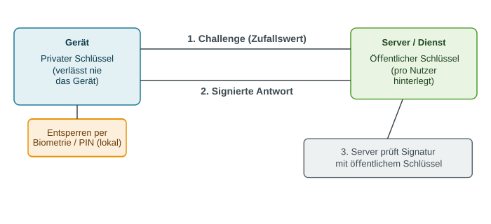
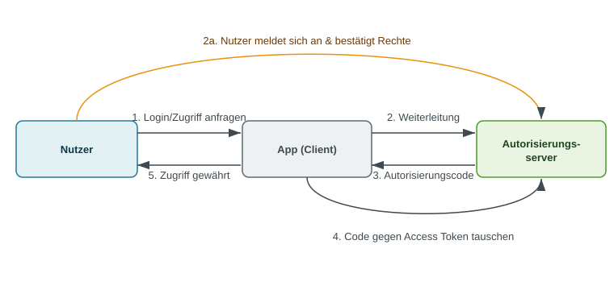

<!-- _class: title -->
# Identity & Access Management

      

## Wer bist du – und was darfst du?

<!-- _notes:
Dieser Abschnitt behandelt Wer bist du – und was darfst du?. Die folgenden Beispiele zeigen, wie sich das Thema auf konkrete Sicherheitsentscheidungen anwenden lässt. Zur Vorbereitung ist wichtig, die verwendeten Begriffe an einem eigenen Beispiel erklären zu können.
-->
---
<!-- _class: biglist -->
# Agenda

- **Grundlagen** – Was ist IAM, AAA-Modell, Authentifizierung vs. Autorisierung
- **Authentifizierungsfaktoren** – Wissen, Besitz, Sein im Überblick
- **Passwörter im Detail** – Entropie, Angriffe, Speicherung, Passwort-Manager
- **Multi-Faktor-Authentifizierung** – Warum ein Faktor nicht reicht
- **Passkeys & FIDO2** – Die passwortlose Zukunft
- **Autorisierung** – PoLP, Access Control Matrix, RBAC/ABAC, PAM
- **Single Sign-On** – OAuth & OpenID Connect

<!-- _notes:
IAM ist die Grundlage für nahezu jede Sicherheitsmaßnahme, die wir in dieser Vorlesungsreihe behandeln – ohne zu wissen, WER auf ein System zugreift, kann man nicht entscheiden, WAS erlaubt ist. Roter Faden: Erst "Wer bist du?", dann "Was darfst du?".
-->

---
<!-- _class: chapter -->
# Grundlagen

## Begriffe und Modelle

<!-- _notes:
Dieser Abschnitt behandelt Begriffe und Modelle. Die folgenden Beispiele zeigen, wie sich das Thema auf konkrete Sicherheitsentscheidungen anwenden lässt. Zur Vorbereitung ist wichtig, die verwendeten Begriffe an einem eigenen Beispiel erklären zu können.
-->
---
# Was ist Identity & Access Management (IAM)?

- **Identity & Access Management (IAM)**: Prozesse und Systeme, die digitale Identitäten verwalten und deren Zugriff auf Ressourcen steuern

- Beantwortet zwei zentrale Fragen:
  - **Wer bist du?** → Authentifizierung
  - **Was darfst du?** → Autorisierung

- Kernbaustein jeder Sicherheitsarchitektur – auch von **Zero Trust** ("Vertraue niemandem automatisch, prüfe jede Identität")

<!-- _notes:
IAM klingt abstrakt, ist aber überall: Login bei Windows, Zugriff auf eine Datenbank, Türschließsystem im Büro. Die zwei Kernfragen (Wer bist du / Was darfst du) sind der rote Faden für die gesamte Vorlesung – die erste Hälfte behandelt Authentifizierung, die zweite Autorisierung. Kurzer Ausblick auf Zero Trust als aktuelles Paradigma, das IAM ins Zentrum stellt – wird hier nur angerissen, nicht vertieft.
-->

---
<!-- _class: biglist -->
# Digitale Identität

- **Digitale Identität**: die Menge an Attributen, die eine Person, ein System oder ein Gerät in einem IT-System eindeutig repräsentiert
  - Beispiel: Benutzername, E-Mail, Mitarbeiter-ID, Rolle, Zertifikat

- Nicht nur Menschen haben Identitäten:
  - **Maschinenidentitäten**: Server, Services, APIs, IoT-Geräte

- Eine Identität muss **eindeutig** und **überprüfbar** sein

<!-- _notes:
Wichtig ist der Hinweis, dass IAM nicht nur "Mitarbeiter-Logins" meint. Auch ein Microservice, der mit einem API-Schlüssel auf eine andere Anwendung zugreift, hat eine Identität, die verwaltet werden muss. Das Konzept "Non-Human Identities" wird in der Praxis zunehmend wichtiger (Cloud, Automatisierung) und kann hier kurz erwähnt werden, ist aber kein Vertiefungsthema.
-->

---
<!-- _class: normal -->
# Das AAA-Modell

### Die drei Säulen
- **Authentication**: Wer bist du?
- **Authorization**: Was darfst du?
- **Accounting**: Was hast du getan?

### Beispiel Login
- Passwort eingeben → **Authentication**
- Zugriff auf Ordner X erlaubt → **Authorization**
- Zugriffe werden geloggt → **Accounting**

<!-- _notes:
Das AAA-Modell (manchmal auch AAA-Framework genannt, ursprünglich aus RADIUS-Kontext) ordnet die Themen dieser Vorlesung ein. Accounting wird oft vergessen, ist aber essenziell für Forensik und Compliance – ohne Protokollierung lässt sich ein Sicherheitsvorfall im Nachhinein nicht rekonstruieren. Für diese Vorlesung liegt der Fokus auf den ersten beiden A's, Accounting wird nur am Rand gestreift.
-->

---
# Authentifizierung vs. Autorisierung

- **Authentifizierung (Authentication)**: Überprüfung, ob jemand wirklich ist, wer er vorgibt zu sein
  - Frage: *"Bist du wirklich Max Mustermann?"*

- **Autorisierung (Authorization)**: Festlegung und Prüfung, welche Rechte eine authentifizierte Identität hat
  - Frage: *"Darf Max Mustermann diese Datei löschen?"*

> **Merksatz:** Authentifizierung prüft die Identität – Autorisierung prüft die Berechtigung.

<!-- _notes:
Das ist die zentrale Unterscheidung der ganzen Vorlesung und wird in der Praxis ständig verwechselt. Analogie: Am Flughafen prüft die Passkontrolle, WER du bist (Authentifizierung) – das Ticket bestimmt, in welche Kabine/Klasse du darfst (Autorisierung). Ein Studierender kann sich erfolgreich authentifizieren (richtiges Passwort) und trotzdem für eine bestimmte Aktion nicht autorisiert sein. Beide Schritte laufen fast immer nacheinander ab: erst Identität feststellen, dann Rechte prüfen.
-->

---
<!-- _class: biglist -->
# Identity Lifecycle: Joiner – Mover – Leaver

- Digitale Identitäten haben einen **Lebenszyklus**, der aktiv verwaltet werden muss:
  - **Joiner**: Neue Identität wird angelegt (z. B. neuer Mitarbeiter, Konto + Rechte)
  - **Mover**: Rolle/Abteilung ändert sich – Rechte müssen angepasst werden
  - **Leaver**: Austritt – Zugänge müssen **vollständig** entzogen werden

> Vergessene Leaver-Prozesse sind eine der häufigsten Ursachen für unautorisierten Zugriff durch Ex-Mitarbeiter.

<!-- _notes:
Dieser Lebenszyklus wird in der Praxis oft unterschätzt, ist aber ein Kernthema von IAM-Systemen (Identity Governance). Besonders der "Leaver"-Schritt wird häufig vernachlässigt: Konten bleiben aktiv, weil kein automatisierter Prozess existiert. Praxisbeispiel: Studien zeigen, dass ein erheblicher Anteil von Unternehmen ehemaligen Mitarbeitenden noch Wochen nach Austritt Zugriff auf Systeme lässt.
-->

---
# Directory Services & Identity Provider

- **Directory Service**: zentrales Verzeichnis für Identitäten und deren Attribute
  - Beispiele: **Active Directory (AD)**, **LDAP**-Verzeichnisse, Cloud-Varianten wie **Azure AD / Entra ID**

- **Identity Provider (IdP)**: System, das Authentifizierung durchführt und Identitätsnachweise (Tokens) an andere Systeme ausstellt

- Grundlage für zentrale Verwaltung **und** spätere Themen wie Single Sign-On

> **LDAP (Lightweight Directory Access Protocol):** Protokoll zum Abfragen und Verwalten von Verzeichniseinträgen. Ein Verzeichnis speichert Identitäten; ein Identity Provider bestätigt Anmeldungen.

<!-- _notes:
Directory Services sind das "Adressbuch" einer Organisation – hier stehen Benutzerkonten, Gruppenzugehörigkeiten, Passwort-Hashes etc. Wichtig für später: Ein Identity Provider ist die Komponente, die anderen Anwendungen bestätigt "diese Person ist authentifiziert" – das ist die technische Voraussetzung für Single Sign-On, das wir am Ende der Vorlesung behandeln.
-->

---
<!-- _class: chapter -->
# Authentifizierungsfaktoren

## Wissen, Besitz, Sein

<!-- _notes:
Dieser Abschnitt behandelt Wissen, Besitz, Sein. Die folgenden Beispiele zeigen, wie sich das Thema auf konkrete Sicherheitsentscheidungen anwenden lässt. Zur Vorbereitung ist wichtig, die verwendeten Begriffe an einem eigenen Beispiel erklären zu können. Authentifizierung prüft die Identität; Autorisierung entscheidet danach über konkrete Zugriffsrechte.
-->
---
# Die drei Faktoren im Überblick

| Faktor | Prinzip | Beispiele |
|---|---|---|
| **Wissen** (*something you know*) | Etwas, das nur du weißt | Passwort, PIN, Sicherheitsfrage |
| **Besitz** (*something you have*) | Etwas, das nur du hast | Smartphone, Hardware-Token, Smartcard |
| **Sein** (*something you are*) | Etwas, das du bist | Fingerabdruck, Gesicht, Iris |

> Je mehr unabhängige Faktoren kombiniert werden, desto schwerer wird ein Angriff.

> **Beispiel:** Passwort (Wissen) + Hardware-Token (Besitz) sind zwei unabhängige Faktoren; zwei Passwörter sind es nicht.

<!-- _notes:
Diese Dreiteilung ist der Standard-Rahmen für alles, was folgt. Die Faktoren müssen unabhängig voneinander sein, damit eine Kombination wirklich Sicherheit erhöht – zwei Passwörter zählen nicht als zwei Faktoren, weil beide auf "Wissen" beruhen. Diese Feinheit wird später bei 2FA nochmal aufgegriffen.
-->

---
<!-- _class: normal -->
# Faktor Wissen: Passwort & PIN

### Beispiel
- Passwort, PIN, Sicherheitsfrage
- Am weitesten verbreiteter Faktor

### Stärken
- Keine zusätzliche Hardware nötig
- Einfach und günstig umzusetzen

### Schwächen
- Kann erraten, abgephisht oder gestohlen werden
- Wird oft wiederverwendet
- Menschen wählen schwache Passwörter

<!-- _notes:
Wissen ist der älteste und günstigste Faktor, aber auch der am einfachsten anzugreifende – daher der ausführliche Deep-Dive im nächsten Kapitel. Zentrales Problem: Sicherheit hängt komplett vom Verhalten der Nutzenden ab, nicht von der Technik.
-->

---
<!-- _class: normal -->
# Faktor Besitz: Token & Smartphone

### Beispiel
- Hardware-Token (z. B. YubiKey)
- Smartcard, Bankkarte
- Smartphone (Authenticator-App)

### Stärken
- Muss physisch gestohlen werden
- Schwer aus der Ferne anzugreifen

### Schwächen
- Kann verloren gehen oder gestohlen werden
- Anschaffungs-/Verteilungskosten
- Bei Verlust: Ersatzverfahren nötig

> **Beispiel:** Ein kopierter Fingerabdruck lässt sich nicht wie ein kompromittiertes Passwort einfach ersetzen.

<!-- _notes:
Besitz erhöht den Angriffsaufwand deutlich, weil ein rein digitaler Angriff (z. B. Passwort erraten aus der Ferne) nicht mehr ausreicht – der Angreifer bräuchte das physische Objekt. Praxisbeispiel: SIM-Swapping als Angriff, der genau versucht, den "Besitz"-Faktor (Smartphone/Telefonnummer) zu kapern. Kurzer Verweis, dass Smartphones heute der häufigste "Besitz"-Faktor sind (Authenticator-Apps), was später bei 2FA wieder aufgegriffen wird.
-->

---
<!-- _class: normal -->
# Faktor Sein: Biometrie

### Beispiel
- Fingerabdruck
- Gesichtserkennung (Face ID)
- Iris-/Retina-Scan

### Stärken
- Sehr bequem, nichts zu merken oder zu tragen
- Schwer zu kopieren im Alltag

### Schwächen
- Bei Kompromittierung **nicht änderbar**
- False-Positive/-Negative-Raten
- Ethische/rechtliche Fragen (Datenschutz)

<!-- _notes:
Der entscheidende Unterschied zu den anderen Faktoren: Ein Fingerabdruck lässt sich nicht wie ein Passwort "zurücksetzen", wenn er einmal kompromittiert wurde (siehe OPM-Datenleck 2015, bei dem Fingerabdruckdaten von Millionen US-Regierungsangestellten gestohlen wurden). Biometrie wird meist lokal auf dem Gerät gespeichert und geprüft (z. B. Secure Enclave bei Apple), nicht auf einem Server – das ist wichtig für den Datenschutz und wird bei Passkeys später wieder relevant.
-->

---
<!-- _class: chapter -->
# Passwörter im Detail

## Der meistgenutzte – und meistangegriffene – Faktor

<!-- _notes:
Dieser Abschnitt behandelt Der meistgenutzte – und meistangegriffene – Faktor. Die folgenden Beispiele zeigen, wie sich das Thema auf konkrete Sicherheitsentscheidungen anwenden lässt. Zur Vorbereitung ist wichtig, die verwendeten Begriffe an einem eigenen Beispiel erklären zu können.
-->
---
# Passwortstärke: Entropie

- **Entropie**: Maß für die Unvorhersehbarkeit eines Passworts, gemessen in **Bit**

$$E = \log_2(R^L) = L \times \log_2(R)$$

- $R$ = Größe des Zeichenraums (z. B. 26 Kleinbuchstaben, 62 alphanumerisch)
- $L$ = Länge des Passworts

- **Beispiel**: 8 Zeichen, nur Kleinbuchstaben ($R=26$) → $E \approx 37,6$ Bit
- **Beispiel**: 8 Zeichen, alphanumerisch + Sonderzeichen ($R=95$) → $E \approx 52,6$ Bit

> **Einordnung:** 37,6 Bit entsprechen bei gleichverteilten, zufällig gewählten Passwörtern etwa 2^37,6 möglichen Kombinationen. Vorhersagbare Muster verringern die praktische Stärke.

<!-- _notes:
Die Formel selbst muss nicht auswendig gekonnt werden, wichtig ist das Verständnis: Entropie beschreibt, wie viele Versuche ein Angreifer im Schnitt braucht, um das Passwort zu erraten (2^E Versuche). Der Kernpunkt für die Diskussion: Länge schlägt Komplexität – ein 16-Zeichen-Passwort aus nur Kleinbuchstaben hat oft mehr Entropie als ein 8-Zeichen-Passwort mit Sonderzeichen, ist aber leichter zu merken.
-->

---
<!-- _class: normal -->
# Passwortregeln: Alt vs. Neu

### Klassisch (veraltet)
- Min. 8 Zeichen
- Groß-/Kleinschreibung + Zahl + Sonderzeichen
- Alle 90 Tage ändern
- Führt oft zu `Sommer2024!` → `Sommer2025!`

### NIST SP 800-63B (aktuell)
- **Länge** statt Komplexitätszwang (min. 8, empfohlen 15+)
- **Kein** erzwungener regelmäßiger Wechsel
- Abgleich mit **Listen bekannter Leak-Passwörter**
- Keine Hinweis-Fragen ("Mädchenname der Mutter")

<!-- _notes:
Die "klassischen" Regeln (erzwungene Komplexität, 90-Tage-Wechsel) galten lange als Best Practice, haben sich aber als kontraproduktiv erwiesen – sie führen zu vorhersagbaren Mustern und Zettel unter der Tastatur. NIST hat 2017 die Richtlinien grundlegend überarbeitet: Länge ist wichtiger als erzwungene Sonderzeichen, und häufiger Zwangswechsel verschlechtert die Passwortqualität eher, weil Nutzer nur minimal variieren. Der Abgleich mit Leak-Listen (z. B. "Have I Been Pwned"-Datenbank) ist heute Standard bei großen Diensten.
-->

---
# Sinnvolle Passwörter: Passphrasen

- Statt kryptischer Zeichenfolgen: **mehrere zufällige Wörter** kombinieren
- **Diceware-Methode**: Wörter per Würfelwurf aus einer Wortliste auswählen

- **Beispiel**: `korrekt-pferd-batterie-heftklammer`
  - Lang (hohe Entropie), aber **merkbar**

- Vorteil: Länge (hohe Entropie) **und** Merkbarkeit gleichzeitig

<!-- _notes:
Das berühmte xkcd-Beispiel "correct horse battery staple" zeigt anschaulich, dass vier zufällige Wörter deutlich mehr Entropie haben können als ein kurzes, komplexes Passwort wie "Tr0ub4dor&3" – und trotzdem leichter zu merken sind. Die Wörter müssen wirklich zufällig gewählt werden (z. B. per Würfel aus einer festen Liste), nicht als sinnvoller Satz, sonst sinkt die Entropie durch Sprachstruktur wieder. Diceware-Wortlisten sind öffentlich verfügbar und für genau diesen Zweck designt.
-->

---
# Angriffe auf Passwörter

| Angriff | Vorgehen |
|---|---|
| **Brute-Force** | Alle möglichen Kombinationen systematisch durchprobieren |
| **Wörterbuchangriff** | Bekannte Wörter/übliche Passwörter durchprobieren |
| **Credential Stuffing** | Geleakte Nutzername/Passwort-Paare bei anderen Diensten testen |
| **Phishing** | Nutzer zur Preisgabe des Passworts verleiten |
| **Keylogging** | Tastatureingaben heimlich mitschneiden |
| **Shoulder Surfing** | Passwort beim Eintippen beobachten |

<!-- _notes:
Diese Tabelle als Überblick, nicht jeden Angriff einzeln vertiefen. Wichtig hervorzuheben: Credential Stuffing funktioniert nur, weil Menschen Passwörter wiederverwenden – ein einziges Datenleck bei Dienst A gefährdet damit auch Dienst B und C. Phishing bleibt der erfolgreichste Angriffsvektor überhaupt, weil er den Menschen statt die Technik angreift.
-->

---
# Passwörter sicher speichern

- **Niemals im Klartext speichern** – bei einem Datenleck wären sofort alle Passwörter offen

- Stattdessen: **Hashing** – Einwegfunktion, die aus dem Passwort einen Hashwert erzeugt
  - Beim Login: Eingabe hashen und mit gespeichertem Hash vergleichen
  - Passwort selbst wird nie gespeichert oder rückgerechnet

- Empfohlene Verfahren: **bcrypt, scrypt, Argon2** (bewusst langsam, um Brute-Force zu erschweren)

<!-- _notes:
Verweis auf die Kryptographie-Vorlesung: Hashfunktionen sind Einwegfunktionen, hier praktisch angewendet. Für Passwort-Hashing werden bewusst *langsame* Hashfunktionen genutzt (bcrypt, scrypt, Argon2), im Gegensatz zu schnellen Hashes wie SHA-256, die für Integritätsprüfung gedacht sind – Geschwindigkeit ist hier ein Nachteil für den Angreifer, kein Vorteil.
-->

---
# Salt & Rainbow Tables

- **Rainbow Table**: vorab berechnete Tabelle von Passwort → Hash-Paaren, um Hashes schnell zurückzuführen

- **Problem ohne Salt**: Gleiche Passwörter erzeugen **immer denselben Hash** → eine Tabelle knackt viele Konten gleichzeitig

- **Salt**: zufälliger, einzigartiger Wert pro Nutzer, der vor dem Hashen an das Passwort angehängt wird
  - Gleiches Passwort → **unterschiedlicher** Hash pro Nutzer
  - Macht vorberechnete Rainbow Tables wertlos

<!-- _notes:
Rainbow Tables sind im Kern eine Zeit-Speicher-Optimierung: Statt bei jedem Angriff neu zu hashen, wird einmalig eine riesige Tabelle vorberechnet und wiederverwendet. Ohne Salt lohnt sich das enorm, weil eine einzige Tabelle gegen Millionen von Accounts gleichzeitig eingesetzt werden kann (z. B. gegen alle Nutzer, die "123456" verwenden). Der Salt macht diese Vorberechnung wertlos, weil der Angreifer für jeden einzelnen Nutzer neu rechnen müsste. Der Salt selbst muss nicht geheim sein, er wird meist zusammen mit dem Hash gespeichert – seine Aufgabe ist Einzigartigkeit, nicht Geheimhaltung.
-->

---
# Passwort-Manager

- **Passwort-Manager**: Software, die Passwörter verschlüsselt speichert und verwaltet
  - Ein einziges, starkes **Master-Passwort** schützt den gesamten Tresor
  - Generiert lange, zufällige, einzigartige Passwörter pro Dienst

- Vorteile:
  - Kein Wiederverwendungsproblem mehr
  - Nutzer muss sich nur **ein** starkes Passwort merken

- Risiko: Master-Passwort ist ein **Single Point of Failure** → unbedingt mit 2FA absichern

<!-- _notes:
Passwort-Manager lösen das grundlegende menschliche Problem, dass man sich unmöglich Dutzende einzigartige, starke Passwörter merken kann. Das Master-Passwort muss besonders stark sein (Passphrase!) und sollte selbst durch 2FA geschützt werden, denn es ist der Generalschlüssel für alle anderen Konten. Kurzer Praxishinweis: Viele Browser und Betriebssysteme bringen mittlerweile integrierte Passwort-Manager mit, dedizierte Lösungen bieten aber meist mehr Kontrolle und plattformübergreifende Nutzung.
-->

---
<!-- _class: chapter -->
# Multi-Faktor-Authentifizierung

## Wenn ein Faktor nicht mehr reicht

<!-- _notes:
Dieser Abschnitt behandelt Wenn ein Faktor nicht mehr reicht. Die folgenden Beispiele zeigen, wie sich das Thema auf konkrete Sicherheitsentscheidungen anwenden lässt. Zur Vorbereitung ist wichtig, die verwendeten Begriffe an einem eigenen Beispiel erklären zu können. Authentifizierung prüft die Identität; Autorisierung entscheidet danach über konkrete Zugriffsrechte.
-->
---
# Warum mehrere Faktoren kombinieren?

- **Zwei-Faktor-Authentifizierung (2FA)**: Kombination von **zwei unterschiedlichen** Faktoren
- **Multi-Faktor-Authentifizierung (MFA)**: Kombination von **zwei oder mehr** Faktoren

- Ein gestohlenes Passwort allein reicht dem Angreifer **nicht mehr**
  - Er bräuchte zusätzlich das Smartphone, den Token oder den Fingerabdruck

> Wichtig: Zwei Passwörter sind **kein** 2FA – beide beruhen auf demselben Faktor (Wissen).

<!-- _notes:
Diese Feinheit wurde schon im Faktoren-Überblick angekündigt: Für "echtes" 2FA müssen die Faktoren aus unterschiedlichen Kategorien stammen. Praxisbezug: MFA reduziert laut Studien (z. B. Microsoft/Google) das Risiko einer erfolgreichen Kontoübernahme um über 99 %, selbst gegen automatisierte Angriffe. Das macht MFA zu einer der wirkungsvollsten Einzelmaßnahmen in der IT-Sicherheit überhaupt.
-->

---
# 2FA-Verfahren im Überblick

| Verfahren | Faktor | Bemerkung |
|---|---|---|
| **SMS-OTP** | Besitz (Telefonnummer) | Anfällig für SIM-Swapping |
| **TOTP-App** (z. B. Authenticator) | Besitz (Smartphone) | Offline nutzbar, zeitbasiert |
| **Hardware-Token** (z. B. YubiKey) | Besitz | Sehr robust, Phishing-resistent |
| **Push-Benachrichtigung** | Besitz | Bequem, aber Ziel von "MFA-Fatigue" |
| **Biometrie** | Sein | Meist als lokaler Zusatzfaktor |

<!-- _notes:
SMS-OTP gilt mittlerweile als schwächste 2FA-Variante, weil SIM-Swapping (Übernahme der Telefonnummer durch Social Engineering beim Mobilfunkanbieter) den Faktor "Besitz" faktisch aushebelt. TOTP-Apps sind ein guter Mittelweg – kostenlos, offline nutzbar, kein Mobilfunknetz nötig. Hardware-Token wie YubiKeys gelten als Goldstandard, weil sie kryptographisch an die tatsächliche Website gebunden sind (dazu bei FIDO2 mehr). Push-Benachrichtigungen sind bequem, aber wie die nächste Fallstudie zeigt, missbrauchbar.
-->

---
# TOTP: Time-based One-Time Password

- Zeitbasiertes Einmalpasswort, das sich alle 30–60 Sekunden ändert
- Basiert auf einem **geheimen Schlüssel** (bei Einrichtung geteilt) und der **aktuellen Uhrzeit**

$$\text{TOTP}(K, T) = \text{Truncate}(\text{HMAC-SHA1}(K, \lfloor T / X \rfloor))$$

- $K$ = geheimer Schlüssel, $T$ = aktuelle Zeit, $X$ = Zeitfenster (meist 30 s)

- Client und Server berechnen unabhängig denselben Wert – kein Netzwerk nötig

> **Kernprinzip:** App und Server kennen denselben geheimen Schlüssel und berechnen aus ihm und der aktuellen Zeit unabhängig denselben Code. Die Formel ist kein Lernziel.

<!-- _notes:
Die Formel muss nicht im Detail hergeleitet werden, wichtig ist das Prinzip: Beide Seiten (App und Server) kennen denselben Geheimschlüssel aus der Einrichtung (meist per QR-Code übertragen) und berechnen unabhängig voneinander denselben zeitabhängigen Code. Genau deshalb funktionieren Authenticator-Apps offline – es ist keine Verbindung zum Server nötig, nur eine synchrone Uhrzeit. Kurzer Hinweis: Deshalb schlägt TOTP fehl, wenn die Geräteuhr zu stark abweicht.
-->

---
<!-- _class: chapter -->
# Passkeys & FIDO2

## Die passwortlose Zukunft

<!-- _notes:
Dieser Abschnitt behandelt Die passwortlose Zukunft. Die folgenden Beispiele zeigen, wie sich das Thema auf konkrete Sicherheitsentscheidungen anwenden lässt. Zur Vorbereitung ist wichtig, die verwendeten Begriffe an einem eigenen Beispiel erklären zu können. Der private Schlüssel bleibt beim Nutzer; der Dienst prüft eine kryptographische Antwort mit dem öffentlichen Schlüssel.
-->
---
# Passkeys: Grundidee

- **Passkey**: passwortloses Anmeldeverfahren auf Basis von **asymmetrischer Kryptographie**

- Bei Registrierung wird ein **Schlüsselpaar** erzeugt:
  - **Privater Schlüssel**: verlässt nie das Gerät (gespeichert z. B. in Secure Enclave)
  - **Öffentlicher Schlüssel**: wird beim Dienst hinterlegt

- Anmeldung erfolgt durch **kryptographischen Nachweis** statt durch Übertragung eines Geheimnisses

<!-- _notes:
Verweis zurück auf die Kryptographie-Vorlesung: Passkeys nutzen genau das asymmetrische Schlüsselpaar-Prinzip, das dort eingeführt wurde. Der entscheidende Unterschied zum Passwort: Es gibt kein gemeinsames Geheimnis mehr, das über das Netz übertragen oder auf einem Server gespeichert werden muss – der private Schlüssel verlässt niemals das Gerät.
-->

---
# Funktionsweise: Login mit Passkey

<!-- _notes:
Ablauf erklären: (1) Der Dienst schickt eine zufällige "Challenge" an das Gerät. (2) Das Gerät entsperrt den privaten Schlüssel lokal per Biometrie oder Geräte-PIN – diese verlässt das Gerät nie und wird nicht an den Server geschickt. (3) Das Gerät signiert die Challenge mit dem privaten Schlüssel und schickt nur die Signatur zurück. (4) Der Server prüft die Signatur mit dem gespeicherten öffentlichen Schlüssel. Entscheidend: Biometrie/PIN entsperren hier nur lokal den Schlüssel, sie werden NICHT wie ein Passwort übertragen oder serverseitig gespeichert.
-->

---
<!-- _class: normal -->
# Passkeys: Vorteile & Probleme

### Vorteile
- **Phishing-resistent**: kein Geheimnis zum Abgreifen
- Kein Passwort zu merken oder zu leaken
- Kryptographisch an die echte Domain gebunden

### Probleme
- **Account-Recovery**: Was tun bei Geräteverlust?
- Abhängigkeit vom Ökosystem (Apple/Google/Microsoft)
- Synchronisation über Cloud wirft Vertrauensfragen auf
- Noch nicht überall unterstützt

<!-- _notes:
Wichtig, beide Seiten ehrlich zu behandeln: Passkeys lösen viele klassische Probleme (Phishing, Wiederverwendung, Datenlecks), bringen aber neue Herausforderungen mit. Das größte praktische Problem ist Account-Recovery – verliert man alle Geräte, auf denen der private Schlüssel liegt, kann man sich nicht mehr anmelden, ohne dass es einen Fallback-Mechanismus gibt (der wiederum ein neues Angriffsziel sein kann). Die Synchronisation über Cloud-Dienste (z. B. iCloud Keychain) ist praktisch, bedeutet aber, dass man dem jeweiligen Anbieter vertrauen muss. Diese Baustellen sind der Grund, warum Passwörter trotz Passkeys noch nicht verschwunden sind.
-->

---
# FIDO2 als Standard

- **FIDO2**: offener Standard der **FIDO Alliance** für passwortlose, phishing-resistente Authentifizierung
  - Grundlage für Passkeys, Hardware-Token (z. B. YubiKey) u. v. m.

- Besteht aus zwei Komponenten:
  - **WebAuthn**: W3C-Standard-API, mit der Webseiten/Apps Authentifizierung anfragen
  - **CTAP** (Client to Authenticator Protocol): Kommunikation zwischen Gerät und Authenticator (z. B. USB, Bluetooth, NFC)

> FIDO2 macht Passkeys herstellerübergreifend kompatibel – nicht an einen einzelnen Anbieter gebunden.

<!-- _notes:
FIDO2 bezeichnet einen offenen Standard für passwortlose, phishing-resistente Anmeldung. WebAuthn verbindet Webanwendung und Anmeldeverfahren; CTAP regelt die Kommunikation mit einem Authenticator wie einem Sicherheitsschlüssel. Passkeys sind eine nutzerfreundliche Umsetzung auf dieser Grundlage.
-->

---
<!-- _class: chapter -->
# Autorisierung

## Was darf eine Identität?

<!-- _notes:
Dieser Abschnitt behandelt Was darf eine Identität?. Die folgenden Beispiele zeigen, wie sich das Thema auf konkrete Sicherheitsentscheidungen anwenden lässt. Zur Vorbereitung ist wichtig, die verwendeten Begriffe an einem eigenen Beispiel erklären zu können.
-->
---
# Principle of Least Privilege (PoLP)

- **Principle of Least Privilege (PoLP)**: Jede Identität erhält **nur** die Rechte, die für ihre Aufgabe **unbedingt notwendig** sind

- Reduziert den möglichen Schaden bei:
  - Kompromittierten Konten
  - Insider-Bedrohungen
  - Fehlbedienung

> **Merksatz:** Nicht "was könnte nützlich sein", sondern "was ist zwingend nötig".

<!-- _notes:
PoLP ist eines der wichtigsten Grundprinzipien der IT-Sicherheit überhaupt und zieht sich durch fast alle folgenden Autorisierungskonzepte. Praxisbeispiel: Ein Praktikant im Marketing braucht keinen Zugriff auf die Personalakten-Datenbank, auch wenn "es ja nicht schaden könnte". Kernproblem in der Praxis: Rechte werden oft großzügig vergeben und nie wieder entzogen ("Privilege Creep") – Rückbezug zum Mover-Schritt im Identity Lifecycle.
-->

---
# Die Access Control Matrix (ACM)

- **Access Control Matrix (ACM)**: theoretisches Modell, das Rechte als Tabelle darstellt
  - Zeilen: Subjekte (Nutzer, Prozesse)
  - Spalten: Objekte (Dateien, Ressourcen)
  - Zellen: erlaubte Aktionen (lesen, schreiben, ausführen)

| | Datei A | Datei B | Server X |
|---|---|---|---|
| **Alice** | lesen, schreiben | lesen | – |
| **Bob** | lesen | lesen, schreiben | ausführen |

<!-- _notes:
Die Access Control Matrix ist ein didaktisches Grundmodell – in der Praxis wäre eine solche Matrix bei vielen Nutzern und Ressourcen viel zu groß und unübersichtlich, um sie direkt zu pflegen. Genau dieses Skalierungsproblem motiviert die folgenden praktischeren Modelle (DAC, MAC, RBAC, ABAC), die alle letztlich Wege sind, dieselbe Matrix effizienter zu verwalten. In der Praxis wird die Matrix meist spaltenweise (Access Control Lists pro Objekt) oder zeilenweise (Capability Lists pro Subjekt) umgesetzt.
-->

---
<!-- _class: normal -->
# DAC vs. MAC

### Discretionary Access Control (DAC)
- Der **Eigentümer** einer Ressource entscheidet über Zugriffsrechte
- Flexibel, aber leicht fehlerhaft konfigurierbar
- Beispiel: Dateiberechtigungen unter Windows/Linux

### Mandatory Access Control (MAC)
- Eine **zentrale Instanz** legt Regeln verbindlich fest
- Nutzer können Rechte **nicht** selbst ändern
- Beispiel: Sicherheitsfreigabestufen in Militär/Behörden

<!-- _notes:
Ich besitze eine Datei und entscheide, wer sie lesen darf (z. B. "Freigeben für..."). Der Nachteil ist genau diese Flexibilität – ein unachtsamer Klick kann sensible Daten für alle freigeben. MAC ist strenger und wird eingesetzt, wo Fehler besonders teuer wären: Ein Soldat mit "Geheim"-Freigabe kann selbst nicht entscheiden, einem Kollegen ohne diese Freigabe Zugriff auf geheime Dokumente zu geben – das System verweigert es zentral, unabhängig vom Willen der Beteiligten.
-->

---
<!-- _class: normal -->
# RBAC vs. ABAC

### Role-Based Access Control (RBAC)
- Rechte werden an **Rollen** gebunden, nicht an Personen
- Nutzer erhalten Rollen (z. B. "Buchhaltung")
- Einfach zu verwalten bei klaren Rollen

### Attribute-Based Access Control (ABAC)
- Zugriff basiert auf **Attributen** (Rolle, Ort, Uhrzeit, Gerät...)
- Sehr fein granular, regelbasiert
- Höherer Konfigurationsaufwand

> **Vergleich an einer Datei:** DAC: Eigentümer vergibt Rechte; MAC: zentrale Regel entscheidet; RBAC: Rolle entscheidet; ABAC: Attribute wie Rolle und Gerätestatus entscheiden.

<!-- _notes:
RBAC ist der heutige Standard in den meisten Unternehmen: Man weist Rollen statt einzelner Rechte zu, was bei einem Mover-Vorgang (Abteilungswechsel) das Umverteilen stark vereinfacht – Rolle wechseln statt jedes einzelne Recht anzufassen. ABAC geht einen Schritt weiter und erlaubt kontextabhängige Regeln, z. B. "Zugriff auf Finanzdaten nur von Firmengeräten und nur während der Arbeitszeit". ABAC ist mächtiger, aber auch komplexer zu pflegen – ein klassischer Trade-off zwischen Granularität und Wartbarkeit. Viele moderne Systeme kombinieren beide Ansätze.
-->

---
# Privileged Access Management (PAM)

- **Privileged Access Management (PAM)**: gezielte Absicherung und Überwachung von **privilegierten Konten** (Admins, Root, Service-Accounts)

- Typische Maßnahmen:
  - **Passwort-Tresore** für Admin-Zugangsdaten (kein Klartext, keine Wiederverwendung)
  - **Just-in-Time-Zugriff**: erhöhte Rechte nur zeitlich befristet gewähren
  - **Session-Monitoring**: privilegierte Sitzungen aufzeichnen/überwachen

> Privilegierte Konten sind das lohnendste Ziel für Angreifer – ein kompromittierter Admin-Account kann PoLP komplett aushebeln.

> **Beispiel:** Ein Administrator erhält erhöhte Rechte nur für einen genehmigten Wartungsvorgang und verliert sie anschließend wieder.

<!-- _notes:
PAM ist die praktische Umsetzung von PoLP speziell für die "mächtigsten" Konten in einer Organisation, weil ein kompromittiertes Admin-Konto alle anderen Schutzmaßnahmen wertlos machen kann. Just-in-Time-Zugriff bedeutet: Ein Admin bekommt Root-Rechte nicht dauerhaft, sondern beantragt sie nur für die konkrete Aufgabe und einen begrenzten Zeitraum – danach werden sie automatisch entzogen. Fallbezug: Beim SolarWinds-Angriff 2020 und beim Twitter-Hack 2020 (Social Engineering gegen interne Support-Mitarbeiter mit weitreichenden Admin-Tools) spielte fehlendes oder unzureichendes PAM eine zentrale Rolle.
-->

---
<!-- _class: chapter -->
# Single Sign-On

## Einmal anmelden, überall zugreifen

<!-- _notes:
Dieser Abschnitt behandelt Einmal anmelden, überall zugreifen. Die folgenden Beispiele zeigen, wie sich das Thema auf konkrete Sicherheitsentscheidungen anwenden lässt. Zur Vorbereitung ist wichtig, die verwendeten Begriffe an einem eigenen Beispiel erklären zu können.
-->
---
# Was ist Single Sign-On (SSO)?

- **Single Sign-On (SSO)**: einmalige Anmeldung genügt für den Zugriff auf **mehrere** unabhängige Systeme/Anwendungen

- Vorteile:
  - Weniger Passwörter, die Nutzer verwalten müssen
  - Zentrale Stelle für Authentifizierung → einfacher abzusichern (z. B. mit MFA)
  - Zentrale Deaktivierung bei Austritt (Leaver-Prozess!)

- Basiert auf einem zentralen **Identity Provider (IdP)**

<!-- _notes:
SSO knüpft direkt an das Konzept des Identity Providers aus dem Grundlagenkapitel an. Der große Sicherheitsgewinn: Statt zehn schwacher Passwörter bei zehn Diensten gibt es eine zentrale, gut abgesicherte Anmeldung – die dann auch leichter mit MFA und starken Passkeys geschützt werden kann. Kehrseite kurz andeuten: SSO ist auch ein "Single Point of Failure" – wird der zentrale Account kompromittiert, sind potenziell alle angebundenen Dienste betroffen.
-->

---
# OAuth 2.0: Autorisierung, nicht Authentifizierung

- **OAuth 2.0**: Standard zur **delegierten Autorisierung** – erlaubt einer App den Zugriff auf Ressourcen, **ohne** das Passwort weiterzugeben

- Klassisches Beispiel: *"App X möchte auf deine Google-Kontakte zugreifen"*

> **Wichtig:** OAuth beantwortet "Was darf die App tun?" – **nicht** "Wer ist der Nutzer?". Das ist ein häufiges Missverständnis!

<!-- _notes:
Das ist eine wichtige Klarstellung, die in der Praxis ständig durcheinandergeht: OAuth wurde ursprünglich für Autorisierung entwickelt, nicht für Authentifizierung, wird aber umgangssprachlich oft als "Login mit Google" bezeichnet. Der eigentliche Zweck: Eine Drittanbieter-App bekommt ein befristetes Zugriffs-Token für bestimmte Ressourcen (z. B. Kalender lesen), ohne dass der Nutzer sein Google-Passwort an die App weitergeben muss. Authentifizierung prüft die Identität; Autorisierung entscheidet danach über konkrete Zugriffsrechte.
-->

---
# OAuth 2.0: Vereinfachter Ablauf

<!-- _notes:

Ein Identity Provider stellt Identitätsnachweise aus; die Anwendung prüft sie. OAuth-Access-Tokens erlauben Zugriffe, OIDC-ID-Tokens bestätigen eine Anmeldung.

Ablauf erklären: (1) Der Nutzer möchte sich bei der App anmelden/Zugriff gewähren und wird zum Autorisierungsserver (z. B. Google) weitergeleitet. (2) Dort meldet sich der Nutzer an und bestätigt, welche Rechte die App bekommen soll. (3) Der Autorisierungsserver schickt einen Autorisierungscode zurück an die App. (4) Die App tauscht diesen Code serverseitig gegen ein Access Token ein. (5) Mit dem Access Token darf die App im Namen des Nutzers auf die freigegebene Ressource zugreifen – das eigentliche Passwort hat die App nie gesehen.
-->

---
# OpenID Connect (OIDC)

- **OpenID Connect (OIDC)**: Authentifizierungsschicht **oberhalb** von OAuth 2.0

- Fügt ein zusätzliches **ID Token** hinzu, das die Identität des Nutzers bestätigt
  - OAuth Access Token: *"Was darf ich tun?"*
  - OIDC ID Token: *"Wer ist angemeldet?"*

> "Login mit Google/Microsoft" nutzt technisch **OIDC**, nicht reines OAuth.

<!-- _notes:
OAuth 2.0 regelt delegierte Zugriffsrechte für eine Anwendung; daraus allein folgt noch kein verlässlicher Identitätsnachweis. OpenID Connect ergänzt OAuth um ein ID-Token für die Anmeldung. Für eine Prüfungsfrage sollte man Access Token und ID-Token anhand ihres jeweiligen Zwecks unterscheiden.
-->

---
# Zusammenfassung

| Kapitel | Kernaussage |
|---|---|
| Grundlagen | Authentifizierung prüft Identität, Autorisierung prüft Rechte |
| Faktoren | Wissen, Besitz, Sein – unabhängig kombiniert am stärksten |
| Passwörter | Länge > Komplexität, immer gehasht + gesalzen speichern |
| MFA | Ein zweiter unabhängiger Faktor stoppt die meisten Angriffe |
| Passkeys/FIDO2 | Asymmetrische Kryptographie ersetzt das gemeinsame Geheimnis |
| Autorisierung | PoLP als Leitprinzip, RBAC/ABAC zur praktischen Umsetzung |
| SSO | OAuth = Autorisierung, OIDC = Authentifizierung |

<!-- _notes:
Diese Tabelle als roten Faden nochmal durchgehen. Kernbotschaft der gesamten Vorlesung: IAM ist kein einzelnes Tool, sondern ein Zusammenspiel aus Prozessen (Identity Lifecycle), Technik (Hashing, Kryptographie, Standards wie FIDO2/OAuth) und Prinzipien (PoLP, Zero Trust). Fast jeder große Sicherheitsvorfall der letzten Jahre (Uber, Twitter, unzählige Datenlecks) hatte eine IAM-Schwachstelle als Ursache oder Verstärker.
-->

---
<!-- _class: biglist -->
# Diskussionsfragen

- Warum reicht ein extrem langes, zufälliges Passwort allein oft nicht mehr aus, um ein Konto wirklich sicher zu machen?
- Welche Rolle spielt der "Faktor Mensch" bei MFA-Fatigue-Angriffen – und wie könnte man technisch gegensteuern?
- Wo würdet ihr in eurem (zukünftigen) Unternehmen RBAC statt ABAC einsetzen – und wo umgekehrt?
- Passkeys gelten als phishing-resistent: Welches neue Risiko entsteht durch die Cloud-Synchronisation privater Schlüssel?

<!-- _notes:
Diskussionsfragen ist ein Baustein der IT-Sicherheit. Entscheidend ist, welches Risiko angesprochen wird und welche Maßnahme seine Auswirkungen begrenzt.
-->
