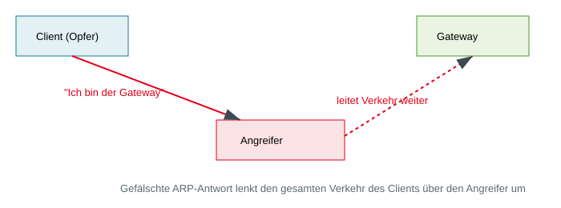
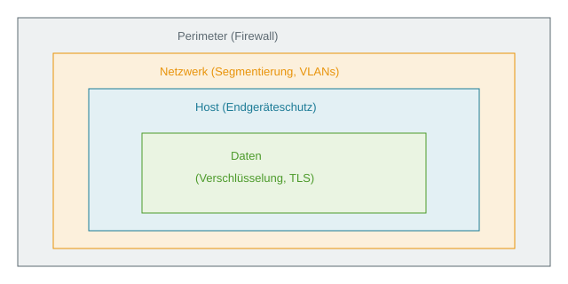

<!-- _class: title -->
# Sicherheit in Netzwerken

      

## Risiken verstehen, Schutz erklären, Kunden beraten

<!-- _notes:
Netzwerksicherheit ist kein reines Technikthema: Ausfälle, Datendiebstahl und manipulierte Kommunikation wirken direkt auf Umsatz, Vertrauen und Lieferfähigkeit. Ziel der Vorlesung ist deshalb nicht, Netzwerkprotokolle konfigurieren zu können. Die Studierenden sollen Risiken verständlich einordnen, den Nutzen von Schutzmaßnahmen erklären und in Kundengesprächen die richtigen Fragen stellen können. Technische Begriffe dienen dabei nur als Orientierung und werden in den Notes vertieft.
-->
---
<!-- _class: biglist -->
# Agenda

- **Geschäftsrisiken** – warum Netzwerksicherheit alle Unternehmen betrifft
- **Orientierungsmodell** – wo Kommunikation angegriffen werden kann
- **Zugang und lokales Netz** – wer oder was darf sich verbinden?
- **Datenwege im Internet** – wem vertrauen wir beim Transport?
- **Verfügbarkeit von Diensten** – wie entstehen Überlastung und Ausfall?
- **Anwendungen und Sitzungen** – wie werden Nutzer umgeleitet oder übernommen?
- **Schutzkonzept und Beratung** – mehrere Schutzlinien sinnvoll kombinieren

<!-- _notes:
Die Agenda folgt einer Beratungsperspektive: Zuerst betrachten wir Auswirkungen auf das Geschäft, danach typische Angriffspunkte und schließlich geeignete Schutzprinzipien. Das OSI-Modell bleibt als Landkarte erhalten, muss aber weder auswendig gelernt noch technisch beherrscht werden. Für jede Station helfen vier Fragen: Was kann passieren? Welche Folgen hat das? Welches Schutzprinzip hilft? Welche Frage sollte man einem Kunden stellen? Diese Fragen eignen sich zugleich als Lernschema für die Prüfungsvorbereitung.
-->

---
<!-- _class: chapter -->
# Warum ist Netzwerksicherheit so wichtig?

## Die Angriffsfläche der vernetzten Welt

<!-- _notes:
Dieses Kapitel schafft den geschäftlichen Kontext für alle späteren Konzepte. Vernetzung ermöglicht digitale Prozesse, vergrößert aber zugleich die Zahl möglicher Einstiege und Abhängigkeiten. Die Studierenden sollen erklären können, warum Cloud, Homeoffice und vernetzte Geräte die klassische Unternehmensgrenze auflösen. Dabei geht es noch nicht um einzelne Produkte, sondern um Angriffsfläche, Schadensausmaß und Verantwortung. Als Lernhilfe sollte zu jedem Aspekt ein Beispiel aus dem eigenen Partnerunternehmen gefunden werden.
-->
---
# Jedes Gerät hängt am Netzwerk

- Vernetzt sind nicht nur Laptops, sondern auch **Drucker, Maschinen, Kameras und Sensoren**
- Cloud-Dienste und Partner schaffen zusätzliche Verbindungen außerhalb des Unternehmens
- Jedes Gerät und jede Verbindung erweitert die **Angriffsfläche**
- Ein unauffälliges Gerät kann zum Einstieg in kritische Systeme werden

> **Geschäftsfrage:** Wissen wir, welche Geräte mit unserem Netzwerk verbunden sind?

<!-- _notes:
Netzwerksicherheit betrifft jedes Gerät, das Daten sendet oder empfängt, nicht nur klassische Computer. In vielen Unternehmen gibt es mehr technische Geräte als Mitarbeitende, gleichzeitig werden alte oder selten beachtete Geräte weniger konsequent aktualisiert. Dadurch kann etwa ein Drucker oder eine Kamera zum Ausgangspunkt für weitere Angriffe werden. Für die Beratung ist eine vollständige Inventarisierung deshalb oft der erste sinnvolle Schritt. Merkhilfe: Was nicht bekannt ist, kann weder bewertet noch zuverlässig geschützt werden.
-->

---
# Zugriff von überall möglich

- Homeoffice, mobile Geräte und Cloud-Dienste lösen die klassische **Unternehmensgrenze** auf
- Angriffe sind weltweit möglich und rund um die Uhr automatisierbar
- Gestohlene Zugangsdaten oder ein ungeschütztes Gerät können den Einstieg ermöglichen
- Danach entscheidet die interne Abschottung über das Schadensausmaß

> **Merksatz:** Ein Netzwerk ist nur so sicher wie sein schwächstes angeschlossenes Gerät.

<!-- _notes:
Früher wurde Netzwerksicherheit häufig als Burg mit Mauer gedacht: innen vertrauenswürdig, außen gefährlich. Cloud, Homeoffice und Dienstleister durchqueren diese Grenze jedoch täglich. Ein kompromittierter Drucker oder Laptop darf daher nicht automatisch auf sensible Systeme zugreifen können. Zero Trust prüft Identität, Gerät und Berechtigung bei jedem relevanten Zugriff. Für Kundengespräche ist die Frage hilfreich, welche Systeme nach dem Verlust eines einzelnen Kontos oder Geräts erreichbar wären.
-->

---
<!-- _class: normal -->
# Perimeter-Sicherheit reicht nicht mehr

### Früher
- Klare Netzwerkgrenze (Perimeter)
- Firewall am Übergang zum Internet
- „Innen sicher, außen unsicher"

### Heute
- Homeoffice, Cloud, mobile Geräte
- Keine klare Grenze mehr
- Prinzip **Zero Trust**: jede Verbindung wird geprüft, egal woher

<!-- _notes:
Die Gegenüberstellung zeigt einen Strategiewechsel, keinen einzelnen Kaufartikel. Zero Trust bedeutet, dass ein Zugriff nicht allein wegen seines Standorts als vertrauenswürdig gilt. Bewertet werden beispielsweise Identität, Berechtigung, Gerätezustand und Auffälligkeiten. Das Konzept wird schrittweise umgesetzt und ersetzt nicht automatisch Firewall oder Segmentierung. In der Beratung sollte daher nach konkreten Zugriffsentscheidungen gefragt werden, nicht nur danach, ob ein Kunde "Zero Trust gekauft" hat.
-->

---
<!-- _class: chapter -->
# Wo Kommunikation angegriffen werden kann

## Das OSI-Modell als einfache Landkarte

<!-- _notes:
Das OSI-Modell ordnet Netzwerkkommunikation in sieben Ebenen. Für diese Zielgruppe dient es ausschließlich als Landkarte: vom physischen Zugang über den Transportweg bis zur Anwendung. Entscheidend ist die Erkenntnis, dass Risiken an verschiedenen Stellen entstehen und unterschiedliche Maßnahmen erfordern. Die Namen und Nummern der Ebenen sind weniger wichtig als ihre Funktion. Als Lernhilfe genügt die Dreiteilung Zugang, Transport und Anwendung.
-->
---
<!-- _class: biglist -->
# Warum ein Schichtenmodell?

- Netzwerkkommunikation besteht aus mehreren aufeinander aufbauenden Aufgaben
- Das **OSI-Modell** ordnet sie vom physischen Zugang bis zur Anwendung
- Jede Ebene kann eigene Risiken und Schutzmaßnahmen haben
- Für Beratung und Vertrieb genügt eine vereinfachte Landkarte:
  - **Zugang – Transport – Anwendung**

<!-- _notes:
Das vollständige OSI-Modell umfasst sieben Schichten und ermöglicht Fachleuten eine präzise Zuordnung technischer Aufgaben. Für das konzeptionelle Verständnis werden diese hier zu drei Bereichen gebündelt. Zugang umfasst Geräte und lokale Verbindungen, Transport den Weg der Daten und Anwendung die Dienste, mit denen Menschen arbeiten. Ein Angriff kann in einem Bereich beginnen und Auswirkungen in einem anderen haben. Deshalb reicht eine einzelne Schutzmaßnahme selten aus.
-->

---
# Eine Landkarte in drei Bereichen

| Bereich | Worum geht es? | Typisches Risiko |
|---|---|---|
| **Anwendung** | Webseiten, E-Mail, angemeldete Sitzungen | Täuschung oder Übernahme |
| **Transport** | Datenwege und Erreichbarkeit | Umleitung oder Überlastung |
| **Zugang** | Geräte, Kabel, WLAN, lokales Netz | Unbefugte Verbindung |

> Das technische OSI-Modell verfeinert diese Landkarte in sieben Schichten.

<!-- _notes:
Diese Dreiteilung ist die zentrale Lernhilfe der Vorlesung. Die sieben OSI-Schichten lauten von unten nach oben: Bitübertragung, Sicherung, Vermittlung, Transport, Sitzung, Darstellung und Anwendung. In der Praxis existiert zusätzlich das kompaktere TCP/IP-Modell. Für Beratungsgespräche ist die genaue Zuordnung meist zweitrangig; wichtiger ist, keinen Bereich zu übersehen. Merksatz: Wer darf hinein, wie reisen die Daten und welchem Dienst vertraut der Nutzer?
-->

---
# Vier Fragen als roter Faden

- **Ereignis:** Was kann bei der Kommunikation schiefgehen?
- **Auswirkung:** Welche Folgen entstehen für Kunden und Geschäft?
- **Schutz:** Welches Sicherheitsprinzip reduziert das Risiko?
- **Beratung:** Welche Frage macht den Handlungsbedarf sichtbar?

> Technische Details erklären das Wie. Für Entscheidungen zählt zuerst das Warum.

<!-- _notes:
Dieses Raster ist wichtiger als die Namen einzelner Protokolle. Beispiel: Wird Datenverkehr unbemerkt umgeleitet, können vertrauliche Informationen offengelegt oder verändert werden; Verschlüsselung und sichere Zugänge reduzieren das Risiko. Eine passende Beratungsfrage wäre: "Wie schützen Sie Mitarbeitende in fremden WLAN-Netzen?" Wer Ereignis, Auswirkung, Schutz und Beratungsfrage verbinden kann, hat das Konzept verstanden. Die folgenden Kapitel wenden dieses Raster auf verschiedene Stationen einer Netzwerkverbindung an.
-->

---
<!-- _class: chapter -->
# Zugang und lokales Netz

## Wer oder was darf sich verbinden?

<!-- _notes:
Der erste Bereich umfasst physischen Zugang, WLAN und die Kommunikation im lokalen Netzwerk. Aus Geschäftssicht geht es um die Frage, welche Personen und Geräte überhaupt eine Verbindung herstellen dürfen. Ein Angreifer benötigt nicht immer eine komplizierte Schwachstelle; manchmal genügen eine frei zugängliche Netzwerkdose oder ein schlecht geschütztes Gast-WLAN. Die technischen OSI-Schichten 1 und 2 liefern hierfür die Detailstruktur. Beim Lernen sollte der Zusammenhang zwischen Zugangskontrolle und Schadensbegrenzung im Mittelpunkt stehen.
-->
---
# Physischer Zugang ist Netzwerkzugang

- Frei zugängliche Netzwerkdosen können interne Verbindungen ermöglichen
- Unsicheres WLAN kann Daten preisgeben oder fremde Geräte hereinlassen
- Serverräume, Verteiler und Leitungen sind Ziele für Diebstahl oder Sabotage
- Schutz beginnt deshalb bei **Zutritt, Inventar und sicheren Funknetzen**

> **Beratungsfrage:** Welche Netzwerkzugänge sind für Gäste und Dritte erreichbar?

<!-- _notes:
Auf der physischen OSI-Schicht werden Bits über Kabel, Glasfaser oder Funk übertragen. Ein erreichbarer Anschluss kann einem fremden Gerät den Zugang zum internen Netz eröffnen, sofern keine zusätzliche Prüfung stattfindet. Funkverbindungen reichen zudem über Gebäudewände hinaus und benötigen daher starke Verschlüsselung und sichere Konfiguration. Organisatorische Maßnahmen wie Besucherregelungen und verschlossene Technikräume ergänzen technische Kontrollen. Der Lernpunkt lautet: Cybersecurity beginnt nicht erst in Software.
-->

---
# Vertrauen im lokalen Netzwerk

- Geräte im selben Netz müssen einander finden und Daten austauschen
- Ältere Netzwerkmechanismen vertrauen vielen Angaben ohne Identitätsprüfung
- Ein fremdes Gerät kann sich dadurch als legitimer Kommunikationspartner ausgeben
- Mögliche Folgen: **Mitlesen, Manipulation oder Zugriff auf weitere Systeme**

> Nähe im Netzwerk ist kein Beweis für Vertrauenswürdigkeit.

<!-- _notes:
Technisch beschreibt diese Folie die OSI-Sicherungsschicht. Switches leiten Daten im lokalen Netz anhand von MAC-Adressen weiter; das Address Resolution Protocol, kurz ARP, ordnet IP-Adressen diesen Geräteadressen zu. ARP besitzt im Grunddesign keine Authentifizierung, weshalb gefälschte Antworten akzeptiert werden können. Das ist ein historisches Beispiel für implizites Vertrauen in internen Netzen. Segmentierung, Zugangskontrollen und verschlüsselte Anwendungen begrenzen die Folgen.
-->

---
# Beispiel: Identität im Netzwerk vortäuschen

- Angreifer gibt sich im lokalen Netz als ein anderes Gerät aus
- Datenverkehr wird unbemerkt über den Angreifer geleitet
- Vergleichbar mit einer gefälschten Nachsendeadresse für Geschäftspost
- Risiken: Zugangsdaten mitlesen, Inhalte verändern, Kommunikation stören
- Fachbegriffe: **MAC-Spoofing** und **ARP-Spoofing**

<!-- _notes:
MAC-Spoofing bezeichnet das Vortäuschen einer fremden Geräteadresse. Beim ARP-Spoofing sendet ein Angreifer gefälschte Zuordnungen und positioniert sich so zwischen Opfer und Netzübergang. Voraussetzung ist typischerweise bereits ein Zugang zum gleichen lokalen Netzwerk, etwa über ein schlecht geschütztes WLAN. Verschlüsselte Ende-zu-Ende-Kommunikation verhindert, dass umgeleitete Inhalte einfach gelesen oder verändert werden. Für die Prüfung genügt: falsche Identität führt zu falschem Datenweg.
-->

---
# ARP-Spoofing als Diagramm

<!-- _notes:
Das Diagramm visualisiert die gefälschte Nachsendeadresse: Der Angreifer behauptet gegenüber dem Client, der Weg ins Internet führe über ihn. Gleichzeitig kann er sich gegenüber dem Gateway als Client ausgeben. Die Kommunikation funktioniert weiter, weshalb der zusätzliche Zwischenstopp oft unbemerkt bleibt. Technisch entsteht so eine Man-in-the-Middle-Position. Beim Lernen sollte man das Diagramm als Ablauf aus Täuschung, Umleitung und möglichem Datenzugriff beschreiben können.
-->

---
<!-- _class: chapter -->
# Datenwege im Internet

## Wem vertrauen wir beim Transport?

<!-- _notes:
Dieses Kapitel betrachtet den Weg von Daten über Netzwerkgrenzen hinweg. Unternehmen steuern nicht jede Zwischenstation selbst und sind deshalb auf Provider, korrekte Wegweiser und sichere Ende-zu-Ende-Verbindungen angewiesen. Für Beratung und Vertrieb ist entscheidend, Abhängigkeiten und Auswirkungen zu verstehen, nicht Routingtabellen zu konfigurieren. Technisch gehört dieser Bereich zur OSI-Vermittlungsschicht. Als Lernfrage dient: Was passiert, wenn Absender oder Wegweiser lügen?
-->
---
# Wie Daten ihr Ziel finden

- Daten werden in kleine Pakete aufgeteilt und über mehrere Stationen weitergeleitet
- **IP-Adressen** kennzeichnen Absender und Ziel
- Router wählen den verfügbaren Weg durch verschiedene Netze
- Unternehmen vertrauen dabei auf Infrastruktur außerhalb der eigenen Kontrolle

> Schutz muss auch wirken, wenn der Transportweg nicht vertrauenswürdig ist.

<!-- _notes:
Auf der OSI-Vermittlungsschicht übernimmt das Internet Protocol, kurz IP, die Adressierung von Paketen. Router lesen die Zieladresse und reichen Pakete über mehrere Netze weiter. Der konkrete Weg kann sich ändern und gehört nur teilweise dem eigenen Unternehmen. Deshalb schützt Transportverschlüsselung wie TLS Daten auch über fremde Zwischenstationen hinweg. Die Postanalogie hilft: Die Adresse steuert den Weg, ein verschlossener Inhalt schützt die Nachricht.
-->

---
# Gefälschte Absender

- Absenderangaben in Netzwerkpaketen können manipuliert werden
- Angreifer verschleiern damit ihre Herkunft oder missbrauchen Vertrauen
- Gefälschte Adressen können Antworten gezielt an ein Opfer lenken
- Deshalb darf eine Adresse allein keine Identität beweisen

> **Beratungsfrage:** Welche Zugriffe vertrauen nur auf Herkunft oder Standort?

<!-- _notes:
Der technische Begriff lautet IP-Spoofing. Ein Paket enthält eine behauptete Absenderadresse, die bei bestimmten Kommunikationsformen nicht automatisch bestätigt wird. Das ähnelt einer frei wählbaren Absenderzeile auf einem Briefumschlag. Moderne Zugangskontrollen kombinieren deshalb Identität, starke Authentifizierung und Kontext, statt nur einer IP-Adresse zu vertrauen. Gefälschte Absender sind außerdem die Grundlage für verschiedene Verstärkungsangriffe auf die Verfügbarkeit.
-->

---
# Wenn digitale Wegweiser falsch zeigen

- Netzbetreiber tauschen Informationen über erreichbare Ziele aus
- Fehlerhafte oder manipulierte Angaben können Verkehr umleiten
- Mögliche Folgen: **Ausfall, Verzögerung, Überwachung oder Manipulation**
- Unternehmen reduzieren das Risiko durch Verschlüsselung und belastbare Provider
- Fachbeispiel: **BGP-Hijacking**

<!-- _notes:
Das Border Gateway Protocol, kurz BGP, ist das Wegweisersystem zwischen großen Netzbetreibern. Beim BGP-Hijacking kündigt ein Netz fälschlich an, für fremde IP-Bereiche zuständig zu sein. Der Datenverkehr kann dadurch fehlgeleitet oder unterbrochen werden, obwohl beim Kunden selbst nichts verändert wurde. Für die meisten Unternehmen ist das vor allem ein Lieferanten- und Resilienzrisiko. Beratungsrelevant sind Providerwahl, Überwachung, Redundanz sowie Verschlüsselung; die technische BGP-Konfiguration bleibt Aufgabe spezialisierter Teams.
-->

---
# Kleine Anfrage, große Wirkung

- Angreifer nutzen viele fremde Systeme als unbeabsichtigte Verstärker
- Kleine Anfragen erzeugen zahlreiche oder deutlich größere Antworten
- Alle Antworten werden an die gefälschte Adresse des Opfers geschickt
- Ergebnis: Dienste werden langsam oder fallen vollständig aus

> Das Angriffsziel ist **Verfügbarkeit**, nicht zwingend der Datendiebstahl.

<!-- _notes:
Das historische Beispiel heißt Smurf-Angriff und missbraucht das Diagnoseprotokoll ICMP. Moderne Varianten nutzen unter anderem DNS- oder NTP-Dienste, das Grundprinzip bleibt jedoch gleich: gefälschter Absender plus Verstärkung. Geschäftlich relevant sind Umsatzverlust, gebrochene Service-Level, überlastete Supportkanäle und Reputationsschäden. Schutz wird häufig gemeinsam mit Internetprovidern oder spezialisierten DDoS-Schutzdiensten umgesetzt. Für das Lernen zählt das Muster, nicht der Name des historischen Angriffs.
-->

---
# Datenwege kontrollieren

- **Firewalls** prüfen Verbindungen anhand festgelegter Regeln
- Nur notwendige Kommunikationswege werden freigegeben
- Verschlüsselung schützt Inhalte auf fremden Transportwegen
- Überwachung erkennt ungewöhnliche Ziele, Mengen oder Muster
- Redundanz hält wichtige Dienste trotz einzelner Ausfälle erreichbar

<!-- _notes:
Eine Firewall ist kein allgemeines Schutzschild, sondern setzt Regeln für erlaubte Kommunikation durch. Access Control Lists, kurz ACLs, sind technische Regellisten auf Netzwerkkomponenten. Dahinter steht dasselbe Prinzip wie im IAM: nur notwendige Rechte und Wege freigeben. Verschlüsselung schützt dagegen den Inhalt und Redundanz die Verfügbarkeit; beide lösen andere Probleme als eine Firewall. Gute Beratung ordnet deshalb jede Maßnahme einem konkreten Risiko und Schutzziel zu.
-->

---
<!-- _class: chapter -->
# Verfügbarkeit von Diensten

## Wenn legitime Kommunikation zur Last wird

<!-- _notes:
Dieses Kapitel behandelt die zuverlässige Übertragung und die Verfügbarkeit von Diensten. Technisch liegt der Schwerpunkt auf der OSI-Transportschicht mit TCP und UDP. Für die Zielgruppe ist vor allem wichtig, dass unterschiedliche Kommunikationsarten verschiedene Missbrauchsmöglichkeiten schaffen. Überlastungsangriffe nutzen begrenzte Ressourcen wie Bandbreite, Speicher oder Rechenleistung. Als Lernziel sollen die Studierenden technische Muster mit geschäftlichen Folgen und geeigneten Gegenmaßnahmen verbinden.
-->
---
<!-- _class: normal -->
# Zwei Arten der Datenübertragung

### TCP
- Wie ein **Telefonat** mit Rückbestätigung
- Verbindung und Vollständigkeit werden geprüft
- Zuverlässig, aber mit zusätzlichem Aufwand
- Typisch für Webseiten und E-Mail

### UDP
- Wie eine **Postkarte** ohne Empfangsbestätigung
- Daten werden direkt versendet
- Schnell, Verluste werden eher akzeptiert
- Typisch für Streaming und Namensabfragen

<!-- _notes:
TCP steht für Transmission Control Protocol und baut eine bestätigte, zuverlässige Verbindung auf. UDP steht für User Datagram Protocol und sendet einzelne Nachrichten ohne vorherigen Verbindungsaufbau. Die Analogien vereinfachen bewusst: Auch Webseiten können ergänzend UDP-basierte Verfahren nutzen, und eine Postkarte besitzt natürlich eine reale Absenderadresse. Sicherheitsrelevant ist der Zielkonflikt zwischen Zuverlässigkeit, Geschwindigkeit und Aufwand. Man sollte erklären können, warum unterschiedliche Dienste unterschiedliche Transportarten wählen.
-->

---
# Beispiel: Unvollständige Anfragen blockieren

- Ein Dienst reserviert Ressourcen für neue Verbindungen
- Angreifer starten massenhaft Verbindungen, führen sie aber nie zu Ende
- Offene Anfragen belegen Speicher und Verarbeitungskapazität
- Legitime Kunden werden langsam oder abgewiesen
- Fachbeispiel: **SYN-Flood**

<!-- _notes:
TCP beginnt eine Verbindung technisch mit drei Nachrichten: SYN, SYN-ACK und ACK. Bei einer SYN-Flood sendet der Angreifer viele Startanfragen, schließt den Aufbau jedoch nicht ab. Der Server hält dadurch zahlreiche halboffene Verbindungen vor. Schutz bieten unter anderem technische Verfahren wie SYN-Cookies, Begrenzungen und vorgeschaltete DDoS-Dienste. Die Restaurantanalogie hilft: Viele falsche Reservierungen blockieren Tische für echte Gäste.
-->

---
# Aufklärung vor dem Angriff

- Angreifer prüfen systematisch, welche Dienste erreichbar sind
- Vergleichbar mit dem Testen von Türen und Fenstern vor einem Einbruch
- Die Suche ist automatisiert und findet dauerhaft im Internet statt
- Unnötige Dienste vergrößern die Angriffsfläche
- Fachbegriff: **Portscan**

<!-- _notes:
Ein Port ist eine nummerierte logische Anschlussstelle für einen Dienst, beispielsweise 443 für verschlüsselte Webkommunikation. Ein Portscan fragt automatisiert ab, welche dieser Anschlussstellen antworten. Der Scan ist zunächst Aufklärung und noch kein erfolgreicher Einbruch, liefert aber wertvolle Informationen für spätere Angriffe. Verteidiger reduzieren die Angriffsfläche, indem sie nicht benötigte Dienste abschalten und erreichbare Dienste überwachen. Beratungsfrage: Welche öffentlich erreichbaren Dienste werden tatsächlich benötigt und regelmäßig geprüft?
-->

---
# Verfügbarkeit ist ein Geschäftsversprechen

- Online-Dienste müssen auch unter hoher Last erreichbar bleiben
- **DDoS-Angriffe** verteilen Überlastung auf viele Quellen
- Folgen: Umsatzverlust, Vertragsverletzungen, Supportaufwand, Vertrauensverlust
- Schutz: Kapazitätsreserven, Filterung, Notfallpläne und spezialisierte Anbieter

> **Beratungsfrage:** Welche Ausfallzeit kann das Geschäft wirklich verkraften?

<!-- _notes:
DDoS steht für Distributed Denial of Service: Viele verteilte Quellen überlasten gemeinsam ein Ziel. Bei UDP-Amplification sendet der Angreifer kleine Anfragen mit gefälschter Opferadresse an offene Server; deren größere Antworten treffen das Opfer. Die technische Abwehr liegt häufig teilweise außerhalb des Unternehmens und erfordert Provider oder spezialisierte Schutzplattformen. Geschäftlich sollte vorab geklärt sein, welche Dienste kritisch sind, welche Wiederanlaufziele gelten und wer im Ereignisfall entscheidet. Merkhilfe: Resilienz verbindet Technik, Vertrag und Notfallorganisation.
-->

---
<!-- _class: chapter -->
# Anwendungen und Sitzungen

## Wenn vertraute Dienste getäuscht werden

<!-- _notes:
Dieses Kapitel betrachtet die Ebene, die Nutzer unmittelbar wahrnehmen: Webseiten, E-Mail, Anmeldungen und laufende Sitzungen. Hier können technisch funktionierende Verbindungen trotzdem zu einem falschen Ziel führen oder von Unbefugten übernommen werden. Die OSI-Schichten 5 bis 7 unterscheiden Sitzung, Darstellung und Anwendung; in modernen Systemen werden sie oft gemeinsam betrachtet. Für Beratung und Vertrieb sind Vertrauen, Identität und verständliche Schutzwirkung zentral. Lernziel ist, Umleitung, Sitzungsübernahme und Überlastung unterscheiden zu können.
-->
---
# Nach dem Login: die digitale Sitzung

- Nach erfolgreicher Anmeldung merkt sich ein Dienst den Nutzer
- Ein **Sitzungstoken** dient vorübergehend als Nachweis der Anmeldung
- Wer dieses Token stiehlt, kann möglicherweise ohne Passwort handeln
- Verschlüsselung schützt das Token auf dem Transportweg
- Kurze Gültigkeit begrenzt den möglichen Schaden

<!-- _notes:
Eine digitale Sitzung verbindet mehrere einzelne Anfragen mit einer bereits geprüften Identität. Webanwendungen verwenden dafür häufig ein Cookie mit einem zufälligen Sitzungstoken. Dieses Token ist zeitweise so wertvoll wie die Anmeldung selbst und muss entsprechend geschützt werden. TLS verschlüsselt den Transport, kann aber ein bereits auf dem Endgerät gestohlenes Token nicht retten. Zusätzliche Maßnahmen sind kurze Laufzeiten, sichere Cookie-Einstellungen und eine erneute Prüfung bei sensiblen Aktionen.
-->

---
# Beispiel: Eine angemeldete Sitzung übernehmen

- Angreifer erbeutet den temporären Nachweis einer Anmeldung
- Der Dienst hält den Angreifer anschließend für den legitimen Nutzer
- Eine starke Anmeldung allein verhindert diesen Missbrauch nicht
- Schutz: verschlüsselte Verbindung, sichere Endgeräte, kurze Sitzungen
- Fachbegriff: **Session Hijacking**

<!-- _notes:
Session Hijacking bedeutet die Übernahme einer bereits authentifizierten Sitzung, häufig durch ein gestohlenes Cookie. Mehrfaktor-Authentifizierung stärkt den Login, wird aber umgangen, wenn der Angreifer erst danach ein gültiges Token übernimmt. Deshalb müssen Identitätsschutz, Endgerätesicherheit und Sitzungsmanagement zusammenspielen. Für besonders kritische Transaktionen kann eine erneute Authentifizierung erforderlich sein. Beratungsfrage: Welche Aktionen darf eine bestehende Sitzung ausführen, ohne die Identität erneut zu prüfen?
-->

---
# Die Anwendung schafft Vertrauen

- Nutzer sehen Namen, Inhalte und Marken – nicht die Netzwerkprotokolle dahinter
- Vertraute Oberflächen können Sicherheit vermitteln, aber auch gefälscht werden
- Anwendungen verarbeiten wertvolle Daten und geschäftliche Transaktionen
- Technik, Prozesse und Aufmerksamkeit der Nutzer müssen zusammenspielen

> Eine funktionierende Verbindung garantiert noch kein vertrauenswürdiges Gegenüber.

<!-- _notes:
Die OSI-Anwendungsschicht umfasst Protokolle wie HTTP für Webseiten, DNS für Namensauflösung und SMTP für E-Mail. Hier treffen technische Kommunikation und menschliche Wahrnehmung aufeinander. Angreifer nutzen deshalb sowohl Softwarefehler als auch überzeugende Täuschung. Eine verschlüsselte Verbindung zeigt lediglich, dass die Verbindung zu einer bestimmten Domain geschützt ist; auch eine betrügerische Domain kann TLS verwenden. Beim Lernen sollte zwischen sicherem Transport und vertrauenswürdigem Inhalt unterschieden werden.
-->

---
# Beispiel: Der richtige Name, das falsche Ziel

- Das **Domain Name System (DNS)** übersetzt Namen in technische Zieladressen
- Manipulierte Antworten können Nutzer zu einem falschen Dienst leiten
- Der eingegebene Name kann dabei korrekt erscheinen
- Mögliche Folgen: Zugangsdaten- oder Zahlungsdatendiebstahl
- Fachbegriffe: **DNS-Spoofing** und **Cache-Poisoning**

<!-- _notes:
DNS funktioniert wie ein Adressverzeichnis: Es ordnet einem lesbaren Namen eine IP-Adresse zu. Beim DNS-Spoofing erhält ein Nutzer eine gefälschte Antwort; Cache-Poisoning speichert eine solche Zuordnung in einem Zwischenspeicher und betrifft dadurch viele Anfragen. Technische Schutzmechanismen umfassen DNSSEC, sichere Resolver und Überwachung, während TLS zusätzlich die Identität des Zielservers prüft. Der Vorfall kann wie Phishing wirken, obwohl der Nutzer keinen Link falsch gelesen hat. Beratungsrelevant sind sowohl technische Kontrollen als auch klare Meldewege bei ungewöhnlichen Zertifikatswarnungen.
-->

---
# Ein Muster, verschiedene Angriffswege

- Angreifer positioniert sich unbemerkt zwischen zwei Kommunikationspartnern
- Er kann Daten mitlesen, verändern oder an ein falsches Ziel leiten
- Der Einstieg ist über WLAN, lokales Netz oder Namensauflösung möglich
- **Ende-zu-Ende-Verschlüsselung** schützt den Inhalt über unsichere Wege

> Fachbegriff: **Man-in-the-Middle (MITM)**

<!-- _notes:
MITM beschreibt eine Position des Angreifers und keine einzelne Technik. ARP-Spoofing, ein bösartiger WLAN-Zugangspunkt oder manipuliertes DNS können zu einer solchen Position führen. Korrekt geprüfte TLS-Verbindungen schützen Vertraulichkeit und Integrität auch dann, wenn jemand den Datenverkehr transportiert. Zertifikatswarnungen dürfen deshalb nicht routinemäßig ignoriert werden. Als Lernhilfe verbindet dieses Muster die zuvor getrennten Bereiche Zugang, Transport und Anwendung.
-->

---
# Wenn normale Anfragen zum Angriff werden

- Angreifer senden massenhaft scheinbar legitime Anfragen an eine Anwendung
- Einzelne Anfragen wirken unauffällig, ihre Menge überlastet den Dienst
- Botnetze verteilen den Verkehr auf viele Geräte und Regionen
- Schutz erfordert Erkennung, Skalierung und klare Prioritäten für kritische Dienste
- Fachbeispiel: **HTTP-Flood**

<!-- _notes:
Bei einer HTTP-Flood rufen viele Quellen wiederholt aufwendige Funktionen einer Webanwendung auf. Jede einzelne Anfrage kann formal korrekt sein, weshalb einfache Netzwerkfilter nicht ausreichen. Botnetze wie Mirai liefern dafür große Mengen verteilter Geräte. Schutzmaßnahmen umfassen Web Application Firewalls, Verhaltensanalyse, Lastverteilung und DDoS-Dienste. Geschäftlich muss entschieden werden, welche Funktionen im Engpass Vorrang erhalten und wie Kunden informiert werden.
-->

---
<!-- _class: chapter -->
# Verteidigung im Überblick

## Mehrere Schutzlinien gleichzeitig

<!-- _notes:
Dieses Abschlusskapitel führt die einzelnen Risiken zu einem Schutzkonzept zusammen. Keine Maßnahme deckt Zugang, Transport, Anwendung und Wiederherstellung gleichzeitig ab. Die Studierenden sollen Schutzmaßnahmen deshalb nach ihrer Wirkung einordnen und ihr Zusammenspiel erklären können. Für Beratung und Vertrieb ist wichtig, erst Schutzziele und Lücken zu klären und danach passende Lösungen zu diskutieren. Die folgenden Folien liefern dafür ein einfaches Gesprächs- und Lernmodell.
-->
---
# Defense in Depth

- **Defense in Depth** kombiniert mehrere unabhängige Schutzmaßnahmen
- Vorbeugen, Erkennen, Begrenzen und Wiederherstellen ergänzen sich
- Versagt eine Maßnahme, verhindert die nächste den Totalschaden
- Menschen, Prozesse, Technik und Dienstleister tragen gemeinsam bei

> Nicht die Anzahl der Produkte zählt, sondern das Zusammenspiel der Kontrollen.

<!-- _notes:
Defense in Depth ist das Leitprinzip der gesamten Vorlesung. Eine Firewall verhindert weder den Diebstahl eines Sitzungstokens auf einem Endgerät noch ersetzt Verschlüsselung einen Notfallplan. Mehrere Kontrollen sollten unterschiedliche Fehler abdecken und möglichst unabhängig voneinander wirken. Zur Bewertung gehören auch Erkennung und Wiederherstellung, nicht nur Prävention. Eine gute Beratungsleistung macht Abhängigkeiten, Lücken und Verantwortlichkeiten sichtbar, statt lediglich weitere Produkte zu empfehlen.
-->

---
# Defense in Depth als Diagramm

<!-- _notes:
Das Diagramm zeigt konzentrische Schutzringe vom Perimeter bis zu den Daten. Dieses Bild ist nützlich, darf aber nicht als vollständig starre Burg verstanden werden, weil Cloud und Homeoffice den klassischen Rand auflösen. Entscheidend bleibt die Idee, dass ein Angreifer nach dem Überwinden einer Kontrolle auf weitere Hürden trifft. Datenverschlüsselung, Zugriffsprüfung und Überwachung wirken auch innerhalb des Netzes. Beim Lernen sollte zu jedem Ring ein Beispiel und sein verbleibendes Risiko genannt werden können.
-->

---
# Schutzmaßnahmen nach ihrer Wirkung

| Ziel | Beispiele | Nutzen |
|---|---|---|
| **Vorbeugen** | sichere Konfiguration, Firewall, Verschlüsselung | Eintritt erschweren |
| **Begrenzen** | Segmentierung, minimale Rechte | Ausbreitung stoppen |
| **Erkennen** | Protokollierung, Netzwerküberwachung | Vorfälle sichtbar machen |
| **Reagieren** | Notfallplan, DDoS-Dienstleister | Ausfallzeit verkürzen |
| **Lernen** | Tests, Übungen, Verbesserungsprozess | Wiederholung vermeiden |

<!-- _notes:
Die Einteilung nach Wirkung verhindert eine reine Produktliste. Intrusion Detection Systems erkennen verdächtigen Verkehr, Intrusion Prevention Systems können ihn zusätzlich blockieren; beide gehören vor allem zu Erkennen und Reagieren. VPN, Firewall und Verschlüsselung wirken präventiv, lösen aber nicht automatisch die Schadensbegrenzung oder Wiederherstellung. Ein ausgewogenes Konzept deckt alle fünf Ziele ab und benennt Verantwortliche. Für eine Beratung eignet sich die Tabelle als einfache Lückenanalyse.
-->

---
# Netzwerksegmentierung & Zero Trust

- **Segmentierung** trennt Bereiche mit unterschiedlichen Aufgaben und Risiken
- Beispiel: Gäste, Büroarbeitsplätze, Produktion und kritische Server
- **Zero Trust** prüft Zugriffe anhand von Identität, Gerät und Kontext
- Gemeinsam reduzieren beide die unkontrollierte Ausbreitung eines Angriffs

> **Beratungsfrage:** Was kann ein kompromittierter Arbeitsplatz im internen Netz erreichen?

<!-- _notes:
Segmentierung teilt ein Netzwerk in getrennte Zonen und kontrolliert die Kommunikation dazwischen. VLANs und Firewallregeln sind mögliche technische Mittel, aber die fachliche Grundlage ist die Trennung nach Schutzbedarf und Geschäftsaufgabe. Zero Trust ergänzt dies durch eine laufende Prüfung von Identität, Gerät, Berechtigung und Kontext. Die Konzepte sind verwandt, aber nicht identisch: Segmentierung begrenzt Wege, Zero Trust bewertet Zugriffe. Ein anschauliches Beispiel ist die Trennung von Gäste-WLAN, Produktion und Finanzsystemen.
-->

---
# Zusammenfassung

| Bereich | Kernrisiko | Leitfrage |
|---|---|---|
| **Zugang** | fremde oder kompromittierte Geräte | Wer oder was darf sich verbinden? |
| **Transport** | Umleitung, Mitlesen, Überlastung | Wie bleiben Daten und Dienste geschützt? |
| **Anwendung** | Täuschung und Sitzungsübernahme | Ist das Gegenüber wirklich vertrauenswürdig? |
| **Organisation** | unklare Reaktion und Abhängigkeiten | Wer handelt bei einem Vorfall? |

> **Merksatz:** Netzwerksicherheit schützt Geschäftskontinuität, Daten und Vertrauen.

<!-- _notes:
Diese Tabelle ersetzt das Auswendiglernen einzelner Angriffsbezeichnungen durch vier dauerhaft nutzbare Leitfragen. Zugang, Transport und Anwendung entsprechen der vereinfachten Landkarte vom Beginn. Die Organisation kommt hinzu, weil technische Kontrollen ohne Verantwortlichkeiten, Verträge und Notfallprozesse unvollständig bleiben. Für die Prüfung sollte zu jeder Zeile ein Beispiel, eine Geschäftsauswirkung und eine passende Maßnahme erklärt werden können. Die zentrale Aussage lautet: Netzwerksicherheit ist Risikomanagement und nicht nur Netzwerkbetrieb.
-->

---
# Diskussionsfragen

- Welcher netzwerkbedingte Ausfall hätte bei eurem Partnerunternehmen die größten Folgen?
- Mit welchen drei Fragen würdet ihr ein erstes Kundengespräch beginnen?
- Wo könnte sich ein Angreifer nach einem erfolgreichen Einstieg weiter ausbreiten?
- Wie würdet ihr den Nutzen von Segmentierung ohne Fachbegriffe erklären?
- Welche Schutzmaßnahme benötigt zwingend einen organisatorischen Prozess?

<!-- _notes:
Die Fragen eignen sich für eine Abschlussdiskussion aus Beratungs- und Vertriebsperspektive. Gute Antworten verbinden ein konkretes Geschäftsszenario mit Schutzzielen und vermeiden vorschnelle Produktnennungen. Bei der zweiten Frage sind beispielsweise kritische Dienste, tolerierbare Ausfallzeit, externe Abhängigkeiten und vorhandene Notfallwege sinnvolle Themen. Segmentierung lässt sich als Brandschutztüren-Prinzip erklären: Ein Vorfall bleibt auf einen Bereich begrenzt. Die letzte Frage verdeutlicht, dass etwa Überwachung ohne geregelte Alarmbearbeitung wenig Nutzen schafft.
-->
