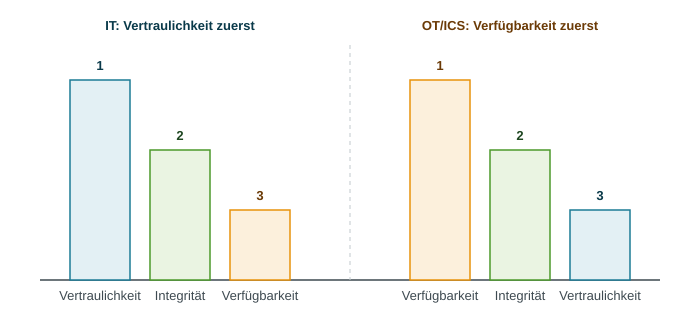
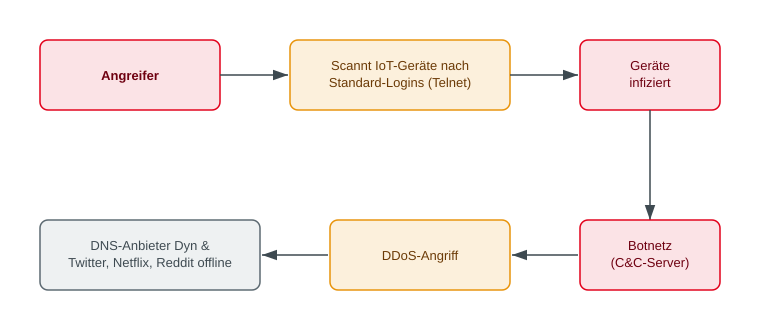

<!-- _class: title -->
# IoT-Sicherheit

   

## Wenn Dinge zur Bedrohung werden

<!-- _notes:
Der Titel ist bewusst doppeldeutig: „Dinge" meint im Englischen die „Things" aus Internet of Things. Die Vorlesung behandelt also Geräte, die ursprünglich gar nicht als IT-Systeme gedacht waren – eine Zentrifuge, eine Überwachungskamera, ein Türschloss – und die durch Vernetzung zu Angriffszielen und zu Angriffswerkzeugen werden.

Der Leitgedanke der gesamten Einheit: Bei klassischen IT-Systemen gibt es einen Verantwortlichen, der patcht, konfiguriert und überwacht. Bei IoT-Geräten fehlt diese Rolle meist vollständig. Daraus entstehen Risiken, die sich nicht durch bessere Technik allein lösen lassen, sondern Hersteller, Regulierung und Nutzer betreffen.

**Klausurvorbereitung:** Als Rahmen für die gesamte Vorlesung merken: IoT-Sicherheit unterscheidet sich von klassischer IT-Sicherheit durch (1) physische Auswirkungen, (2) sehr lange Lebensdauer der Geräte, (3) fehlende Administration.
-->
---
<!-- _class: biglist -->
# Agenda

- **Industrieanlagen im Visier** – Stuxnet und die Besonderheiten von OT
- **Das Smart Home** – Mirai-Botnet und Consumer-IoT-Risiken
- **OWASP IoT Top 10** – die wichtigsten Schwachstellenkategorien

<!-- _notes:
Kompakte Einheit zum Internet of Things (IoT) – die inhaltliche Fortsetzung der Netzwerksicherheits-Vorlesung, diesmal mit Fokus auf die Geräte selbst statt auf das Netzwerk drumherum.

Die Dramaturgie der drei Kapitel ist bewusst gewählt und sollte im Kopf bleiben: Kapitel 1 zeigt das **High-End-Szenario** – ein staatlicher Angreifer mit nahezu unbegrenzten Mitteln (Stuxnet) gegen eine hochgesicherte Industrieanlage. Kapitel 2 zeigt das genaue Gegenteil, das **Low-End-Szenario** – ein technisch trivialer Angriff (Mirai) gegen Billiggeräte ohne jeden Schutz. Beide Extreme führen zu massiven Schäden, allerdings aus völlig unterschiedlichen Gründen. Kapitel 3 ordnet beide Fälle mit den OWASP IoT Top 10 in ein gemeinsames Raster ein.

**Klausurvorbereitung:** Die beiden Fallstudien sind der Prüfungskern. Zu jeder sollten Ablauf, Ursache und Lehre in jeweils zwei bis drei Sätzen frei wiedergegeben werden können. Die OWASP-Liste muss nicht auswendig gelernt werden, aber die Zuordnung „welcher Fall passt zu welcher Kategorie" sollte sitzen.
-->

---
<!-- _class: chapter -->
# Industrieanlagen im Visier

## Wenn ein Cyberangriff Maschinen zerstört

<!-- _notes:
Dieses Kapitel behandelt den Bereich, in dem IT-Sicherheit die digitale Welt verlässt: Wenn ein Angriff nicht Daten verändert, sondern Motoren, Ventile und Rotoren steuert, können Menschen und Maschinen physisch zu Schaden kommen.

Die Kernfrage des Kapitels lautet: Warum lassen sich bewährte IT-Sicherheitsmaßnahmen – regelmäßig patchen, verdächtige Systeme sofort isolieren, alte Hardware ausmustern – in einer Produktionsumgebung oft nicht anwenden? Die Antwort liegt nicht in Unwissenheit der Betreiber, sondern in echten Zielkonflikten zwischen Sicherheit und Betrieb.

**Klausurvorbereitung:** Für dieses Kapitel die Begriffe OT, ICS, SCADA und SPS/PLC sauber unterscheiden können sowie mindestens drei strukturelle Unterschiede zwischen IT- und OT-Sicherheit nennen können.
-->
---
# Fallstudie: Stuxnet (2010)

- **Was geschah?**
  - Hochkomplexe Schadsoftware infizierte die Steuerungssysteme der iranischen Urananreicherungsanlage Natanz
  - Manipulierte gezielt die Drehzahl der Zentrifugen – mal zu schnell, mal zu langsam – und zeigte den Betreibern gleichzeitig **normale Messwerte** an
  - Ergebnis: rund 1.000 Zentrifugen physisch zerstört, ohne dass die Ursache zunächst erkennbar war

<!-- _notes:
Stuxnet gilt als erste bekannte Cyberwaffe, die gezielt physische Zerstörung verursacht hat. Entdeckt wurde die Schadsoftware 2010, aktiv war sie vermutlich schon ab 2007. Die Urheberschaft ist bis heute nicht offiziell bestätigt; in der Fachwelt wird breit ein staatlicher Akteur vermutet, da Aufwand und Zielgenauigkeit die Möglichkeiten krimineller Gruppen deutlich übersteigen.

**Der eigentliche Trick** ist der doppelte Angriff: Stuxnet manipulierte nicht nur die Drehzahl der Zentrifugen, sondern spielte gleichzeitig den Überwachungssystemen zuvor aufgezeichnete Normalwerte vor. Die Bediener sahen also auf ihren Bildschirmen eine einwandfrei laufende Anlage, während die Rotoren real außerhalb ihrer zulässigen Drehzahlbereiche liefen und über Monate hinweg mechanisch zerstört wurden. Das ist ein klassischer **Integritätsangriff** auf die Messdaten – die Betreiber verloren das Vertrauen in ihre eigenen Instrumente, nicht nur in die Anlage.

Die Drehzahländerungen erfolgten bewusst **langsam und selten** (Phasen über Wochen), damit die Ausfälle wie gewöhnlicher Materialverschleiß wirkten. Genau das verzögerte die Erkennung erheblich: Die Techniker tauschten defekte Zentrifugen aus, ohne einen Angriff zu vermuten.

**Ordnung in die CIA-Triade:** Primär betroffen ist die **Integrität** – sowohl der Steuerbefehle als auch der angezeigten Messwerte. Die zerstörten Zentrifugen sind die Folge, also ein Verfügbarkeitsschaden. Vertraulichkeit spielte praktisch keine Rolle; es ging nie um Datendiebstahl.

**Klausurvorbereitung:** Stuxnet in drei Sätzen erklären können: (1) Ziel war die iranische Urananreicherungsanlage Natanz, (2) die Schadsoftware manipulierte die Drehzahl von rund 1.000 Zentrifugen bis zur physischen Zerstörung, (3) gleichzeitig wurden dem Bedienpersonal gefälschte Normalwerte angezeigt. Typische Prüfungsfrage: Welches Schutzziel wurde hier primär verletzt und warum? Antwort: Integrität, weil sowohl Steuerung als auch Messwerte verfälscht wurden.
-->

---
# Wie kam die Schadsoftware in die Anlage?

- Die Anlage war **air-gapped** – keine direkte Verbindung zum Internet
- Verbreitung über infizierte **USB-Sticks**, vermutlich über Zulieferer oder Mitarbeitende eingeschleust
- Nutzte **vier Zero-Day-Schwachstellen** in Windows gleichzeitig – ein Aufwand, der auf staatliche Ressourcen hindeutet
- Zielte gezielt auf **SPS (speicherprogrammierbare Steuerungen)** von Siemens einer bestimmten Konfiguration

> **Merksatz:** Ein Air Gap schützt nicht vor USB-Sticks und Menschen.

> **Zero-Day:** Sicherheitslücke, für die noch kein Patch verfügbar ist. **SPS** ist die deutsche Bezeichnung für **PLC** (Programmable Logic Controller).

<!-- _notes:
**Air Gap** bezeichnet die vollständige physische Trennung eines Netzes vom Internet – es existiert buchstäblich eine „Luftlücke", kein Kabel und keine Funkverbindung. In vielen Hochsicherheitsumgebungen gilt das bis heute als stärkste denkbare Schutzmaßnahme.

Stuxnet zeigt die Grenze dieses Konzepts: Ein Air Gap schützt nur gegen Angriffe **über das Netzwerk**. Sobald ein Datenträger die Lücke überbrückt, ist der Schutz wirkungslos. Genau deshalb ist der Weg über USB-Sticks – eingeschleust über Wartungstechniker, Zulieferer oder unwissende Mitarbeitende – bis heute die typische Methode gegen isolierte Systeme. Der Mensch wird zur Brücke über den Air Gap. Daraus folgt für die Praxis: Air Gaps müssen durch organisatorische Regeln (USB-Sperren, Schleusenrechner zur Datenprüfung, Lieferantenmanagement) ergänzt werden, sonst erzeugen sie nur ein Gefühl von Sicherheit.

**Zero-Day** heißt eine Schwachstelle, die dem Hersteller noch unbekannt ist und für die es folglich keinen Patch gibt – Verteidiger hatten „null Tage" Zeit zu reagieren. Zero-Days sind wertvoll und werden daher normalerweise sparsam eingesetzt, weil sie nach erstem Einsatz entdeckt und geschlossen werden können. Dass Stuxnet gleich **vier** gleichzeitig verbrannte, ist das stärkste technische Indiz für einen staatlichen Angreifer: Nur wer Zero-Days nicht kaufen muss und Erfolg über Wirtschaftlichkeit stellt, agiert so.

Die **Zielgenauigkeit** ist der zweite bemerkenswerte Punkt: Stuxnet verbreitete sich zwar weltweit und infizierte zehntausende Rechner, aktivierte seine zerstörerische Nutzlast aber nur, wenn eine ganz bestimmte Siemens-SPS-Konfiguration mit passender Zentrifugenanordnung vorlag. Auf allen anderen Systemen blieb die Schadsoftware passiv. Das belegt, dass die Angreifer die Zielanlage im Detail kannten.

**Klausurvorbereitung:** Zwei Merksätze reichen oft schon für die Prüfung: „Ein Air Gap schützt nicht vor USB-Sticks und Menschen" und „Vier Zero-Days gleichzeitig deuten auf einen staatlichen Akteur hin". Außerdem sollte die Definition von Zero-Day und die Abkürzung SPS = PLC sicher sitzen.
-->

---
# Was ist an Industrieanlagen besonders?

- **Operational Technology (OT)**: Hard- und Software, die physische Prozesse steuert und überwacht (Maschinen, Ventile, Motoren)
  - Abgrenzung zur klassischen **Information Technology (IT)**, die primär Daten verarbeitet

- Typische OT-Begriffe:
  - **ICS (Industrial Control Systems)**: Sammelbegriff für Steuerungssysteme in der Industrie
  - **SCADA (Supervisory Control and Data Acquisition)**: Systeme zur Fernüberwachung und -steuerung
  - **SPS / PLC (Programmable Logic Controller)**: steuert einzelne Maschinen oder Anlagenteile direkt

> **OT (Operational Technology)** steuert physische Prozesse; **ICS** bezeichnet industrielle Steuerungssysteme, **SCADA** übergeordnete Überwachung und **SPS/PLC** die Steuerung einzelner Maschinen.

<!-- _notes:
Diese Begriffe fallen in der Praxis ständig und werden häufig durcheinandergeworfen, deshalb hier eine saubere Einordnung.

**IT vs. OT** ist die grundlegende Unterscheidung: IT verarbeitet, speichert und transportiert **Daten** – ein Fehler kostet Informationen oder Geld. OT steuert **physische Prozesse** – ein Fehler bewegt reale Masse: ein Ventil öffnet, ein Motor dreht hoch, ein Roboterarm fährt aus. Genau diese physische Kopplung macht OT-Sicherheit zu einem eigenen Fachgebiet.

Die drei Begriffe lassen sich als **Hierarchie von oben nach unten** merken:
• **ICS** ist der Oberbegriff für alle industriellen Steuerungssysteme – die Klammer um alles Weitere.
• **SCADA** ist die Leitwarten-Ebene: zentrale Visualisierung, Fernüberwachung, Alarmierung, Datenaufzeichnung über viele Anlagen oder gar über ein ganzes Versorgungsgebiet hinweg (typisch bei Strom-, Wasser- und Gasnetzen).
• **SPS/PLC** ist die unterste, gerätenahe Ebene: ein robuster Kleinrechner, der direkt an der Maschine sitzt und dort Sensoren ausliest und Aktoren schaltet – in Echtzeit und auch dann weiter, wenn die übergeordnete Leitwarte ausfällt.

Eselsbrücke: SCADA schaut zu und zeigt an, die SPS macht. Stuxnet griff die unterste Ebene an (die SPS) und täuschte gleichzeitig die oberste (die SCADA-Anzeige) – das erklärt, warum der Angriff so lange unentdeckt blieb.

**Klausurvorbereitung:** Alle vier Abkürzungen aussprechen und in einem Satz erklären können. Typische Prüfungsfrage: „Worin unterscheidet sich OT von IT?" – Antwort: OT steuert und überwacht physische Prozesse, IT verarbeitet Daten; daraus folgen abweichende Schutzziel-Prioritäten und Lebenszyklen.
-->

---
<!-- _class: normal -->
# IT und OT ticken unterschiedlich

### IT-Systeme
- Priorität: **Vertraulichkeit** zuerst
- Kurze Update-Zyklen (Tage/Wochen)
- Lebensdauer: 3–5 Jahre
- Ausfall = ärgerlich, aber selten gefährlich

### OT / ICS
- Priorität: **Verfügbarkeit** zuerst
- Patches oft erst bei geplantem Stillstand
- Lebensdauer: 15–20+ Jahre
- Ausfall = Produktionsstopp oder **physischer Schaden**

> **Abwägung:** Ein sofortiger Neustart für einen Patch kann eine laufende Produktionsanlage stoppen; ein Aufschub lässt die Schwachstelle länger offen.

<!-- _notes:
Diese Gegenüberstellung ist die wichtigste Folie des OT-Kapitels, weil sie erklärt, warum Security-Konzepte aus der klassischen IT sich nicht eins zu eins auf OT übertragen lassen.

**Zur Update-Problematik:** Ein Produktionsstillstand kostet in der Automobilfertigung schnell einen hohen fünf- bis sechsstelligen Betrag pro Stunde. Ein Neustart „nur" für einen Patch ist damit eine betriebswirtschaftliche Entscheidung, keine technische. Hinzu kommt: Viele Anlagen sind vom Hersteller **zertifiziert** (etwa im Pharma- oder Medizinbereich); eine nachträgliche Änderung der Software kann die Zulassung oder Gewährleistung ungeltend machen. Patches werden daher in Wartungsfenstern gebündelt, die oft nur ein- bis zweimal pro Jahr stattfinden.

**Zur Lebensdauer:** Eine Produktionsanlage wird nach wirtschaftlicher Abschreibung betrieben, nicht nach IT-Zyklen. 15 bis 20 Jahre sind normal, 30 Jahre keine Seltenheit. Deshalb laufen in Fabrikhallen bis heute Steuerungsrechner mit Windows XP oder noch älteren Systemen, für die es seit Jahren keine Sicherheitsupdates mehr gibt. Diese Systeme lassen sich oft nicht ersetzen, weil die Steuerungssoftware nur auf dieser Plattform läuft und der Hersteller nicht mehr existiert.

**Konsequenz für die Praxis:** Da Patchen häufig unmöglich ist, verlagert sich OT-Sicherheit auf **kompensierende Maßnahmen** – vor allem Netzsegmentierung (Trennung von Büro-IT und Produktionsnetz), strenge Zugriffskontrolle an den Übergängen und passive Überwachung des Datenverkehrs. Man akzeptiert die Schwachstelle und erschwert stattdessen den Zugang zu ihr.

**Klausurvorbereitung:** Mindestens drei Unterschiede IT/OT frei nennen können (Schutzzielpriorität, Patch-Zyklus, Lebensdauer, Schadensart). Zusatzfrage, die gern gestellt wird: „Warum laufen in Industrieanlagen noch veraltete Betriebssysteme?" – Antwort: lange Abschreibungszeiträume, Herstellerzertifizierung, fehlende Ersatzsoftware, Stillstandskosten.
-->

---
# Die CIA-Reihenfolge kehrt sich um

<!-- _notes:
Aus der ersten Vorlesung ist die CIA-Triade bekannt: Confidentiality (Vertraulichkeit), Integrity (Integrität), Availability (Verfügbarkeit). In der klassischen IT wird typischerweise in genau dieser Reihenfolge priorisiert – ein Datenleck gilt als schlimmer als ein kurzer Ausfall.

In der OT-Welt kehrt sich die Reihenfolge faktisch um: **Verfügbarkeit steht an erster Stelle**, weil ein Anlagenstillstand sofort teuer oder sogar gefährlich wird – man denke an ein Kraftwerk, eine Wasseraufbereitung oder einen chemischen Prozess, der nicht einfach angehalten werden kann. Die Integrität bleibt in der Mitte, weil verfälschte Steuerbefehle und Messwerte unmittelbar zu Fehlsteuerungen führen (genau der Stuxnet-Fall). Die Vertraulichkeit rückt nach hinten: Dass ein Angreifer die Temperatur eines Kessels mitliest, ist weniger kritisch, als wenn er sie verändert.

**Praktische Konsequenz** – und das ist der Punkt, der in Prüfungen gern gefragt wird: Bei einem Sicherheitsvorfall lautet der IT-Reflex „System sofort vom Netz nehmen". In der OT wäre genau das unter Umständen der größere Schaden – dort wird häufig bis zum Schichtende oder zum nächsten geplanten Stillstand gewartet und in der Zwischenzeit nur überwacht und isoliert. Die Incident Response muss deshalb in OT-Umgebungen anders geplant werden als in der Büro-IT.

**Bildbeschreibung:** Die Grafik stellt zwei Balkengruppen nebeneinander, getrennt durch eine senkrechte gestrichelte Linie in der Bildmitte. Beide Gruppen stehen auf einer gemeinsamen waagerechten Grundlinie, sodass die Balken wie bei einem Säulendiagramm von oben unterschiedlich weit herunterreichen. Die linke Hälfte trägt die fettgedruckte Überschrift „IT: Vertraulichkeit zuerst", die rechte Hälfte „OT/ICS: Verfügbarkeit zuerst". Jede Gruppe besteht aus drei Balken, deren Höhe die Priorität ausdrückt: der höchste Balken ist mit einer „1" über dem Balken markiert, der mittlere mit „2", der niedrigste mit „3". Unter jedem Balken steht das zugehörige Schutzziel. Die Farben sind in beiden Hälften konsistent vergeben: Vertraulichkeit blau, Integrität grün, Verfügbarkeit orange. Links steht in absteigender Höhe die Reihenfolge Vertraulichkeit (blau, höchster Balken), Integrität (grün, mittel), Verfügbarkeit (orange, niedrigster Balken). Rechts ist die Reihenfolge gespiegelt: Verfügbarkeit (orange, höchster Balken), Integrität (grün, mittel), Vertraulichkeit (blau, niedrigster Balken). Dadurch fällt sofort auf, dass der blaue und der orange Balken ihre Plätze getauscht haben, während der grüne Balken der Integrität in beiden Welten unverändert auf Platz 2 in der Mitte steht.

**Klausurvorbereitung:** Die Aussage des Diagramms in einem Satz formulieren können: In der IT gilt die Priorität C – I – A, in der OT kehrt sie sich zu A – I – C um, wobei die Integrität in beiden Fällen auf Platz 2 bleibt. Ergänzend eine praktische Folge nennen können, etwa die unterschiedliche Reaktion auf einen Vorfall (sofortige Isolation in der IT vs. kontrollierter Weiterbetrieb in der OT).
-->

---
# Weitere Besonderheiten von OT-Umgebungen

- **Fernwartungszugänge**: Hersteller warten Anlagen zunehmend per Fernzugriff – zusätzliche Angriffsfläche
- **Industrie 4.0 / IIoT**: bisher isolierte Anlagen werden zur Vernetzung mit der Büro-IT und dem Internet verbunden
- Ein erfolgreicher Angriff wirkt sich **physisch** aus: Maschinenschäden, Produktionsausfälle, im Extremfall Gefahr für Menschen

> **Merksatz:** In der IT verliert man Daten – in der OT können Maschinen explodieren.

<!-- _notes:
Diese Folie schließt das OT-Kapitel mit den Entwicklungen ab, die die Lage in den letzten Jahren verschärft haben.

**Fernwartung** ist betriebswirtschaftlich attraktiv – der Hersteller muss keinen Techniker anreisen lassen, Störungen werden schneller behoben. Sicherheitstechnisch entsteht damit aber ein dauerhafter Zugang von außen in das Herz der Produktion, häufig über Zugangsdaten, die beim Hersteller liegen und nicht vom Betreiber kontrolliert werden. Damit wird die Sicherheit der eigenen Anlage von der Sicherheit des Lieferanten abhängig – ein typisches **Supply-Chain-Risiko**.

**Industrie 4.0 / IIoT** (Industrial Internet of Things) bedeutet, dass Maschinendaten zur Prozessoptimierung, Qualitätssicherung und vorausschauenden Wartung (Predictive Maintenance) in die Büro-IT oder gleich in eine Cloud fließen. Dadurch fällt genau die Isolation weg, die Industrieanlagen jahrzehntelang faktisch geschützt hat. Die klassische Trennlinie „Fabrikhalle ist offline, Büro ist online" existiert in modernen Werken nicht mehr. Die gängige Gegenmaßnahme ist eine gestufte Architektur mit einer entmilitarisierten Zone zwischen Produktions- und Büronetz, oft nach dem Purdue-Modell oder der Normenreihe IEC 62443 strukturiert.

**Physische Schadenswirkung:** Der entscheidende Unterschied zu allen bisherigen Vorlesungsthemen. Reale Beispiele neben Stuxnet: der Angriff auf ein deutsches Stahlwerk (2014), bei dem ein Hochofen nicht mehr geregelt heruntergefahren werden konnte und erheblichen Schaden nahm, sowie die Triton/Trisis-Schadsoftware (2017), die gezielt ein Sicherheitsabschaltsystem einer petrochemischen Anlage manipulierte – also ausgerechnet jenes System, das im Notfall Menschenleben schützen soll.

**Klausurvorbereitung:** Erklären können, warum die Vernetzung im Rahmen von Industrie 4.0 das Risiko erhöht (Wegfall der Isolation, größere Angriffsfläche, Verbindung zu Altsystemen ohne Schutzmechanismen). Den Merksatz zum Unterschied zwischen digitalem und physischem Schaden parat haben.
-->

---
<!-- _class: chapter -->
# Das Smart Home

## Consumer-IoT und das Mirai-Botnet

<!-- _notes:
Der Wechsel vom Industrie- in den Consumer-Bereich ist ein bewusster Kontrast: Im vorherigen Kapitel stand ein Angreifer mit staatlichen Ressourcen gegen eine hochgesicherte Anlage. Jetzt geht es um das genaue Gegenteil – ein technisch trivialer Angriff gegen Geräte, die überhaupt keinen nennenswerten Schutz besitzen.

Die Leitfrage des Kapitels lautet: Warum richtet ein simpler Angriff auf billige Geräte größeren öffentlichen Schaden an als eine hochentwickelte Cyberwaffe? Die Antwort liegt in der **Masse**: Nicht die Qualität des Angriffs entscheidet, sondern die Zahl der verwundbaren Geräte.

Ein zweiter wichtiger Perspektivwechsel: Bisher war das angegriffene System immer auch das Ziel. Bei Mirai ist das IoT-Gerät nur das **Werkzeug** – getroffen werden soll jemand ganz anderes.

**Klausurvorbereitung:** Für dieses Kapitel die vier strukturellen Ursachen der IoT-Unsicherheit (Kostendruck, fehlende Updates, Monokultur, Dauerbetrieb online) sowie den Mirai-Ablauf vom Scan bis zum DDoS sicher beherrschen.
-->
---
# Was ist Consumer-IoT / Smart Home?

- **Internet of Things (IoT)**: Alltagsgegenstände mit Internetverbindung, Sensorik und eigener Intelligenz
- Typische Smart-Home-Geräte: IP-Kameras, smarte Steckdosen, Türschlösser, Lautsprecher, Router, Babyphones
- Gemeinsamkeit: **billig, massenhaft verkauft, dauerhaft online**
- Im Gegensatz zur Industrieanlage: kein Sicherheitsteam, kein IT-Admin – der Nutzer selbst ist verantwortlich

<!-- _notes:
**Definition:** Internet of Things bezeichnet Alltagsgegenstände, die um Sensorik, Rechenleistung und Netzwerkanbindung erweitert wurden und dadurch Daten erfassen, senden und auf Befehle reagieren können. Entscheidend ist: Es handelt sich um Geräte, deren **primärer Zweck nicht Datenverarbeitung** ist – eine Kamera soll filmen, ein Schloss soll schließen. Die IT-Komponente ist Beiwerk, und genau deshalb wird sie bei Entwicklung und Betrieb stiefmütterlich behandelt.

**Abgrenzung zu klassischer IT:** Ein Laptop oder Smartphone hat ein Betriebssystem mit automatischen Updates, eine Benutzeroberfläche für Sicherheitseinstellungen und einen Nutzer, der Warnmeldungen sieht. Ein IoT-Gerät hat häufig keines davon: kein Display, keine Benachrichtigung, kein Update-Dialog. Der Nutzer bemerkt daher weder eine Schwachstelle noch eine Infektion.

**Der Verantwortungsunterschied zur OT** ist der Kernpunkt dieser Folie: In einem Industriebetrieb existieren zumindest Fachpersonal, Wartungsverträge und dokumentierte Prozesse – Sicherheit ist dort schwierig, aber jemand ist zuständig. Beim Smart-Home-Gerät für 20 Euro ist formal der Endnutzer verantwortlich, der aber weder das Wissen noch die technischen Möglichkeiten hat, das Gerät abzusichern. Diese Lücke zwischen formaler Verantwortung und tatsächlicher Handlungsfähigkeit ist der Grund, warum der Gesetzgeber zunehmend eingreift (EU Cyber Resilience Act, Funkanlagenrichtlinie).

**Klausurvorbereitung:** IoT in einem Satz definieren können und den Unterschied zu klassischen IT-Geräten begründen: keine Administration, keine Benutzeroberfläche für Sicherheit, kein Bewusstsein des Nutzers für den Zustand des Geräts.
-->

---
# Warum Smart-Home-Geräte so anfällig sind

- **Kostendruck**: Sicherheit kostet Entwicklungszeit – bei Billigware oft die erste Einsparung
- **Keine Update-Mechanismen**: viele Geräte erhalten nie ein Sicherheitsupdate, manche Hersteller existieren nach Jahren nicht mehr
- **Monokultur**: dieselbe Firmware steckt in tausenden baugleichen Geräten weltweit – eine Schwachstelle betrifft alle gleichzeitig
- **Immer online**: Geräte laufen 24/7 und sind oft direkt aus dem Internet erreichbar

<!-- _notes:
Diese vier Punkte sind der rote Faden für praktisch jeden IoT-Sicherheitsvorfall im Consumer-Bereich und sollten einzeln begründet werden können.

**Kostendruck:** Bei einem Verkaufspreis von wenigen Euro liegt die Marge pro Gerät im Centbereich. Sicherheitsentwicklung, Code-Reviews, Penetrationstests und ein über Jahre betriebener Update-Server sind Kosten, die sich über diese Marge nicht refinanzieren lassen. Sicherheit ist zudem für den Käufer im Laden unsichtbar – niemand vergleicht zwei Kameras nach Patch-Politik. Es entsteht ein klassisches **Marktversagen**: Der Hersteller, der in Sicherheit investiert, ist im Preiswettbewerb im Nachteil.

**Keine Update-Mechanismen:** Viele Geräte besitzen technisch gar keine Möglichkeit, Firmware nachzuladen. Selbst wo sie existiert, endet die Unterstützung oft nach kurzer Zeit – oder der Hersteller verschwindet vom Markt, während seine Geräte noch jahrelang in Haushalten laufen. Das Gerät ist damit ab Werk auf dem Sicherheitsstand eingefroren, auf dem es ausgeliefert wurde.

**Monokultur:** Hinter vielen unterschiedlich beschrifteten Marken steckt dieselbe Hardware und Firmware eines einzigen Zulieferers (sogenanntes White-Labeling). Eine einzige Schwachstelle betrifft dadurch nicht ein Modell, sondern hunderte Produktnamen in Millionen Haushalten gleichzeitig. Das macht automatisierte Massenangriffe erst lohnend: Der Angreifer entwickelt einmal und erntet millionenfach.

**Immer online:** Geräte laufen 24/7 ohne Neustart und sind durch Portweiterleitungen oder UPnP häufig direkt aus dem Internet erreichbar. Suchmaschinen wie Shodan indexieren diese Geräte systematisch – ein Angreifer muss also nicht einmal selbst scannen. Dauerbetrieb bedeutet außerdem: Ein einmal infiziertes Gerät bleibt für den Angreifer zuverlässig nutzbar.

**Wechselwirkung:** Entscheidend ist, dass sich die vier Faktoren gegenseitig verstärken. Ein Gerät ohne Update-Mechanismus wäre tolerierbar, wenn es nicht erreichbar wäre. Ein erreichbares Gerät wäre tolerierbar, wenn es gepatcht würde. Die Kombination aus allen vier Punkten erzeugt das Risiko.

**Klausurvorbereitung:** Alle vier Ursachen nennen und jeweils mit einem Satz begründen können. Häufige Prüfungsfrage: „Warum sind IoT-Geräte unsicherer als PCs?" – die vier Punkte sind die Musterantwort.
-->

---
# Fallstudie: Mirai-Botnet (2016)

- **Was geschah?**
  - Schadsoftware scannte automatisiert das Internet nach IoT-Geräten mit offenem **Telnet-Zugang**
  - Testete dabei eine Liste von rund **60 Standard-Benutzername/Passwort-Kombinationen** (z. B. `admin`/`admin`)
  - Infizierte so hunderttausende Kameras, Router und Digitalrekorder – ganz ohne komplexe Exploits

> **Telnet:** älterer Fernzugangsdienst zur Anmeldung am Gerät. Standard-Zugangsdaten erlaubten Mirai, sich an schlecht gesicherten Geräten anzumelden.

<!-- _notes:
Mirai (japanisch für „Zukunft") tauchte 2016 auf und ist der Gegenentwurf zu Stuxnet: kein Zero-Day, kein Exploit, keine staatlichen Ressourcen – sondern schlicht das Ausprobieren von Werksvorgaben, die Nutzer nie geändert hatten.

**Ablauf im Detail:** Ein bereits infiziertes Gerät scannt eigenständig zufällige IP-Adressbereiche nach offenen Telnet-Ports (23 und 2323). Findet es eine Anmeldeaufforderung, arbeitet es eine fest einprogrammierte Liste von rund 60 Standard-Kombinationen ab (`admin/admin`, `root/123456`, `support/support` und ähnliche). Bei Erfolg wird die Schadsoftware nachgeladen und das Gerät Teil des Botnetzes, das wiederum selbst zu scannen beginnt – ein sich selbst beschleunigender Prozess. Innerhalb weniger Stunden waren so Hunderttausende Geräte infiziert.

**Warum Telnet?** Telnet ist ein Fernzugangsprotokoll aus den 1960er-Jahren, das Zugangsdaten **im Klartext** überträgt und keinerlei Verschlüsselung kennt. In der professionellen IT wurde es längst durch SSH ersetzt. In günstiger IoT-Firmware blieb es erhalten, weil es minimal Ressourcen benötigt und bei der Fertigung zur Diagnose praktisch ist – häufig vergisst der Hersteller dann schlicht, es vor Auslieferung zu deaktivieren.

**Besonderheit der Infektion:** Mirai nistete sich nur im Arbeitsspeicher ein, nicht dauerhaft in der Firmware. Ein Neustart entfernte die Schadsoftware also – aber da das Standardpasswort unverändert blieb, wurde das Gerät meist binnen Minuten erneut infiziert. Das ist ein lehrreiches Beispiel dafür, dass Bereinigung ohne Beseitigung der Ursache wirkungslos bleibt.

**Klausurvorbereitung:** Den Ablauf in vier Schritten wiedergeben können: scannen – Standardpasswort durchprobieren – infizieren – weiterscannen. Typische Prüfungsfrage: „Warum war Mirai trotz einfachster Technik so erfolgreich?" – Antwort: wegen der Masse ungesicherter, baugleicher Geräte mit unveränderten Werkszugangsdaten.
-->

---
# Mirai-Botnet als Diagramm

<!-- _notes:
Das Diagramm zeigt den vollständigen Ablauf vom automatisierten Scan bis zum eigentlichen Ziel des Angriffs. Zentral ist die Erkenntnis, dass die IoT-Geräte selbst für die Angreifer völlig uninteressant waren – niemand wollte die Aufnahmen der Kameras sehen. Die Geräte dienten ausschließlich als **Werkzeug**, um jemand anderen zu treffen. Die Besitzer bemerkten von der Infektion in aller Regel nichts; allenfalls lief das Gerät etwas langsamer oder die Internetverbindung war stärker ausgelastet.

**Zum Ziel des Angriffs:** Am 21. Oktober 2016 richtete sich ein Mirai-DDoS gegen den DNS-Dienstleister Dyn. DNS übersetzt Namen wie `twitter.com` in IP-Adressen. Fällt dieser Dienst aus, sind die betroffenen Webseiten technisch noch erreichbar – aber niemand findet mehr den Weg dorthin. Deshalb konnte ein Angriff auf ein einziges Unternehmen große Teile des amerikanischen und europäischen Internets lahmlegen, darunter Twitter, Netflix, Reddit, Spotify und PayPal. Das ist ein Musterbeispiel für ein **Single Point of Failure**-Problem durch zentrale Infrastrukturdienste.

**C&C-Server** (Command and Control) ist die zentrale Steuerstelle, bei der sich alle infizierten Geräte melden und von der sie ihre Befehle erhalten. Sie ist gleichzeitig die größte Schwachstelle eines Botnetzes: Wird sie abgeschaltet, verliert der Angreifer die Kontrolle – weshalb moderne Botnetze auf verteilte oder Peer-to-Peer-Steuerung ausweichen.

**Bildbeschreibung:** Das Diagramm stellt den Ablauf in zwei Zeilen dar, die über die rechte Seite miteinander verbunden sind, sodass der Lesefluss insgesamt einem umgekehrten U folgt. In der oberen Zeile steht links ein rot hinterlegter Kasten mit der fettgedruckten Beschriftung „Angreifer". Von dort führt ein Pfeil nach rechts zu einem orange hinterlegten Kasten mit dem Text „Scannt IoT-Geräte nach Standard-Logins (Telnet)". Von diesem führt ein weiterer Pfeil nach rechts zu einem rot hinterlegten Kasten mit der Beschriftung „Geräte infiziert". Von dort führt ein Pfeil senkrecht nach unten in die zweite Zeile, und zwar zu einem rot hinterlegten Kasten mit der Beschriftung „Botnetz (C&C-Server)". Die untere Zeile verläuft anschließend von rechts nach links: Vom Botnetz-Kasten zeigt ein Pfeil nach links auf einen orange hinterlegten Kasten mit der Beschriftung „DDoS-Angriff", und von diesem ein weiterer Pfeil nach links auf einen grau hinterlegten Kasten mit dem Text „DNS-Anbieter Dyn & Twitter, Netflix, Reddit offline". Die Farbgebung ist bedeutungstragend: Rot markiert die vom Angreifer kontrollierten Elemente, Orange die Angriffshandlungen und Grau das unbeteiligte Opfer am Ende der Kette. Auffällig ist, dass der infizierte Gerätepark in der Mitte des Ablaufs steht – er ist weder Ausgangspunkt noch Ziel, sondern reines Zwischenglied.

**Klausurvorbereitung:** Den dargestellten Ablauf in fünf Stufen wiedergeben können: (1) Angreifer startet automatisierten Scan, (2) Geräte mit Standard-Logins werden infiziert, (3) infizierte Geräte melden sich beim C&C-Server und bilden das Botnetz, (4) auf Befehl erfolgt ein gemeinsamer DDoS-Angriff, (5) das eigentliche Opfer ist ein zentraler Dienst, dessen Ausfall viele weitere Dienste mitreißt. Wichtig ist die Einsicht, dass Gerätebesitzer unfreiwillige Mittäter sind.
-->

---
# Konsequenzen & Lehren aus Mirai

- **Konsequenzen**: großflächiger Ausfall bekannter Internetdienste, verstärkte regulatorische Debatten über IoT-Mindeststandards
- Der Quellcode wurde veröffentlicht – seither Basis unzähliger Varianten und Nachfolge-Botnetze
- **Lehre**: Ein einzelnes unsicheres Gerät gefährdet nicht nur seinen Besitzer, sondern potenziell das gesamte Internet

> **Merksatz:** Das schwächste Glied im IoT ist selten das Gerät selbst – es ist das Standardpasswort.

<!-- _notes:
Drei Lehren aus Mirai, die über den konkreten Vorfall hinausreichen.

**Erstens die Veröffentlichung des Quellcodes:** Der Autor stellte den Code kurz nach dem Angriff öffentlich ins Netz – mutmaßlich, um die eigene Spur in der Masse von Nachahmern zu verwischen. Die Folge war, dass Mirai kein einmaliger Vorfall blieb, sondern zur technischen Grundlage unzähliger Varianten wurde (Satori, Okiru, Mozi und viele weitere), die bis heute aktiv sind und längst auch echte Exploits statt nur Standardpasswörter nutzen. Allgemeine Lehre: Offengelegter Angriffscode senkt die Einstiegshürde dauerhaft – aus einem Vorfall wird eine ganze Angriffsklasse.

**Zweitens die externe Wirkung:** Der klassische Sicherheitsgedanke fragt „Welcher Schaden entsteht mir, wenn mein Gerät kompromittiert wird?" Bei Mirai lautet die Antwort: fast keiner. Der Schaden entsteht **Dritten**. Das ist ökonomisch eine **negative Externalität** – derjenige, der die Kosten verursacht (Hersteller, Nutzer), trägt sie nicht. Genau deshalb korrigiert sich das Problem nicht von selbst über den Markt, und genau deshalb greift der Gesetzgeber ein: Der EU Cyber Resilience Act verpflichtet Hersteller erstmals verbindlich zu Update-Bereitstellung über einen Mindestzeitraum und verbietet die Auslieferung mit universellen Standardpasswörtern.

**Drittens die Gegenmaßnahmen**, die sich daraus ableiten: individuelle Werkspasswörter pro Gerät statt einheitlicher Vorgaben, Abschalten nicht benötigter Dienste wie Telnet im Auslieferungszustand, keine unnötige Erreichbarkeit aus dem Internet (keine Portweiterleitung, UPnP deaktivieren) und auf Nutzerseite die Trennung von IoT-Geräten in ein eigenes WLAN-Netz, damit ein kompromittiertes Gerät nicht auch noch das Heimnetz gefährdet.

**Klausurvorbereitung:** Die zentrale Lehre formulieren können: Ein unsicheres IoT-Gerät gefährdet weniger seinen Besitzer als unbeteiligte Dritte – daraus folgt, dass IoT-Sicherheit nicht allein über Nutzerverantwortung lösbar ist, sondern Hersteller- und Regulierungspflichten erfordert. Mindestens zwei konkrete Gegenmaßnahmen nennen können.
-->

---
<!-- _class: chapter -->
# OWASP IoT Top 10

## Die häufigsten Schwachstellenkategorien im Überblick

<!-- _notes:
Nach zwei konkreten Fallstudien folgt nun die systematische Einordnung. Beide Fälle waren Einzelbeispiele – die OWASP IoT Top 10 liefern das Raster, mit dem sich beliebige IoT-Risiken strukturiert bewerten lassen.

**OWASP** steht für Open Worldwide Application Security Project, eine gemeinnützige Organisation, die herstellerneutrale Sicherheitsstandards und Checklisten veröffentlicht. Die bekannteste Liste ist die OWASP Top 10 für Webanwendungen aus dem SSDLC-Kapitel; die IoT-Liste ist deren Gegenstück für vernetzte Geräte.

Wichtig zum Verständnis solcher Listen: Es handelt sich **nicht** um eine Rangliste der gefährlichsten Angriffe, sondern um die in der Praxis am häufigsten beobachteten Schwachstellenkategorien. Sie dienen als Prüfraster – etwa bei der Beschaffung von Geräten oder bei einem Sicherheitsaudit.

**Klausurvorbereitung:** Die Liste muss nicht vollständig auswendig beherrscht werden. Gefragt wird typischerweise die Zuordnung: Welche Kategorie passt zu welchem Vorfall? Mirai → I1 und I2, fehlende Smart-Home-Updates → I4, OT-Altsysteme → I5.
-->
---
# Die OWASP IoT Top 10 (2018)

| # | Kategorie |
|---|---|
| I1 | Schwache, erratbare oder fest codierte Passwörter |
| I2 | Unsichere Netzwerkdienste |
| I3 | Unsichere Ecosystem-Schnittstellen (App, Cloud, API) |
| I4 | Fehlender sicherer Update-Mechanismus |
| I5 | Einsatz unsicherer oder veralteter Komponenten |

> **Beispiel für I3:** Eine sichere Kamera hilft wenig, wenn ihre Smartphone-App oder Cloud-Schnittstelle unberechtigt auf Aufnahmen zugreifen lässt.

<!-- _notes:
Analog zur OWASP Top 10 für Webanwendungen aus dem SSDLC-Kapitel gibt es eine eigene Liste speziell für IoT-Geräte. Die ersten fünf Kategorien im Einzelnen:

• **I1 – Schwache, erratbare oder fest codierte Passwörter:** Steht nicht zufällig auf Platz 1 – genau diese Kategorie ermöglichte Mirai. Wird auf der nächsten Folie vertieft.
• **I2 – Unsichere Netzwerkdienste:** Dienste, die auf dem Gerät lauschen und aus dem Netz erreichbar sind, obwohl sie es nicht sein müssten – Telnet ist das Paradebeispiel, aber auch offene Debug-Schnittstellen, ungesicherte Web-Oberflächen oder UPnP gehören hierher. Grundregel: Jeder nicht benötigte Dienst ist Angriffsfläche.
• **I3 – Unsichere Ecosystem-Schnittstellen:** Ein IoT-Gerät ist nie nur das Gerät. Dazu gehören die Smartphone-App, die Cloud-Plattform des Herstellers und die Programmierschnittstellen dazwischen. Häufiger Fehler ist eine API, die beim Abruf von Aufnahmen zwar die Anmeldung prüft, aber nicht, ob der Nutzer auch Eigentümer dieser Kamera ist – eine geänderte Geräte-ID genügt dann für fremden Zugriff.
• **I4 – Fehlender sicherer Update-Mechanismus:** Wird ebenfalls vertieft. „Sicher" ist dabei genauso wichtig wie „vorhanden": Ein Update, das unverschlüsselt und unsigniert geladen wird, kann vom Angreifer ausgetauscht werden und wird so selbst zum Einfallstor.
• **I5 – Unsichere oder veraltete Komponenten:** IoT-Firmware besteht größtenteils aus Open-Source-Bausteinen (Linux-Kernel, Netzwerkbibliotheken, Verschlüsselungsbibliotheken). Werden diese jahrelang nicht aktualisiert, erbt das Gerät sämtliche bekannt gewordenen Schwachstellen. Bezug zum Supply-Chain-Thema: Man ist nur so sicher wie die schwächste eingebaute Fremdkomponente.

**Klausurvorbereitung:** Zu jeder der fünf Kategorien ein eigenes Beispiel nennen können. Besonders prüfungsrelevant ist I3, weil es verdeutlicht, dass die Sicherheitsbetrachtung das gesamte Ökosystem aus Gerät, App und Cloud umfassen muss, nicht nur die Hardware.
-->
---
# Die OWASP IoT Top 10 (2018)

| # | Kategorie |
|---|---|
| I6 | Unzureichender Datenschutz |
| I7 | Unsichere Datenübertragung & -speicherung |
| I8 | Fehlendes Geräte-Management |
| I9 | Unsichere Standardeinstellungen |
| I10 | Fehlende physische Absicherung |

<!-- _notes:
Die Kategorien I6 bis I10 decken die übrigen Stellen im Lebenszyklus eines Geräts ab:

• **I6 – Unzureichender Datenschutz:** Viele Geräte erheben deutlich mehr Daten als für ihre Funktion nötig und übertragen sie an Hersteller oder Dritte. Ein smarter Lautsprecher zeichnet Sprache auf, ein Fitnesstracker Gesundheitsdaten, ein Staubsaugerroboter den Grundriss der Wohnung. Direkter Bezug zur DSGVO: Datenminimierung und Zweckbindung sind rechtlich verpflichtend, in der Praxis aber häufig nicht umgesetzt.
• **I7 – Unsichere Datenübertragung und -speicherung:** Daten werden unverschlüsselt übertragen oder auf dem Gerät im Klartext abgelegt – etwa das WLAN-Passwort des Haushalts in einem ungeschützten Speicherbereich. Wer das Gerät weiterverkauft oder entsorgt, gibt damit unbemerkt Zugangsdaten weiter.
• **I8 – Fehlendes Geräte-Management:** Es existiert keine Übersicht darüber, welche Geräte überhaupt im Netz hängen, in welchem Firmware-Stand sie sind und ob sie noch unterstützt werden. Was man nicht kennt, kann man nicht schützen – ein Inventar ist die Grundvoraussetzung jeder Sicherheitsmaßnahme.
• **I9 – Unsichere Standardeinstellungen:** Das Gerät ist ab Werk so konfiguriert, dass es bequem, aber nicht sicher läuft – offene Dienste, unverändertes Standardpasswort, Fernzugriff aktiviert. Das Gegenprinzip heißt **Secure by Default**: Die sichere Einstellung ist die Voreinstellung, Komfortfunktionen muss der Nutzer bewusst einschalten.
• **I10 – Fehlende physische Absicherung:** Wer das Gerät in die Hand bekommt, kann über offene Wartungsanschlüsse (etwa serielle Schnittstellen oder JTAG auf der Platine) die Firmware auslesen. Daraus lassen sich fest codierte Passwörter und Schlüssel extrahieren – und wegen der Monokultur gelten diese dann für alle baugleichen Geräte weltweit. Besonders relevant bei Geräten im öffentlichen Raum wie Kameras, Ladegeräten oder Sensoren.

**Klausurvorbereitung:** Nicht alle zehn Punkte auswendig lernen, sondern das Gliederungsprinzip verstehen: Die Liste folgt grob dem Lebenszyklus von Zugangsdaten über Schnittstellen und Daten bis zum Betrieb und zur physischen Ebene. Besonders merken: I9 (Secure by Default) und I10 (physischer Zugriff als Angriffsweg).
-->
---
# Vertiefung: I1 – Schwache/fest codierte Passwörter

- Geräte werden mit **Standard-Zugangsdaten** ausgeliefert, die Nutzer selten ändern
- Manche Geräte haben zusätzlich **fest codierte** (hardcoded) Zugänge, die sich gar nicht ändern lassen
- **Bereits gesehen bei:** Mirai-Botnet – Infektion allein über ausprobierte Standard-Logins

<!-- _notes:
Direkter Rückgriff auf die Mirai-Fallstudie: Genau diese Kategorie war der Türöffner für hunderttausende Infektionen – deshalb steht sie in der Liste auf Platz 1.

**Drei Stufen des Problems**, die sauber unterschieden werden sollten:
• **Schwache Passwörter:** Der Nutzer darf ein Passwort setzen, wählt aber ein triviales. Das ist ein klassisches Awareness-Problem.
• **Standard-Zugangsdaten (Default Credentials):** Das Gerät kommt mit einem Werkspasswort, das für die gesamte Modellreihe identisch ist und in jeder frei verfügbaren Bedienungsanleitung steht. Änderbar wäre es – nur ändert es fast niemand, weil das Gerät auch ohne Änderung funktioniert. Es gibt öffentliche Datenbanken, die Werkszugangsdaten tausender Modelle sammeln; der Angreifer muss also nichts raten.
• **Fest codierte Zugänge (Hardcoded Credentials):** Die schwerwiegendste Variante. Zugangsdaten sind unveränderlich in die Firmware eingebrannt, oft als versteckter Service- oder Debug-Zugang für den Hersteller. Der Nutzer kann sie weder einsehen noch ändern noch deaktivieren – sein eigenes, sicheres Passwort nützt nichts, weil der zweite Zugang daneben weiterbesteht. Sobald jemand die Firmware ausliest und veröffentlicht (siehe I10), sind alle Geräte dieser Baureihe dauerhaft offen. Die einzige Abhilfe wäre ein Firmware-Update – womit wir wieder bei I4 wären.

**Gegenmaßnahmen:** Erzwungene Passwortänderung bei der Ersteinrichtung, individuelle Zufallspasswörter pro Gerät (aufgedruckt auf einem Aufkleber am Gerät), vollständiger Verzicht auf versteckte Service-Zugänge. Der EU Cyber Resilience Act greift genau hier an und verbietet einheitliche Werkspasswörter.

**Klausurvorbereitung:** Den Unterschied zwischen änderbaren Standard-Zugangsdaten und nicht änderbaren fest codierten Zugängen präzise erklären können – das ist der häufigste Prüfungspunkt zu I1. Mirai als Beispiel zuordnen können.
-->

---
# Vertiefung: I4 – Fehlender sicherer Update-Mechanismus

- Viele IoT-Geräte haben **keinen** oder nur einen unsicheren Weg, um Sicherheitsupdates zu erhalten
- Betrifft Consumer-Geräte (nie ein Update) **und** Industrieanlagen (Updates nur im geplanten Stillstand)
- Ohne Update-Mechanismus bleibt eine einmal bekannte Schwachstelle **dauerhaft** ausnutzbar

<!-- _notes:
Diese Kategorie verbindet beide Fallstudien der Vorlesung und ist deshalb didaktisch der Schlusspunkt.

**Die beiden Ausprägungen des Problems:**
• Im **Consumer-Bereich** fehlt der Update-Mechanismus häufig vollständig – technisch nicht vorgesehen, oder der Hersteller stellt keine Updates mehr bereit beziehungsweise existiert nicht mehr. Das Gerät bleibt auf dem Sicherheitsstand des Auslieferungstages stehen, läuft aber noch zehn Jahre im Haushalt.
• In der **OT** ist der Mechanismus zwar vorhanden, aber praktisch nicht nutzbar: Updates erfordern einen Anlagenstillstand, eine erneute Herstellerfreigabe und unter Umständen eine Rezertifizierung. Hier ist nicht die Technik das Hindernis, sondern der Betriebsprozess.

**Was „sicher" bei einem Update-Mechanismus bedeutet** – ein Punkt, der gern übersehen wird: Es genügt nicht, dass Updates überhaupt möglich sind. Das Update muss über eine verschlüsselte Verbindung geladen und vor allem **digital signiert** sein, damit das Gerät prüfen kann, dass es tatsächlich vom Hersteller stammt. Fehlt die Signaturprüfung, wird der Update-Kanal selbst zum Angriffsweg: Ein Angreifer in Zwischenposition spielt eigene Firmware ein und erhält damit dauerhafte, nicht entfernbare Kontrolle über das Gerät. Hier schließt sich der Bogen zu den digitalen Signaturen aus der Kryptographie-Vorlesung.

**Zentrale Konsequenz:** Ohne funktionierenden Update-Mechanismus ist jede bekannt gewordene Schwachstelle **dauerhaft** ausnutzbar. Veröffentlicht jemand einen Exploit, steigt das Risiko – und es sinkt nie wieder, solange das Gerät läuft. In der klassischen Server- und Client-IT wäre dieser Zustand undenkbar.

**Klausurvorbereitung:** Begründen können, warum I4 als strukturell schwerwiegendste Kategorie gilt: Sie verhindert die Behebung aller übrigen Schwachstellen. Ergänzend die zwei Anforderungen an einen sicheren Update-Mechanismus nennen können (geschützte Übertragung und Signaturprüfung).
-->

---
# Zusammenfassung

| Bereich | Kernrisiko | Beispiel |
|---|---|---|
| Industrieanlagen (OT) | Verfügbarkeit vor Vertraulichkeit, lange Lebensdauer | Stuxnet |
| Smart Home (Consumer-IoT) | Kostendruck, keine Updates, Monokultur | Mirai-Botnet |
| OWASP IoT Top 10 | Strukturierte Übersicht typischer Schwachstellen | I1, I4 |

> **Merksatz:** IoT-Sicherheit bedeutet, Sicherheit für Geräte zu denken, die niemand administriert.

<!-- _notes:
Die Tabelle bündelt die drei Kapitel. Der Merksatz fasst den roten Faden zusammen: Ob Industrieanlage oder Kamera im Wohnzimmer – IoT-Geräte haben meist keinen Administrator, der sich aktiv um Patches, Konfiguration und Überwachung kümmert. Genau diese Rolle ist in klassischen IT-Umgebungen selbstverständlich und fällt im IoT ersatzlos weg.

**Die Brücke zwischen beiden Welten** sollte klar sein: Obwohl Stuxnet und Mirai technisch kaum unterschiedlicher sein könnten – staatlicher Spitzenangriff gegen simples Passwortraten – teilen sie dieselbe strukturelle Ursache: Geräte mit langer Lebensdauer, ohne laufende Pflege und ohne Erkennungsmöglichkeit für den Betreiber. Der Unterschied liegt nur in der Schadensrichtung: In der OT trifft der Schaden den Betreiber selbst und kann physisch werden; im Consumer-IoT trifft er überwiegend unbeteiligte Dritte.

**Prüfungsrelevante Querbezüge zu anderen Vorlesungen:** CIA-Triade und ihre umgekehrte Priorisierung in der OT (Vorlesung 1), DDoS und Botnetze (Netzwerksicherheit), digitale Signaturen zur Absicherung von Updates (Kryptographie), OWASP-Listen als Prüfraster (SSDLC), Datenminimierung nach DSGVO bei I6 (Datenschutz).

**Klausurvorbereitung:** Diese Tabelle eignet sich als Lernübersicht. Zu jeder Zeile sollten der zugehörige Fall, das Kernrisiko und eine passende Gegenmaßnahme frei wiedergegeben werden können. Eine typische Transferfrage lautet: „Vergleichen Sie Stuxnet und Mirai hinsichtlich Angreifer, Aufwand, Ziel und Schaden."
-->

---
# Diskussionsfragen

- Wer sollte verantwortlich sein, wenn ein günstiges IoT-Gerät nie ein Sicherheitsupdate erhält – Hersteller, Händler oder Nutzer?
- Sollten Industrieanlagen gesetzlich verpflichtet werden, Sicherheitsupdates auch außerhalb geplanter Stillstände einzuspielen?

<!-- _notes:
Diese Fragen eignen sich für eine kurze Abschlussdiskussion, falls noch Zeit bleibt.

**Zur ersten Frage (Verantwortung für fehlende Updates):** Die drei Positionen lassen sich jeweils begründen. Für den **Hersteller** spricht, dass nur er die Firmware ändern kann und dass er den Fehler verursacht hat – dagegen spricht, dass Support über viele Jahre bei Niedrigpreisprodukten wirtschaftlich kaum darstellbar ist. Der **Händler** wäre in der EU der erreichbare Ansprechpartner, auch wenn der Hersteller außerhalb Europas sitzt – ihm fehlt aber jede technische Möglichkeit zur Behebung. Der **Nutzer** trägt zwar das Gerät ins Netz, kann die Sicherheit beim Kauf aber nicht beurteilen. Hinweis auf die aktuelle Rechtslage: Der EU Cyber Resilience Act verschiebt die Verantwortung erstmals verbindlich zum Hersteller, mit Pflicht zur Update-Bereitstellung über einen Mindestzeitraum und einer anzugebenden Support-Dauer. Diskussionswürdig bleibt, ob das die Preise spürbar erhöht oder Günstiganbieter vom europäischen Markt verdrängt.

**Zur zweiten Frage (Update-Pflicht in der Industrie):** Hier lässt sich der Zielkonflikt aus dem OT-Kapitel noch einmal zuspitzen. Dafür spricht der Schutz kritischer Infrastrukturen, deren Ausfall die Allgemeinheit trifft – entsprechend greifen NIS-2-Richtlinie und BSI-Gesetz bereits in diese Richtung. Dagegen spricht, dass ein erzwungenes Update außerhalb geplanter Fenster selbst ein Betriebsrisiko darstellt: Ein fehlgeschlagener Patch in einer laufenden Anlage kann größeren Schaden anrichten als die Schwachstelle. Eine tragfähige Zwischenposition sind verpflichtende kompensierende Maßnahmen – Segmentierung, Überwachung, strikte Zugangskontrolle – dort, wo zeitnahes Patchen nachweislich nicht möglich ist.

**Klausurvorbereitung:** Zu beiden Fragen sollte eine eigene, begründete Position formuliert werden können. Bei Transferfragen wird weniger die gewählte Antwort bewertet als die Qualität der Argumentation und das Erkennen des jeweiligen Zielkonflikts.
-->
