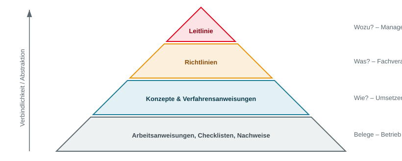
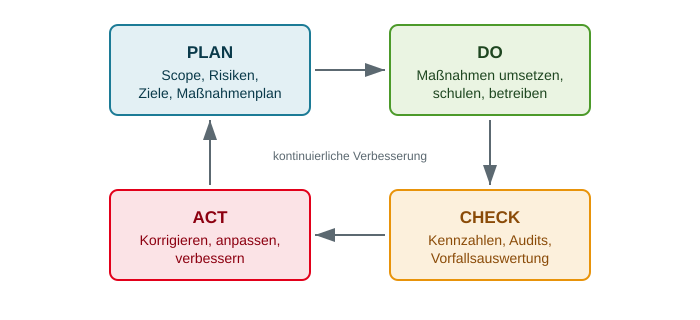
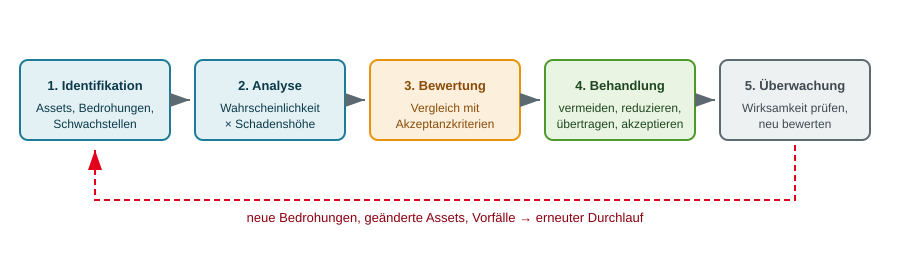
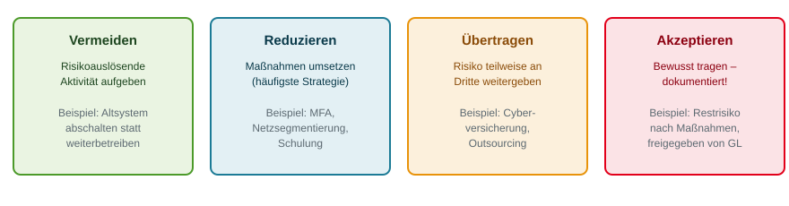
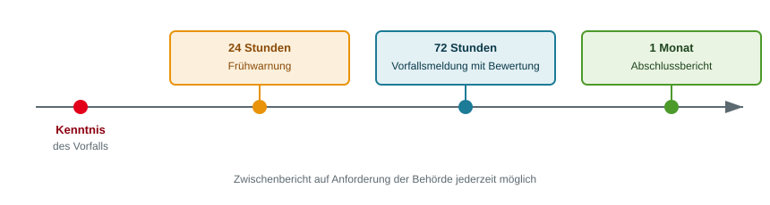

<!-- _class: title -->
# ISMS

      

## Informationssicherheit als Managementaufgabe

<!-- _notes:
**Worum geht es?**
Ein Informationssicherheits-Managementsystem (ISMS) ist der organisatorische Rahmen, der Sicherheitsziele mit Verantwortlichkeiten, geregelten Abläufen und überprüfbaren Maßnahmen verbindet. Geschützt werden Informationen in jeder Form: digitale Bestellungen, Papierverträge, vertrauliche Gespräche und Wissen in den Köpfen der Mitarbeitenden.

**Vertiefung**
Der entscheidende Unterschied für die Klausur: Ein Sicherheitsprodukt (Firewall, Virenscanner, Backup-Software) löst genau eine technische Aufgabe. Ein Managementsystem beantwortet dagegen die Fragen davor und danach: Welche Aufgabe ist überhaupt wichtig? Wer entscheidet darüber? Wurde die Maßnahme umgesetzt? Wirkt sie? Was passiert, wenn sie nicht wirkt? Diese Steuerungslogik ist der rote Faden der gesamten Vorlesung.

Das Kundenportal zieht sich als fiktiver Lehrfall durch alle Kapitel. Es verbindet ein Geschäftsziel (Bestellungen annehmen) mit technischen Komponenten (Portal, Datenbank, Hosting) und organisatorischen Fragen (Zuständigkeit, Meldewege, Tests). An diesem Beispiel lassen sich nahezu alle Prüfungsfragen durchspielen.

**Prüfungsfokus**
- Definition ISMS: Ziele + Rollen + Prozesse + Maßnahmen + Nachweise, risikobasiert und kontinuierlich.
- Die Abgrenzung Produkt gegen Prozess ist eine klassische Einstiegsfrage.
-->
---
<!-- _class: biglist -->

# Unser Weg durch das ISMS

- **Verstehen:** Warum Sicherheit eine Managementaufgabe ist
- **Aufbauen:** Geltungsbereich, Rollen und kontinuierliche Verbesserung
- **Priorisieren:** Risiken erkennen, bewerten und behandeln
- **Einordnen:** ISO/IEC 27001 und BSI IT-Grundschutz
- **Anwenden:** Rechtliche Anforderungen, Betrieb und Einführung

> Leitfrage: Wie werden aus Sicherheitsmaßnahmen überprüfbare Entscheidungen?

<!-- _notes:
**Worum geht es?**
Die Agenda bildet eine Lernreihenfolge ab, keine beliebige Themensammlung. Zuerst wird begründet, warum Technik allein nicht genügt. Danach folgen die organisatorischen Bausteine (Geltungsbereich, Rollen, PDCA), anschließend das Risikomanagement als Entscheidungsgrundlage. Erst darauf aufbauend ergeben Standards und Gesetze Sinn.

**Vertiefung**
Merken Sie sich die Kette „Geschäftsprozess → Risiko → Entscheidung → Maßnahme → Nachweis“. Jede Folie der Vorlesung lässt sich einem dieser fünf Glieder zuordnen.

Am Lehrfall: Die Bestellannahme ist der Geschäftsprozess. Ein Ausfall nach einem Angriff ist das Risiko. Die Festlegung eines Wiederanlaufziels ist die Entscheidung. Sicherung und geübter Wiederherstellungsablauf sind die Maßnahme. Das Testprotokoll ist der Nachweis.

Die Kette ist zugleich ein Prüfungswerkzeug: Wenn eine Klausuraufgabe eine Situation schildert, bestimmen Sie zuerst, welches Glied fehlt. In der Regel fehlt nicht die Technik, sondern die Entscheidung oder der Nachweis.

**Prüfungsfokus**
- Die fünfgliedrige Kette sicher beherrschen und auf ein fremdes Beispiel anwenden können.
-->
---
# Lernziele

<!-- _class: biglist -->

Nach der Vorlesung können Sie:

- ein ISMS von einzelnen Sicherheitsprodukten unterscheiden,
- ein Risikoszenario formulieren und eine Behandlung begründen,
- ISO 27001 und IT-Grundschutz funktional einordnen,
- rechtliche Pflichten von Zertifizierungsnachweisen unterscheiden,
- die Wirksamkeit einer Maßnahme anhand eines Nachweises beurteilen.

<!-- _notes:
**Worum geht es?**
Die Lernziele beschreiben Kompetenzen auf Anwendungsniveau. Das Wiedergeben von Definitionen genügt für die Klausur nicht; verlangt werden Formulieren, Begründen und Beurteilen.

**Vertiefung**
Zu jedem Lernziel gehört eine typische Aufgabenform:

1. ISMS von Produkten unterscheiden führt zu Abgrenzungs- und Bewertungsfragen („Beurteilen Sie die Aussage ...“).
2. Ein Risikoszenario formulieren verlangt den Satzbau „Wenn Ereignis X eintritt, kann Geschäftsfolge Y entstehen“.
3. ISO 27001 und IT-Grundschutz einordnen verlangt eine funktionale Gegenüberstellung, keine Aufzählung von Kapitelnummern.
4. Rechtliche Pflichten von Zertifizierungsnachweisen unterscheiden ist eine klassische Falle: Ein Zertifikat erfüllt keine gesetzliche Meldepflicht.
5. Wirksamkeit beurteilen verlangt immer die Angabe eines konkreten Nachweises.

**Prüfungsfokus**
- Selbsttest: Können Sie zu jedem Lernziel ein eigenes Beispiel bilden, das nicht aus der Vorlesung stammt? Wenn nein, ist das Thema noch nicht gesichert.
-->
---
<!-- _class: chapter -->

# Warum ISMS?

## Die Grenzen rein technischer Sicherheit

<!-- _notes:
**Worum geht es?**
Das Kapitel begründet, warum organisatorische Steuerung notwendig ist. Technik kann Zugriffe beschränken, Schadsoftware erkennen und Daten sichern. Sie entscheidet aber nicht, welche Informationen besonders wichtig sind, welche Ausfallfolgen tragbar wären und wer im Ernstfall handeln darf.

**Vertiefung**
Zentrale Unterscheidung dieses Kapitels: vorhandene Maßnahme gegen gesteuerte Sicherheitsleistung. Ein Backup ist eine vorhandene Maßnahme. Erst definierte Wiederherstellungsziele, benannte Verantwortliche, regelmäßige Tests und dokumentierte Ergebnisse machen daraus eine überprüfbare Sicherheitsleistung.

Organisatorische und technische Sicherheit stehen nicht in Konkurrenz. Technik ohne Organisation erzeugt blinde Flecken; Organisation ohne Technik erzeugt wirkungslose Papiere. Beides ist notwendig, keines für sich hinreichend.

**Prüfungsfokus**
- Die Formulierung „Technik ist notwendig, aber nicht hinreichend“ mit zwei eigenen Beispielen belegen können.
-->
---
# Der typische Irrtum

> **„Wir haben eine Firewall, einen Virenscanner und machen Backups – wir sind sicher.“**

- Diese Aussage beschreibt **Produkte**, keine **Prozesse**
- Offene Fragen bleiben:
  - Wer entscheidet, *was* überhaupt geschützt werden muss?
  - Woher weiß jemand, dass die Backups funktionieren?
  - Wer handelt um 3 Uhr nachts, wenn etwas auffällt?
  - Wer merkt, dass sich die Bedrohungslage geändert hat?

<!-- _notes:
**Worum geht es?**
Die zitierte Aussage beschreibt Ausstattung, nicht Sicherheit. Sie nennt Produkte und lässt alle Steuerungsfragen offen: Priorisierung, Überprüfung, Zuständigkeit im Ernstfall und Anpassung an eine veränderte Bedrohungslage.

**Vertiefung**
Prägen Sie sich diesen Dreischritt ein, er trägt durch die gesamte Klausur:

1. **Existenz** – Gibt es die Regel oder Maßnahme überhaupt?
2. **Umsetzung** – Wird sie im Alltag tatsächlich angewendet?
3. **Wirksamkeit** – Erreicht sie das beabsichtigte Ziel?

Die drei Fragen sind nicht gleichbedeutend. Eine Firewall kann existieren und falsch konfiguriert sein. Eine Sicherung kann laufen und nicht wiederherstellbar sein. Eine Richtlinie kann unterschrieben und der Belegschaft unbekannt sein.

Die Frage „Wer handelt um 3 Uhr nachts?“ zielt auf Rufbereitschaft, Eskalation und Entscheidungsbefugnis. Ohne festgelegte Meldekette verstreicht Zeit, die bei gesetzlichen Fristen (NIS2: 24 Stunden ab Kenntnis) unmittelbar zum Rechtsverstoß führen kann.

**Prüfungsfokus**
- Existenz / Umsetzung / Wirksamkeit sicher beherrschen und an einem Beispiel durchdeklinieren.
-->
---
# Warum Technik allein nicht reicht

- **Priorisierung fehlt:** Ohne Risikobewertung wird dort investiert, wo es am lautesten ist – nicht dort, wo es am meisten bringt
- **Verantwortung diffundiert:** „Das macht doch die IT“ – bis niemand es macht
- **Wirksamkeit unbekannt**: Eine Maßnahme ohne Messung ist eine Hoffnung
- **Keine Anpassung**: Bedrohungen, Technik und Geschäft ändern sich laufend
- **Nicht nachweisbar**: Kunden, Auditoren und Aufsichtsbehörden wollen Belege, keine Beteuerungen

> **Merksatz:** Sicherheit ist kein Zustand, den man kauft, sondern ein Prozess, den man betreibt.

<!-- _notes:
**Worum geht es?**
Die fünf Punkte benennen die systematischen Lücken rein technischer Sicherheit: fehlende Priorisierung, diffuse Verantwortung, unbekannte Wirksamkeit, fehlende Anpassung und fehlende Nachweisbarkeit.

**Vertiefung**
Informationssicherheit beruht auf drei Säulen: Mensch, Prozess und Technik. Fehlt eine Säule, wirkt die Maßnahme nicht. Eine Schutzfunktion, deren Meldungen niemand bearbeitet, ist wirkungslos. Eine Richtlinie ohne technische Durchsetzung bleibt eine Absichtserklärung.

„Verantwortung diffundiert“ beschreibt das Phänomen, dass bei unklarer Zuordnung alle annehmen, jemand anderes sei zuständig. Gegenmittel ist die namentliche Benennung von Rollen, nicht der Verweis auf eine Abteilung.

„Nachweisbar“ bedeutet nicht möglichst viel Papier. Ein guter Nachweis enthält Ziel, Ablauf, Ergebnis, festgestellte Abweichungen und deren Behandlung. Ein Testprotokoll mit diesen fünf Angaben ist aussagekräftiger als ein Ordner voller Konzepte.

Im Lehrfall muss geklärt sein, wer einen Ausfall erkennt, wer den Notbetrieb freigibt und wer Kundinnen und Kunden informiert.

**Prüfungsfokus**
- Merksatz: Sicherheit ist kein Zustand, den man kauft, sondern ein Prozess, den man betreibt.
- Die fünf Lücken aufzählen und je ein Beispiel nennen können.
-->
---
# Lehrfall: Das Kundenportal fällt aus

**Fiktives Beispiel für die gesamte Vorlesung**

- Ein Unternehmen nimmt Bestellungen über ein Kundenportal an.
- Nach einem Angriff sind Bestellungen und Kundendaten nicht erreichbar.
- Eine Sicherung existiert; der Wiederanlauf wurde noch nicht getestet.
- Zuständigkeit und Meldewege sind nicht festgelegt.

**Leitfrage:** Welche Entscheidungen fehlen neben der technischen Reparatur?

<!-- _notes:
**Worum geht es?**
Der Lehrfall ist ausdrücklich erfunden und begleitet die gesamte Vorlesung. Ein Unternehmen nimmt Bestellungen über ein Kundenportal an. Nach einem Angriff sind Bestellungen und Kundendaten nicht erreichbar. Eine Sicherung existiert, der Wiederanlauf wurde nie getestet, Zuständigkeit und Meldewege fehlen.

**Vertiefung**
Entscheidend ist die Unterscheidung zwischen technischer Wiederherstellung und geschäftlichem Wiederanlauf. Ein wieder gestarteter Server ist nur die technische Seite. Geschäftlich muss geklärt sein: Sind alle Bestellungen vorhanden? Wer prüft die Vollständigkeit? Wie werden Bestellungen aus der Ausfallzeit nacherfasst? Was wird den Kundinnen und Kunden mitgeteilt?

Konkret fehlende Entscheidungen im Fall:
- Wiederanlaufziel (RTO) und tolerierbarer Datenverlust (RPO)
- Verantwortliche Person für die Freigabe des Notbetriebs
- Meldeweg gegenüber Behörden und betroffenen Personen
- Rolle und Pflichten des Hosting-Dienstleisters
- Kriterien, wann der Normalbetrieb wieder aufgenommen werden darf

**Prüfungsfokus**
- Typische Aufgabe: „Welche Entscheidungen fehlen neben der technischen Reparatur?“ Nennen Sie mindestens vier organisatorische Punkte.
-->
---
<!-- _class: normal -->

# Treiber für die Einführung

| Externe Anforderungen | Interne Ziele |
|---|---|
| Gesetze und regulatorische Vorgaben | Kritische Prozesse zuverlässig betreiben |
| Sicherheitsanforderungen von Kunden | Aus Vorfällen und Übungen lernen |
| Verträge mit Versicherern und Partnern | Abhängigkeiten und Zuständigkeiten klären |

 

> Der Auslöser kann von außen kommen. Wirksamkeit entsteht im eigenen Betrieb.

<!-- _notes:
**Worum geht es?**
Ein ISMS kann extern angestoßen werden (Gesetze, Kundenanforderungen, Verträge mit Versicherern und Partnern) oder intern motiviert sein (zuverlässiger Betrieb kritischer Prozesse, Lernen aus Vorfällen, Klärung von Abhängigkeiten und Zuständigkeiten).

**Vertiefung**
Trennen Sie Anlass und Nutzen. Der Anlass kann ein Kunde sein, der ein Zertifikat verlangt. Der Nutzen entsteht aber erst durch wirksame Abläufe im eigenen Betrieb. Wird nur der Anlass bedient, entsteht ein Papier-ISMS, das das Audit besteht und im Vorfall versagt.

In der Praxis ist der häufigste Auslöser eine Kundenanforderung in einer Ausschreibung, der zweithäufigste ein selbst erlebter oder in der Branche beobachteter Vorfall. Ein von außen erzwungenes ISMS braucht besonders viel Aufmerksamkeit für die Check-Phase, weil die innere Motivation fehlt.

Welche externen Anforderungen tatsächlich gelten, ist immer Einzelfallprüfung. Die Aussage „Alle Unternehmen brauchen ISO 27001“ ist in der Klausur falsch. Branche, Größe, Tätigkeit und vertragliche Vereinbarungen entscheiden.

**Prüfungsfokus**
- Je zwei externe und zwei interne Treiber nennen können.
- Falle: Externer Druck erzeugt Dokumentation, nicht automatisch Sicherheit.
-->
---
<!-- _class: chapter -->

# Aufbau eines ISMS

## Begriffe, Rollen, Dokumente, PDCA

<!-- _notes:
**Worum geht es?**
Ein ISMS besteht aus vier zusammenwirkenden Elementen: der Leitung (Ziele und Rahmenbedingungen), den Rollen (Aufgaben und Befugnisse), den Prozessen (wiederkehrende Tätigkeiten wie Risikobewertung oder Vorfallbearbeitung) und der Dokumentation (nachvollziehbare Entscheidungen und Ergebnisse).

**Vertiefung**
Die Elemente wirken nur gemeinsam. Eine Risikoliste ohne benannte Verantwortliche führt zu keiner Maßnahme. Eine Maßnahme ohne definiertes Ziel kann nicht auf Wirksamkeit geprüft werden. Dokumentation ohne gelebten Prozess ergibt ein Papier-ISMS.

Der PDCA-Zyklus ist die Klammer um alle vier Elemente. Er sorgt dafür, dass Erkenntnisse aus Prüfung und Betrieb wieder in Planung und Umsetzung einfließen.

**Prüfungsfokus**
- Die vier Elemente benennen und begründen, warum keines allein genügt.
-->
---
# Was ist ein ISMS?

Ein **Informationssicherheits-Managementsystem (ISMS)** verbindet Ziele, Zuständigkeiten, Prozesse und Maßnahmen.

- **Risikobasiert:** Schutz nach möglichen Schäden priorisieren
- **Nachweisbar:** Entscheidungen und Ergebnisse dokumentieren
- **Kontinuierlich:** Wirksamkeit prüfen und Verbesserungen umsetzen

**Lehrfall:** Nicht nur Backups erstellen, sondern Wiederherstellung, Zuständigkeit und Tests regeln.

<!-- _notes:
**Worum geht es?**
Definition: Ein ISMS verbindet Ziele, Zuständigkeiten, Prozesse und Maßnahmen zu einem gesteuerten System. Drei Eigenschaften kennzeichnen es: risikobasiert, nachweisbar, kontinuierlich.

**Vertiefung**
**Risikobasiert** heißt, dass mögliche Schäden und ihre Wahrscheinlichkeit die Prioritäten bestimmen. Es heißt nicht, dass jede Entscheidung exakt berechnet werden muss. Auch qualitative Einschätzungen sind zulässig, solange ihre Kriterien offengelegt und einheitlich angewendet werden.

**Nachweisbar** heißt, dass wesentliche Entscheidungen und Ergebnisse belegbar sind: Risikobeurteilungen, Freigaben, Testprotokolle, Auditfeststellungen.

**Kontinuierlich** heißt, dass der Betrieb nach der Einführung weitergeht. Jede Änderung an Anwendungen, Lieferanten oder Prozessen kann neue Risiken erzeugen. Im Kundenportal genügt deshalb kein einmaliger Wiederherstellungstest; nach einer Migration oder einem Dienstleisterwechsel muss erneut getestet werden.

**Prüfungsfokus**
- Die drei Eigenschaften je mit einem Satz erläutern und am Lehrfall belegen.
-->
---
# Informationssicherheit ist mehr als IT-Sicherheit

| Begriff | Schützt | Beispiel |
|---|---|---|
| **IT-Sicherheit** | IT-Systeme und darin verarbeitete Daten | Serverhärtung, Firewall |
| **Informationssicherheit** | Informationen in **jeder** Form | Akten, Gespräche, Know-how im Kopf |
| **Datenschutz** | Personenbezogene Daten und die Rechte Betroffener | Löschkonzept, Auskunftsrecht |
| **Cybersicherheit** | Schutz vor Angriffen aus dem Cyberraum | Abwehr von Ransomware |

<!-- _notes:
**Worum geht es?**
Vier Begriffe mit unterschiedlichem Schutzgegenstand, die sich überschneiden, aber nicht deckungsgleich sind.

**Vertiefung**
**IT-Sicherheit** schützt informationstechnische Systeme und die darin verarbeiteten Daten, etwa durch Serverhärtung oder eine Firewall.

**Informationssicherheit** schützt Informationen unabhängig vom Träger. Der vertrauliche Ausdruck auf einem frei zugänglichen Schreibtisch oder das laute Telefonat im Zug sind Informationssicherheitsprobleme ganz ohne technischen Angriff.

**Datenschutz** schützt personenbezogene Daten und die Rechte der betroffenen Personen. Eine Verarbeitung kann technisch mustergültig abgesichert und trotzdem rechtswidrig sein, wenn Zweck oder Rechtsgrundlage fehlen. Informationssicherheit ersetzt die datenschutzrechtliche Prüfung also nicht.

**Cybersicherheit** betrachtet Risiken aus dem vernetzten digitalen Raum, etwa Ransomware.

Merkbild zum Mengenverhältnis: Informationssicherheit ist der weiteste Begriff. IT-Sicherheit und Cybersicherheit liegen weitgehend darin. Datenschutz überschneidet sich, geht aber mit den Betroffenenrechten darüber hinaus.

**Prüfungsfokus**
- Klassische Aufgabe: Ordnen Sie ein Beispiel dem richtigen Begriff zu. Die Akte im Papierkorb ist Informationssicherheit, nicht IT-Sicherheit.
-->
---
# Schutzziele im Kundenportal

| Schutzziel | Leitfrage | Beispiel |
|---|---|---|
| **Vertraulichkeit** | Wer darf Informationen sehen? | Nur Berechtigte sehen Kundendaten. |
| **Integrität** | Sind Daten korrekt und vor unbefugter Änderung geschützt? | Bestellungen werden nicht manipuliert. |
| **Verfügbarkeit** | Sind Informationen bei Bedarf nutzbar? | Bestellungen können bearbeitet werden. |

> Eine Maßnahme kann mehrere Schutzziele unterstützen.

<!-- _notes:
**Worum geht es?**
Die drei klassischen Schutzziele (CIA-Triade) am Lehrfall: Vertraulichkeit, Integrität, Verfügbarkeit.

**Vertiefung**
**Vertraulichkeit:** Nur berechtigte Stellen erhalten die Information. Leitfrage: Wer darf Kundendaten sehen?
**Integrität:** Daten sind korrekt und vor unbefugter Veränderung geschützt. Leitfrage: Wer darf Bestellungen ändern, und wird eine Änderung erkennbar?
**Verfügbarkeit:** Information und Funktion sind bei Bedarf nutzbar. Leitfrage: Wann muss die Bestellbearbeitung möglich sein?

Die Ziele sind getrennt zu beurteilen und können in Konflikt geraten. Ein erreichbares Portal kann manipulierte Bestellungen enthalten (Verfügbarkeit erfüllt, Integrität verletzt). Eine unveränderte Bestellung kann unbefugt offengelegt worden sein (Integrität erfüllt, Vertraulichkeit verletzt). Eine sehr strenge Zugriffskontrolle kann die Verfügbarkeit im Notfall beeinträchtigen.

Eine Maßnahme kann mehrere Ziele unterstützen: Eine verschlüsselte, signierte und getestete Sicherung wirkt auf alle drei. Sie gewährleistet aber keines automatisch vollständig.

**Prüfungsfokus**
- Zu einem geschilderten Vorfall das verletzte Schutzziel bestimmen und begründen.
- Beispiel: Ransomware verletzt primär die Verfügbarkeit, bei Datenabfluss zusätzlich die Vertraulichkeit.
-->
---
# Geltungsbereich: Was gehört zum ISMS?

Der **Geltungsbereich (Scope)** beschreibt die Grenzen des ISMS.

- **Organisation:** Welche Bereiche und Geschäftsprozesse?
- **Standorte und Technik:** Welche Räume, Systeme und Dienste?
- **Abhängigkeiten:** Welche Lieferanten und Schnittstellen?

**Lehrfall:** Kundenportal einschließlich Bestellprozess, Datenbank, Betrieb und Hosting-Dienstleister.

> Ein Zertifikat gilt für seinen ausgewiesenen Scope, nicht automatisch für das gesamte Unternehmen.

<!-- _notes:
**Worum geht es?**
Der Geltungsbereich (Scope) legt die Grenzen des ISMS fest: Organisationseinheiten und Geschäftsprozesse, Standorte, Systeme und Dienste sowie die Abhängigkeiten nach außen.

**Vertiefung**
Besonders prüfungsrelevant sind die Schnittstellen. Ein ausgelagerter Dienst liegt außerhalb der eigenen Organisation und ist trotzdem für die Sicherheit des betrachteten Prozesses wesentlich. Er muss deshalb über Verträge, Anforderungen und Nachweise in den Scope eingebunden werden.

Im Lehrfall wäre „nur der Webserver“ ein falsch geschnittener Scope: Ohne Datenbank, Identitätsdienst, Hosting-Dienstleister und den fachlichen Bestellprozess ist die Bestellannahme nicht abgesichert.

Ein zu großer Scope überfordert die Organisation, ein zu kleiner erzeugt Scheinsicherheit. Übliche Empfehlung: klein und sauber starten, dann erweitern.

Zertifikatsfalle: Ein Zertifikat gilt ausschließlich für den auf der Urkunde ausgewiesenen Geltungsbereich. Ein Dienstleister kann ein gültiges ISO-27001-Zertifikat besitzen, das genau den Standort oder die Leistung nicht abdeckt, die Sie beziehen.

**Prüfungsfokus**
- Drei Fragen an ein fremdes Zertifikat: Welcher Scope? Welche Gültigkeit? Deckt es die tatsächlich bezogene Leistung ab?
-->
---
# Die Dokumentenpyramide

<!-- _notes:
**Bildbeschreibung**
Die Folie zeigt eine vierstufige Pyramide. Von der Spitze zur Basis:
1. Spitze (rot): „Leitlinie“
2. Zweite Stufe (orange): „Richtlinien“
3. Dritte Stufe (blau): „Konzepte & Verfahrensanweisungen“
4. Basis (grau): „Arbeitsanweisungen, Checklisten, Nachweise“

Rechts neben jeder Stufe steht die zugehörige Leitfrage mit der verantwortlichen Gruppe: „Wozu? – Management“, „Was? – Fachverantwortliche“, „Wie? – Umsetzende“, „Belege – Betrieb“. Links verläuft ein nach oben gerichteter Pfeil mit der Beschriftung „Verbindlichkeit / Abstraktion“: Je weiter oben, desto abstrakter und verbindlicher; je weiter unten, desto konkreter und umfangreicher. Die Fläche der Stufen entspricht ungefähr der Dokumentenmenge – wenige Leitlinien, sehr viele Nachweise.

**Worum geht es?**
Die Pyramide erklärt, warum ein ISMS viele Dokumente erzeugt und wie man sie ordnet, ohne die Übersicht zu verlieren.

**Vertiefung**
**Leitlinie:** zwei bis drei Seiten, von der Geschäftsführung unterschrieben. Sagt, dass und warum Sicherheit wichtig ist. Ändert sich selten.
**Richtlinien:** je Themenfeld, etwa Passwort-, Berechtigungs- oder Mobile-Work-Richtlinie. Legen fest, was gilt.
**Konzepte und Verfahrensanweisungen:** beschreiben die Umsetzung, etwa ein Datensicherungskonzept mit RTO, RPO, Aufbewahrungsfristen und Testturnus.
**Unterste Ebene:** Nachweise aus dem Tagesgeschäft – Testprotokolle, Freigaben, Schulungsnachweise, ausgefüllte Checklisten.

Faustregel: Je weiter oben ein Dokument steht, desto seltener ändert es sich und desto höher ist die freigebende Instanz.

**Prüfungsfokus**
- Ein vorgegebenes Dokument der richtigen Ebene zuordnen, etwa „Protokoll des Wiederherstellungstests“ zur untersten Ebene.
- Die Zuordnung Wozu / Was / Wie / Beleg sicher beherrschen.
-->

---
# Die Informationssicherheitsleitlinie

Die Leitung legt die übergeordnete Ausrichtung fest:

- Welche Informationen und Prozesse sind besonders wichtig?
- Welche Sicherheitsziele verfolgen wir?
- Wer trägt welche Verantwortung?
- Wie werden Verbesserung und Ressourcen unterstützt?

**Lehrfall:** „Bestellungen und Kundendaten müssen angemessen geschützt und im Notfall wiederherstellbar sein.“

<!-- _notes:
**Worum geht es?**
Die Informationssicherheitsleitlinie ist das oberste Dokument des ISMS. Sie legt fest, welche Informationen und Prozesse besonders wichtig sind, welche Sicherheitsziele verfolgt werden, wer welche Verantwortung trägt und wie Verbesserung und Ressourcen unterstützt werden.

**Vertiefung**
Wichtig ist die Abgrenzung nach unten:
- Die **Leitlinie** fordert, wichtige Informationen angemessen zu schützen.
- Eine **Berechtigungsrichtlinie** konkretisiert die Regeln für Zugriffe.
- Eine **Arbeitsanweisung** beschreibt, wie eine Rechteprüfung tatsächlich durchgeführt wird.
- Ein **Protokoll** belegt das Ergebnis.

Formal relevant: Die Leitlinie wird von der obersten Leitung verabschiedet und in der Organisation kommuniziert. Damit übernimmt die Leitung sichtbar Verantwortung – genau das verlangt ISO 27001 in Kapitel 5. Eine Leitlinie, die nur die IT-Abteilung unterschreibt, erfüllt diesen Zweck nicht.

Im Lehrfall könnte die Leitlinie fordern, dass Bestellungen und Kundendaten angemessen geschützt und im Notfall wiederherstellbar sind. Die konkreten Wiederanlaufziele und Testverfahren gehören dann in das Datensicherungs- und Notfallkonzept.

**Prüfungsfokus**
- Leitlinie / Richtlinie / Konzept / Nachweis an einem Beispiel durchspielen.
- Merken: Die Leitlinie beantwortet das Wozu, nicht das Wie.
-->
---
# Wer entscheidet, wer setzt um?

| Rolle | Kernaufgabe |
|---|---|
| **Leitung** | Ziele, Ressourcen und Verantwortlichkeiten festlegen |
| **Informationssicherheitsbeauftragter (ISB)** | Sicherheitsprozess koordinieren und berichten |
| **Fachbereich / Risikoeigentümer** | Geschäftsfolgen bewerten und Risiken verantworten |
| **IT-Betrieb** | Technische Maßnahmen umsetzen und betreiben |
| **Unabhängige Prüfung** | Umsetzung und Wirksamkeit untersuchen |

<!-- _notes:
**Worum geht es?**
Die Tabelle trennt fünf Funktionen: Leitung, Informationssicherheitsbeauftragter (ISB), Fachbereich bzw. Risikoeigentümer, IT-Betrieb und unabhängige Prüfung.

**Vertiefung**
Entscheidend ist die Trennung von Verantworten, Ausführen und Prüfen.

**Leitung:** legt Ziele fest, stellt Ressourcen bereit, trägt die Gesamtverantwortung. Diese ist nicht delegierbar.
**ISB:** koordiniert den Sicherheitsprozess, berät und berichtet. Er setzt in der Regel nicht selbst um und ist kein Auditor seiner eigenen Arbeit.
**Fachbereich:** bewertet die Geschäftsfolgen eines Risikos, weil nur er weiß, was ein Ausfall betrieblich bedeutet. Deshalb liegt die Risikoakzeptanz beim Fachbereich bzw. bei der Leitung, nicht bei der IT.
**IT-Betrieb:** setzt technische Maßnahmen um und betreibt sie.
**Unabhängige Prüfung:** untersucht Umsetzung und Wirksamkeit mit Abstand zur Ausführung.

Begriffsunterscheidung: Der **Risikoeigentümer** verantwortet ein bestimmtes Risiko und die dazugehörigen Entscheidungen. Der **Asset Owner** ist fachlich für einen Informationswert oder eine Ressource zuständig. Beide Rollen können zusammenfallen, müssen es aber nicht. Aufgaben und Befugnisse müssen ausdrücklich festgelegt sein, statt aus Stellenbezeichnungen abgeleitet zu werden.

**Prüfungsfokus**
- Typische Frage: Wer entscheidet über die Akzeptanz eines Restrisikos? Antwort: der befugte Risikoeigentümer bzw. die Leitung – nicht der ISB und nicht die IT.
-->
---
# Unabhängigkeit und Interessenkonflikte

- Sicherheitsprobleme müssen **ohne unzulässige Einflussnahme** berichtet werden können.
- Das BSI empfiehlt die Zuordnung des ISB zur obersten Leitung.
- Ein **direkter Berichtsweg** ermöglicht die Eskalation von Konflikten.
- Umsetzung und unabhängige Prüfung dürfen nicht verwechselt werden.

**Lehrfall:** Wer den Wiederherstellungstest durchführt, sollte dessen unabhängige Prüfung nicht allein übernehmen.

<!-- _notes:
**Worum geht es?**
Sicherheitsprobleme müssen ohne unzulässige Einflussnahme berichtet werden können. Das BSI empfiehlt deshalb die organisatorische Zuordnung des ISB zur obersten Leitung und einen direkten Berichtsweg.

**Vertiefung**
Ein Interessenkonflikt entsteht, wenn dieselbe Stelle eine Maßnahme umsetzt und anschließend deren Wirksamkeit allein bestätigt. Klassisches Beispiel: Der ISB ist zugleich IT-Leiter. Dann müsste er Budgetentscheidungen und Betriebsprioritäten, die er selbst getroffen hat, kritisch bewerten.

Ein direkter Berichtsweg ermöglicht die Eskalation, wenn Sicherheitsanforderungen mit anderen Zielen kollidieren, etwa mit einem Projekttermin oder einem Kostenziel. Ohne diesen Weg wird das Problem auf mittlerer Ebene gefiltert und erreicht die Entscheidungsebene nie.

Nicht verwechseln: Die Sicherheitskoordination durch den ISB ist kein unabhängiges Audit. Das interne Audit nach ISO 27001 Kapitel 9.2 muss objektiv und unparteiisch durchgeführt werden; Auditoren dürfen ihre eigene Arbeit nicht prüfen.

Im Lehrfall darf die IT den Wiederherstellungstest durchführen. Die Beurteilung, ob Verfahren, Nachweise und Ergebnisse den festgelegten Anforderungen entsprechen, sollte aber eine andere Stelle vornehmen.

**Prüfungsfokus**
- Begründen können, warum Umsetzung und Prüfung personell zu trennen sind.
- Beispiel für einen Interessenkonflikt nennen können.
-->
---
# Der PDCA-Zyklus

<!-- _notes:
**Bildbeschreibung**
Die Folie zeigt vier abgerundete Kästen, die als Kreislauf im Uhrzeigersinn angeordnet sind:
- Oben links (blau): „PLAN – Scope, Risiken, Ziele, Maßnahmenplan“
- Oben rechts (grün): „DO – Maßnahmen umsetzen, schulen, betreiben“
- Unten rechts (orange): „CHECK – Kennzahlen, Audits, Vorfallsauswertung“
- Unten links (rot): „ACT – Korrigieren, anpassen, verbessern“

Pfeile verlaufen von PLAN zu DO, von DO zu CHECK, von CHECK zu ACT und von ACT wieder zurück zu PLAN. In der Mitte des Kreislaufs steht die Beschriftung „kontinuierliche Verbesserung“.

**Worum geht es?**
Der PDCA-Zyklus nach Deming ist das strukturierende Prinzip praktisch aller Managementsysteme (ISO 27001, 9001, 14001, 22301).

**Vertiefung**
Wichtig ist die Richtung des letzten Pfeils: Act führt zurück zu Plan, nicht ins Archiv. Erkenntnisse aus Audits und Vorfällen verändern Scope, Risikobeurteilung und Maßnahmenplanung.

Die in der Praxis am häufigsten vernachlässigte Phase ist **Check**. Maßnahmen umzusetzen ist sichtbar und befriedigend, die eigene Arbeit kritisch zu messen nicht. Genau deshalb schreiben die Standards internes Audit und Managementbewertung verbindlich vor. Ein ISMS ohne funktionierende Check-Phase degeneriert binnen weniger Jahre zum Papier-ISMS.

Zuordnung zu ISO/IEC 27001: Plan entspricht den Kapiteln 4 bis 7, Do dem Kapitel 8, Check dem Kapitel 9, Act dem Kapitel 10.

**Prüfungsfokus**
- Die vier Phasen mit je einer typischen Aktivität benennen.
- Die Zuordnung PDCA zu den ISO-27001-Kapiteln.
-->

---
# PDCA am Beispiel der Wiederherstellung

| Phase | Bedeutung | Lehrfall |
|---|---|---|
| **Plan** | Planen | Wiederanlaufziel und Testverfahren festlegen |
| **Do** | Umsetzen | Sicherung und Wiederherstellung einrichten |
| **Check** | Überprüfen | Wiederherstellung testen und Ergebnis vergleichen |
| **Act** | Verbessern | Ursachen beheben und erneut testen |

> **PDCA = Plan, Do, Check, Act:** ein wiederkehrender Verbesserungszyklus.

<!-- _notes:
**Worum geht es?**
Die Tabelle überträgt den PDCA-Zyklus auf die Wiederherstellung im Lehrfall.

**Vertiefung**
**Plan:** Wiederanlaufziel (RTO) und Testverfahren festlegen, etwa „Bestellbearbeitung innerhalb von vier Stunden wieder möglich, Test halbjährlich“.
**Do:** Sicherung einrichten, Wiederherstellungsablauf dokumentieren, Beteiligte schulen.
**Check:** Die Wiederherstellung tatsächlich durchführen und das Ergebnis mit dem Ziel vergleichen.
**Act:** Ursachen der Zielverfehlung beheben – etwa fehlende Dokumentation, zu langsame Leitung oder fehlende Berechtigungen – und erneut testen.

Der häufigste Denkfehler: Ein erfolgreich abgeschlossener Sicherungslauf ist noch kein Check. Er beweist nur, dass Daten geschrieben wurden – nicht, dass sie lesbar, vollständig und in der Zielzeit nutzbar sind. Erst der Wiederherstellungstest liefert diesen Nachweis.

Der Zyklus wiederholt sich, weil Änderungen an System, Datenmenge oder Dienstleister die bisherigen Annahmen entwerten können.

**Prüfungsfokus**
- Einen beliebigen Sachverhalt auf die vier Phasen abbilden können.
- Falle: „Das Backup lief fehlerfrei“ als Wirksamkeitsnachweis zu akzeptieren, ist falsch.
-->
---
<!-- _class: chapter -->

# Risikomanagement

## Das Herzstück jedes ISMS

<!-- _notes:
**Worum geht es?**
Risikomanagement ist die Entscheidungsgrundlage des ISMS. Es betrachtet nicht technische Schwachstellen für sich, sondern mögliche Ereignisse und deren Folgen für die Organisation.

**Vertiefung**
Die Kette lautet: Informationswert → Schadensszenario → Analyse → Bewertung → Behandlung → Restrisiko → Überwachung. Das Ergebnis ist eine priorisierte Behandlung, keine Sammlung technischer Befunde.

Ein Schwachstellenscan liefert Befunde. Erst die Verknüpfung mit Geschäftsfolgen macht daraus Risiken, über die das Management entscheiden kann. Im Kundenportal wird untersucht, wie ein Ausfall die Bestellbearbeitung beeinträchtigt; daraus folgen Maßnahmen und Zuständigkeiten.

Die Entscheidung bleibt nur dann überprüfbar, wenn Annahmen, Kriterien und Ergebnisse dokumentiert sind.

**Prüfungsfokus**
- Den Unterschied zwischen einem technischen Befund und einem Risiko erklären können.
-->
---
# Warum Risikomanagement?

- Ressourcen sind **immer** begrenzt: Budget, Personal, Aufmerksamkeit
- Risikomanagement beantwortet die Frage: **Wo lohnt sich der nächste Euro am meisten?**
- Es macht Entscheidungen **nachvollziehbar und revisionsfest**
- Es verlagert die Entscheidung dorthin, wo sie hingehört: ins **Management**

 

> **Merksatz:** Ohne Risikomanagement ist ein ISMS nur eine abgehakte Checkliste.

<!-- _notes:
**Worum geht es?**
Ressourcen sind immer begrenzt. Risikomanagement beantwortet die Frage, wo der nächste Euro den größten Sicherheitsgewinn bringt, macht Entscheidungen nachvollziehbar und verlagert sie dorthin, wo sie hingehören: ins Management.

**Vertiefung**
Die auffälligste Schwachstelle ist nicht automatisch das wichtigste Geschäftsrisiko. Eine kritische Lücke in einer selten genutzten Testanwendung kann weniger bedeutsam sein als eine mittlere Lücke im zentralen Bestellsystem. Ohne Risikobewertung wird dort investiert, wo es am lautesten ist – nicht dort, wo es am meisten bringt.

Grenze der Wirtschaftlichkeitsbetrachtung: Rechtliche Pflichten lassen sich nicht wegrechnen. Wenn ein Gesetz eine Maßnahme verlangt, ist ein ungünstiges Kosten-Nutzen-Verhältnis keine zulässige Begründung für das Unterlassen.

„Revisionsfest“ bedeutet, dass Annahmen, Kriterien, Bewertungszeitpunkt und entscheidende Person später rekonstruierbar sind. Genau danach fragt ein Auditor.

**Prüfungsfokus**
- Merksatz: Ohne Risikomanagement ist ein ISMS nur eine abgehakte Checkliste.
- Begründen können, warum die Priorisierung ins Management gehört und nicht in die IT.
-->
---
# Risiko: Vom Wert zum Schadensszenario

- **Asset / Informationswert:** Was ist für die Organisation wichtig?
- **Bedrohung:** Was könnte Schaden verursachen?
- **Schwachstelle:** Welche Schwäche begünstigt das Ereignis?
- **Risiko:** Wie wahrscheinlich ist ein Schaden, und wie schwer wäre er?
- **Control / Maßnahme:** Was verändert Wahrscheinlichkeit oder Folgen?
- **Restrisiko:** Was bleibt nach berücksichtigten Maßnahmen übrig?

<!-- _notes:
**Worum geht es?**
Die Begriffskette Asset, Bedrohung, Schwachstelle, Risiko, Control und Restrisiko. Diese Begriffe werden in Klausuren häufig abgefragt und regelmäßig verwechselt.

**Vertiefung**
**Asset / Informationswert:** etwas, dessen Verlust, Veränderung oder Nichtverfügbarkeit Schaden verursacht. Im Lehrfall die Bestell- und Kundendaten.
**Bedrohung:** eine mögliche Schadensursache, etwa Ransomware oder Stromausfall. Bedrohungen existieren unabhängig davon, ob man angreifbar ist.
**Schwachstelle:** eine Schwäche, die das Wirksamwerden der Bedrohung begünstigt, etwa ein fehlender Patch oder eine nie getestete Wiederherstellung.
**Risiko:** die Verknüpfung aus möglichem Ereignis, Eintrittswahrscheinlichkeit und Schadensausmaß.
**Control / Maßnahme:** verändert die Wahrscheinlichkeit oder die Folgen.
**Restrisiko:** was nach Berücksichtigung der Maßnahmen verbleibt. Es wird nie null.

Formulierungshilfe für die Klausur: „Wenn Ereignis X eintritt, kann Geschäftsfolge Y entstehen.“ Beispiel: Wenn Ransomware das Portal verschlüsselt, kann die Bestellannahme mehrere Tage ausfallen und Umsatzverluste sowie Vertragsstrafen verursachen. Eine Aufzählung wie „Server, Firewall, Backup“ ist dagegen kein Risiko.

**Prüfungsfokus**
- Zu einem Szenario Asset, Bedrohung, Schwachstelle und Geschäftsfolge korrekt zuordnen.
- Merken: Ohne Schwachstelle keine Realisierung der Bedrohung; ohne Asset kein Schaden.
-->
---
# Der Risikomanagement-Prozess

<!-- _notes:
**Bildbeschreibung**
Die Folie zeigt fünf nebeneinanderliegende Kästen, die durch Pfeile von links nach rechts verbunden sind:
1. (blau) „1. Identifikation – Assets, Bedrohungen, Schwachstellen“
2. (blau) „2. Analyse – Wahrscheinlichkeit × Schadenshöhe“
3. (orange) „3. Bewertung – Vergleich mit Akzeptanzkriterien“
4. (grün) „4. Behandlung – vermeiden, reduzieren, übertragen, akzeptieren“
5. (grau) „5. Überwachung – Wirksamkeit prüfen, neu bewerten“

Unterhalb der Kette führt ein rot gestrichelter Rückpfeil von Schritt 5 zurück zu Schritt 1. Er ist beschriftet mit „neue Bedrohungen, geänderte Assets, Vorfälle → erneuter Durchlauf“.

**Worum geht es?**
Der Regelkreis des Risikomanagements. Der fünfte Schritt schließt den Kreis.

**Vertiefung**
Der gestrichelte Rückpfeil ist die Kernaussage: Risikomanagement ist kein Projekt, das man einmal durchführt und abheftet. Jede größere Änderung löst einen erneuten Durchlauf aus – ein neues System, ein neuer Dienstleister, eine veränderte Bedrohungslage oder ein eingetretener Vorfall. Zusätzlich legt man einen festen Turnus fest, typischerweise jährlich.

Besonders prüfungsrelevant ist die Trennung von Schritt 2 und 3. **Analyse** ist die fachliche Einschätzung von Wahrscheinlichkeit und Schadenshöhe. **Bewertung** ist der Abgleich dieses Ergebnisses mit den Akzeptanzkriterien, die das Management zuvor festgelegt hat. Wer beides vermischt, lässt eine Einschätzung unmittelbar als Entscheidung gelten.

**Prüfungsfokus**
- Die fünf Schritte in richtiger Reihenfolge und mit Inhalt benennen.
- Mindestens drei Auslöser für einen erneuten Durchlauf nennen können.
-->

---
# Schritt 1: Identifikation

- **Assets inventarisieren:** Was existiert überhaupt?
  - Informationen, Anwendungen, Systeme, Netze, Räume, Personen, Dienstleister
- **Bedrohungen erfassen:** Was könnte passieren?
  - Angriffe, menschliches Versagen, technisches Versagen, höhere Gewalt
- **Schwachstellen erkennen:** Wo sind wir angreifbar?
  - Fehlende Patches, fehlende Schulung, Single Point of Failure, fehlende Verträge

> **Praxistipp:** Nicht mit der Serverliste anfangen, sondern mit der Frage: *Welcher Geschäftsprozess darf auf keinen Fall ausfallen?*

<!-- _notes:
**Worum geht es?**
Die Identifikation erfasst Assets, Bedrohungen und Schwachstellen. Der Praxistipp dreht die übliche Reihenfolge um: nicht mit der Serverliste beginnen, sondern mit der Frage, welcher Geschäftsprozess auf keinen Fall ausfallen darf.

**Vertiefung**
Assets umfassen mehr als Hardware: Informationen, Anwendungen, Systeme, Netze, Räume, Personen und Dienstleister. Für die Bestellannahme sind Portal, Datenbank, Benutzerverwaltung, Hosting und die fachliche Bearbeitung relevant.

Bedrohungsquellen lassen sich in vier gut merkbare Gruppen einteilen: vorsätzliche Angriffe, menschliches Versagen, technisches Versagen und höhere Gewalt. Prüfen Sie in einer Aufgabe immer alle vier – die meisten Antworten nennen nur die erste.

Schwachstellen sind nicht nur technisch: fehlende Patches, aber ebenso fehlende Schulung, ein Single Point of Failure oder ein fehlender Vertrag mit Sicherheitsanforderungen.

Top-down statt bottom-up: Wer mit dem Prozess beginnt, findet auch Abhängigkeiten, die in keinem Inventar stehen – etwa eine Excel-Datei auf einem Einzelrechner oder das Wissen einer einzigen Person.

Vollständigkeitsanspruch: Die Identifikation soll ausreichend vollständig sein, nicht erschöpfend. Jede theoretisch denkbare Kombination mit gleicher Tiefe zu behandeln ist weder möglich noch sinnvoll.

**Prüfungsfokus**
- Die vier Bedrohungskategorien aufzählen.
- Top-down gegen bottom-up begründen können.
-->
---
# Analyse und Bewertung unterscheiden

**Analyse:** Wahrscheinlichkeit und Schadensausmaß einschätzen.
**Bewertung:** Ergebnis mit festgelegten Akzeptanzkriterien vergleichen.

| Beispielhafte Einschätzung | Schadensausmaß | Ergebnis im Lehrmodell |
|---|---|---|
| Ausfall möglich | Hoch | Behandlung erforderlich |
| Ausfall unwahrscheinlich | Gering | Akzeptanz prüfen |

> Kategorien und Grenzen sind organisationsspezifisch, keine universelle Normmatrix.

<!-- _notes:
**Worum geht es?**
Analyse schätzt Wahrscheinlichkeit und Schadensausmaß ein. Bewertung vergleicht dieses Ergebnis mit den festgelegten Akzeptanzkriterien.

**Vertiefung**
Die Trennung verhindert, dass eine Einschätzung unmittelbar als Entscheidung gilt. Analyse ist Fachaufgabe, Bewertung ist Managementaufgabe – denn die Akzeptanzkriterien stammen vom Management.

Qualitative Begriffe brauchen Definitionen. „Hoch“ muss festgelegt sein, etwa als Schaden über 100.000 Euro oder als Ausfall über acht Stunden. Ohne Definition sind zwei Bewertungen nicht vergleichbar.

Zweite Präzisierungsfrage: Wurden bestehende Maßnahmen bereits berücksichtigt? Man unterscheidet das **Bruttorisiko** (ohne Maßnahmen) vom **Nettorisiko** bzw. Restrisiko (mit Maßnahmen). Wer das nicht angibt, erzeugt unvergleichbare Zahlen.

Eine Risikomatrix unterstützt die Darstellung, erzeugt aber keine Objektivität. Farben und Zahlen ersetzen keine begründeten Annahmen. Bei unsicherer Datenlage sind die Annahmen ausdrücklich zu dokumentieren. Nach einer Behandlung wird erneut geprüft, wie sich das verbleibende Risiko verändert hat.

**Prüfungsfokus**
- Analyse gegen Bewertung abgrenzen.
- Brutto- und Nettorisiko unterscheiden.
-->
---
<!-- _class: normal -->

# Qualitativ oder quantitativ?

| Ansatz | Ergebnis | Grenze |
|---|---|---|
| **Qualitativ** | Kategorien wie gering, mittel, hoch | Abhängig von klaren Kriterien |
| **Quantitativ** | Geldbeträge und Ereignishäufigkeiten | Abhängig von belastbaren Daten |

**Einfaches Rechenmodell:**
Erwarteter Jahresschaden = Schaden je Ereignis × erwartete Ereignisse pro Jahr

> Ein Erwartungswert beschreibt nicht den schlimmsten möglichen Schaden.

<!-- _notes:
**Worum geht es?**
Zwei Bewertungsansätze mit unterschiedlichen Stärken und Grenzen.

**Vertiefung**
**Qualitativ** arbeitet mit Kategorien wie gering, mittel, hoch. Vorteil: schnell, auch ohne Datenbasis anwendbar. Grenze: hängt vollständig von klar definierten Kriterien ab und ist zwischen Organisationen nicht vergleichbar.
**Quantitativ** arbeitet mit Geldbeträgen und Ereignishäufigkeiten. Vorteil: rechenbar, gut für Investitionsentscheidungen. Grenze: braucht belastbare Daten, die bei seltenen Ereignissen meist fehlen.

Das Rechenmodell auf der Folie entspricht der klassischen ALE-Formel (Annual Loss Expectancy): Erwarteter Jahresschaden = Schaden je Ereignis × erwartete Ereignisse pro Jahr.

Rechenbeispiel: 200.000 Euro Schaden je Ausfall bei 0,5 erwarteten Ausfällen pro Jahr ergibt 100.000 Euro erwarteten Jahresschaden. Eine Maßnahme, die jährlich 30.000 Euro kostet und die Häufigkeit halbiert, spart rechnerisch 50.000 Euro und ist damit wirtschaftlich.

Zwei typische Fehler:
1. Der Erwartungswert ist nicht der schlimmste mögliche Schaden. Ein Ereignis, das alle 50 Jahre eintritt und existenzbedrohend ist, erscheint im Durchschnitt harmlos. Deshalb gehört neben den Erwartungswert immer eine Worst-Case-Betrachtung.
2. Qualitative Kategorien dürfen nicht wie Zahlen multipliziert werden. „mittel × mittel“ ergibt keine belastbare Aussage, sondern Scheingenauigkeit.

**Prüfungsfokus**
- Die Formel anwenden und ein Zahlenbeispiel rechnen können.
- Beide typischen Fehler kennen und benennen können.
-->
---
# Schritt 4: Die vier Behandlungsstrategien

<!-- _notes:
**Bildbeschreibung**
Die Folie zeigt vier gleich große, nebeneinanderstehende Karten. Jede nennt oben den Strategienamen, darunter die Definition und unten in grauer Schrift ein Praxisbeispiel:
1. (grün) „Vermeiden – Risikoauslösende Aktivität aufgeben“. Beispiel: Altsystem abschalten statt weiterbetreiben.
2. (blau) „Reduzieren – Maßnahmen umsetzen (häufigste Strategie)“. Beispiel: MFA, Netzsegmentierung, Schulung.
3. (orange) „Übertragen – Risiko teilweise an Dritte weitergeben“. Beispiel: Cyberversicherung, Outsourcing.
4. (rot) „Akzeptieren – Bewusst tragen, dokumentiert“. Beispiel: Restrisiko nach Maßnahmen, freigegeben von der Geschäftsleitung.

**Worum geht es?**
Die vier Optionen der Risikobehandlung. Diese Systematik gehört zum Pflichtwissen und wird fast immer geprüft.

**Vertiefung**
Zwei Fallstricke, die regelmäßig Gegenstand von Prüfungsfragen sind:

**Erstens: Übertragen überträgt nie das ganze Risiko.** Eine Cyberversicherung ersetzt Geld, aber nicht die Reputation und nicht die gesetzliche Verantwortung. Wer eine Leistung auslagert, bleibt für die Sicherheit verantwortlich. Deshalb spricht die aktuelle Terminologie eher von „teilen“ als von „übertragen“.

**Zweitens: Akzeptieren ist keine Unterlassung,** sondern eine aktive, dokumentierte und von der zuständigen Hierarchiestufe freigegebene Entscheidung. Wenn ein Risiko liegen bleibt, weil niemand Zeit hatte, ist das kein Akzeptieren, sondern Ignorieren. Der Unterschied wird spätestens im Audit oder vor Gericht relevant.

Reduzieren ist in der Praxis die häufigste Strategie. Vermeiden ist oft die wirksamste, aber geschäftlich selten durchsetzbar, weil die risikoauslösende Aktivität meist Umsatz erzeugt.

**Prüfungsfokus**
- Alle vier Strategien mit eigenem Beispiel nennen.
- Akzeptieren gegen Ignorieren abgrenzen.
- Aussage bewerten: „Mit einer Cyberversicherung ist das Risiko erledigt.“ Falsch – mit Begründung.
-->

---
# Risikobehandlung nachvollziehbar machen

Ein **Risikobehandlungsplan** verbindet Entscheidung und Umsetzung:

- Strategie und konkrete Maßnahmen
- Verantwortliche, Termin und benötigte Ressourcen
- Nachweis der Umsetzung und Wirksamkeit
- Verbleibendes Risiko und dokumentierte Akzeptanz

> Risikoakzeptanz erfolgt durch die dafür befugten Risikoeigentümer.

<!-- _notes:
**Worum geht es?**
Der Risikobehandlungsplan verbindet Entscheidung und Umsetzung. Er enthält Strategie und konkrete Maßnahmen, Verantwortliche, Termin und Ressourcen, den Nachweis von Umsetzung und Wirksamkeit sowie das verbleibende Risiko mit dokumentierter Akzeptanz.

**Vertiefung**
Prüfen Sie einen Behandlungsplan stets an fünf Fragen: Was wird getan? Wer tut es? Bis wann? Womit wird belegt, dass es wirkt? Wer akzeptiert das Restrisiko?

Fehlt die verantwortliche Person oder der Termin, ist der Plan nicht steuerbar. Fehlt der Nachweis, bleibt die Wirksamkeit unbekannt. Fehlt die Akzeptanzentscheidung, ist unklar, ob das Restrisiko überhaupt bewusst getragen wird.

Zur Erinnerung aus der Rollenfolie: Die Akzeptanz erfolgt durch den befugten Risikoeigentümer, nicht durch den ISB und nicht durch die IT. ISO/IEC 27001 verlangt in Kapitel 6.1.3 ausdrücklich die Genehmigung des Risikobehandlungsplans und die Akzeptanz der Restrisiken durch die Risikoeigentümer.

Ein Restrisiko wird üblicherweise befristet akzeptiert und zum festgelegten Termin erneut bewertet. Dauerhafte Akzeptanz ohne Wiedervorlage ist ein typischer Auditbefund.

**Prüfungsfokus**
- Die Pflichtbestandteile eines Risikobehandlungsplans aufzählen.
- Begründen, warum das bloße Ausbleiben einer Maßnahme keine Risikoakzeptanz ist.
-->
---
# SoA: Warum welche Maßnahmen?

**Statement of Applicability (SoA)** = Erklärung zur Anwendbarkeit.

- Dokumentiert notwendige Sicherheitsmaßnahmen und deren Auswahlgründe
- Hält fest, ob diese Maßnahmen umgesetzt sind
- Begründet Ausschlüsse von Maßnahmen aus Anhang A
- Nutzt Anhang A als Vollständigkeitsabgleich

> Eigene zusätzliche Maßnahmen können erforderlich sein.

<!-- _notes:
**Worum geht es?**
Das Statement of Applicability (SoA, Erklärung zur Anwendbarkeit) dokumentiert, welche Sicherheitsmaßnahmen notwendig sind, warum sie ausgewählt wurden, ob sie umgesetzt sind und warum einzelne Maßnahmen aus Anhang A ausgeschlossen wurden.

**Vertiefung**
Das SoA ist das zentrale Bindeglied zwischen Risikobeurteilung und Maßnahmenumsetzung und eines der wichtigsten Dokumente im Zertifizierungsaudit. Für jede der 93 Maßnahmen des Anhangs A muss eine Aussage vorliegen: anwendbar oder nicht, umgesetzt oder nicht, mit Begründung.

Anhang A wirkt dabei als **Vollständigkeitsabgleich**, nicht als Pflichtkatalog. Die Notwendigkeit einer Maßnahme folgt aus der Risikobeurteilung sowie aus rechtlichen und vertraglichen Anforderungen. Umgekehrt können eigene, im Katalog nicht enthaltene Maßnahmen erforderlich sein.

Häufige Fehler, die geprüft werden:
- Das SoA als bloße Checkliste behandeln.
- Es als Ersatz für die Risikobeurteilung ansehen.
- Fehlendes Budget als Begründung für „nicht anwendbar“ angeben. Fehlendes Budget macht eine erforderliche Maßnahme nicht unanwendbar, sondern erzeugt ein offenes Risiko, über das entschieden werden muss.

Im Lehrfall wird im SoA begründet, warum Datensicherung, Zugangsschutz und Lieferantenanforderungen erforderlich sind und mit welchem Dokument die Umsetzung belegt wird.

**Prüfungsfokus**
- Die vier Inhalte des SoA nennen.
- Das Verhältnis SoA zu Anhang A und zur Risikobeurteilung erklären.
-->
---
<!-- _class: chapter -->

# ISO/IEC 27001

## Der internationale Standard

<!-- _notes:
**Worum geht es?**
ISO/IEC 27001 formuliert die Anforderungen an ein Informationssicherheits-Managementsystem. Sie verbindet organisatorische Steuerung mit risikobasierter Maßnahmenauswahl und kontinuierlicher Verbesserung.

**Vertiefung**
Die Norm ist weder ein Produktkatalog noch ein technischer Sicherheitsstandard. Sie schreibt nicht vor, welche Firewall zu kaufen ist, sondern verlangt ein nachvollziehbares Verfahren der Auswahl, Umsetzung und Überprüfung.

Ein ISMS kann normkonform aufgebaut und betrieben werden, ohne dass zertifiziert wird. Die Zertifizierung ist eine zusätzliche Möglichkeit, Konformität gegenüber Dritten nachzuweisen; sie ist keine Voraussetzung für Sicherheit.

Die Norm ist aufgeteilt in den verbindlichen Managementsystemteil (Kapitel 4 bis 10) und den Anhang A mit Referenzmaßnahmen.

**Prüfungsfokus**
- Wichtiger als Normnummern ist die funktionale Frage: Wie werden Risiken gesteuert, Entscheidungen dokumentiert und Ergebnisse überprüft?
-->
---
# Welche ISO-Norm wofür?

| Norm | Zweck |
|---|---|
| **ISO/IEC 27001** | Anforderungen an ein zertifizierbares ISMS |
| **ISO/IEC 27002** | Erläuterungen zu Sicherheitsmaßnahmen |
| **ISO/IEC 27005** | Unterstützung des Risikomanagements |
| **ISO/IEC 27701:2025** | Eigenständiges Datenschutz-Managementsystem |

> Anforderungen, Umsetzungshilfe und Zertifizierung sind unterschiedliche Dinge.

<!-- _notes:
**Worum geht es?**
Die Normenfamilie ISO/IEC 27000 teilt sich funktional auf. Die Tabelle nennt die vier für die Klausur relevanten Dokumente.

**Vertiefung**
**ISO/IEC 27001** enthält die zertifizierbaren Anforderungen an das ISMS. Nur gegen diese Norm wird zertifiziert.
**ISO/IEC 27002** ist ein Leitfaden. Er erläutert die Maßnahmen des Anhangs A ausführlich, ist aber nicht zertifizierbar.
**ISO/IEC 27005** gibt Anleitung zum Risikomanagement in der Informationssicherheit. Sie schreibt keine Methode vor, sondern beschreibt mögliche Vorgehensweisen.
**ISO/IEC 27701:2025** beschreibt ein eigenständiges Datenschutz-Managementsystem (Privacy Information Management System). Anders als die Vorgängerausgabe ist sie nicht mehr nur eine Erweiterung von ISO 27001.

Merkhilfe: 27001 sagt, **was** gefordert ist. 27002 sagt, **wie** man es umsetzt. 27005 sagt, wie man **Risiken** behandelt. 27701 ergänzt den **Datenschutz**.

Ein Datenschutz-Managementsystem und ein ISMS können gemeinsam betrieben werden, verfolgen aber nicht identische Ziele: Das eine schützt die Organisation und ihre Informationen, das andere die Rechte betroffener Personen.

**Prüfungsfokus**
- Die vier Normen den Funktionen Anforderung / Umsetzungshilfe / Risikomanagement / Datenschutz zuordnen.
- Falle: Nach ISO/IEC 27002 kann man sich nicht zertifizieren lassen.
-->
---
# ISO/IEC 27001: Aufbau

| Kapitel | Inhalt |
|---|---|
| **4: Kontext** | Interne/externe Themen, interessierte Parteien, Scope |
| **5: Führung** | Verpflichtung der Leitung, Leitlinie, Rollen |
| **6: Planung** | Risikobeurteilung, Risikobehandlung, SoA, Ziele |
| **7: Unterstützung** | Ressourcen, Kompetenz, Awareness, Kommunikation, Dokumentation |
| **8: Betrieb** | Durchführung der Risikobehandlung, Änderungssteuerung |
| **9: Bewertung** | Monitoring, internes Audit, Managementbewertung |
| **10: Verbesserung** | Nichtkonformitäten, Korrekturmaßnahmen |

- Kapitel 4–10 sind **verbindlich** – Ausschlüsse sind nicht zulässig
- Gemeinsame **Harmonized Structure** mit ISO 9001, 14001, 22301 → gemeinsame Struktur unterstützt die Integration

<!-- _notes:
**Worum geht es?**
Der Managementsystemteil der Norm umfasst die Kapitel 4 bis 10. Diese Kapitel sind verbindlich; Ausschlüsse sind nicht zulässig.

**Vertiefung**
**Kapitel 4 Kontext:** interne und externe Themen, interessierte Parteien und deren Anforderungen, Festlegung des Geltungsbereichs.
**Kapitel 5 Führung:** Verpflichtung der obersten Leitung, Leitlinie, Zuweisung von Rollen und Befugnissen.
**Kapitel 6 Planung:** Risikobeurteilung, Risikobehandlung, SoA, Sicherheitsziele.
**Kapitel 7 Unterstützung:** Ressourcen, Kompetenz, Bewusstsein, Kommunikation, dokumentierte Information.
**Kapitel 8 Betrieb:** Durchführung der geplanten Maßnahmen, Steuerung von Änderungen und ausgelagerten Prozessen.
**Kapitel 9 Bewertung:** Überwachung und Messung, internes Audit, Managementbewertung.
**Kapitel 10 Verbesserung:** Umgang mit Nichtkonformitäten, Korrekturmaßnahmen, fortlaufende Verbesserung.

Wichtige Abgrenzung, die gern geprüft wird: Anhang A darf maßnahmenbezogen eingeschränkt werden, sofern die Ausschlüsse im SoA begründet sind. Die Kapitel 4 bis 10 dürfen dagegen nicht weggelassen werden.

Die **Harmonized Structure** (früher High Level Structure) ist der einheitliche Aufbau aller modernen ISO-Managementsystemnormen. Sie erleichtert integrierte Managementsysteme, etwa die gemeinsame Führung von ISO 9001, 14001, 22301 und 27001 mit gemeinsamen Audits und einer gemeinsamen Managementbewertung.

**Prüfungsfokus**
- Die sieben Kapitel in richtiger Reihenfolge mit je einem Stichwort benennen.
- Die Zuordnung der Kapitel zum PDCA-Zyklus.
-->
---
# Anhang A: Maßnahmen in vier Themen

| Thema | Anzahl | Beispiel |
|---|---|---|
| **Organisatorisch** | 37 | Lieferanten und Vorfälle steuern |
| **Personenbezogen** | 8 | Sensibilisieren und schulen |
| **Physisch** | 14 | Zutritt zu Räumen schützen |
| **Technologisch** | 34 | Zugriffe und Datensicherung absichern |

**ISO/IEC 27001:2022:** 93 Referenzmaßnahmen.
Nicht jede Maßnahme ist automatisch für jeden Scope erforderlich.

<!-- _notes:
**Worum geht es?**
Anhang A der Ausgabe 2022 enthält 93 Referenzmaßnahmen in vier Themen: 37 organisatorische, 8 personenbezogene, 14 physische und 34 technologische.

**Vertiefung**
Die Vierteilung ersetzt die 14 Abschnitte der Ausgabe 2013 mit damals 114 Maßnahmen. Die Reduktion entstand überwiegend durch Zusammenlegung, nicht durch Streichung. Elf Maßnahmen sind neu hinzugekommen, darunter Threat Intelligence, Informationssicherheit bei der Nutzung von Cloud-Diensten, Data Leakage Prevention und sichere Programmierung.

Die Aufteilung macht eine Kernbotschaft der Vorlesung sichtbar: Nur 34 von 93 Maßnahmen sind technologisch. Der größte Block ist organisatorisch. Informationssicherheit ist überwiegend eine Organisationsaufgabe.

Maßnahmen werden nicht dadurch erforderlich, dass sie im Katalog stehen. Ihre Notwendigkeit leitet sich aus Risiken sowie rechtlichen und vertraglichen Anforderungen ab; der Katalog dient dem Vollständigkeitsabgleich. Umgekehrt können Maßnahmen außerhalb des Katalogs nötig sein.

**Prüfungsfokus**
- Die vier Themen und die Gesamtzahl 93 kennen.
- Wichtiger als die Zahlen: begründen können, warum der Katalog kein Pflichtprogramm ist.
-->
---
# ISO/IEC 27002: Vom Was zum Wie

- ISO 27001 sagt, **was** erreicht werden muss – ISO 27002 erklärt, **wie**
- Je Control beschrieben:
  - **Zweck** der Maßnahme
  - **Leitlinien zur Umsetzung** mit konkreten Hinweisen
  - **Weitere Informationen** und Querverweise
- Beispiele:
  - Zugriffssteuerung → Least Privilege, Rezertifizierung von Rechten
  - Protokollierung → welche Ereignisse, wie lange aufbewahren, Schutz der Logs
  - Kryptografie → Algorithmenwahl, Schlüsselverwaltung, Schlüsselwechsel

<!-- _notes:
**Worum geht es?**
ISO/IEC 27002 übersetzt das **Was** der ISO 27001 in ein **Wie**. Je Maßnahme beschreibt sie Zweck, Umsetzungsleitlinien und weitere Informationen.

**Vertiefung**
**Beispiel Zugriffssteuerung:** „Zugriffe beschränken“ ist keine Umsetzung. Erforderlich sind ein Rollenkonzept, ein Genehmigungsverfahren, ein geregelter Entzug bei Austritt oder Rollenwechsel und eine regelmäßige Überprüfung.
- **Least Privilege:** nur die für die Aufgabe erforderlichen Rechte vergeben.
- **Rezertifizierung von Berechtigungen:** erneute fachliche Bestätigung bestehender Rechte durch den Fachverantwortlichen. Nicht zu verwechseln mit der Zertifizierung des Unternehmens.

**Beispiel Protokollierung:** Festzulegen sind, welche Ereignisse aufgezeichnet werden, wie lange sie aufbewahrt werden, wer sie auswertet und wie die Protokolle selbst vor Veränderung geschützt werden. Logs, die niemand auswertet, erzeugen Aufwand ohne Sicherheitsgewinn. Zusätzlich sind Mitbestimmung und Datenschutz zu beachten, da Protokolle personenbeziehbar sein können.

**Beispiel Kryptografie:** Algorithmenwahl, Schlüssellängen, Schlüsselverwaltung über den gesamten Lebenszyklus und geregelter Schlüsselwechsel. Der schwächste Punkt ist fast immer die Schlüsselverwaltung, nicht der Algorithmus.

Umsetzungshinweise sind Empfehlungen und müssen zum konkreten Umfeld passen.

**Prüfungsfokus**
- Das Verhältnis 27001 zu 27002 in einem Satz erklären.
- Least Privilege und Rezertifizierung definieren können.
-->
---
# Was wird bei einer Zertifizierung geprüft?

1. **Vorbereiten:** ISMS umsetzen und belastbare Nachweise sammeln
2. **Intern prüfen:** Abweichungen erkennen und behandeln
3. **Managementbewertung:** Leitung entscheidet über Verbesserungen
4. **Stage 1:** Bereitschaft für das Zertifizierungsaudit beurteilen
5. **Stage 2:** Umsetzung und Wirksamkeit anhand von Nachweisen prüfen

> Ein Zertifikat ist ein begrenzter Nachweis, keine Garantie gegen Angriffe.

<!-- _notes:
**Worum geht es?**
Der Weg zur Zertifizierung in fünf Schritten: ISMS umsetzen und Nachweise sammeln, intern auditieren, Managementbewertung durchführen, Stage-1-Audit, Stage-2-Audit.

**Vertiefung**
**Stage 1** ist im Wesentlichen eine Dokumenten- und Bereitschaftsprüfung: Sind Scope, Leitlinie, Risikobeurteilung, SoA, internes Audit und Managementbewertung vorhanden und plausibel? Ergebnis ist die Entscheidung, ob Stage 2 sinnvoll ist.
**Stage 2** prüft die tatsächliche Umsetzung und Wirksamkeit vor Ort anhand von Nachweisen, Stichproben und Interviews.

Typische Nachweise sind Risikobeurteilungen, Testprotokolle, Schulungsnachweise, Auditfeststellungen, Freigaben und dokumentierte Verbesserungsentscheidungen. Dokumente allein belegen nicht, dass Prozesse angewendet werden.

Abweichungen werden nach Schwere unterschieden: Eine **Hauptabweichung** verhindert die Zertifikatserteilung bis zur Behebung. Eine **Nebenabweichung** muss mit einem Korrekturmaßnahmenplan behandelt werden.

Ein Zertifikat ist typischerweise drei Jahre gültig, mit jährlichen Überwachungsaudits und einem Rezertifizierungsaudit am Ende. Es gilt nur für den ausgewiesenen Scope und ist kein Versprechen, dass keine Angriffe gelingen.

**Prüfungsfokus**
- Stage 1 gegen Stage 2 abgrenzen.
- Aussage bewerten: „Wir sind zertifiziert, also sicher.“ Falsch – mit Begründung.
-->
---
<!-- _class: chapter -->

# BSI IT-Grundschutz

## Der deutsche Weg

<!-- _notes:
**Worum geht es?**
Der IT-Grundschutz des BSI verbindet eine Vorgehensmethodik mit konkreten, vorformulierten Sicherheitsanforderungen. Betrachtungsgegenstand ist der **Informationsverbund**: die Gesamtheit der betrachteten Prozesse, Informationen und unterstützenden Ressourcen.

**Vertiefung**
Ein **Baustein** beschreibt einen typischen Gegenstand – etwa einen Webserver, ein Rechenzentrum oder das Patchmanagement – mit der zugehörigen Gefährdungslage und den Anforderungen. Die Organisation ordnet ihren **Zielobjekten** passende Bausteine zu und prüft deren Umsetzung.

Der Ansatz nimmt der Organisation den Großteil der Risikoanalyse für typische Fälle ab, ersetzt aber nicht die Prüfung besonderer Einsatzbedingungen. Das ist der entscheidende Unterschied zu ISO 27001, die immer bei der individuellen Risikobeurteilung beginnt.

Im Lehrfall müssen Anwendung, Betrieb, Räume und organisatorische Abhängigkeiten gemeinsam betrachtet werden.

**Prüfungsfokus**
- Die Begriffe Informationsverbund, Zielobjekt und Baustein sauber unterscheiden.
-->
---
# IT-Grundschutz: typische Risiken vorstrukturieren

- **BSI-Rolle:** Bereitstellung von Methodik und konkreten Sicherheitsanforderungen
- **Schutzbedarf:** Wie schwer wären Schäden für Informationen und Prozesse?
- **Bausteine:** Welche Anforderungen passen zu den Zielobjekten?
- **Zusätzliche Risikoanalyse:** Wann reichen die Standardbausteine nicht aus?

> Vordefinierte Anforderungen erleichtern die Arbeit, ersetzen aber keine Kontextprüfung.

<!-- _notes:
**Worum geht es?**
Das BSI stellt Methodik und Anforderungen bereit. Kern sind die Schutzbedarfsfeststellung, die Zuordnung von Bausteinen und die ergänzende Risikoanalyse.

**Vertiefung**
Der Grundgedanke ist Standardisierung: Weil viele Organisationen ähnliche Technik einsetzen, müssen typische Gefährdungen nicht jedes Mal neu analysiert werden. Das BSI hat diese Analysearbeit vorweggenommen.

Eine ergänzende Risikoanalyse nach BSI-Standard 200-3 wird in drei Fällen notwendig – eine beliebte Prüfungsfrage:
1. hoher oder sehr hoher Schutzbedarf,
2. kein passender Baustein im Kompendium vorhanden,
3. Einsatzszenario untypisch für den Baustein.

„Grundschutz“ bedeutet also nicht, dass besondere Risiken ignoriert werden dürfen. Im Kundenportal kann die Standardanforderung zur Datensicherung passen; sind die Ausfallfolgen jedoch besonders hoch, sind weitergehende Maßnahmen und Tests erforderlich.

**Prüfungsfokus**
- Die drei Auslöser der ergänzenden Risikoanalyse nennen.
- Erklären, warum vordefinierte Anforderungen die Kontextprüfung nicht ersetzen.
-->
---
# BSI-Standards: Methodik und Anforderungen

| Werk | Leitfrage |
|---|---|
| **200-1** | Wie wird Informationssicherheit gesteuert? |
| **200-2** | Wie wird IT-Grundschutz angewendet? |
| **200-3** | Wie werden zusätzliche Risiken analysiert? |
| **200-4** | Wie bleibt der Betrieb bei Störungen handlungsfähig? |
| **Kompendium** | Welche Anforderungen passen zu den Zielobjekten? |

> Die BSI-Werke sind frei zugänglich. Verwendete Versionen dokumentieren.

<!-- _notes:
**Worum geht es?**
Die BSI-Standards der 200er-Reihe und das IT-Grundschutz-Kompendium bilden zusammen das Regelwerk.

**Vertiefung**
**200-1** beschreibt die allgemeinen Anforderungen an ein Managementsystem für Informationssicherheit und ist weitgehend kompatibel zu ISO/IEC 27001.
**200-2** beschreibt die IT-Grundschutz-Vorgehensweise mit den drei Absicherungsvarianten Basis, Kern und Standard.
**200-3** beschreibt die risikoanalysebasierte Ergänzung für Fälle, die der Grundschutz nicht abdeckt.
**200-4** beschreibt das Business Continuity Management und hat den früheren Standard 100-4 abgelöst.
**Kompendium:** enthält die Bausteine mit den konkreten Anforderungen und wird jährlich aktualisiert.

Unterscheiden Sie Methodik und Anforderungskatalog: Die Standards liefern die Methodik (wie geht die Organisation vor), das Kompendium den Katalog (was ist konkret zu erfüllen).

Alle Werke sind frei zugänglich. Weil das Kompendium jährlich erscheint, muss dokumentiert sein, welche Edition verwendet wurde. Änderungen sind auf ihre Bedeutung für das eigene ISMS zu prüfen, nicht ungeprüft als vollständige Neuausrichtung zu behandeln.

**Prüfungsfokus**
- Die vier Standards ihren Leitfragen zuordnen.
- 200-4 sicher als BCM-Standard merken.
-->
---
<!-- _class: normal -->
# Drei Vorgehensweisen nach BSI 200-2

### Basis-Absicherung
Breiter, schneller Einstieg auf Mindestniveau.
Nur **Basis-Anforderungen** aller relevanten Bausteine.
→ für Organisationen am Anfang

### Kern-Absicherung
Fokus auf die **„Kronjuwelen“**: wenige besonders kritische Prozesse.
Dort gezielte Absicherung mit ergänzender Risikoanalyse nach Bedarf.
→ wenn Kritikalität stark konzentriert ist

### Standard-Absicherung
Vollständige Umsetzung für den gesamten Informationsverbund.
**Basis- + Standard-Anforderungen**.
→ Ziel der meisten Organisationen

### Ergänzend
**Risikoanalyse nach 200-3**, wenn Bausteine nicht ausreichen oder der Schutzbedarf hoch ist.

<!-- _notes:
**Worum geht es?**
BSI-Standard 200-2 kennt drei Absicherungsvarianten, die sich in Breite und Tiefe unterscheiden.

**Vertiefung**
**Basis-Absicherung:** breit, aber flach. Nur die Basis-Anforderungen aller relevanten Bausteine, über den gesamten Informationsverbund. Ziel ist ein schneller Einstieg auf Mindestniveau.
**Kern-Absicherung:** schmal, aber tief. Wenige besonders kritische Prozesse, die „Kronjuwelen“, werden vollständig abgesichert, inklusive ergänzender Risikoanalyse. Sinnvoll, wenn die Kritikalität stark konzentriert ist.
**Standard-Absicherung:** breit und tief. Basis- und Standard-Anforderungen für den gesamten Informationsverbund. Das ist die klassische Variante und das Ziel der meisten Organisationen.

Merkbild: Basis = Breite ohne Tiefe. Kern = Tiefe ohne Breite. Standard = beides.

Die ISO-27001-Zertifizierung auf Basis von IT-Grundschutz setzt die Standard-Absicherung voraus; für Basis- und Kern-Absicherung sieht das BSI eigene, enger gefasste Testate vor.

„Kern“ bedeutet nicht, dass die übrigen Bereiche unwichtig sind. Ein begrenzter Einstieg muss mit den tatsächlichen Abhängigkeiten vereinbar sein; gemeinsam genutzte Dienste bleiben relevant. Die Wahl muss zu Zielsetzung und gewünschtem Nachweis passen.

**Prüfungsfokus**
- Die drei Varianten über die Achsen Breite und Tiefe erklären.
- Welche Variante führt zur klassischen Zertifizierung? Die Standard-Absicherung.
-->
---
# Schutzbedarf folgt den möglichen Schäden

| Kategorie | Bedeutung |
|---|---|
| **Normal** | Schäden sind begrenzt und überschaubar. |
| **Hoch** | Schäden können beträchtlich sein. |
| **Sehr hoch** | Schäden können existenziell bedrohlich oder katastrophal sein. |

- Jeweils für Vertraulichkeit, Integrität und Verfügbarkeit begründen
- Geschäftsfolgen bestimmen die Einstufung, nicht die Geräteklasse

> „Sehr hoch“ bedeutet nicht automatisch „keine Sekunde Ausfall erlaubt“.

<!-- _notes:
**Worum geht es?**
Die drei Schutzbedarfskategorien normal, hoch und sehr hoch beschreiben, wie schwer mögliche Schäden wären.

**Vertiefung**
**Normal:** Schadensauswirkungen sind begrenzt und überschaubar.
**Hoch:** Schadensauswirkungen können beträchtlich sein.
**Sehr hoch:** Schadensauswirkungen können ein existenziell bedrohliches, katastrophales Ausmaß erreichen.

Der Schutzbedarf wird getrennt für Vertraulichkeit, Integrität und Verfügbarkeit begründet. Ein System kann hohen Vertraulichkeitsbedarf und nur normalen Verfügbarkeitsbedarf haben.

Drei Vererbungsprinzipien, die regelmäßig geprüft werden:
**Maximumprinzip:** Eine gemeinsam genutzte Ressource erbt den höchsten Schutzbedarf der auf ihr betriebenen Anwendungen. Ein Server mit einer hochkritischen und zwei unkritischen Anwendungen ist hoch.
**Kumulationseffekt:** Viele einzelne Schäden normalen Ausmaßes können sich zu einem hohen Gesamtschaden summieren. Dann steigt der Schutzbedarf über das Maximum hinaus.
**Verteilungseffekt:** Ist eine Anwendung auf mehrere Systeme verteilt, kann der Schutzbedarf des Einzelsystems niedriger liegen, weil der Ausfall eines Teils nicht den Gesamtausfall bedeutet. Er rechtfertigt aber keine pauschale Herabstufung.

Die Einstufung folgt den Geschäftsfolgen, nicht der Geräteklasse. Ein Drucker kann hohen Schutzbedarf haben, wenn er Verträge druckt.

„Sehr hoch“ legt keine konkrete Ausfallzeit fest. Die tolerierbare Ausfallzeit wird aus dem Geschäftsprozess abgeleitet.

**Prüfungsfokus**
- Maximumprinzip, Kumulation und Verteilung an einem Beispiel anwenden können.
-->
---
# Bausteine passend modellieren

| Bereich | Beispiel für den Lehrfall |
|---|---|
| **ISMS:** Sicherheitsmanagement | Zuständigkeiten und Leitlinie |
| **ORP:** Organisation und Personal | Schulung und Berechtigungen |
| **CON:** Konzepte | Datensicherungskonzept |
| **OPS / DER:** Betrieb / Detektion und Reaktion | Patchmanagement und Vorfallbearbeitung |
| **APP / SYS / NET / INF:** Anwendungen, Systeme, Netze, Infrastruktur | Portal, Server, Netzwerk, Räume |

> Modellierung = Zielobjekten passende Bausteine zuordnen.

<!-- _notes:
**Worum geht es?**
Modellierung heißt, jedem Zielobjekt die passenden Bausteine des Kompendiums zuzuordnen. Die Tabelle zeigt die Schichten mit ihren Kürzeln.

**Vertiefung**
Die Kürzel strukturieren Themenbereiche:
- **ISMS** – Sicherheitsmanagement, etwa Leitlinie und Zuständigkeiten
- **ORP** – Organisation und Personal, etwa Schulung, Berechtigungsvergabe, Austritt von Mitarbeitenden
- **CON** – Konzepte und Vorgehensweisen, etwa Datensicherungs- oder Kryptokonzept
- **OPS** – Betrieb, etwa Patch- und Änderungsmanagement, Protokollierung
- **DER** – Detektion und Reaktion, etwa Vorfallbehandlung und forensische Vorbereitung
- **APP** – Anwendungen, **SYS** – IT-Systeme, **NET** – Netze und Kommunikation, **INF** – Infrastruktur (Gebäude und Räume)

Das Kompendium unterscheidet **prozessorientierte** Schichten (ISMS, ORP, CON, OPS, DER) und **systemorientierte** Schichten (APP, SYS, NET, INF). Diese Zweiteilung ist eine gute Merkhilfe.

Für das Kundenportal genügt kein Serverbaustein. Erforderlich sind zusätzlich Bausteine zu Organisation, Berechtigungen, Datensicherung, Vorfallbearbeitung, Netzanbindung, Räumen und zum Umgang mit dem Hosting-Dienstleister.

Die Modellierung ergibt das **Soll**. Der anschließende IT-Grundschutz-Check vergleicht dieses Soll mit dem **Ist**. Wo ein Objekt oder seine Einsatzbedingungen nicht ausreichend abgedeckt sind, folgt eine ergänzende Risikoanalyse.

**Prüfungsfokus**
- Prozess- gegen systemorientierte Schichten unterscheiden.
- Mindestens fünf Kürzel mit Bedeutung nennen können.
-->
---
# Anforderungsklasse und Verbindlichkeit trennen

- **Basis-Anforderungen:** grundlegende Absicherung
- **Standard-Anforderungen:** ergänzende Anforderungen für Standard-Absicherung
- **Erhöhter Schutzbedarf:** Anregungen für zusätzliche Maßnahmen

**Unabhängig davon gilt die Formulierung:**
- **MUSS:** verbindliche Anforderung
- **SOLLTE:** Abweichung nur mit sorgfältiger Begründung

> Die Anforderungsklasse ist nicht gleichbedeutend mit einem einzelnen Schlüsselwort.

<!-- _notes:
**Worum geht es?**
Zwei voneinander unabhängige Ebenen, die regelmäßig verwechselt werden: die **Anforderungsklasse** (Basis, Standard, erhöhter Schutzbedarf) und die **sprachliche Verbindlichkeit** (MUSS, SOLLTE, DARF NICHT).

**Vertiefung**
Anforderungsklassen gruppieren Anforderungen nach Umsetzungsreihenfolge und Anspruch:
- **Basis-Anforderungen** sind vorrangig umzusetzen und bilden die Grundabsicherung.
- **Standard-Anforderungen** ergänzen sie für die Standard-Absicherung bei normalem Schutzbedarf.
- **Anforderungen bei erhöhtem Schutzbedarf** sind Umsetzungsvorschläge für hohen und sehr hohen Schutzbedarf. Sie sind nicht automatisch verbindlich, sondern werden über die Risikoanalyse ausgewählt.

Die Schlüsselwörter regeln dagegen die Verbindlichkeit der einzelnen Formulierung:
- **MUSS / DARF NICHT:** unbedingt zu erfüllen.
- **SOLLTE / SOLLTE NICHT:** zu erfüllen, sofern nicht stichhaltige Gründe dagegensprechen. Eine Abweichung ist zulässig, aber begründungs- und dokumentationspflichtig.

Beide Ebenen sind kombinierbar: Eine Standard-Anforderung kann ein MUSS enthalten, eine Basis-Anforderung ein SOLLTE. Die Klasse sagt nichts über das Schlüsselwort aus.

Lesen Sie in der Klausur immer die konkrete Anforderung: Was wird verlangt, unter welchen Bedingungen, mit welchem Nachweis?

**Prüfungsfokus**
- Aussage bewerten: „SOLLTE heißt optional.“ Falsch – Abweichung nur mit dokumentierter Begründung.
-->
---
# Vorgehen und Zertifizierung

- Typischer Ablauf:
  1. Strukturanalyse des Informationsverbunds
  2. Schutzbedarfsfeststellung
  3. Modellierung mit Bausteinen
  4. **IT-Grundschutz-Check**: Soll-Ist-Abgleich je Anforderung
  5. Ggf. Risikoanalyse nach 200-3, dann Umsetzung der Lücken

- **ISO 27001-Zertifikat auf Basis von IT-Grundschutz:** Audit durch qualifizierte Auditoren, Zertifizierungsentscheidung durch das BSI
- Gültigkeit **3 Jahre**, jährliche Überwachungsaudits

<!-- _notes:
**Worum geht es?**
Der typische Grundschutz-Ablauf in fünf Schritten und die Zertifizierung nach ISO 27001 auf Basis von IT-Grundschutz.

**Vertiefung**
1. **Strukturanalyse:** Erfassung des Informationsverbunds – Prozesse, Anwendungen, Systeme, Netze, Räume und Personen – mit Gruppenbildung gleichartiger Objekte, um den Aufwand zu begrenzen.
2. **Schutzbedarfsfeststellung:** Wie schwer wären Schäden je Schutzziel?
3. **Modellierung:** Zuordnung passender Bausteine (Soll).
4. **IT-Grundschutz-Check:** Soll-Ist-Abgleich je Anforderung mit den Ergebnissen entbehrlich, ja, teilweise oder nein.
5. **Ergänzende Risikoanalyse** nach 200-3 wo nötig, dann Umsetzung der Lücken.

Die Schritte beantworten unterschiedliche Fragen: Was wird betrachtet? Wie wichtig ist es? Welche Anforderungen passen? Was ist bereits umgesetzt? Was fehlt?

Zur Zertifizierung: Das Audit führen beim BSI zertifizierte Auditoren durch, die Zertifizierungsentscheidung trifft das BSI selbst. Das Zertifikat gilt drei Jahre, mit jährlichen Überwachungsaudits.

Unterscheiden Sie dieses formale Zertifikat von einer frei formulierten Selbstaussage wie „grundschutzkonform“. Letztere ist kein Nachweis. Auch eine vollständig ausgefüllte Checkliste belegt noch keine wirksame Wiederherstellung.

**Prüfungsfokus**
- Die fünf Schritte in richtiger Reihenfolge nennen.
- Wer auditiert, wer zertifiziert? Qualifizierte Auditoren bzw. das BSI.
-->
---
# ISO 27001 und IT-Grundschutz kombinieren

| Frage | ISO/IEC 27001 | IT-Grundschutz |
|---|---|---|
| Was steht im Mittelpunkt? | Anforderungen an das ISMS | Methodik und konkrete Anforderungen |
| Wie werden Maßnahmen gewählt? | Risikobasiert, mit Anhang-A-Abgleich | Schutzbedarf, Bausteine, ergänzende Risikoanalyse |
| Was unterstützt die Umsetzung? | ISO/IEC 27002 | Kompendium und BSI-Hilfsmittel |

> Kein Entweder-oder: IT-Grundschutz kann die Umsetzung eines ISO-27001-ISMS unterstützen.

<!-- _notes:
**Worum geht es?**
Die Gegenüberstellung zeigt: Beide Ansätze lösen dieselbe Aufgabe mit unterschiedlichem Schwerpunkt und lassen sich kombinieren.

**Vertiefung**
**ISO/IEC 27001** ist anforderungsorientiert und international anerkannt. Sie lässt offen, wie Risiken analysiert und Maßnahmen ausgewählt werden, verlangt aber Nachvollziehbarkeit.
Stärken: Flexibilität, internationale Akzeptanz, gute Integration mit anderen Managementsystemen.
Schwächen: wenig konkrete Umsetzungshilfe, die Normen sind kostenpflichtig.

**IT-Grundschutz** ist methoden- und katalogorientiert.
Stärken: sehr konkrete Anforderungen, viel vorweggenommene Analysearbeit, frei verfügbar, im deutschen öffentlichen Sektor etabliert.
Schwächen: hoher Dokumentationsaufwand, international weniger bekannt, auf deutsche Verhältnisse zugeschnitten.

Die Kombination ist in Deutschland der Regelfall: Die Steuerung folgt ISO 27001, die konkrete Umsetzung orientiert sich an den Grundschutz-Bausteinen. Genau das leistet die Zertifizierung nach ISO 27001 auf Basis von IT-Grundschutz.

Die Auswahl hängt ab von Geltungsbereich, vorhandenen Kenntnissen, externen Anforderungen und gewünschtem Nachweis.

**Prüfungsfokus**
- Je zwei Stärken und Schwächen beider Ansätze nennen.
- Falle: Beide als Gegensatz darzustellen ist fachlich falsch.
-->
---
<!-- _class: chapter -->

# Regulatorische Anforderungen

## KRITIS, NIS2 und DSGVO

<!-- _notes:
**Worum geht es?**
Das Kapitel trennt drei Quellen von Anforderungen: Gesetz, Standard und Vertrag.

**Vertiefung**
Ein **Gesetz** legt Pflichten für seinen Anwendungsbereich fest und ist nicht verhandelbar. Ein **Standard** bietet Anforderungen oder Methoden an und wird erst durch eigene Entscheidung oder durch Vertrag verbindlich. Ein **Vertrag** kann bestimmte Maßnahmen und Nachweise verbindlich vereinbaren.

Prüfschema für jede regulatorische Frage – nutzen Sie es in der Klausur konsequent:
1. **Anwendbarkeit:** Gilt die Regel für diese Organisation oder Tätigkeit?
2. **Pflicht:** Welche konkrete Anforderung folgt daraus?
3. **Nachweis:** Wie wird die Erfüllung belegt?

Ein ISMS unterstützt die Umsetzung, ersetzt aber keine rechtliche Einzelfallprüfung. Ein Zertifikat belegt nicht automatisch die Erfüllung von Datenschutz- oder Meldepflichten.

**Prüfungsfokus**
- Das dreistufige Prüfschema auf einen geschilderten Fall anwenden können.
-->
---
# Rechtliche Pflichten und Zertifizierung trennen

- **BSI-Gesetz (BSIG) / NIS2:** Sicherheitsmaßnahmen, Registrierung und Vorfallmeldungen
- **KRITIS:** Kritische Infrastrukturen – zusätzliche Anforderungen können gelten
- **DSGVO:** Risikogerechter Schutz personenbezogener Daten
- **ISMS:** Unterstützt die systematische Umsetzung und Dokumentation

> Sicherheitsanforderungen bedeuten nicht automatisch eine allgemeine ISO-27001-Zertifizierungspflicht.

<!-- _notes:
**Worum geht es?**
BSIG/NIS2, KRITIS und DSGVO stellen Sicherheitsanforderungen. Ein ISMS hilft bei deren systematischer Umsetzung. Keine dieser Regelungen begründet eine allgemeine Pflicht zur ISO-27001-Zertifizierung.

**Vertiefung**
Die zentrale Abgrenzung: Eine Pflicht zu **geeigneten Sicherheitsmaßnahmen** ist etwas anderes als eine Pflicht zu einem **bestimmten Zertifikat**. Umgekehrt erfüllt ein Zertifikat keine Registrierungs- oder Meldepflicht. Beides ist getrennt zu prüfen und zu erfüllen.

**KRITIS** bezeichnet kritische Infrastrukturen in Sektoren wie Energie, Wasser, Ernährung, Gesundheit, Finanzen, Transport, Informationstechnik und Telekommunikation. Für Betreiber können zusätzliche Anforderungen gelten, etwa Systeme zur Angriffserkennung und regelmäßige Nachweise gegenüber dem BSI.

Die **DSGVO** verlangt in Artikel 32 technische und organisatorische Maßnahmen, die dem Risiko für die Rechte und Freiheiten betroffener Personen angemessen sind. Der Maßstab ist damit ein anderer als beim BSIG: dort die Sicherheit der Systeme und Dienste, hier der Schutz der Personen.

Im Kundenportal können beide Perspektiven gleichzeitig gelten. Die Sicherheitsorganisation muss deshalb mit Datenschutz und Rechtsabteilung zusammenarbeiten.

**Prüfungsfokus**
- Aussage bewerten: „NIS2 verpflichtet zur ISO-27001-Zertifizierung.“ Falsch.
- Schutzgegenstand von BSIG und DSGVO unterscheiden.
-->
---
# NIS2: EU-Richtlinie und deutsches Recht

- **NIS2:** Zweite EU-Richtlinie zur Netz- und Informationssicherheit.
- Die Richtlinie wird durch nationales Recht umgesetzt.
- In Deutschland ist das Umsetzungsgesetz seit **6. Dezember 2025** in Kraft.
- Maßgeblich sind die geltenden Anforderungen des **BSI-Gesetzes (BSIG)**.

> Rechtsstand dieser Überarbeitung: 7. Oktober 2026.

<!-- _notes:
**Worum geht es?**
NIS2 ist die zweite EU-Richtlinie zur Netz- und Informationssicherheit. Richtlinien gelten nicht unmittelbar, sondern müssen in nationales Recht umgesetzt werden. In Deutschland geschieht das über das BSI-Gesetz; das Umsetzungsgesetz ist seit dem 6. Dezember 2025 in Kraft.

**Vertiefung**
Rechtstechnisch wichtig: Berufen Sie sich in der Klausur bei deutschen Sachverhalten auf das **BSIG**, nicht auf die Richtlinie. Die Richtlinie bindet die Mitgliedstaaten, das nationale Gesetz bindet die Unternehmen.

NIS2 löst die erste NIS-Richtlinie von 2016 ab und erweitert den Anwendungsbereich erheblich: mehr Sektoren, deutlich mehr erfasste Einrichtungen, strengere Meldepflichten und eine ausdrückliche Verantwortung der Geschäftsleitung.

Die Begriffe „besonders wichtige Einrichtung“ und „wichtige Einrichtung“ sind rechtliche Kategorien mit unterschiedlichen Aufsichts- und Bußgeldfolgen. Bei besonders wichtigen Einrichtungen kann die Aufsicht proaktiv tätig werden, bei wichtigen Einrichtungen grundsätzlich anlassbezogen. Die Kategorien bewerten nicht die wirtschaftliche Bedeutung eines Unternehmens.

Ein Verweis auf NIS2 allein beantwortet nicht, ob eine konkrete Einrichtung betroffen ist.

**Prüfungsfokus**
- Unterschied zwischen Richtlinie und nationalem Umsetzungsgesetz erklären.
- Die beiden Einrichtungskategorien benennen.
-->
---
# NIS2: Betroffenheit systematisch prüfen

1. **Einrichtungsart:** Fällt die Tätigkeit unter Anlage 1 oder 2 des BSIG?
2. **Größe:** Welche Beschäftigten- und Finanzschwellen gelten?
3. **Sonderfälle:** Gilt eine größenunabhängige Einstufung?

**Regelfall wichtige Einrichtung:**
Mindestens 50 Beschäftigte **oder** Jahresumsatz **und** Jahresbilanzsumme jeweils über 10 Mio. Euro – weitere Voraussetzungen beachten.

> Ein Sektorname allein entscheidet nicht über die Einstufung.

<!-- _notes:
**Worum geht es?**
Die Betroffenheitsprüfung erfolgt in drei Schritten: Einrichtungsart nach Anlage 1 oder 2 des BSIG, Größenkriterien, Sonderfälle.

**Vertiefung**
Anlage 1 listet die Sektoren besonders hoher Kritikalität, Anlage 2 die sonstigen kritischen Sektoren. Die Anlage entscheidet mit darüber, ob eine Einrichtung als besonders wichtig oder als wichtig eingestuft wird.

Die Größenschwellen folgen der EU-Definition für mittlere Unternehmen. Für die wichtige Einrichtung gilt im Regelfall: mindestens 50 Beschäftigte **ODER** Jahresumsatz **UND** Jahresbilanzsumme von jeweils über 10 Millionen Euro.

Lesen Sie die Verknüpfungen genau: Das ODER zwischen Beschäftigtenzahl und Finanzkriterium bedeutet, dass eines von beiden genügt. Das UND innerhalb des Finanzkriteriums bedeutet, dass beide Finanzwerte überschritten sein müssen. Die Wiedergabe des UND als ODER ist ein klassischer Klausurfehler.

Sonderfälle sind größenunabhängig erfasst, etwa qualifizierte Vertrauensdiensteanbieter, Betreiber öffentlicher Telekommunikationsnetze, bestimmte KRITIS-Betreiber und Einrichtungen der Bundesverwaltung.

Bei verbundenen Unternehmen sind Beteiligungsverhältnisse zu berücksichtigen; eine kleine Tochter eines großen Konzerns kann erfasst sein.

Für den Lehrfall ist keine Einstufung möglich, solange Sektor, Größe und Konzernstruktur nicht bekannt sind. Eine gute Prüfungsantwort benennt die fehlenden Angaben, statt zu raten.

**Prüfungsfokus**
- Das dreistufige Schema anwenden.
- Die Und/Oder-Verknüpfung korrekt wiedergeben.
-->
---
# NIS2: Verantwortung der Geschäftsleitung

Nach **§ 38 BSIG** muss die Geschäftsleitung:

- Risikomanagementmaßnahmen **umsetzen**
- deren Umsetzung **überwachen**
- regelmäßig an einschlägigen **Schulungen** teilnehmen

Bei schuldhafter Pflichtverletzung kann eine Haftung gegenüber der Einrichtung entstehen.

> Fachaufgaben können verteilt werden – die Leitungsverantwortung bleibt.

<!-- _notes:
**Worum geht es?**
§ 38 BSIG verpflichtet die Geschäftsleitungen betroffener Einrichtungen, Risikomanagementmaßnahmen umzusetzen, deren Umsetzung zu überwachen und regelmäßig an einschlägigen Schulungen teilzunehmen.

**Vertiefung**
Das ist die rechtliche Verankerung dessen, was ISO 27001 in Kapitel 5 als Führungsverantwortung beschreibt. Neu ist, dass die Pflicht die Leitung persönlich adressiert und mit einer Haftungsregel verbunden ist.

Fachliche Ausführung und Leitungsverantwortung sind zu trennen. Die Leitung muss keine Sicherungen selbst erstellen, aber gewährleisten, dass Umsetzung und Überwachung stattfinden, und dafür Ressourcen bereitstellen.

Die Schulungspflicht ist eine Besonderheit: Sie trifft die Leitung selbst, nicht nur die Belegschaft, und ist regelmäßig zu erfüllen. Teilnahmenachweise sind entsprechend aufzubewahren.

Die Haftung ist nicht die automatische Folge eines Angriffs. Sie setzt eine Pflichtverletzung, einen Schaden und Verschulden voraus. Ein erfolgreicher Angriff trotz angemessener und überwachter Maßnahmen begründet keine Haftung; ein ignorierter Risikobericht kann es sehr wohl.

Im Lehrfall sind klare Zuständigkeiten, bereitgestellte Ressourcen und überprüfte Testergebnisse Beispiele für nachvollziehbare Leitungssteuerung.

**Prüfungsfokus**
- Die drei Pflichten aus § 38 BSIG nennen.
- Die Voraussetzungen der Haftung erläutern.
-->
---
<!-- _class: small -->

# NIS2: Maßnahmen als zusammenhängendes System

- **Vorbeugen:** Risikoanalyse, Zugriffsschutz, sichere Entwicklung
- **Abhängigkeiten steuern:** Lieferanten und Dienstleister
- **Reagieren:** Vorfälle erkennen und bewältigen
- **Fortführen:** Sicherung, Wiederherstellung und Krisenmanagement
- **Verbessern:** Wirksamkeit prüfen, schulen und sensibilisieren

> § 30 BSIG verlangt geeignete, verhältnismäßige und wirksame Maßnahmen.

<!-- _notes:
**Worum geht es?**
§ 30 BSIG verlangt geeignete, verhältnismäßige und wirksame technische und organisatorische Maßnahmen. Die Folie gruppiert sie in fünf Handlungsfelder.

**Vertiefung**
Die gesetzlichen Mindestmaßnahmen umfassen unter anderem: Risikoanalyse und Sicherheitskonzepte, Bewältigung von Sicherheitsvorfällen, Aufrechterhaltung des Betriebs mit Backup- und Krisenmanagement, Sicherheit der Lieferkette, Sicherheit bei Erwerb, Entwicklung und Wartung, Bewertung der Wirksamkeit, Schulung und Cyberhygiene, Kryptografie, Personalsicherheit und Zugriffskontrolle sowie Multi-Faktor-Authentisierung und gesicherte Kommunikation.

Beachten Sie, dass drei unterschiedliche Anforderungen nebeneinanderstehen:
- **Geeignet:** Die Maßnahme passt zum konkreten Risiko.
- **Verhältnismäßig:** Aufwand und Nutzen stehen in einem vertretbaren Verhältnis.
- **Wirksam:** Sie erreicht nachweislich ihr Ziel.
Eine Maßnahme kann technisch einwandfrei funktionieren und trotzdem ungeeignet sein.

Im Lehrfall nützt eine zusätzliche Sicherung wenig, wenn sie dauerhaft eingebunden ist und im Ransomware-Angriff mitverschlüsselt wird oder niemand die Wiederherstellung beherrscht. Zugangsschutz, Sicherung, Lieferantenvereinbarungen und Tests müssen zusammenpassen.

Die Gruppierung auf der Folie dient der Orientierung und ersetzt keine Prüfung des Gesetzestexts.

**Prüfungsfokus**
- Geeignet, verhältnismäßig und wirksam unterscheiden.
- Mindestens sechs der gesetzlichen Maßnahmenfelder nennen.
-->
---
# NIS2 – Meldepflichten

<!-- _notes:
**Bildbeschreibung**
Die Folie zeigt einen waagerechten Zeitstrahl mit vier markierten Punkten. Ganz links steht ein roter Punkt mit der Beschriftung „Kenntnis des Vorfalls“ – hier startet die Frist. Im weiteren Verlauf sind drei beschriftete Kästen über dem Zeitstrahl angeordnet, jeweils mit einer senkrechten Verbindungslinie zum entsprechenden Punkt:
- (orange) „24 Stunden – Frühwarnung“
- (blau) „72 Stunden – Vorfallsmeldung mit Bewertung“
- (grün) „1 Monat – Abschlussbericht“

Unter dem Zeitstrahl steht der Hinweis: „Zwischenbericht auf Anforderung der Behörde jederzeit möglich“.

**Worum geht es?**
Die dreistufige Meldekette nach § 32 BSIG ist eine der konkretesten und am häufigsten geprüften Anforderungen.

**Vertiefung**
Entscheidend ist der **Fristbeginn**: Die Uhr läuft ab Kenntnis des Vorfalls – nicht ab Abschluss der Analyse und nicht ab dem technischen Beginn des Angriffs. Wer mit der Meldung wartet, bis die Ursache geklärt ist, verletzt die Frist.

**Frühwarnung (24 h):** muss noch keine Ursachenanalyse enthalten. Sie gibt nur eine erste Einschätzung, insbesondere ob der Vorfall auf rechtswidrige Handlungen zurückgehen könnte oder grenzüberschreitende Auswirkungen haben kann.
**Vorfallsmeldung (72 h):** enthält eine erste Bewertung, Schweregrad, Auswirkungen und gegebenenfalls Kompromittierungsindikatoren.
**Abschlussbericht (1 Monat nach der zweiten Meldung):** Ursachen, ergriffene Maßnahmen, grenzüberschreitende Auswirkungen. Dauert der Vorfall noch an, tritt zunächst ein Fortschrittsbericht an seine Stelle.

Zum Vergleich: Die DSGVO gewährt 72 Stunden für die Erstmeldung. Die 24-Stunden-Frühwarnung nach NIS2 ist deutlich schärfer.

Praktische Konsequenz: Es braucht eine vorbereitete Meldekette mit Rufbereitschaft, festgelegter Zuständigkeit und Vorlagen. Wer im Vorfall erst recherchiert, wen er anrufen muss, verliert die Frist.

**Prüfungsfokus**
- Die drei Fristen 24 Stunden, 72 Stunden und 1 Monat samt Inhalt sicher benennen.
- Fristbeginn: Kenntnis des Vorfalls.
-->

---
<!-- _class: biglist -->

# NIS2: Bußgelder sind tatbestandsabhängig

Für bestimmte Verstöße nach **§ 65 BSIG** gelten Höchstbeträge:

| Einrichtung | Fester Höchstbetrag | Bei Gesamtumsatz über 500 Mio. Euro |
|---|---|---|
| Besonders wichtig | 10 Mio. Euro | Bis 2 % des Gesamtumsatzes |
| Wichtig | 7 Mio. Euro | Bis 1,4 % des Gesamtumsatzes |

> Andere Verstöße haben andere Bußgeldrahmen. Kein automatisches Bußgeld bei jedem Vorfall.

<!-- _notes:
**Worum geht es?**
§ 65 BSIG sieht für bestimmte Verstöße Bußgeldrahmen vor, die nach Einrichtungskategorie gestaffelt sind.

**Vertiefung**
**Besonders wichtige Einrichtungen:** bis 10 Millionen Euro oder bis 2 Prozent des weltweiten Gesamtjahresumsatzes – maßgeblich ist der höhere Betrag.
**Wichtige Einrichtungen:** bis 7 Millionen Euro oder bis 1,4 Prozent.

Die Prozentgrenze wird erst ab einem Gesamtumsatz von über 500 Millionen Euro relevant, weil erst dort der prozentuale Betrag den festen Höchstbetrag übersteigt. Genau das zeigt die Tabelle auf der Folie.

Wichtig für die Klausur: Diese Rahmen gelten für bestimmte Tatbestände, nicht pauschal für jeden Vorfall. Ein Sicherheitsvorfall ist kein Pflichtverstoß. Geprüft werden immer die einschlägige Vorschrift, die Art des Verstoßes und die Einrichtungskategorie.

Trennen Sie außerdem drei unterschiedliche Folgen:
1. das Bußgeld gegen die Einrichtung nach § 65 BSIG,
2. die zivilrechtliche Haftung der Geschäftsleitung gegenüber der eigenen Einrichtung nach § 38 BSIG,
3. aufsichtsrechtliche Anordnungen des BSI.

**Prüfungsfokus**
- Die beiden Bußgeldrahmen den Einrichtungskategorien zuordnen.
- Falle: Ein Bußgeld ist nicht die automatische Folge eines Angriffs.
-->
---
# NIS2 und DSGVO: Zwei Prüfungen

| Frage | BSIG / NIS2 | DSGVO |
|---|---|---|
| Schutzgegenstand | Sicherheit der relevanten Systeme und Dienste | Rechte und Freiheiten betroffener Personen |
| Meldeauslöser | Erheblicher Sicherheitsvorfall | Datenschutzverletzung mit meldepflichtigem Risiko |
| Frühe Fristen | Unverzüglich, spätestens 24 h / 72 h | Unverzüglich, möglichst binnen 72 h |
| Empfänger | Gesetzlich vorgesehene Meldestelle | Zuständige Datenschutzaufsicht |

> Derselbe Vorfall kann beide Meldeprozesse auslösen.

<!-- _notes:
**Worum geht es?**
Derselbe Vorfall kann zwei voneinander unabhängige Meldeprozesse auslösen. Die Tabelle stellt beide Prüfungen gegenüber.

**Vertiefung**
**Schutzgegenstand:** Das BSIG schützt die Sicherheit der Systeme und Dienste und damit die Funktionsfähigkeit der Einrichtung und der Versorgung. Die DSGVO schützt die Rechte und Freiheiten der betroffenen Personen.
**Meldeauslöser:** Beim BSIG ist es der erhebliche Sicherheitsvorfall, bei der DSGVO die Verletzung des Schutzes personenbezogener Daten mit einem Risiko für die Betroffenen.
**Fristen:** Nach § 32 BSIG sind die Frühwarnung spätestens nach 24 Stunden und die Meldung spätestens nach 72 Stunden vorgesehen; die Abschlussmeldung folgt grundsätzlich spätestens einen Monat nach der zweiten Meldung. Die DSGVO verlangt nach Artikel 33 die Meldung unverzüglich und möglichst binnen 72 Stunden.
**Empfänger:** hier die gesetzlich vorgesehene Meldestelle beim BSI, dort die zuständige Datenschutzaufsichtsbehörde.

Hinzu kommt gegebenenfalls die Benachrichtigung der betroffenen Personen nach Artikel 34 DSGVO bei voraussichtlich hohem Risiko.

Beide Fristen beginnen mit der **Kenntnis**, nicht mit dem technischen Beginn des Angriffs. Ein Ransomware-Angriff auf das Kundenportal mit Abfluss von Kundendaten löst typischerweise beide Prozesse parallel aus; sie sind getrennt zu dokumentieren.

**Prüfungsfokus**
- Beide Meldewege gegenüberstellen können.
- Falle: Eine Meldung an das BSI ersetzt nicht die Meldung an die Datenschutzaufsicht.
-->
---
<!-- _class: chapter -->

# Betrieb und Wirksamkeit

## Wie man ein ISMS am Leben hält

<!-- _notes:
**Worum geht es?**
Nach der Einführung beginnt der dauerhafte Betrieb des ISMS. Maßnahmen müssen gepflegt, Rollen aktuell gehalten und Veränderungen berücksichtigt werden.

**Vertiefung**
Wirksamkeit heißt, dass eine Maßnahme ihr beabsichtigtes Ziel erreicht. Im Lehrfall ist das Ziel nicht der erfolgreiche Sicherungslauf, sondern die nutzbare Wiederherstellung des Bestellprozesses innerhalb der festgelegten Zeit.

Vier Instrumente liefern dafür unterschiedliche Informationen:
- **Kennzahlen** zeigen Trends und Ausreißer.
- **Tests** zeigen, ob etwas tatsächlich funktioniert.
- **Audits** zeigen Konformität und gelebte Praxis.
- **Managementbewertung** führt alles zu Entscheidungen zusammen.

Ein einmaliger Nachweis genügt nicht, wenn sich die zugrunde liegenden Bedingungen ändern.

**Prüfungsfokus**
- Die vier Instrumente und ihre jeweilige Aussagekraft unterscheiden.
-->
---
# Kennzahlen: Vom Messwert zur Entscheidung

| Kennzahl | Mögliche Steuerungsfrage |
|---|---|
| Erfolgreiche Wiederherstellungstests | Erreichen wir das Wiederanlaufziel? |
| Kritische Schwachstellen über Frist | Welche Maßnahmen müssen eskaliert werden? |
| Zeit bis Erkennung und Eindämmung | Funktioniert die Vorfallreaktion? |
| Überfällige Risikomaßnahmen | Fehlen Ressourcen oder Entscheidungen? |

> Für jede Kennzahl: Definition, Ziel, Datenquelle, Verantwortliche und Reaktion.

<!-- _notes:
**Worum geht es?**
Eine Kennzahl ist ein verdichteter Messwert. Sie unterstützt Steuerung nur, wenn Definition, Ziel, Datenquelle, Verantwortlicher und vorgesehene Reaktion festgelegt sind.

**Vertiefung**
Zu jeder Kennzahl gehört eine Steuerungsfrage. Eine Zahl ohne Frage erzeugt nur Reporting:
- Erfolgreiche Wiederherstellungstests → Erreichen wir das Wiederanlaufziel?
- Kritische Schwachstellen über Frist → Welche Maßnahmen müssen eskaliert werden?
- Zeit bis Erkennung und Eindämmung → Funktioniert die Vorfallreaktion?
- Überfällige Risikomaßnahmen → Fehlen Ressourcen oder Entscheidungen?

Begriffe: **MTTD** ist die mittlere Zeit bis zur Erkennung. **MTTR** wird uneinheitlich verwendet – mal als mean time to respond, mal to repair oder to recover. Die Bedeutung muss deshalb ausdrücklich definiert werden.

Drei typische Messfallen:
1. **Durchschnittswerte verdecken Ausreißer.** Ein Median oder ein Perzentil ist oft aussagekräftiger.
2. **Aktivitätskennzahlen sind keine Wirkungskennzahlen.** Eine Schulungsquote von 98 Prozent zeigt Teilnahme, nicht verändertes Verhalten.
3. **Kennzahlen erzeugen Fehlanreize.** Wird die Anzahl offener Findings gemessen, sinkt sie notfalls dadurch, dass weniger gesucht wird.

Im Lehrfall sind Testquote, tatsächlich erreichte Wiederanlaufzeit und Vollständigkeit der wiederhergestellten Daten gemeinsam aussagekräftiger als die bloße Zahl vorhandener Backups.

**Prüfungsfokus**
- Zu einer Kennzahl die fünf Pflichtangaben nennen.
- Aktivitäts- gegen Wirkungskennzahl abgrenzen.
-->
---
<!-- _class: normal -->

# Audit und Managementbewertung unterscheiden

| Internes Audit | Managementbewertung |
|---|---|
| Prüft Anforderungen und gelebte Umsetzung | Bewertet Eignung und Wirksamkeit des ISMS |
| Objektiv und unparteilich durchgeführt | Durch die Leitung vorgenommen |
| Ergebnis: Feststellungen und Nachweise | Ergebnis: Entscheidungen und Verbesserungen |

- Beide Aktivitäten in geplanten Intervallen organisieren
- Frequenz nach Anforderungen, Risiken und Veränderungen festlegen

<!-- _notes:
**Worum geht es?**
Zwei unterschiedliche Instrumente der Check-Phase: das interne Audit nach ISO 27001 Kapitel 9.2 und die Managementbewertung nach Kapitel 9.3.

**Vertiefung**
Das **interne Audit** prüft, ob die Anforderungen erfüllt und die Prozesse tatsächlich angewendet werden. Es wird objektiv und unparteiisch durchgeführt, also nicht durch die für den geprüften Bereich verantwortliche Person. Ergebnis sind Feststellungen mit Nachweisen.

Die **Managementbewertung** wird von der obersten Leitung vorgenommen. Sie beurteilt, ob das ISMS weiterhin geeignet, angemessen und wirksam ist. Typische Eingaben sind Auditergebnisse, Kennzahlen, Rückmeldungen interessierter Parteien, Status der Risikobehandlung und Verbesserungsvorschläge. Ergebnis sind Entscheidungen über Ressourcen, Ziele und Verbesserungen.

Merkformel: Das Audit liefert **Befunde**, die Managementbewertung liefert **Entscheidungen**.

Im Lehrfall stellt ein Audit fest, dass Wiederherstellungstests nicht dokumentiert wurden. Die Leitung entscheidet daraufhin über Zuständigkeit, Testturnus und Budget. Eine Feststellung allein verbessert nichts; Behandlung und Wirkung müssen nachverfolgt werden.

Beide Aktivitäten erfolgen in geplanten Intervallen. Die Norm nennt keine feste Jahresfrist; der Turnus wird nach Anforderungen, Risiken und Veränderungen begründet festgelegt.

**Prüfungsfokus**
- Audit gegen Managementbewertung nach Zweck, Durchführendem und Ergebnis unterscheiden.
-->
---
# Vom Ereignis zur geordneten Reaktion

- **Ereignis:** beobachtete Aktivität, etwa ein fehlgeschlagener Login
- **Vorfall:** sicherheitsrelevante Beeinträchtigung, die behandelt werden muss
- **Krise:** Lage, die besondere übergreifende Steuerung erfordert

**Ablauf:** Erkennen → Melden → Bewerten → Eindämmen → Wiederherstellen → Lernen

> Einstufung, Zuständigkeit und Meldepflichten früh klären.

<!-- _notes:
**Worum geht es?**
Die Eskalationsstufen Ereignis, Vorfall und Krise sowie der sechsstufige Reaktionsablauf.

**Vertiefung**
**Ereignis:** eine beobachtete Aktivität oder Zustandsänderung, etwa ein fehlgeschlagener Login oder eine Alarmmeldung. Ereignisse treten massenhaft auf.
**Sicherheitsvorfall:** eine sicherheitsrelevante Beeinträchtigung, die behandelt werden muss. Nicht jedes Ereignis ist ein Vorfall; entscheidend sind Kontext und weitere Hinweise. Ein fehlgeschlagener Login ist normal, tausend fehlgeschlagene Logins aus einem fremden Land sind es nicht.
**Krise:** eine Lage, die mit den normalen Linienstrukturen nicht mehr beherrschbar ist und eine übergreifende Steuerung erfordert, meist durch einen Krisenstab.

Ablauf: Erkennen → Melden → Bewerten → Eindämmen → Wiederherstellen → Lernen. Die Schritte können sich überlappen.

Besonders prüfungsrelevant ist der **Zielkonflikt zwischen Eindämmung und Wiederherstellung**. Eine schnelle Wiederherstellung darf keine kompromittierten Systeme ungeprüft in Betrieb nehmen, sonst beginnt der Vorfall von vorn. Ebenso kann sofortiges Abschalten Beweismittel vernichten, die für Aufklärung und Meldung benötigt werden.

Im Lehrfall sind technische Lage, Geschäftsfolgen und mögliche Meldepflichten gemeinsam zu bewerten. Einstufung, Zuständigkeit und Fristen gehören früh geklärt, weil die 24-Stunden-Frist mit der Kenntnis beginnt.

Die Lessons-Learned-Phase speist Erkenntnisse zurück in Risikobeurteilung und Maßnahmen und schließt damit den PDCA-Kreis.

**Prüfungsfokus**
- Ereignis, Vorfall und Krise abgrenzen.
- Den sechsstufigen Ablauf in richtiger Reihenfolge nennen.
-->
---
# BCM: Geschäftsprozesse wieder anlaufen lassen

**Business Continuity Management (BCM)** = Management der Geschäftskontinuität.

- **Business-Impact-Analyse (BIA):** Folgen einer Unterbrechung untersuchen
- **RTO (Recovery Time Objective):** Angestrebte Zeit bis zum Wiederanlauf
- **RPO (Recovery Point Objective):** Tolerierbarer Datenverlust, als Zeitraum ausgedrückt
- **Maximal tolerierbare Ausfallzeit:** Grenze, vor der der Wiederanlauf liegen muss

> Ein vorhandenes Backup ist noch kein getesteter Notbetrieb.

<!-- _notes:
**Worum geht es?**
Business Continuity Management sichert die Handlungsfähigkeit bei Unterbrechungen. Zentrale Begriffe sind BIA, RTO, RPO und die maximal tolerierbare Ausfallzeit.

**Vertiefung**
Die **Business Impact Analyse (BIA)** untersucht, welche Folgen eine Unterbrechung je Geschäftsprozess hat und wie diese Folgen mit der Zeit wachsen. Sie ist die Grundlage aller weiteren Festlegungen und betrachtet Prozesse, nicht Systeme.

**RTO (Recovery Time Objective):** die angestrebte Zeit bis zur Wiederaufnahme des Prozesses nach der Unterbrechung. Blickrichtung: nach vorn.
**RPO (Recovery Point Objective):** der tolerierbare Datenverlust, ausgedrückt als Zeitraum vor dem Ereignis. Blickrichtung: zurück. Ein RPO von vier Stunden verlangt mindestens alle vier Stunden eine Sicherung.
**Maximal tolerierbare Ausfallzeit:** die Grenze, ab der der Schaden untragbar wird. Das RTO muss kleiner sein als diese Grenze und einen Sicherheitsabstand lassen.

Merkbild auf einem Zeitstrahl: RPO liegt links vom Ereignis, RTO rechts davon, die maximal tolerierbare Ausfallzeit noch weiter rechts.

Im Kundenportal ist zusätzlich zu klären, welche Bestellungen im Notbetrieb überhaupt bearbeitet werden, wie sie erfasst werden und wie fehlende Daten später nachgeführt werden. Ein Backup allein ist weder ein Notbetrieb noch ein Nachweis seiner Funktionsfähigkeit.

Methodische Grundlagen: BSI-Standard 200-4 für Deutschland, ISO 22301 international.

**Prüfungsfokus**
- RTO und RPO sicher unterscheiden und auf einem Zeitstrahl einordnen.
- Aus einem vorgegebenen RPO die nötige Sicherungsfrequenz ableiten.
-->
---
# Lieferanten und Lieferkette

- Verantwortung für Sicherheit ist **nicht auslagerbar** – auch nicht in die Cloud
- Bausteine des Lieferantenmanagements:
  - **Kritikalitätsbewertung** der Dienstleister vor Beauftragung
  - vertragliche **Sicherheitsanforderungen**, Melde- und Auditrechte
  - Nachweise einfordern: Zertifikate, Prüfberichte, **Scope** prüfen
  - **laufende** Überwachung und Exit-Strategie
- **Shared Responsibility (geteilte Sicherheitsverantwortung)** in der Cloud klar dokumentieren

<!-- _notes:
**Worum geht es?**
Verantwortung für Sicherheit ist nicht auslagerbar, auch nicht in die Cloud. Lieferantenmanagement umfasst Kritikalitätsbewertung, vertragliche Anforderungen, Nachweise und laufende Überwachung.

**Vertiefung**
Auslagerung verändert die Aufgabenverteilung, nicht die Verantwortung. Beim Hosting des Kundenportals muss geklärt sein, wer Zugriffe verwaltet, wer sichert, wer Vorfälle in welcher Frist meldet und wer die Wiederherstellung durchführt.

Die Bausteine im Einzelnen:
- **Kritikalitätsbewertung vor Beauftragung:** Wie stark hängt ein kritischer Prozess vom Dienstleister ab?
- **Vertragliche Sicherheitsanforderungen:** konkrete Maßnahmen, Melde- und Informationspflichten mit Fristen, Audit- und Informationsrechte, Regelungen zu Unterauftragnehmern.
- **Nachweise:** Zertifikate und Prüfberichte anfordern und vor allem deren **Scope** prüfen. Ein Zertifikat ist nur im Zusammenhang mit Geltungsbereich, Gültigkeit und tatsächlich bezogener Leistung aussagekräftig.
- **Laufende Überwachung und Exit-Strategie:** Was passiert bei Insolvenz, Kündigung oder Qualitätsverfall? Wie kommen Daten in nutzbarer Form zurück?

**Shared Responsibility** bezeichnet die geteilte Sicherheitsverantwortung in der Cloud. Die Grenze verschiebt sich je nach Servicemodell: Bei IaaS verantwortet der Kunde Betriebssystem, Anwendungen und Daten; bei SaaS im Wesentlichen nur noch Identitäten, Berechtigungen, Konfiguration und Daten. Die Verantwortung für eigene Daten und Zugänge bleibt in jedem Modell beim Kunden.

Ungeklärte Übergaben erzeugen Lücken, obwohl beide Seiten für sich gut arbeiten. NIS2 adressiert dies ausdrücklich über die Sicherheit der Lieferkette.

**Prüfungsfokus**
- Vier Bausteine des Lieferantenmanagements nennen.
- Shared Responsibility für IaaS gegen SaaS abgrenzen.
-->
---
# Awareness: Sicherheitsbewusstsein und Handlungskompetenz

- Ziel ist nicht Wissen, sondern **verändertes Verhalten**
- Wirksame Bausteine:
  - **rollenspezifische** Inhalte statt Einheitsschulung für alle
  - **kurz und wiederkehrend** statt einmal jährlich zwei Stunden
  - **Simulationen** mit anschließender Erklärung statt Bloßstellung
  - sichtbares **Vorbild der Führungsebene**
- Messbar über Melde- und Klickquoten, Teilnahmequoten, Vorfallsmeldungen

> **Merksatz:** Ein ISMS ist nur so gut wie die Kultur, die es trägt.

<!-- _notes:
**Worum geht es?**
Ziel von Awareness ist nicht Wissen, sondern verändertes Verhalten. Die Folie nennt vier wirksame Bausteine und mögliche Messgrößen.

**Vertiefung**
Dreistufiges Modell: **Awareness** schafft Aufmerksamkeit, **Training** vermittelt Fähigkeiten, **Bildung** schafft Verständnis. Für die meisten Rollen sind die ersten beiden Stufen entscheidend.

- **Rollenspezifisch statt einheitlich:** Der Kundenservice braucht andere Inhalte als Administratoren oder Entwickler. Eine Einheitsschulung trifft niemanden genau.
- **Kurz und wiederkehrend:** Verhalten verändert sich durch Wiederholung, nicht durch zwei Stunden Frontalunterricht einmal im Jahr.
- **Simulationen mit Nachbesprechung statt Bloßstellung:** Eine Phishing-Simulation, die Betroffene vorführt, erzeugt Angst und verhindert künftige Meldungen. Ziel ist eine hohe Meldequote, nicht nur eine niedrige Klickquote.
- **Vorbild der Führungsebene:** Wenn Führungskräfte Ausnahmen für sich beanspruchen, wird die Regel unglaubwürdig.

Zu den Kennzahlen: Teilnahmequoten messen Reichweite. Klickquoten messen Anfälligkeit. Die **Meldequote** ist die aussagekräftigste Größe, weil sie zeigt, ob der Meldeweg bekannt, erreichbar und angstfrei nutzbar ist. Eine steigende Zahl gemeldeter Vorfälle ist in der Regel ein gutes Zeichen.

Eine Sicherheitskultur fördert sachliches Melden und Lernen aus Fehlern statt Schuldzuweisung. Eine Schuldkultur macht Probleme unsichtbar.

**Prüfungsfokus**
- Merksatz: Ein ISMS ist nur so gut wie die Kultur, die es trägt.
- Begründen, warum die Meldequote aussagekräftiger ist als die Klickquote.
-->
---
<!-- _class: chapter -->

# ISMS in der Praxis

## Einführung, Fallstricke, Fallbeispiel

<!-- _notes:
**Worum geht es?**
Die praktische Einführung verbindet organisatorische Entscheidungen mit schrittweiser Umsetzung. Ausgangspunkt sind ein klarer Auftrag der Leitung, ein sinnvoll geschnittener Geltungsbereich und benannte Verantwortliche.

**Vertiefung**
Ein kleiner, tatsächlich betriebener Prozess ist wertvoller als eine umfangreiche Dokumentation ohne Anwendung. Im Lehrfall kann ein erster Schritt darin bestehen, Wiederherstellungsziele festzulegen, einen Test durchzuführen und die Abweichungen zu behandeln.

Dieser Einstieg ersetzt kein vollständiges ISMS, zeigt aber die Grundlogik im Kleinen: Entscheidung, Umsetzung, Nachweis und Verbesserung müssen zusammenwirken.

**Prüfungsfokus**
- Begründen können, warum ein kleiner gelebter Prozess einem großen Papierwerk vorzuziehen ist.
-->
---
# Einführung: Ergebnisse statt pauschaler Dauer

| Schritt | Benötigtes Ergebnis |
|---|---|
| **Initiieren** | Auftrag, Scope, Rollen und Ressourcen |
| **Ist-Zustand prüfen** | Bekannte Lücken und Prioritäten |
| **Aufbauen** | Leitlinie, Risikoverfahren und Maßnahmenplanung |
| **Umsetzen und betreiben** | Gelebte Prozesse und belastbare Nachweise |
| **Überprüfen** | Audit, Managementbewertung und Verbesserungen |

> Dauer hängt von Scope, Ausgangslage und verfügbaren Ressourcen ab.

<!-- _notes:
**Worum geht es?**
Die Tabelle beschreibt die Einführung ergebnisorientiert statt über eine pauschale Dauer.

**Vertiefung**
**Initiieren:** Auftrag der Leitung, Scope, Rollen, Ressourcen. Ohne sichtbaren Auftrag scheitert die Einführung an fehlender Mitwirkung der Fachbereiche.
**Ist-Zustand prüfen:** Gap-Analyse als Soll-Ist-Vergleich gegen die gewählte Referenz. Ergebnis sind bekannte Lücken und Prioritäten.
**Aufbauen:** Leitlinie, Risikoverfahren, SoA und Maßnahmenplanung.
**Umsetzen und betreiben:** Prozesse anwenden und dabei Nachweise erzeugen. Nachweise entstehen im Betrieb, nicht nachträglich vor dem Audit.
**Überprüfen:** internes Audit, Managementbewertung, Verbesserungen.

**Quick Wins** sind schnell umsetzbare Verbesserungen, die Akzeptanz schaffen, etwa MFA für administrative Zugänge. Sie ersetzen nicht die nachhaltige Behandlung wesentlicher Risiken.

Phasen überlappen sich. Im Lehrfall kann der erste Wiederherstellungstest früh beginnen, während Rollen und Dokumentation noch entstehen.

Die Dauer hängt von Scope, Ausgangslage und Ressourcen ab. Eine pauschale Monatsangabe ist deshalb in der Klausur keine gute Antwort. Entscheidend ist, dass jede Phase ein überprüfbares Ergebnis liefert. Nach einer möglichen Zertifizierung endet die Arbeit nicht; Betrieb und Überwachungsaudits gehen weiter.

**Prüfungsfokus**
- Die fünf Phasen mit ihrem jeweiligen Ergebnis nennen.
- Gap-Analyse definieren.
-->
---
# Typische Fallstricke

| Fallstrick | Gegenmaßnahme |
|---|---|
| **Papier-ISMS:** dokumentiert, aber nicht gelebt | Wirksamkeit messen, Stichproben, Audits ernst nehmen |
| Scope zu groß gewählt | Klein und sauber starten, dann erweitern |
| ISMS als reines IT-Projekt | Fachbereiche als Asset Owner verbindlich einbinden |
| Risikoanalyse als Einmalübung | Fester Turnus plus ereignisgesteuerte Reviews |
| Zertifikat als Projektziel | Ziel ist Wirksamkeit – das Zertifikat ist ein Nebenprodukt |
| Abhängigkeit von einer Person | Vertretung, Dokumentation, Toolunterstützung |
| Dokumentenflut ohne Pflege | Weniger Dokumente, klare Lenkung, Review-Termine |

<!-- _notes:
**Worum geht es?**
Sieben typische Fehler bei Einführung und Betrieb mit der jeweiligen Gegenmaßnahme. Diese Tabelle eignet sich besonders gut für Transferaufgaben.

**Vertiefung**
**Papier-ISMS:** Dokumente existieren, die beschriebenen Abläufe werden nicht gelebt. Erkennbar daran, dass niemand außerhalb des Sicherheitsteams die Dokumente kennt.
**Zu großer Scope:** Der Versuch, sofort den gesamten Konzern abzudecken, führt zu Oberflächlichkeit. Besser klein und sauber starten, dann erweitern.
**ISMS als reines IT-Projekt:** Dann bewertet die IT Geschäftsrisiken, die sie nicht beurteilen kann. Fachbereiche müssen als Asset Owner und Risikoeigentümer verbindlich eingebunden sein.
**Risikoanalyse als Einmalübung:** Gegenmittel ist ein fester Turnus plus ereignisgesteuerte Reviews bei Änderungen und Vorfällen.
**Zertifikat als Projektziel:** Dann endet die Anstrengung mit der Urkunde. Ziel ist Wirksamkeit; das Zertifikat ist Nebenprodukt.
**Abhängigkeit von einer Person:** Fällt der ISB aus, steht das System still. Gegenmittel sind Vertretung, Dokumentation und Werkzeugunterstützung.
**Dokumentenflut ohne Pflege:** Veraltete Dokumente sind schlimmer als keine, weil sie falsche Sicherheit erzeugen. Gegenmittel sind weniger Dokumente, klare Lenkung und feste Review-Termine.

Leitfrage zu jedem Fallstrick: Woran wäre im Alltag erkennbar, dass der Prozess funktioniert?

Eine Abweichung ist nicht automatisch ein Scheitern des ISMS. Problematisch wird sie erst, wenn sie nicht erkannt, nicht bewertet und nicht behandelt wird. Verbesserung gehört ausdrücklich zum System.

**Prüfungsfokus**
- Zu einer geschilderten Situation den Fallstrick benennen und eine Gegenmaßnahme vorschlagen.
-->
---
# Was bleibt: Entscheidungen, Maßnahmen, Nachweise

1. **ISMS verbindet** Ziele, Rollen, Prozesse und Sicherheitsmaßnahmen.
2. **Risiken priorisieren** den Schutz wichtiger Informationen und Prozesse.
3. **ISO 27001 und IT-Grundschutz** unterstützen systematische Umsetzung.
4. **Rechtliche Pflichten** sind konkret zu prüfen, nicht mit Zertifikaten gleichzusetzen.
5. **Wirksamkeit entsteht im Betrieb:** testen, prüfen und verbessern.

> Lehrfall: Backup + Verantwortliche + Wiederherstellungstest + Verbesserung.

<!-- _notes:
**Worum geht es?**
Die fünf Kernaussagen der Vorlesung in der Reihenfolge der Kapitel.

**Vertiefung**
Die tragende Verbindung lautet: Geschäftsziele bestimmen den Schutzbedarf. Risiken ermöglichen die Priorisierung. Maßnahmen setzen Entscheidungen um. Nachweise ermöglichen die Überprüfung. Standards helfen, diese Arbeit systematisch zu organisieren, ersetzen sie aber nicht.

Am Lehrfall zusammengefasst: Eine vorhandene Sicherung genügt nicht. Benötigt werden ein festgelegtes Wiederanlaufziel, eine zuständige Person, ein geübter Ablauf, ein überprüftes Ergebnis und eine dokumentierte Entscheidung über das verbleibende Risiko.

Rechtliche Anforderungen und Zertifizierungsnachweise bleiben getrennt zu betrachten: Ein Zertifikat ersetzt keine Meldepflicht, eine Meldung ersetzt keine Maßnahme.

**Prüfungsfokus**
- Entscheidend ist die Fähigkeit, diese Zusammenhänge zu erklären und auf ein neues Beispiel zu übertragen – nicht das Wiedergeben von Normnummern.
-->
---
# Diskussion: Entscheidungen begründen

1. Warum reicht eine funktionierende Sicherung allein nicht aus?
2. Welche Abhängigkeiten gehören zum Scope des Kundenportals?
3. Wie ergänzen sich ISO 27001 und IT-Grundschutz?
4. Welche drei Fragen stellen Sie zu einem Lieferantenzertifikat?
5. Wie unterscheiden Sie Risikoakzeptanz von Nichtstun?

> Begründen Sie jede Antwort mit einer Entscheidung und einem möglichen Nachweis.

<!-- _notes:
**Worum geht es?**
Fünf Transferfragen, die typischen Klausuraufgaben entsprechen. Jede Antwort soll eine Aussage, eine Begründung und einen möglichen Nachweis enthalten.

**Vertiefung**
**Zu 1:** Eine Sicherung belegt nur, dass Daten geschrieben wurden. Es fehlen Wiederherstellbarkeit, Zielerreichung innerhalb des RTO, Vollständigkeit und Zuständigkeit. Nachweis: dokumentierter Wiederherstellungstest.
**Zu 2:** Zum Scope gehören Bestellprozess, Portal, Datenbank, Identitätsdienst, Netzanbindung, Hosting-Dienstleister, beteiligte Fachbereiche und Räume – nicht nur ein Server.
**Zu 3:** ISO 27001 liefert die Managementanforderungen, IT-Grundschutz die Methodik und konkrete Anforderungen. Die Kombination mündet in der Zertifizierung nach ISO 27001 auf Basis von IT-Grundschutz.
**Zu 4:** Fragen an ein Lieferantenzertifikat sind Geltungsbereich, Gültigkeitsdauer und Bezug zur tatsächlich bezogenen Leistung. Ergänzend: Gibt es offene Abweichungen aus dem letzten Überwachungsaudit?
**Zu 5:** Risikoakzeptanz ist eine informierte, dokumentierte Entscheidung der befugten Stelle mit Begründung und Wiedervorlagetermin. Nichtstun ist das Fehlen dieser Entscheidung.

Mehrere Lösungen können fachlich vertretbar sein. Entscheidend ist, dass die Annahmen offenliegen und die vorgeschlagene Maßnahme zur beschriebenen Geschäftsfolge passt.

**Prüfungsfokus**
- Das Antwortschema Aussage – Begründung – Nachweis konsequent anwenden.
-->

---
<!-- _class: title -->

# Fragen?

<!-- _notes:
**Worum geht es?**
Abschluss und Selbstkontrolle vor der Klausur.

**Vertiefung**
Rekonstruieren Sie den Lehrfall ohne Folien anhand von fünf Fragen:
1. Welcher Geschäftsprozess ist betroffen?
2. Welche Informationen sind dafür wichtig?
3. Welches Ereignis könnte welchen Schaden verursachen?
4. Wer entscheidet über die Behandlung?
5. Wie wird die Wirkung überprüft?

Diagnose Ihrer Antworten: Nennt die Antwort nur ein Produkt, fehlt die organisatorische Verbindung. Nennt sie nur eine Richtlinie, fehlt der Umsetzungsnachweis. Nennt sie nur eine Normnummer, fehlt die Funktion.

Ordnen Sie verbleibende Fragen in drei Kategorien: Begriff unklar, Zusammenhang unklar, Anwendung unklar. Begriffe lassen sich nachlesen, Zusammenhänge müssen erklärt und Anwendung muss an Beispielen geübt werden.

**Prüfungsfokus**
- Die fünf Rekonstruktionsfragen als Selbsttest vor der Klausur nutzen.
-->
