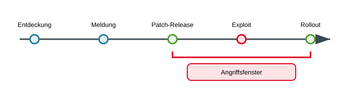
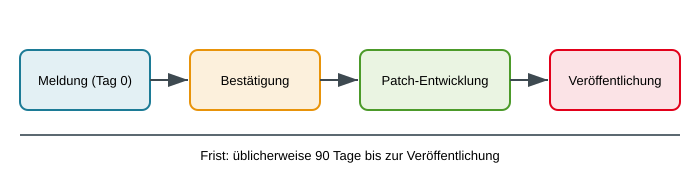
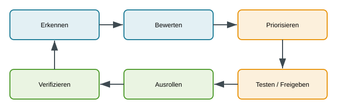
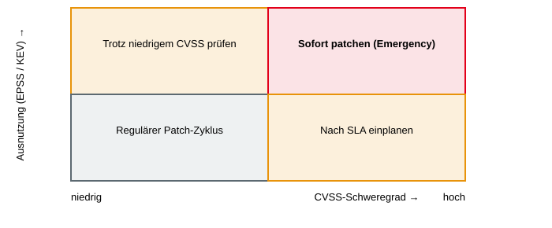

<!-- _class: title -->
# Schwachstellen- und Patchmanagement

      

## IT-Sicherheit – von der Entdeckung bis zum Rollout

<!-- _notes:
Willkommen zum Thema Schwachstellen- und Patchmanagement. Die Leitfrage der gesamten Vorlesung ist: Eine Sicherheitslücke wird irgendwo entdeckt – wie kommt man von dort bis zu dem Punkt, an dem der Fehler auf allen betroffenen Systemen wirklich behoben ist? Ihr braucht kein Vorwissen zum Thema – alle Fachbegriffe führen wir unterwegs ein. Ein verfügbarer Patch schützt erst nach erfolgreichem Rollout und anschließender Verifikation.
-->

---

<!-- _class: biglist -->
# Agenda

- **Grundlagen** – Begriffe, Lebenszyklus einer Schwachstelle
- **Finden von Schwachstellen** – wer, warum, wie
- **Bug-Bounty-Programme** – Schwachstellen als Markt
- **Responsible Disclosure** – Meldung und Veröffentlichung
- **CVSS** – Schwachstellen bewerten
- **Patchmanagement** – Organisation im Unternehmen

<!-- _notes:
Die Agenda folgt dem Lebensweg einer Schwachstelle. Zuerst klären wir Begriffe und den Lebenszyklus, dann sehen wir, wer Schwachstellen überhaupt findet und mit welchen Methoden. Danach betrachten wir zwei gegensätzliche "Märkte": legale Bug-Bounty-Programme und die geordnete Offenlegung (Responsible Disclosure). Anschließend lernen wir mit CVSS ein Bewertungssystem kennen und schließen mit dem Patchmanagement – also der Frage, wie ein Unternehmen aus einer bekannten Lücke einen ausgerollten und verifizierten Patch macht.
-->

---

<!-- _class: chapter -->

# Grundlagen

## Begriffe und Lebenszyklus

<!-- _notes:
Ziel dieses Blocks: Ihr könnt Schwachstelle, Exploit, Zero-Day und Patch klar auseinanderhalten und versteht, warum zwischen "Patch existiert" und "Patch ist eingespielt" oft ein gefährliches Zeitfenster liegt.
-->

---

# Begriffe

- **Schwachstelle (Vulnerability)**: Fehler in Software, Hardware oder Konfiguration, der Sicherheitsziele gefährdet
- **Exploit**: Code oder Technik, die eine Schwachstelle ausnutzt
- **Zero-Day**: Schwachstelle, für die noch **kein Patch** verfügbar ist – unabhängig davon, ob sie schon ausgenutzt wird
- **N-Day**: öffentlich bekannte Schwachstelle, für die bereits ein **Patch existiert**
- **Patch**: Korrektur des Herstellers

<!-- _notes:
Eine Schwachstelle ist zunächst nur eine Möglichkeit – ein Exploit macht daraus ein nutzbares Werkzeug. Beim Zero-Day ist das entscheidende Merkmal: Der Hersteller hat noch keine Abhilfe bereitgestellt. Ob die Lücke schon aktiv ausgenutzt wird, ist eine zweite, davon unabhängige Frage – ein Zero-Day ist also nicht automatisch ein laufender Angriff. Der Name kommt daher, dass der Verteidiger "null Tage" Zeit zur Vorbereitung hatte. N-Day ist das Gegenstück: Die Lücke ist bekannt und ein Patch ist verfügbar – das "N" steht für die Zahl der Tage, die seit der Veröffentlichung vergangen sind.
-->

---

# Kennungen und Datenbanken

- **Common Vulnerabilities and Exposures (CVE)**: eindeutige ID, z. B. CVE-2017-0144
- **Common Weakness Enumeration (CWE)**: Katalog von Schwachstellenklassen
- **National Vulnerability Database (NVD)**: Datenbank mit Beschreibung und Bewertung

> **Merksatz:** CVE benennt den Einzelfall – CWE beschreibt die Fehlerklasse.

> **Ein Beispiel:** CVE benennt eine konkrete gemeldete Lücke; CWE beschreibt die zugehörige Fehlerklasse; NVD stellt Informationen zu bekannten CVEs bereit.

<!-- _notes:
Damit weltweit alle über dieselbe Lücke reden, gibt es eindeutige Kennungen. Eine CVE-Nummer ist wie eine Aktenzeichen-ID für genau eine konkrete Schwachstelle in einem bestimmten Produkt – im Beispiel CVE-2017-0144, die später bei WannaCry eine Rolle spielt. Eine CWE dagegen benennt nicht den Einzelfall, sondern die Fehler-Kategorie dahinter, etwa "SQL-Injection" oder "Pufferüberlauf"; viele verschiedene CVEs gehören zur selben CWE. Die NVD ist die große US-Datenbank, die CVEs anreichert – mit Beschreibung, betroffenen Versionen und einer CVSS-Bewertung, die wir später noch genauer ansehen. Der Merksatz fasst die wichtigste Unterscheidung zusammen: Einzelfall versus Fehlerklasse.
-->

---

# Lebenszyklus einer Schwachstelle

> **Kernproblem:** Zwischen Patch-Release und Rollout liegt das Angriffsfenster.

> **Vereinfachter Ablauf:** Ein Exploit kann schon vor der Meldung oder vor einem Patch existieren. Das gezeigte Angriffsfenster ist nicht die einzige gefährliche Phase.

<!-- _notes:
Die dargestellte Abfolge umfasst den idealtypischen Ablauf: Entdeckung, Meldung, Patch-Release, und schließlich Rollout beim Anwender. In der Realität ist diese Reihenfolge nicht garantiert. Ein Exploit kann auch schon vor der Meldung oder vor dem Patch existieren – dann sprechen wir vom Zero-Day-Fall. Die Darstellung ist also eine Vereinfachung, um das Kernproblem sichtbar zu machen: Sobald ein Patch veröffentlicht ist, wird die Lücke öffentlich bekannt, aber die Systeme sind erst nach dem Rollout tatsächlich geschützt. Genau diese Lücke zwischen "Patch verfügbar" und "Patch eingespielt" ist das Angriffsfenster – rot markiert. Genau darum geht es im ganzen Patchmanagement später: dieses Fenster so klein wie möglich zu halten.
-->

---

# Fallstudie: WannaCry (2017)

- **Was geschah?**
  - Ransomware nutzte EternalBlue (SMBv1), weltweit über 200.000 Systeme in ca. 150 Ländern, u. a. Krankenhäuser (NHS)

- **Warum Versagen der Verfügbarkeit?**
  - Patch (MS17-010) lag zwei Monate vor dem Angriff vor, nicht eingespielt

- **Konsequenzen:**
  - Betriebsausfälle, Milliardenschäden, Debatte über Patch-Disziplin

<!-- _notes:
WannaCry aus dem Jahr 2017 ist das Lehrbuchbeispiel für ein zu großes Angriffsfenster. Die Ransomware nutzte die Schwachstelle EternalBlue im veralteten Netzwerkprotokoll SMBv1 und verschlüsselte weltweit über 200.000 Systeme, unter anderem im britischen Gesundheitssystem NHS, wo Operationen abgesagt werden mussten. Der entscheidende Punkt für uns: Microsoft hatte den passenden Patch MS17-010 rund zwei Monate vor dem Angriff bereitgestellt. Die betroffenen Organisationen hatten ihn nur nicht eingespielt. Deshalb ordnen wir das als Versagen der Verfügbarkeit ein – die Systeme waren durch fehlende Patch-Disziplin lahmgelegt, obwohl die Lösung längst existierte.
-->

---

<!-- _class: chapter -->

# Finden von Schwachstellen

## Wer sucht, warum und wie

<!-- _notes:
Wichtig ist die Erkenntnis, dass dieselbe Tätigkeit – das Suchen von Lücken – sowohl der Verteidigung als auch dem Angriff dienen kann. Wer sucht, entscheidet über die Absicht.
-->

---

# Wer findet Schwachstellen?

- Hersteller (interne Tests, Code-Review)
- Pentester und Red Teams
- Sicherheitsforschende und Bug Hunter
- Kriminelle Gruppen
- Staatliche Akteure
- Zufallsfunde von Anwendern

<!-- _notes:
Die Liste reicht bewusst von "gut" bis "böse". Hersteller und Pentester suchen im Auftrag und mit Erlaubnis – Pentester und Red Teams simulieren dabei reale Angreifer, um die Verteidigung zu prüfen. Sicherheitsforschende und Bug Hunter arbeiten oft freiwillig oder im Rahmen von Bug-Bounty-Programmen. Auf der anderen Seite stehen kriminelle Gruppen, die Lücken für Erpressung oder Datendiebstahl nutzen, und staatliche Akteure – damit sind Geheimdienste und militärische Einheiten gemeint, die Schwachstellen für Spionage oder Sabotage horten, teils über Jahre. Der Unterschied zwischen diesen Gruppen liegt nicht in der Technik, sondern in Auftrag, Erlaubnis und Ziel. Und nicht zu vergessen: Viele Lücken werden schlicht zufällig von normalen Anwendern entdeckt.
-->

---

<!-- _class: normal -->
# Motive

### Defensiv
- Reputation und Karriere
- Belohnung (Bounty)
- Neugier, Forschung
- Vertragliche Prüfung

### Offensiv
- Finanzieller Gewinn
- Spionage
- Sabotage
- Handel über Broker

<!-- _notes:
Die Motive spiegeln die Akteure von eben. Auf der defensiven Seite geht es um Reputation und Karriere – ein gefundener Bug in einem bekannten Produkt ist ein Karriere-Sprungbrett – sowie um Bounty-Zahlungen, Neugier und vertraglich beauftragte Prüfungen. Offensiv dominieren finanzieller Gewinn, Spionage und Sabotage. Der Punkt "Handel über Broker" ist erklärungsbedürftig: Exploit-Broker kaufen funktionierende Angriffstechniken auf und verkaufen sie weiter, etwa an staatliche Kunden – ein legaler Graubereich bis Schwarzmarkt. Genau deshalb versuchen Bug-Bounty-Programme später, Talente auf die defensive Seite zu ziehen.
-->

---

# Methoden

- **Manuell**: Code-Review, Pentest, Reverse Engineering
- **Statisch**: Static Application Security Testing (SAST) – Code lesen, ohne ihn auszuführen
- **Dynamisch**: Dynamic Application Security Testing (DAST), Schwachstellen-Scanner – laufende Anwendung testen
- **Fuzzing**: automatisierte Zufallseingaben, um Abstürze zu provozieren
- **Software Composition Analysis (SCA)**: verwundbare Fremd-Abhängigkeiten finden

> **Merksatz:** statisch = Code lesen, dynamisch = Programm testen, SCA = fremde Bausteine prüfen.

> **Vergleich:** Fuzzing testet das Verhalten einer Anwendung mit vielen Eingaben; SCA prüft ihre verwendeten Fremdkomponenten auf bekannte Schwachstellen.

<!-- _notes:
Manuelle Verfahren – Code-Review, Pentest, Reverse Engineering – sind gründlich, aber teuer und nicht skalierbar. SAST steht für statische Analyse: Man untersucht den Quellcode, ohne das Programm auszuführen – gut, um Fehler früh in der Entwicklung zu finden, produziert aber viele Fehlalarme. DAST ist das Gegenteil: Man testet die laufende Anwendung von außen, wie ein Angreifer – findet nur real erreichbare Probleme, aber erst spät. Fuzzing wirft massenhaft zufällige oder ungültige Eingaben auf ein Programm, um Abstürze und damit Lücken aufzuspüren – sehr wirksam bei Parsern und Dateiformaten. SCA schließlich prüft nicht euren eigenen Code, sondern die eingebundenen Fremdbibliotheken auf bekannte CVEs – heute besonders wichtig, weil moderne Software zu großen Teilen aus Abhängigkeiten besteht.
-->

---

<!-- _class: chapter -->

# Bug-Bounty-Programme

## Schwachstellen als Markt

<!-- _notes:
Bug-Bounty-Programme sind der Versuch, das Finden von Schwachstellen in geordnete, legale Bahnen zu lenken und dafür zu bezahlen. Die Grundidee: Statt dass Forschende ihre Funde auf dem Schwarzmarkt verkaufen, schafft man einen legalen Kanal mit klaren Regeln und fairer Vergütung.
-->

---

# Prinzip

- Organisation lädt Externe zur Suche ein und **zahlt für valide Funde**
- Klarer **Scope**: welche Systeme, welche Methoden erlaubt
- Vergütung nach Schweregrad
- Plattformen: HackerOne, Bugcrowd, Intigriti, YesWeHack

> **Scope-Beispiel:** Die Testfreigabe gilt für die ausdrücklich genannten Systeme und Methoden, nicht für beliebige Konten oder Produktivdaten.

<!-- _notes:
Das Prinzip: Eine Organisation lädt externe Forschende ein, ihre Systeme zu testen, und zahlt nur für valide, neue Funde. Erstens der Scope – die Spielregeln, welche Systeme getestet werden dürfen und welche Methoden erlaubt sind; alles außerhalb ist tabu und kann strafbar sein. Zweitens die Frage, was "valide" heißt: Jeder Report durchläuft eine Triage, in der das Team prüft, ob die Lücke echt und reproduzierbar ist und ob sie nicht schon gemeldet wurde – Duplikate werden nicht doppelt bezahlt. Die Höhe der Prämie richtet sich nach dem Schweregrad, den man später oft mit CVSS begründet. Plattformen wie HackerOne oder YesWeHack vermitteln zwischen Unternehmen und Forschenden und übernehmen einen Teil der Abwicklung.
-->

---

<!-- _class: normal -->
# Vorteile und Grenzen

### Vorteile
- Viele unterschiedliche Blickwinkel
- Bezahlung nur für Ergebnisse
- Legaler Kanal für Forschende

### Grenzen
- Report-Flut, Duplikate, Fehlmeldungen
- Triage-Aufwand
- Reife Prozesse zum Patchen nötig
- Konkurrenz zum Schwarzmarkt

<!-- _notes:
Der größte Vorteil ist die Vielfalt: Hunderte unterschiedliche Köpfe schauen aus Blickwinkeln auf ein System, die ein internes Team nie alle abdecken könnte – und man zahlt nur für Ergebnisse, nicht für Aufwand. Zugleich ist es ein legaler, geschützter Kanal für Forschende. Aber: Ein offenes Programm erzeugt eine Flut an Reports, darunter viele Duplikate und Fehlmeldungen, die alle gesichtet werden müssen – dieser Triage-Aufwand wird gern unterschätzt. Vor allem aber nützt ein Bug-Bounty nichts, wenn die Organisation die gemeldeten Lücken nicht zügig patchen kann; ein Programm ohne reifen Patch-Prozess produziert nur einen Stapel bekannter, offener Probleme.
-->

---

# Bounty vs. Markt

- Bounty-Höhen liegen **je nach Fall** oft unter den Preisen, die **Exploit-Broker** (Händler, die funktionierende Angriffstechniken auf- und weiterverkaufen, z. B. an staatliche Kunden) für Zero-Days zahlen
- Motivation daher auch Anerkennung (Hall of Fame) und Karriere
- Voraussetzung für Erfolg: klare Regeln, faire Bewertung, schnelle Reaktion

> **Entscheidend:** Ein Bug-Bounty-Programm bietet einen autorisierten Meldeweg; ein Verkauf an einen Exploit-Broker folgt anderen Regeln und Interessen.

<!-- _notes:
Für besonders begehrte Zero-Days – etwa in weit verbreiteten Betriebssystemen oder Messengern – zahlen spezialisierte Exploit-Broker teils deutlich mehr als offizielle Bounty-Programme. Diese Aussage gilt aber nicht pauschal: Sie hängt stark vom Produkt und von der Art der Lücke ab, und viele gewöhnliche Funde werden überhaupt nicht am Schwarzmarkt gehandelt. Warum entscheiden sich Forschende trotzdem oft für den legalen Weg? Weil Geld nicht das einzige Motiv ist: Anerkennung in einer "Hall of Fame", ein sauberer Lebenslauf und Rechtssicherheit wiegen für viele schwerer als der höchstmögliche Preis. Damit das funktioniert, muss die Herstellerseite liefern: klare Regeln, faire und nachvollziehbare Bewertung und vor allem schnelle Reaktion.
-->

---

<!-- _class: chapter -->

# Responsible Disclosure

## Meldung und Veröffentlichung

<!-- _notes:
Responsible Disclosure beantwortet die Frage: Ich habe eine Lücke gefunden – was jetzt? Sofort veröffentlichen wäre unverantwortlich, denn dann könnten Angreifer die Lücke ausnutzen, bevor ein Patch existiert. Gar nichts sagen wäre aber auch falsch, weil die Lücke dann nie behoben wird. In diesem Kapitel geht es um den geordneten Mittelweg und seinen rechtlichen Rahmen. Koordinierte Offenlegung soll Hersteller, Forschende und gegebenenfalls weitere Betroffene auf eine abgestimmte Veröffentlichung vorbereiten.
-->

---

# Disclosure-Modelle

| Modell | Kern |
|---|---|
| **Full Disclosure** | sofortige Veröffentlichung, Druck auf Hersteller |
| **Non-Disclosure** | keine Veröffentlichung, Weitergabe nur intern |
| **Responsible Disclosure** | erst Hersteller informieren, Veröffentlichung nach Behebung |
| **Coordinated Disclosure** | mehrere Parteien (Hersteller, CERT/BSI) stimmen einen gemeinsamen Termin ab |

> **Beispiel:** Betrifft eine Lücke mehrere Produkte, können Hersteller und Koordinierungsstelle eine gemeinsame Veröffentlichung abstimmen.

<!-- _notes:
Full Disclosure bedeutet: alles sofort veröffentlichen, maximaler Druck auf den Hersteller – wirksam, aber riskant für die Nutzer. Non-Disclosure ist das andere Extrem: Man behält die Lücke für sich oder gibt sie nur intern weiter – typisch für staatliche Akteure. Die beiden mittleren Modelle werden oft synonym verwendet, unterscheiden sich aber im Detail. Bei Responsible Disclosure informiert der Finder zuerst den Hersteller und veröffentlicht erst, nachdem die Lücke behoben ist – die Steuerung liegt im Kern beim Finder. Coordinated Disclosure geht einen Schritt weiter: Mehrere Parteien – Hersteller, oft eine Koordinierungsstelle wie das BSI, manchmal mehrere betroffene Anbieter – stimmen gemeinsam einen Veröffentlichungstermin ab. Das ist besonders nötig, wenn eine Lücke viele Produkte gleichzeitig betrifft.
-->

---

# Ablauf und Fristen

- Meldung an Hersteller (PSIRT, `security.txt`) oder Koordinierungsstelle (CERT/CC, BSI)
- Bestätigung, Analyse, Patch-Entwicklung
- Übliche Frist: **90 Tage** als Beispiel einer Offenlegungs-Policy (z. B. Google Project Zero)
- Veröffentlichung mit Advisory und CVE

> **Ansprechpartner:** PSIRT = Sicherheitsteam eines Herstellers; CERT = Koordinierungsstelle für Sicherheitsvorfälle. **Kontaktweg:** `security.txt` nennt Meldeadressen und Regeln.

<!-- _notes:
Der typische Ablauf: Zuerst braucht man einen Meldeweg. Viele größere Hersteller haben ein PSIRT – ein Product Security Incident Response Team – und hinterlegen unter der standardisierten Datei security.txt, wie und wo man Schwachstellen melden kann. Findet man keinen Ansprechpartner, wendet man sich an eine Koordinierungsstelle wie das CERT/CC oder das BSI. Dann folgen Bestätigung, Analyse und Patch-Entwicklung durch den Hersteller. Zur Frist: Die 90 Tage sind kein Gesetz, sondern das bekannte Beispiel einer selbst gesetzten Offenlegungs-Policy – populär gemacht von Googles Project Zero. Andere Programme nutzen andere Fristen.
-->

---

# Ablauf im Zeitstrahl

<!-- _notes:
Der Zeitstrahl visualisiert den eben beschriebenen Ablauf noch einmal: Meldung an Tag 0, dann Bestätigung durch den Hersteller, Patch-Entwicklung und schließlich Veröffentlichung. Die durchgehende Linie darunter steht für die übliche Frist von rund 90 Tagen, innerhalb derer das idealerweise abgeschlossen sein soll. Wichtig zum Mitnehmen: Diese Zeitachse ist ein Aushandlungsprozess – reagiert der Hersteller zügig, wird oft früher veröffentlicht; braucht er länger, wird im Rahmen der Policy manchmal verlängert.
-->

---

# Rechtliche Lage

- **§ 202c StGB** („Hackerparagraph"): stellt bestimmte **Vorbereitungshandlungen** unter Strafe – der Kontext entscheidet
- Unbefugter Zugriff bleibt strafbar, auch bei guter Absicht
- **Safe Harbor**: vertragliche Zusicherung des Herstellers, Forschende bei regelkonformem Testen nicht zu belangen – schafft Rechtssicherheit, aber nur, wenn die Regeln der Policy **eingehalten** werden
- Herstellerseite: Meldende nicht bedrohen, transparent kommunizieren

> **Wichtig:** Eine Meldemöglichkeit oder Safe-Harbor-Regel ist keine pauschale Erlaubnis, beliebige Systeme zu testen; maßgeblich sind die konkreten Freigaben.

<!-- _notes:
Ein kurzer, bewusst vorsichtiger Blick auf die Rechtslage – das ist keine Rechtsberatung. Der § 202c StGB, umgangssprachlich "Hackerparagraph", verbietet nicht pauschal jedes Sicherheitswerkzeug. Er stellt bestimmte Vorbereitungshandlungen unter Strafe, und ob eine Handlung darunter fällt, hängt stark vom Kontext und der Absicht ab – dieselben Tools nutzt auch die legitime Sicherheitsforschung. Ganz wichtig und oft übersehen: Ein unbefugter Zugriff auf fremde Systeme bleibt strafbar, selbst wenn man es nur gut meinte und die Lücke danach melden wollte. Gute Absicht schützt nicht automatisch. Genau hier setzt ein Safe Harbor an: Eine Bug-Bounty- oder Disclosure-Policy kann Forschenden ausdrücklich zusichern, dass sie für regelkonformes Testen nicht belangt werden – aber dieser Schutz gilt nur, solange man sich exakt an den vereinbarten Scope und die Regeln hält.
-->

---

<!-- _class: chapter -->

# Beurteilung: CVSS

## Common Vulnerability Scoring System

<!-- _notes:
CVSS – das Common Vulnerability Scoring System – ist der Versuch, die Schwere einer Schwachstelle in einer einzigen Zahl von 0 bis 10 auszudrücken, damit man Lücken vergleichen und priorisieren kann. CVSS beschreibt die technische Schwere einer Schwachstelle; die Priorität ergibt sich zusätzlich aus Exposition und Bedeutung des betroffenen Systems.
-->

---

# Aufbau CVSS 4.0

- **Base**: Eigenschaften der Schwachstelle, konstant
- **Threat**: Ausnutzungsreife (Exploit Maturity), zeitabhängig
- **Environmental**: Anpassung an die eigene Umgebung
- **Supplemental**: Zusatzinfos (z. B. Automatable, Safety), ohne Score-Einfluss

<!-- _notes:
CVSS 4.0 besteht aus vier Metrikgruppen, die man sich als Schichten vorstellen kann. Die Base-Metriken beschreiben die Schwachstelle selbst und ändern sich nicht – sie liefern den Grundwert, den man meist in Datenbanken sieht. Die Threat-Gruppe berücksichtigt, wie ausgereift ein Exploit schon ist, und ist damit zeitabhängig – eine Lücke mit fertigem Angriffscode ist gefährlicher. Die Environmental-Metriken erlauben es, den Wert an die eigene Umgebung anzupassen: Ein System ohne sensible Daten kann eine an sich kritische Lücke für mich entschärfen. Die Supplemental-Gruppe schließlich liefert nur Zusatzinformationen – etwa ob ein Angriff automatisierbar ist oder Sicherheitsrisiken für Menschen bestehen – und fließt bewusst nicht in den Score ein. In der Praxis wird meist nur der Base-Score kommuniziert, obwohl erst die anderen Gruppen das echte Bild liefern.
-->

---

# Base-Metriken

| Gruppe | Metriken |
|---|---|
| Ausnutzbarkeit | Attack Vector (AV), Attack Complexity (AC), Attack Requirements (AT) |
| Voraussetzungen | Privileges Required (PR), User Interaction (UI) |
| Auswirkung | Vertraulichkeit, Integrität, Verfügbarkeit (VC/VI/VA), Folgesysteme (SC/SI/SA) |

> **Lesebeispiel:** AV:N = Angriff über das Netzwerk; PR:N = keine vorherigen Rechte; UI:N = keine Mitwirkung eines Nutzers erforderlich.

<!-- _notes:
Diese Tabelle müsst ihr nicht auswendig können – sie zeigt nur die Logik hinter der Base-Bewertung, und zwar in drei intuitiven Fragen. Erstens Ausnutzbarkeit: Wie leicht ist der Angriff? Der Attack Vector fragt, von wo aus angegriffen werden kann – übers Netz ist schlimmer als nur mit physischem Zugang. Attack Complexity und Attack Requirements erfassen, wie viele günstige Umstände nötig sind. Zweitens Voraussetzungen: Braucht der Angreifer bereits Rechte auf dem System (Privileges Required) oder muss ein Nutzer mitwirken, etwa auf einen Link klicken (User Interaction)? Je weniger nötig ist, desto gefährlicher.
-->

---

# Vektor lesen und Schweregrad

`CVSS:4.0/AV:N/AC:L/AT:N/PR:N/UI:N/VC:H/VI:H/VA:H/SC:N/SI:N/SA:N` → **9.3**

| Score | Schweregrad |
|---|---|
| 0.0 | None |
| 0.1 – 3.9 | Low |
| 4.0 – 6.9 | Medium |
| 7.0 – 8.9 | High |
| 9.0 – 10.0 | Critical |

> **Vektor lesen:** `AV:N` Netzwerk, `PR:N` ohne Anmeldung, `UI:N` ohne Nutzeraktion. Erst danach den Score als Schweregrad einordnen.

<!-- _notes:
AV:N heißt Attack Vector Network, also übers Netz angreifbar – der schlimmste Fall. AC:L bedeutet niedrige Komplexität, AT:N keine besonderen Anforderungen – der Angriff ist also leicht. PR:N heißt keine Rechte nötig und UI:N keine Nutzerinteraktion – der Angreifer braucht niemanden, der mitmacht. Und VC:H, VI:H, VA:H bedeuten hohe Auswirkung auf Vertraulichkeit, Integrität und Verfügbarkeit. Übers Netz, ohne Hürden, mit vollem Schaden – kein Wunder, dass daraus ein sehr hoher Wert von 9,3 und die Stufe "Critical" entsteht. Änderte man ein Teil, etwa PR auf "hoch" oder AV auf "lokal", sänke der Score deutlich.
-->

---

# Grenzen von CVSS

- Score misst **Schwere**, nicht **Risiko**
- Kontext fehlt: Exposition, Kritikalität des Systems, Ausnutzung in freier Wildbahn

- **EPSS**: Wahrscheinlichkeit einer Ausnutzung in den nächsten 30 Tagen
- **CISA KEV**: Katalog nachweislich ausgenutzter Schwachstellen
- **SSVC**: Entscheidungsbaum (Track, Attend, Act)

> **Beispiel:** Eine nur mittelschwere Lücke auf einem internetexponierten Server kann dringender sein als eine kritische Lücke auf einem isolierten Testsystem.

> **Merksatz:** CVSS sagt, wie schlimm es sein könnte – EPSS und KEV sagen, ob es passiert.

> **Entscheidungsbeispiel:** Zwei Lücken mit gleichem CVSS-Wert können unterschiedlich dringend sein, wenn nur ein betroffenes System öffentlich erreichbar ist.

<!-- _notes:
Risiko entsteht erst im Kontext – wie exponiert ist das System, wie kritisch ist es fürs Geschäft, und wird die Lücke tatsächlich ausgenutzt? Eine nur mittelschwere Lücke auf einem direkt aus dem Internet erreichbaren Server kann in der Praxis dringender sein als eine als "kritisch" bewertete Lücke auf einem abgeschotteten Testsystem, das niemand erreicht. Deshalb ergänzt man CVSS mit weiteren Signalen. EPSS schätzt datenbasiert die Wahrscheinlichkeit, dass eine Lücke in den nächsten 30 Tagen ausgenutzt wird. Die KEV-Liste der US-Behörde CISA sammelt Lücken, die nachweislich schon aktiv ausgenutzt werden – steht eine Lücke dort, sollte man sofort handeln, unabhängig vom CVSS-Wert.
-->

---

<!-- _class: chapter -->

# Patchmanagement

## Organisation im Unternehmen

<!-- _notes:
Die letzte offene Frage ist die praktischste: Wie schafft es ein Unternehmen mit tausenden Systemen, aus einer bekannten Lücke tatsächlich einen ausgerollten und verifizierten Patch zu machen? Das ist reine Organisation – und genau da scheitert es in der Praxis am häufigsten, wie wir gleich bei Equifax sehen werden. Ein verfügbarer Patch schützt erst nach erfolgreichem Rollout und anschließender Verifikation.
-->

---

# Voraussetzungen

- **Asset-Inventar / Configuration Management Database (CMDB)**: zentrales Verzeichnis, welche Systeme überhaupt im Einsatz sind
- **Software Bill of Materials (SBOM)**: Stückliste, welche Komponenten und Bibliotheken in einer Software stecken
- Klare **Verantwortlichkeiten** je System
- Quellen: Herstellerhinweise, CERT-Bund, CVE-Feeds, Scanner

<!-- _notes:
Bevor man irgendetwas patchen kann, muss man wissen, was man überhaupt besitzt – das klingt banal, ist aber in der Praxis der häufigste Bruchpunkt. Die CMDB, die Configuration Management Database, ist das zentrale Verzeichnis aller Systeme: Server, Clients, Netzwerkgeräte, mit Version und Verantwortlichem. Ohne ein solches Inventar bekommt man einen CVE-Alarm für eine bestimmte Softwareversion und weiß schlicht nicht, auf welchen Systemen im Unternehmen diese Version überhaupt läuft. Die SBOM ergänzt das auf Code-Ebene: Sie listet, welche Bibliotheken und Komponenten in einer einzelnen Anwendung stecken – das ist die Grundlage, um bei einer neuen CVE in einer Fremdbibliothek überhaupt zu wissen, welche eigenen Produkte betroffen sind, ähnlich wie wir es bei SCA schon gesehen haben. Dazu kommen klare Verantwortlichkeiten: Für jedes System muss jemand zuständig sein, sonst bleibt ein Patch-Hinweis liegen, weil sich niemand angesprochen fühlt. Die Quellen, aus denen man überhaupt von einer Lücke erfährt, sind vielfältig: Herstellerhinweise, die Warnungen von CERT-Bund, automatisierte CVE-Feeds und eigene Scanner.
-->

---

# Der Patch-Prozess

> **Wichtig:** Ohne Verifikation (Scan nach Rollout) ist ein Patch nur „angenommen", nicht „wirksam".

<!-- _notes:
Die dargestellte Abfolge umfasst den Prozess als geschlossenen Kreislauf mit sechs Schritten. Erkennen und Bewerten kennt ihr schon aus den vorherigen Kapiteln – das ist die Kombination aus CVE-Feed und CVSS-Einordnung. Testen und Freigeben bedeutet, den Patch erst in einer Testumgebung zu prüfen, bevor er produktiv geht – ein fehlerhafter Patch kann selbst zum Verfügbarkeitsproblem werden. Ausrollen ist die eigentliche Verteilung auf die Zielsysteme. Und der letzte, oft vergessene Schritt ist Verifizieren: ein erneuter Scan nach dem Rollout, der bestätigt, dass die Lücke tatsächlich geschlossen ist.
-->

---

# Priorisierung und SLAs

- Kriterien: CVSS, EPSS/KEV, Kritikalität, Exposition (Internet vs. intern)
- **Service Level Agreements (SLAs) nach Schweregrad**, z. B. kritisch in Tagen, niedrig im regulären Zyklus
- **Emergency Patching** für aktiv ausgenutzte Lücken außerhalb des Wartungsfensters

<!-- _notes:
Kein Unternehmen kann alle Lücken gleichzeitig schließen, also braucht man eine Reihenfolge. Die Kriterien kombinieren genau das, was wir im CVSS-Kapitel gelernt haben: den CVSS-Schweregrad, die Ausnutzungssignale EPSS und KEV, dazu wie kritisch das betroffene System fürs Geschäft ist und ob es aus dem Internet erreichbar ist oder nur intern. Ein Service Level Agreement, kurz SLA, ist dabei eine verbindliche Zielvorgabe: eine Selbstverpflichtung, kritische Lücken zum Beispiel innerhalb von 7 Tagen zu schließen, während niedrige Schweregrade im normalen, geplanten Patch-Zyklus mitlaufen dürfen. Für den Ausnahmefall gibt es Emergency Patching: Wird eine Lücke bereits aktiv ausgenutzt – Stichwort CISA KEV aus dem letzten Kapitel –, wartet man nicht auf das nächste geplante Wartungsfenster, sondern patcht sofort, mit allen Risiken, die ein ungetesteter Notfall-Rollout mit sich bringt.
-->

---

# Priorisierungsmatrix

<!-- _notes:
Die Matrix spannt die zwei wichtigsten Achsen aus dem CVSS-Kapitel gegeneinander auf: horizontal der CVSS-Schweregrad, vertikal die tatsächliche Ausnutzung laut EPSS oder KEV. Vier Felder ergeben sich daraus. Unten links, niedriger Schweregrad und keine bekannte Ausnutzung: regulärer Patch-Zyklus, keine Eile. Unten rechts, hoher Schweregrad aber (noch) keine bekannte Ausnutzung: nach SLA einplanen, also mit definierter Frist, aber nicht sofort. Oben links, niedriger CVSS-Wert aber bereits aktive Ausnutzung: trotzdem prüfen – genau der Fall, den wir im CVSS-Kapitel als Beispiel hatten, eine formal nur mittelschwere Lücke kann durch aktive Ausnutzung plötzlich brisant werden.
-->

---

# Rollout-Strategien

- **Testringe**: Test → Pilotgruppe → Breite → Kritische Systeme
- Wartungsfenster und Abstimmung mit Fachbereichen
- **Rollback-Plan** vor jedem Rollout
- Automatisierung (Patch-Tools, Configuration Management)

<!-- _notes:
Ist die Priorität geklärt, muss der Patch noch sicher auf die Systeme kommen. Testringe sind das zentrale Prinzip: Man rollt nicht auf einmal überall aus, sondern stufenweise – zuerst eine reine Testumgebung, dann eine kleine Pilotgruppe echter Nutzer, dann die breite Belegschaft, und erst zuletzt die kritischsten Systeme, wo ein Fehler am teuersten wäre. So fällt ein fehlerhafter Patch früh und mit begrenztem Schaden auf, statt gleich das ganze Unternehmen zu treffen. Wartungsfenster sind mit den Fachbereichen abgestimmte Zeitfenster, in denen ein Neustart oder eine kurze Downtime tolerierbar ist – ein Produktionssystem patcht man nicht einfach mitten im laufenden Betrieb. Ein Rollback-Plan muss vor jedem Rollout stehen: Für den Fall, dass der Patch selbst Probleme verursacht, muss klar sein, wie man zur vorherigen Version zurückkommt, und zwar schnell. Und weil sich das bei tausenden Systemen nicht mehr manuell abbilden lässt, übernehmen Patch-Tools und Configuration-Management-Systeme die eigentliche Verteilung automatisiert.
-->

---

<!-- _class: normal -->
# Wenn Patchen nicht geht

### Typische Fälle
- Legacy-Systeme, End of Life
- OT / IoT, Medizingeräte
- Herstellerfreigabe fehlt
- Hohe Verfügbarkeitsanforderung

### Kompensierende Maßnahmen
- Netzwerksegmentierung
- Virtual Patching (WAF, IPS)
- Dienst deaktivieren
- Dokumentierte **Risikoakzeptanz**

> **Virtual Patching:** WAF/IPS können bestimmte Angriffsversuche abfangen; die Schwachstelle in der Software bleibt bestehen und braucht weiter eine dauerhafte Lösung.

<!-- _notes:
In der Realität lässt sich nicht jede Lücke einfach patchen. Typische Fälle: Legacy-Systeme, für die der Support ausgelaufen ist (End of Life) und für die es schlicht keinen Patch mehr gibt; OT-Systeme, IoT-Geräte und Medizingeräte, die wir aus dem IoT-Kapitel kennen und die oft nicht ohne Weiteres neu gestartet oder verändert werden dürfen; Fälle, in denen der Hersteller einen Patch noch nicht freigegeben hat; oder Systeme mit so hoher Verfügbarkeitsanforderung, dass selbst ein kurzes Wartungsfenster nicht tragbar ist, etwa in der Produktion oder im OP-Betrieb. Für diese Fälle gibt es kompensierende Maßnahmen, die die Lücke nicht schließen, aber das Risiko senken: Netzwerksegmentierung isoliert das verwundbare System von den restlichen; Virtual Patching über eine Web Application Firewall (WAF) oder ein Intrusion Prevention System (IPS) blockiert den bekannten Angriffsweg von außen, ohne die Software selbst zu verändern; man kann den betroffenen Dienst schlicht deaktivieren, wenn er nicht zwingend gebraucht wird; oder man akzeptiert das Restrisiko bewusst und dokumentiert diese Risikoakzeptanz – wichtig, damit die Entscheidung nachvollziehbar bleibt und nicht einfach "vergessen" wirkt.
-->

---

# Kennzahlen und Rahmenwerke

- **Time-to-Patch**, Patch-Quote, offene kritische Findings, SLA-Einhaltung
- **ISO 27001:2022**: Control A.8.8 (technische Schwachstellen)
- **BSI IT-Grundschutz**: OPS.1.1.3 Patch- und Änderungsmanagement
- **NIS2**: Pflicht zum Schwachstellenmanagement

> **Messfrage:** Neben der Patch-Quote auch prüfen, wie viele kritische Lücken nach Ablauf der vereinbarten Frist noch offen sind.

<!-- _notes:
Damit ein Patch-Prozess nicht nur auf dem Papier existiert, misst man ihn. Time-to-Patch ist die Zeit vom Bekanntwerden bis zum eingespielten und verifizierten Patch – genau die Zeitspanne, die bei WannaCry zwei Monate zu lang war. Die Patch-Quote zeigt, wie viel Prozent der als kritisch eingestuften Systeme fristgerecht gepatcht wurden, offene kritische Findings zeigen den aktuellen Rückstand, und die SLA-Einhaltung macht messbar, ob die selbst gesetzten Fristen von vorhin auch tatsächlich eingehalten werden. Diese Kennzahlen sind zunehmend nicht mehr freiwillig: Die ISO 27001:2022 verlangt im Control A.8.8 explizit den Umgang mit technischen Schwachstellen, der deutsche BSI IT-Grundschutz beschreibt das im Baustein OPS.1.1.3 sehr konkret, und die europäische NIS2-Richtlinie verpflichtet bestimmte Unternehmen und Sektoren gesetzlich zu einem funktionierenden Schwachstellenmanagement. Aus einer guten Praxis wird also zunehmend eine rechtliche Pflicht.
-->

---

# Fallstudie: Equifax (2017)

- **Was geschah?**
  - Angriff über Apache Struts (CVE-2017-5638), Daten von rund 147 Mio. Personen abgeflossen

- **Warum Versagen der Vertraulichkeit?**
  - Patch war verfügbar, System wurde nicht gepatcht, Inventar und Scans lückenhaft

- **Konsequenzen:**
  - Hohe Vergleichszahlungen, Rücktritte, regulatorische Folgen

<!-- _notes:
Equifax ist das Gegenstück zu WannaCry: gleiches Grundmuster – ein verfügbarer Patch wurde nicht eingespielt –, aber ein anderes Schutzziel ist verletzt. Die US-Kreditauskunftei Equifax wurde 2017 über eine Schwachstelle in der Webanwendungs-Bibliothek Apache Struts angegriffen, CVE-2017-5638. Über diese Lücke griffen Angreifer auf die Datenbanken zu und erbeuteten sensible Daten von rund 147 Millionen Menschen, unter anderem Sozialversicherungsnummern. Der Patch für diese Lücke war bereits verfügbar, bevor der Angriff begann – aber das betroffene System stand offenbar nicht einmal vollständig im Inventar, und die eigenen Scans hatten die Lücke nicht zuverlässig erkannt. Das ist genau das Voraussetzungen-Problem von vorhin: Ohne belastbare CMDB und funktionierende Scans weiß man nicht, wo man verwundbar ist. Weil hier nicht die Verfügbarkeit wie bei WannaCry, sondern die Vertraulichkeit der Daten verletzt wurde, ordnen wir den Fall entsprechend ein.
-->

---

# Zusammenfassung

| Thema | Kernaussage |
|---|---|
| Finden | Viele Akteure mit gegensätzlichen Motiven |
| Bug Bounty | Legaler Kanal, braucht Triage- und Patch-Prozess |
| Disclosure | Koordiniert und mit Frist, rechtlich abgesichert |
| CVSS | Schwere ≠ Risiko, mit EPSS/KEV ergänzen |
| Patchmanagement | Inventar, Priorisierung, Verifikation, Ausnahmen steuern |

<!-- _notes:
Vom Finden über die zwei Wege der Meldung – Bug Bounty und Disclosure – bis zur Bewertung mit CVSS und schließlich der eigentlichen Organisation im Patchmanagement: Das ist die durchgehende Kette von der Entdeckung bis zum Rollout, die uns die ganze Vorlesung begleitet hat. Die beiden Fallstudien, WannaCry und Equifax, zeigen dabei denselben Kernfehler aus zwei Blickwinkeln: Ein verfügbarer Patch nützt nichts, wenn er nicht eingespielt wird – einmal trifft es die Verfügbarkeit, einmal die Vertraulichkeit. Bevor wir Schluss machen, wollen wir die gelernten Konzepte noch an ein paar offenen Fragen ausprobieren.
-->

---

# Diskussionsfragen

- Wann ist eine Veröffentlichung ohne Patch vertretbar?
- Lohnt sich ein eigenes Bug-Bounty-Programm für ein mittelständisches Unternehmen?
- Kritische Lücke im Produktivsystem, Patch aber nicht sofort möglich: Was tun?

<!-- _notes:
Diese drei Fragen haben bewusst keine eindeutig richtige Antwort – sie sollen zur Diskussion anregen und die Konzepte aus der Vorlesung auf konkrete Situationen anwenden. Bei der zweiten Frage denkt an die Vorteile und Grenzen von Bug Bounty: Ein Programm bringt nur etwas, wenn der eigene Patch-Prozess reif genug ist, die eingehenden Reports auch zeitnah zu bearbeiten – ist das bei einem mittelständischen Unternehmen mit begrenzten IT-Ressourcen realistisch? Und die dritte Frage ist genau der Fall aus dem Kapitel "Wenn Patchen nicht geht": Welche kompensierenden Maßnahmen würdet ihr wählen, und wer müsste die Risikoakzeptanz am Ende unterschreiben? Nehmt diese Fragen gerne mit in die Übung oder die nächste Diskussionsrunde.
-->

