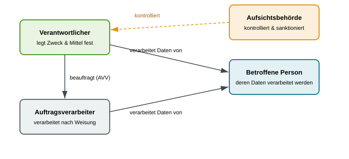

<!-- _class: title -->
# Datenschutz und DSGVO

      

## Ein Überblick für die Praxis

<!-- _notes:
### 💡 Auf den Punkt gebracht (Das große Ganze)
Datenschutz ist kein trockenes Jura-Thema und keine Schikane, sondern eine Kernanforderung an moderne IT- und Geschäftsprozesse. In einer digitalisierten Wirtschaft sind Daten das wertvollste Gut („das neue Öl“) – aber wenn Systeme Daten über reale Menschen verarbeiten, entsteht ein extremes Machtgefälle. Datenschutz schützt nicht Computer oder Festplatten, sondern die Privatsphäre und Handlungsfreiheit lebender Personen. Für IT-Berater und Entwickler bedeutet das: Jedes System muss von Anfang an so gebaut werden, dass Nutzerdaten geschützt und rechtssicher verarbeitet werden.

### 🎯 Klausurrelevanz & Lernziel
- **Was du können musst:** Den grundlegenden Unterschied zwischen technischer Datensicherheit (Schutz vor Hackerangriffen/Verlust) und grundrechtlichem Datenschutz (Schutz von Menschen vor Datenmissbrauch) erklären können.
- **Roter Faden:** Die Vorlesung verbindet rechtliche Grundsätze (DSGVO) direkt mit praktischen Softwareanforderungen (Privacy by Design, Löschkonzepte, Rollenverteilung).

### ❓ Prüfungsfokus & Leitfrage
**Leitfrage:** „Warum schützt Datenschutz Menschen und nicht Daten?“
**Kernantwort:** Weil Daten isoliert keinen Schaden anrichten können. Der Schaden entsteht erst, wenn Daten über reale Menschen intransparent gesammelt, verknüpft oder missbraucht werden (z. B. Identitätsdiebstahl, Diskriminierung bei Krediten oder Bewerbungen).
-->
---
<!-- _class: biglist -->
# Agenda

- **Warum Datenschutz?** – Motivation und Grundrecht
- **Grundbegriffe der DSGVO** – Daten, Rollen, Geltungsbereich
- **Die Grundprinzipien** – Sieben Grundsätze der Verarbeitung
- **Rechtsgrundlagen** – Wann darf überhaupt verarbeitet werden?
- **Rechte der betroffenen Personen** – Auskunft, Löschung & Co.
- **Datenschutz in der Softwareentwicklung** – Privacy by Design
- **Wenn es schiefgeht** – Meldepflichten und Bußgelder

<!-- _notes:
### 💡 Auf den Punkt gebracht (Strukturüberblick)
Der Stoff gliedert sich in einen logischen Ablauf:
1. **Warum?** (Grundrecht & Motivation – ethische Basis)
2. **Was & Wer?** (Grundbegriffe: Personenbezug, Rollen wie Verantwortlicher vs. Auftragsverarbeiter)
3. **Wie?** (Die 7 Grundprinzipien & 6 Rechtsgrundlagen nach DSGVO)
4. **Rechte der Betroffenen** (Auskunft, Recht auf Löschung)
5. **Praxis in der IT** (Privacy by Design & TOM – wie setzt man es technisch um?)
6. **Konsequenzen** (Data Breaches, Meldepflichten und Bußgelder)

### 🎯 Klausurrelevanz & Lern-Strategie
- **Schwerpunkte:** Besonders häufig werden die Grundbegriffe (Kapitel 2), die 7 Prinzipien (Kapitel 3) und die technischen Anforderungen/Rechte (Kapitel 5 & 6) in Klausuren geprüft – meist anhand eines konkreten Fallbeispiels aus der Praxis (z. B. Online-Shop, App, Cloud-Dienst).
- **Lern-Tipp:** Versuche jedes Prinzip und jeden Begriff sofort mit einem Beispiel aus deinem Alltag (z. B. Smartphone-App oder Online-Bestellung) zu verknüpfen.
-->

---
<!-- _class: chapter -->
# Warum Datenschutz?

## Motivation und Grundrecht

<!-- _notes:
### 💡 Auf den Punkt gebracht (Kapiteleinstieg)
Bevor man sich mit Gesetzen und technischen Schutzmaßnahmen beschäftigt, muss das Fundament klar sein: Warum existiert Datenschutz überhaupt? IT-Systeme sammeln heute ununterbrochen Informationen über unser Verhalten. Dieses Kapitel erklärt das Grundrecht auf „informationelle Selbstbestimmung“ und zeigt, warum unkontrollierte Datensammlung reale Menschen und Bürgerrechte gefährdet.

### 🎯 Klausurrelevanz & Lernziel
- **Was du können musst:** Die Motivation für Datenschutzgesetze begründen und den Begriff „informationelle Selbstbestimmung“ in eigenen Worten erklären können.
- **Typische Klausurfalle:** Denken, dass Datenschutz nur „lästige Bürokratie“ sei – in Klausuraufgaben geht es um die Abwägung zwischen Unternehmensinteressen und Bürgerrechten.

### ❓ Typischer Klausurschwerpunkt
**Frage:** „Erläutern Sie das Konzept der informationellen Selbstbestimmung.“
**Antwort:** Jede Person hat grundsätzlich das Recht, selbst darüber zu entscheiden, wer welche Daten über sie erhebt, speichert, weitergibt oder verarbeitet (Ursprung: deutsches Bundesverfassungsgericht / Volkszählungsurteil 1983).
-->
---
# Daten sind wertvoll – und verletzlich

- Unternehmen sammeln heute riesige Mengen an **personenbezogenen Daten**: Einkaufsverhalten, Standort, Gesundheitsdaten, Kommunikation

- Diese Daten sind wirtschaftlich wertvoll – Werbung, Profilbildung, KI-Training

- Genau das macht sie auch **missbrauchsanfällig**: Diskriminierung, Überwachung, Identitätsdiebstahl

> **Merksatz:** Daten über Menschen sind kein neutraler Rohstoff – ihr Missbrauch trifft reale Personen.

<!-- _notes:
### 💡 Auf den Punkt gebracht (Einfach erklärt)
Daten werden oft als „Rohstoff des 21. Jahrhunderts“ bezeichnet. Aber anders als bei Holz oder Eisen gilt: Wenn man Daten über Menschen sammelt, kann man Profile erstellen (z. B. politische Gesinnung, Krankheiten, finanzielle Lage). 
*Alltagsbeispiel:* Wenn ein Versicherungsunternehmen heimlich deine Fitness-Tracker-Daten auswertet und daraufhin deine Beiträge erhöht oder die Behandlung verweigert, spürst du den Missbrauch direkt im Geldbeutel und deiner Existenz. Genau deshalb sind Daten nicht neutral, sondern verletzlich.

### 🎯 Klausurrelevanz & Lernziel
- **Was du können musst:** Drei konkrete Risiken intransparenter Datensammlung nennen und erläutern können (z. B. Profilbildung/Scoring, Identitätsdiebstahl, Diskriminierung).
- **Kernbegriff:** Profiling (automatisierte Analyse von Verhalten zur Vorhersage von Vorlieben oder Risiken).

### ❓ Mögliche Klausurfrage & Antwortskizze
**Frage:** „Warum reicht es im Wirtschaftsleben nicht aus, Daten rein als wirtschaftliches Gut wie Warenbestände zu behandeln?“
**Antwort:**
- Daten beziehen sich auf Individuen; ihr Missbrauch greift direkt in Grundrechte und die Privatsphäre ein.
- Unregulierte Nutzung führt zu Machtasymmetrien (Unternehmen wissen alles über Kunden, Kunden wissen nichts über Algorithmen).
- Risiken: Diskriminierung, Manipulation und Verlust der Kontrolle über die eigene digitale Identität.
-->

---
# Datenschutz als Grundrecht

- In der EU ist der Schutz personenbezogener Daten ein **Grundrecht** (Charta der Grundrechte der EU, Art. 8)

- Kerngedanke: **informationelle Selbstbestimmung** – jede Person soll grundsätzlich selbst bestimmen können, wer was über sie weiß und damit macht

- Datenschutz schützt also nicht „Daten“ abstrakt, sondern die **Person** dahinter

<!-- _notes:
### 💡 Auf den Punkt gebracht (Einfach erklärt)
In Europa ist Datenschutz nicht bloß eine Empfehlung, sondern ein echtes Grundrecht (wie Meinungsfreiheit oder körperliche Unversehrtheit). 
*Der Kernunterschied (Prüfungsklassiker!):*
- **Datensicherheit / IT-Sicherheit:** Schützt die *Systeme und Daten* (vor Hackern, Stromausfall, Festplattendefekt). Werkzeuge: Passwörter, Firewalls, Backups.
- **Datenschutz:** Schützt die *Person*. Er verbietet es auch dem legalen Systembetreiber, mit den Daten Dinge zu tun, die den Nutzer schädigen oder bevormunden.
*Alltagsanalogie:* Eine Alarmanlage schützt dein Haus vor Einbrechern (Datensicherheit). Die Privatsphäre verbietet es dem Vermieter, heimlich Kameras in deiner Wohnung zu installieren, obwohl ihm das Gebäude gehört (Datenschutz).

### 🎯 Klausurrelevanz & Lernziel
- **Was du können musst:** Den Unterschied zwischen Datenschutz und Datensicherheit (IT-Sicherheit) anhand eines eigenen Beispiels trennscharf erläutern können.
- **Typische Klausurfalle:** Die Begriffe synonym verwenden! Ein System kann 100 % sicher vor Hackern sein, aber trotzdem massiv gegen Datenschutz verstoßen (z. B. wenn der Admin alle Mitarbeiter lückenlos überwacht).

### ❓ Mögliche Klausurfrage & Antwortskizze
**Frage:** „Grenzen Sie die Begriffe Datenschutz und Datensicherheit voneinander ab. Kann ein System datensicher sein, aber den Datenschutz verletzen?“
**Antwort:**
- **Datenschutz:** Schützt natürliche Personen vor unrechtmäßiger Verarbeitung ihrer Daten (rechtlich/grundrechtlich getrieben).
- **Datensicherheit:** Schützt Daten und IT-Systeme vor Verlust, Zerstörung und unbefugtem Zugriff (technisch/organisatorisch getrieben).
- **Ja:** Wenn ein Unternehmen Mitarbeiterdaten perfekt verschlüsselt und vor Hackern schützt, diese Daten aber ohne Rechtsgrundlage zur Mitarbeiterüberwachung nutzt, ist das System sicher, verletzt aber den Datenschutz.
-->

---
# Von nationalen Gesetzen zur DSGVO

- Vor 2018: Datenschutz in der EU war **national unterschiedlich** geregelt – uneinheitliches Schutzniveau, hoher Aufwand für Unternehmen mit EU-weitem Geschäft

- Seit dem 25. Mai 2018: die **Datenschutz-Grundverordnung (DSGVO)** gilt EU-weit einheitlich und unmittelbar

- Ziel: gleiches Schutzniveau für alle EU-Bürger:innen und ein gemeinsamer Rechtsrahmen für Unternehmen

<!-- _notes:
### 💡 Auf den Punkt gebracht (Einfach erklärt)
Vor 2018 kochte jedes EU-Land sein eigenes Süppchen (Flickenteppich). Ein deutsches Unternehmen, das Kunden in Frankreich oder Spanien bedienen wollte, musste 28 verschiedene Gesetze prüfen. Seit dem 25. Mai 2018 gilt mit der **DSGVO** (englisch: **GDPR**) ein einheitliches Regelwerk. 
*Wichtiges juristisches Detail einfach übersetzt:* Eine EU-„Verordnung“ gilt direkt und unmittelbar in jedem Mitgliedsstaat – anders als eine „Richtlinie“, die jedes Land erst mühsam in nationales Recht umschreiben muss.

### 🎯 Klausurrelevanz & Lernziel
- **Was du können musst:** Die zwei Hauptziele der DSGVO nennen können (1. Einheitliches, hohes Schutzniveau für alle Bürger; 2. Fairer gemeinsamer digitaler Binnenmarkt für Unternehmen).
- **Stichdatum merken:** 25. Mai 2018 (wird in Multiple-Choice- oder Einstiegsfragen gern abgefragt).

### ❓ Mögliche Klausurfrage & Antwortskizze
**Frage:** „Welchen entscheidenden Vorteil bietet eine EU-Verordnung wie die DSGVO im Vergleich zu früheren nationalen Datenschutzgesetzen für international tätige Unternehmen?“
**Antwort:**
- **Rechtssicherheit & Harmonisierung:** Gleiche Spielregeln im gesamten EU-Binnenmarkt statt 27 unterschiedlicher nationaler Gesetze.
- **Wettbewerbsgleichheit:** Auch Konzerne außerhalb der EU (z. B. USA) müssen sich an dieselben Standards halten, wenn sie Kunden in der EU bedienen (Marktortprinzip).
-->

---
# Zusammenfassung: Warum Datenschutz?

- Personenbezogene Daten sind wertvoll **und** missbrauchsanfällig

- Datenschutz ist ein **Grundrecht**, kein Kann-Thema

- Die DSGVO harmonisiert den Datenschutz EU-weit seit 2018

> **Merksatz:** Datenschutz schützt Menschen – nicht Datenbanken.

<!-- _notes:
### 💡 Auf den Punkt gebracht (Schnell-Check)
Dieses Einführungskapitel hat die Leitplanken gesetzt:
1. Daten sind kein harmloser Rohstoff, sondern eng mit der Identität realer Menschen verknüpft.
2. Datenschutz ist in der EU ein einklagbares Grundrecht (Art. 8 EU-Grundrechtecharta).
3. Die DSGVO gilt unmittelbar und einheitlich in ganz Europa.
*Merksatz für die Klausur:* Datenschutz schützt Menschen vor intransparenter Datenverarbeitung – Datensicherheit schützt Bits & Bytes vor Zerstörung und Diebstahl.

### 🎯 Klausurrelevanz & Lernziel
- **Sicher beherrschen:** Begründen können, warum IT-Sicherheit eine notwendige, aber keine hinreichende Bedingung für Datenschutz ist.

### ❓ Blitzfrage zur Selbstkontrolle
**Frage:** „Nenne den rechtlichen Begriff für das Recht jedes Bürgers, selbst zu bestimmen, wer welche Daten über ihn verarbeitet.“
**Antwort:** **Informationelle Selbstbestimmung** (ursprünglich aus dem Volkszählungsurteil 1983).
-->

---
<!-- _class: chapter -->
# Grundbegriffe der DSGVO

## Daten, Rollen, Geltungsbereich

<!-- _notes:
### 💡 Auf den Punkt gebracht (Kapiteleinstieg)
Jetzt steigen wir in das juristische Fundament ein. Bevor man entscheiden kann, ob eine Software datenschutzkonform ist, muss man die vier Basisfragen klären:
1. *Welche Daten fallen überhaupt unter das Gesetz?* (Personenbezogene Daten)
2. *Welche Vorgänge sind erfasst?* (Praktisch jede digitale Aktion = Verarbeitung)
3. *Wer hat welche Pflichten und wer haftet?* (Rollen: Verantwortlicher vs. Auftragsverarbeiter)
4. *Gilt das Gesetz auch für Firmen in den USA oder Asien?* (Marktortprinzip)

### 🎯 Klausurrelevanz & Lernziel
- **Absoluter Prüfungsklassiker:** Dieses Kapitel liefert das Vokabular für nahezu jede Klausuraufgabe. Wer hier Rollen oder Begriffe verwechselt, verliert in Fallstudien schnell Folgepunkte.
- **Kernkompetenz:** In einem vorgegebenen Unternehmensszenario Rollen fehlerfrei zuweisen können.

### ❓ Typischer Klausurschwerpunkt
**Vorschau:** In Prüfungen wird fast immer eine Konstellation beschrieben (z. B. „Unternehmen A betreibt Webshop und mietet Server bei B“) und du musst begründen, wer Verantwortlicher und wer Auftragsverarbeiter ist.
-->
---
# Was sind personenbezogene Daten?

- **Personenbezogene Daten**: alle Informationen, die sich auf eine identifizierte oder identifizierbare natürliche Person beziehen

- Klassische Beispiele: Name, Adresse, E-Mail, Geburtsdatum, IP-Adresse

- Auch **indirekt** identifizierbare Daten zählen dazu: Kombination aus Merkmalen, die zusammen auf eine Person schließen lassen

- Besondere Kategorien mit erhöhtem Schutz: Gesundheitsdaten, ethnische Herkunft, religiöse Überzeugung, sexuelle Orientierung (Art. 9 DSGVO)

<!-- _notes:
### 💡 Auf den Punkt gebracht (Einfach erklärt)
Personenbezogen ist jede Information, die zu einem konkreten lebenden Menschen gehört.
*Der Trick bei der indirekten Identifizierbarkeit:* Ein Datensatz muss nicht den Namen enthalten, um geschützt zu sein! Wenn eine Datenbank nur speichert: „Wohnort: 76133 Karlsruhe, Beruf: Dekan der Fakultät Wirtschaft, Alter: 58“, ist das Merkmal-Mosaik so eindeutig, dass jeder weiß, wer gemeint ist. 
*Technische Kennungen:* Auch dynamische IP-Adressen, Cookies oder MAC-Adressen sind personenbezogen, weil der Provider oder Plattformbetreiber den Anschlussinhaber ermitteln kann.
*Besondere Kategorien (Art. 9):* Extrem sensible Daten (Gesundheit, Religion, Gewerkschaft, Biometrie) – für sie gelten drastisch strengere Hürden.

### 🎯 Klausurrelevanz & Lernziel
- **Was du können musst:** Die Definition von Art. 4 Nr. 1 DSGVO sinngemäß wiedergeben und anhand von 3 Beispielen erklären, warum auch technische Kennungen geschützt sind.
- **Typische Klausurfalle:** Anonymität mit Pseudonymität verwechseln! Eine Matrikelnummer oder User-ID ist **nicht** anonym, sondern **pseudonym** (denn mit einer Zuordnungstabelle lässt sich der Klarname wiederherstellen). Pseudonyme Daten unterliegen voll der DSGVO!

### ❓ Mögliche Klausurfrage & Antwortskizze
**Frage:** „Ein Webshop speichert Zugriffslogs mit Datum, Uhrzeit, besuchten Produktseiten und IP-Adresse, erfasst aber weder Namen noch Adressen. Fallen diese Daten unter die DSGVO? Begründen Sie kurz.“
**Antwort:**
- **Ja:** Die IP-Adresse ist ein personenbezogenes Datum.
- Über den Internet-Provider kann die Identität des Nutzers ermittelt werden (sog. relative Personenbeziehbarkeit).
- Zudem erlauben Klickpfad und Surfverhalten die Erstellung individueller Profile.
-->

---
# Was zählt als Verarbeitung?

- **Verarbeitung**: jeder Umgang mit personenbezogenen Daten – nicht nur Speichern

- Dazu zählen u.&nbsp;a.: Erheben, Erfassen, Speichern, Verändern, Auslesen, Verwenden, Übermitteln, Löschen

- Praktisch bedeutet das: Fast **jede** Software, die mit Nutzerdaten arbeitet, „verarbeitet“ im Sinne der DSGVO

<!-- _notes:
### 💡 Auf den Punkt gebracht (Einfach erklärt)
In der Alltagssprache denkt man bei „Verarbeitung“ ans Berechnen oder Ändern von Daten. Im Datenschutzrecht (Art. 4 Nr. 2 DSGVO) ist der Begriff extrem weit gefasst: **Jeder noch so kleine Handgriff mit Daten ist eine Verarbeitung!**
*Beispiele, an die viele nicht denken:*
- Das bloße Anzeigen einer Kundenadresse auf dem Bildschirm eines Servicemitarbeiters (Auslesen/Verwenden).
- Das Versenden einer E-Mail mit Kundendaten an einen Kollegen (Übermitteln).
- Sogar das Löschen oder Vernichten von Daten ist rechtlich eine Verarbeitung!
*Fazit:* In der IT gibt es praktisch keine Software mit Nutzerdaten, die *nicht* unter diesen Begriff fällt.

### 🎯 Klausurrelevanz & Lernziel
- **Was du können musst:** Erklären können, dass Verarbeitung nicht nur Speichern meint, und mindestens vier Verarbeitungsformen nennen (z. B. Erheben, Speichern, Weiterleiten, Löschen).
- **Typische Klausurfalle:** Glauben, dass reines „Durchleiten“ von Daten (z. B. über eine API) keine Verarbeitung sei.

### ❓ Mögliche Klausurfrage & Antwortskizze
**Frage:** „Ein Start-up argumentiert: ‚Wir verarbeiten keine personenbezogenen Daten, da wir sie gar nicht dauerhaft in einer Datenbank speichern, sondern nur in Echtzeit an einen externen KI-Dienst zur Textanalyse weiterleiten.‘ Ist diese Argumentation nach DSGVO haltbar?“
**Antwort:**
- **Nein, absolut unhaltbar.**
- Nach Art. 4 Nr. 2 DSGVO umfasst die Verarbeitung jeden Vorgang mit Daten, ausdrücklich auch das Erheben, Erfassen und **Übermitteln**.
- Auch temporäre Übertragungen oder das Durchleiten an Dritte sind rechtlich vollwertige Verarbeitungen und bedürfen einer Rechtsgrundlage.
-->

---
<!-- _class: normal -->
# Die Rollen im Datenschutz

### Wer entscheidet?
- **Verantwortlicher**: legt Zweck und Mittel der Verarbeitung fest
- Trägt die Hauptverantwortung
- Beispiel: das Unternehmen, das eine Kunden-App betreibt

### Wer führt aus?
- **Auftragsverarbeiter**: verarbeitet Daten im Auftrag, nach Weisung
- Hat keine eigene Zweckhoheit
- Beispiel: ein Cloud-Hosting-Anbieter

> **Beispiel:** Ein Online-Shop bestimmt den Zweck der Kundendaten; ein beauftragter Hosting-Dienst verarbeitet sie nach dessen Weisung.

<!-- _notes:
### 💡 Auf den Punkt gebracht (Einfach erklärt)
Wer haftet und wer bestimmt? Das ist die Kernfrage der Rollenverteilung:
- **Verantwortlicher (Controller):** Ist der „Chef“ der Daten. Er bestimmt **Warum** (Zweck: z. B. Kundenservice) und **Wie** (Mittel: z. B. CRM-System) Daten genutzt werden. Er haftet primär gegenüber Kunden und Behörden.
- **Auftragsverarbeiter (Processor):** Ist der weisungsgebundene Dienstleister. Er kriegt gesagt: „Speichere diese Daten für mich ab und fass sie nicht für eigene Zwecke an!“
*Alltagsanalogie:* Du mietest ein Bankschließfach. Du entscheidest, was hineingelegt wird und warum (Verantwortlicher). Die Bank stellt nur den Tresorraum und das Schließfach zur Verfügung, darf aber nicht in deinen Karton schauen oder deine Sachen verkaufen (Auftragsverarbeiter).
*Vertragliche Pflicht:* Zwischen beiden ist zwingend ein **Auftragsverarbeitungsvertrag (AVV)** nach Art. 28 DSGVO vorgeschrieben.

### 🎯 Klausurrelevanz & Lernziel
- **Was du können musst:** In einem Fallbeispiel eindeutig identifizieren, welche Partei der Verantwortliche und welche der Auftragsverarbeiter ist, und dies anhand von „Zweck und Mittel“ begründen.
- **Typische Klausurfalle:** Denken, der Cloud-Anbieter sei automatisch der Verantwortliche, weil er die Server besitzt. Falsch: Solange er nur nach Weisung hostet, ist er Auftragsverarbeiter!

### ❓ Mögliche Klausurfrage & Antwortskizze
**Frage:** „Ein Fitnessstudio nutzt eine externe SaaS-Plattform zur Mitgliederverwaltung. Das Studio entscheidet über Mitgliedsbeiträge und Laufzeiten. Der Softwareanbieter speichert die Daten in seiner Cloud. Wer hat welche Rolle nach DSGVO?“
**Antwort:**
- **Fitnessstudio = Verantwortlicher:** Es entscheidet über die Zwecke (Mitgliederbetreuung, Abrechnung) und Mittel der Verarbeitung.
- **SaaS-Anbieter = Auftragsverarbeiter:** Er stellt lediglich die technische Infrastruktur und verarbeitet die Daten weisungsgebunden im Auftrag des Studios.
-->

---
# Die Rollen im Überblick

- **Betroffene Person**: die Person, um deren Daten es geht
- **Aufsichtsbehörde**: staatliche Stelle, die die Einhaltung der DSGVO kontrolliert (mehr dazu im letzten Kapitel)

<!-- _notes:
### 💡 Auf den Punkt gebracht (Das Gesamtbild)
Dieses Schaubild fasst das gesamte Beziehungsgeflecht der DSGVO zusammen:
1. **Betroffene Person (Data Subject):** Der Bürger / Kunde / Mitarbeiter, dessen Daten verarbeitet werden (Rechteinhaber).
2. **Verantwortlicher:** Trägt die Gesamtverantwortung und muss den Betroffenen Rede und Antwort stehen (z. B. bei Auskunftsersuchen).
3. **Auftragsverarbeiter:** Arbeitet im Auftrag des Verantwortlichen auf Basis des Auftragsverarbeitungsvertrags (AVV).
4. **Aufsichtsbehörde:** Der staatliche „Schiedsrichter“ (in Deutschland die Landesdatenschutzbeauftragten, z. B. LfDI Baden-Württemberg). Sie prüft Beschwerden von Bürgern, führt Audits durch und verhängt Bußgelder.

### 🎯 Klausurrelevanz & Lernziel
- **Was du können musst:** Die 4 Parteien und ihre Beziehungen zueinander fehlerfrei benennen und in eine Skizze einordnen können.
- **Wichtiges Rechtswissen:** An wen wendet sich der Kunde bei Problemen? Immer an den Verantwortlichen!

### ❓ Mögliche Klausurfrage & Antwortskizze
**Frage:** „Ein Kunde möchte wissen, welche Daten über ihn gespeichert sind. Kann er das Auskunftsersuchen direkt an den Cloud-Dienstleister richten, der die Server betreibt?“
**Antwort:**
- **Nein:** Der Cloud-Dienstleister ist nur Auftragsverarbeiter und hat keine direkte rechtliche Beziehung zum Betroffenen bzgl. der Zwecke.
- Der Kunde muss sich an den **Verantwortlichen** wenden. Der Auftragsverarbeiter ist lediglich verpflichtet, den Verantwortlichen bei der Erfüllung der Betroffenenrechte technisch zu unterstützen.
-->

---
# Geltungsbereich: Für wen gilt die DSGVO?

- **Räumlich**: für alle Unternehmen mit Sitz in der EU

- **Marktortprinzip**: gilt auch für Unternehmen außerhalb der EU, wenn sie EU-Bürger:innen gezielt Waren/Dienste anbieten oder ihr Verhalten beobachten

- **Praktische Folge**: Auch ein US-Startup ohne EU-Büro muss die DSGVO beachten, sobald es aktiv EU-Kund:innen anspricht

- **Ausnahme (Haushaltsausnahme)**: gilt nicht für die Verarbeitung durch natürliche Personen zu ausschließlich persönlichen oder familiären Tätigkeiten (Art. 2 Abs. 2 lit. c DSGVO)

<!-- _notes:
### 💡 Auf den Punkt gebracht (Einfach erklärt)
Gilt europäisches Recht auch für Meta, Google, Apple oder ein kleines Startup in Tokio?
- **Marktortprinzip (Prüfungs-Highlight!):** Entscheidend ist nicht, wo der Firmensitz oder der Server steht, sondern **wo der Kunde lebt!** Wenn ein US-Anbieter seine Website auf Deutsch anbietet, Preise in Euro abrechnet oder Lieferungen nach Europa schickt, unterliegt er zu 100 % der DSGVO.
- **Die Haushaltsausnahme:** Die DSGVO gilt *nicht* für dein rein privates Leben. Deine WhatsApp-Kontakte, die Geburtstagsliste deiner Familie oder deine private Adressverwaltung sind ausgenommen.
*Aber Vorsicht:* Sobald du Daten veröffentlichst (z. B. auf einem öffentlichen Instagram-Profil) oder gewerblich nutzt, erlischt die Haushaltsausnahme sofort!

### 🎯 Klausurrelevanz & Lernziel
- **Was du können musst:** Das Marktortprinzip definieren und anhand eines praktischen Beispiels anwenden können. Die Grenzen der Haushaltsausnahme erklären können.
- **Typische Klausurfalle:** Zu glauben, US-Unternehmen müssten sich nur an US-Recht halten.

### ❓ Mögliche Klausurfrage & Antwortskizze
**Frage:** „Ein kalifornischer Webshop verkauft Sneaker. Er hat weder eine Niederlassung noch Server in der EU, bietet aber Euro-Zahlung und Versand nach Deutschland an. Gilt für ihn die DSGVO? Begründen Sie Ihre Antwort.“
**Antwort:**
- **Ja, die DSGVO findet Anwendung.**
- Begründung: **Marktortprinzip (Art. 3 Abs. 2 DSGVO)**. Das Unternehmen bietet gezielt Waren und Dienstleistungen für betroffene Personen in der Europäischen Union an. Der physische Sitz des Unternehmens ist irrelevant.
-->

---
# Zusammenfassung: Grundbegriffe

| Begriff | Kurzdefinition |
|---|---|
| Personenbezogene Daten | Alle Informationen mit Bezug zu einer Person |
| Verarbeitung | Jeder Umgang mit diesen Daten (Erheben, Speichern, Löschen) |
| Verantwortlicher | Legt Zwecke und Mittel der Verarbeitung fest |
| Auftragsverarbeiter | Verarbeitet Daten weisungsgebunden im Auftrag |
| Betroffene Person | Natürliche Person, um deren Daten es geht |

<!-- _notes:
### 💡 Auf den Punkt gebracht (Schnell-Check)
Dieses Kapitel war das Begriffs-Rückgrat der gesamten Vorlesung:
1. **Personenbezug:** Direkt (Name) oder indirekt (IP-Adresse, Merkmalskombination).
2. **Verarbeitung:** Nahezu jede digitale Handlung mit Daten (inkl. Löschen und Anzeigen).
3. **Verantwortlicher:** Entscheidet über Zweck & Mittel, trägt die Hauptverantwortung.
4. **Auftragsverarbeiter:** Führt nur weisungsgebunden aus (braucht AVV).
5. **Geltungsbereich:** Gilt überall dort, wo EU-Bürger adressiert werden (Marktortprinzip).

### 🎯 Klausurrelevanz & Lernziel
- **Must-Know für die Prüfung:** Diese 5 Begriffe musst du im Schlaf definieren und in Szenarien fehlerfrei anwenden können.

### ❓ Blitz-Selbsttest für die Klausur
**Frage 1:** „Welche vertragliche Vereinbarung muss zwingend geschlossen werden, bevor ein Unternehmen Kundendaten auf Servern eines externen Dienstleisters speichert?“
➔ **Antwort:** Ein **Auftragsverarbeitungsvertrag (AVV)** nach Art. 28 DSGVO.

**Frage 2:** „Warum schützt die bloße Entfernung des Namens (z. B. Ersetzen durch eine Kundennummer) einen Datensatz nicht vor der DSGVO?“
➔ **Antwort:** Weil es sich nur um **Pseudonymisierung** handelt; die Identität bleibt über die Kundennummer weiterhin herstellbar.
-->

---
<!-- _class: chapter -->
# Die Grundprinzipien

## Sieben Grundsätze der Verarbeitung

<!-- _notes:
### 💡 Auf den Punkt gebracht (Kapiteleinstieg)
Die sieben Grundsätze nach Art. 5 DSGVO sind die „Zehn Gebote“ des Datenschutzes. Sie legen fest, unter welchen moralischen und operativen Spielregeln Daten überhaupt angefasst werden dürfen. Jedes Software-Design, jede Datenbanktabelle und jede App-Berechtigung muss sich an diesen sieben Prinzipien messen lassen.

### 🎯 Klausurrelevanz & Lernziel
- **Prüfungsschwerpunkt:** In nahezu jeder Klausur wird verlangt, mindestens 4 bis 5 der 7 Grundsätze zu nennen und anhand eines praktischen Softwarebeispiels (z. B. Registrierungsformular, Web-Analytics) zu erläutern.
- **Wichtigste Prinzipien:** Zweckbindung, Datenminimierung und Speicherbegrenzung haben die größten direkten Auswirkungen auf Softwarearchitektur und Datenmodelle.

### ❓ Typischer Klausurschwerpunkt
**Frage:** „Nennen Sie vier Grundsätze der Datenverarbeitung nach Art. 5 DSGVO und erläutern Sie zwei davon an einem Beispiel.“
**Antwort-Tipp:** Merke dir die „Big 4“: Zweckbindung, Datenminimierung, Speicherbegrenzung und Integrität/Vertraulichkeit.
-->
---
# Die sieben Grundsätze im Überblick (Art. 5 DSGVO)

| Grundsatz | Kurzbeschreibung |
|---|---|
| Rechtmäßigkeit, Treu & Glauben, Transparenz | Verarbeitung braucht eine Grundlage und ist nachvollziehbar |
| Zweckbindung | Daten nur für festgelegte Zwecke nutzen |
| Datenminimierung | Nur so viele Daten wie tatsächlich nötig |
| Richtigkeit | Daten müssen korrekt und aktuell sein |
| Speicherbegrenzung | Daten nicht länger als nötig aufbewahren |
| Integrität & Vertraulichkeit | Daten vor Verlust und Missbrauch schützen |
| Rechenschaftspflicht | Verantwortlicher muss Einhaltung nachweisen können |

<!-- _notes:
### 💡 Auf den Punkt gebracht (Übersicht)
Diese 7 Grundsätze sind wie eine Qualitäts-Checkliste für Entwickler und Berater:
1. **Rechtmäßigkeit, Treu & Glauben, Transparenz:** Nicht heimlich handeln, Spielregeln einhalten.
2. **Zweckbindung:** Vorab festlegen, wofür Daten gesammelt werden – und sich strikt daran halten.
3. **Datenminimierung:** Nur so viele Daten wie unbedingt nötig („Sparsamkeitsprinzip“).
4. **Richtigkeit:** Keine veralteten oder falschen Datensätze mitschleppen.
5. **Speicherbegrenzung:** Daten löschen, sobald der Zweck erfüllt ist (keine ewige Halde).
6. **Integrität & Vertraulichkeit:** Technische IT-Sicherheit (Schutz vor Hackern & Datenpannen).
7. **Rechenschaftspflicht (Accountability):** Man muss all das auch lückenlos beweisen können!

### 🎯 Klausurrelevanz & Lernziel
- **Was du können musst:** Die 7 Grundsätze aufzählen und ihre Kernbedeutung in je einem Halbsatz zusammenfassen können.
- **Signalwort:** Rechenschaftspflicht bedeutet *Beweislastumkehr* – nicht die Behörde muss dir einen Verstoß nachweisen, sondern du musst beweisen, dass du sauber arbeitest!

### ❓ Mögliche Klausurfrage & Antwortskizze
**Frage:** „Was fordert der Grundsatz der Rechenschaftspflicht (Accountability) vom Verantwortlichen?“
**Antwort:**
- Der Verantwortliche muss nicht nur alle Grundsätze einhalten, sondern deren Einhaltung auch aktiv **nachweisen und dokumentieren** können (z. B. durch Verarbeitungsverzeichnisse, Löschkonzepte und Sicherheitsnachweise).
-->

---
# Rechtmäßigkeit, Treu & Glauben und Transparenz

- **Rechtmäßigkeit**: Verarbeitung braucht immer eine gültige Rechtsgrundlage (dazu gleich mehr im nächsten Kapitel)

- **Treu und Glauben**: Verarbeitung darf betroffene Personen nicht täuschen oder überrumpeln – sie muss so ablaufen, wie diese es vernünftigerweise erwarten würden

- **Transparenz**: verständliche, leicht zugängliche Information darüber, was mit den Daten passiert – keine versteckten Klauseln in seitenlangen AGB

> **Prüffrage für eine App:** Wofür brauche ich die Daten, welche Rechtsgrundlage gilt, und welche Angaben sind dafür wirklich erforderlich?

<!-- _notes:
### 💡 Auf den Punkt gebracht (Einfach erklärt)
Dieses Trio sorgt für Fairness zwischen Unternehmen und Nutzern:
- **Rechtmäßigkeit:** Es gibt ein klares Verbot mit Erlaubnisvorbehalt – ohne rechtliche Erlaubnis darf kein Byte verarbeitet werden.
- **Treu und Glauben (Fairness):** Keine fiesen Tricks! Die Verarbeitung muss so ablaufen, wie ein normaler Nutzer es vernünftigerweise erwarten würde.
*Negativbeispiel:* Eine Taschenlampen-App, die im Hintergrund das Adressbuch kopiert, verstößt grob gegen Treu und Glauben – selbst wenn es tief in 50 Seiten AGB irgendwo stand!
- **Transparenz:** Datenschutzhinweise müssen in klarer, einfacher Sprache formuliert sein („Plain Language“), nicht in unlesbarem Juristendeutsch.

### 🎯 Klausurrelevanz & Lernziel
- **Was du können musst:** Das Prinzip „Treu und Glauben“ an einem Negativbeispiel (z. B. intransparente App-Berechtigungen) verdeutlichen können.
- **Typische Klausurfalle:** Glauben, dass ein versteckter Satz in den AGB ein faires Verhalten ersetzt. Transparenz verlangt aktive, verständliche Aufklärung!

### ❓ Mögliche Klausurfrage & Antwortskizze
**Frage:** „Eine kostenlose Wetter-App verlangt Zugriff auf Standort und Kontaktdaten. Die Standortdaten werden an Werbenetzwerke weiterverkauft; dies wird nur in Absatz 14 der AGB erwähnt. Welche Grundsätze nach Art. 5 DSGVO sind verletzt?“
**Antwort:**
- **Treu und Glauben:** Überrumpelung der Nutzer; unfaire Datenverarbeitung, die Nutzer vernünftigerweise nicht erwarten.
- **Transparenz:** Versteckte Information im Kleingedruckten statt klarer, leicht zugänglicher Aufklärung.
- **Datenminimierung:** Für eine Wettervorhersage sind Kontaktdaten technisch völlig irrelevant.
-->

---
# Zweckbindung und Datenminimierung

- **Zweckbindung**: Daten dürfen nur für den Zweck verwendet werden, für den sie erhoben wurden

  - Beispiel: E-Mail-Adresse für Bestellbestätigung ≠ automatisch Erlaubnis für Werbe-Newsletter

- **Datenminimierung**: nur die Daten erheben, die für den Zweck tatsächlich nötig sind

  - Beispiel: Für eine Newsletter-Anmeldung reicht die E-Mail-Adresse – Geburtsdatum und Adresse sind meist nicht erforderlich

<!-- _notes:
### 💡 Auf den Punkt gebracht (Einfach erklärt)
Hier schlagen die zwei wichtigsten Prinzipien für Entwickler und Datenbank-Designer zu:
- **Zweckbindung (Wofür?):** Wenn ich Daten für Zweck A sammle (z. B. Pizza ausliefern), darf ich sie später nicht einfach für Zweck B benutzen (z. B. ungefragt Werbung schicken oder die Daten für KI-Training nutzen). Ein neuer Zweck braucht eine neue Rechtsgrundlage!
- **Datenminimierung (Wie viel?):** „So viel wie nötig, so wenig wie möglich.“ Früher galt in der IT oft: *Sammeln wir mal alles, wer weiß, wofür wir es noch brauchen.* Die DSGVO verbietet das strikt!
*Alltagsvergleich:* Um dir ein Paket zu schicken, braucht der Paketdienst deine Adresse. Wenn er zusätzlich dein Geburtsdatum und deinen Beziehungsstatus als Pflichtfeld verlangt, verstößt er gegen die Datenminimierung.

### 🎯 Klausurrelevanz & Lernziel
- **Absoluter Klausur-Klassiker:** Gegeben ist ein Web-Formular (z. B. Registrierung oder Newsletter). Du musst beurteilen, welche Felder Pflichtfelder sein dürfen und welche gegen Datenminimierung oder Zweckbindung verstoßen.
- **Faustregel für die Klausur:** Pflichtfeld darf nur sein, was zur Erbringung der Dienstleistung technisch zwingend erforderlich ist!

### ❓ Mögliche Klausurfrage & Antwortskizze
**Frage:** „Ein Online-Händler verlangt bei der Registrierung für einen reinen Software-Download zwingend die Angabe von Telefonnummer und Geburtsdatum. Beurteilen Sie dies datenschutzrechtlich.“
**Antwort:**
- **Verstoß gegen Datenminimierung (Art. 5 Abs. 1 lit. c DSGVO):** Für den Download einer Software sind weder Telefonnummer noch Geburtsdatum erforderlich (E-Mail reicht).
- Diese Felder dürfen höchstens freiwillig sein, niemals Pflichtfelder („Asterisk/Sternchen“).
-->

---
# Speicherbegrenzung und Richtigkeit

- **Speicherbegrenzung**: Daten nicht unbegrenzt aufheben – nur solange, wie es der Zweck erfordert

  - Praxisfolge: Lösch- und Aufbewahrungsfristen im Datenmodell mitdenken, nicht „auf Vorrat“ speichern

- **Richtigkeit**: Daten müssen sachlich richtig und, wo nötig, auf dem neuesten Stand sein

  - Praxisfolge: Nutzer:innen brauchen eine Möglichkeit, eigene Daten zu korrigieren

<!-- _notes:
### 💡 Auf den Punkt gebracht (Einfach erklärt)
- **Speicherbegrenzung (Verfallsdatum für Daten):** Daten dürfen nicht auf ewig in der Datenbank herumliegen. Sobald der Zweck erfüllt ist (z. B. die Bewerbungsphase ist beendet oder das Kundenkonto gekündigt), müssen die Daten gelöscht oder anonymisiert werden.
*Alltagsanalogie:* Ein Parkticket. Wenn du aus dem Parkhaus fährst, wird der Parkvorgang beendet – der Betreiber darf dein Nummernschild nicht jahrelang auf Vorrat aufbewahren.
*Praxis in der IT:* Entwickler müssen automatische Löschroutinen („Data Retention Policies“) programmieren.
- **Richtigkeit:** Systeme müssen dafür sorgen, dass falsche Daten korrigiert werden, da falsche Profile verheerende Folgen haben können (z. B. falscher Schufa-Score).

### 🎯 Klausurrelevanz & Lernziel
- **Was du können musst:** Erklären können, warum „Speicherplatz ist billig, wir heben alles auf“ ein Datenschutzverstoß ist, und das Spannungsfeld zwischen gesetzlichen Aufbewahrungsfristen (z. B. Steuerrecht: 10 Jahre) und Speicherbegrenzung kennen.
- **Löschkonzept:** Ein zentrales Instrument, das in Prüfungen oft als TOM / organisatorische Maßnahme genannt werden muss.

### ❓ Mögliche Klausurfrage & Antwortskizze
**Frage:** „Ein Webseitenbetreiber speichert detaillierte Server-Logfiles (inkl. IP-Adressen) seit 5 Jahren unbegrenzt, um im Falle eines Angriffs eventuell historische Muster analysieren zu können. Ist das zulässig?“
**Antwort:**
- **Nein, Verstoß gegen den Grundsatz der Speicherbegrenzung (Art. 5 Abs. 1 lit. e DSGVO).**
- Zur Fehler- und Sicherheitsanalyse genügen üblicherweise wenige Tage bis maximal wenige Wochen (gängige Rechtsprechung: typisch 7 Tage).
- Vorratsdatenspeicherung ohne konkreten Anlass über Jahre hinweg ist unzulässig.
-->

---
# Integrität, Vertraulichkeit und Rechenschaftspflicht

- **Integrität und Vertraulichkeit**: Daten müssen durch geeignete technische Maßnahmen vor unbefugtem Zugriff, Verlust und Zerstörung geschützt werden

  - Hier trifft Datenschutz direkt auf klassische **IT-Sicherheit** (Verschlüsselung, Zugriffskontrolle, Backups)

- **Rechenschaftspflicht (Accountability)**: der Verantwortliche muss die Einhaltung aller Grundsätze **nachweisen** können – nicht nur einhalten

  - Praxisfolge: Dokumentation, Verzeichnis von Verarbeitungstätigkeiten (VVT, Art. 30 DSGVO), Nachweise über getroffene Maßnahmen

<!-- _notes:
### 💡 Auf den Punkt gebracht (Einfach erklärt)
- **Integrität & Vertraulichkeit (Die Brücke zur IT-Security):** Hier fordert das Datenschutzrecht die klassische technische IT-Sicherheit ein. Daten müssen verschlüsselt (Vertraulichkeit), vor Manipulation geschützt (Integrität) und verfügbar sein. Wer Kundendaten unverschlüsselt auf einem offenen Server liegen lässt, begeht einen direkten DSGVO-Verstoß!
- **Rechenschaftspflicht (Accountability):** Der Satz „Wir halten uns doch an alle Gesetze!“ reicht nicht aus. Das Unternehmen muss es im Streitfall schwarz auf weiß beweisen können.
*Praxis-Werkzeug:* Das **Verfahrensverzeichnis (VVT / Art. 30 DSGVO)** – ein zentrales Verzeichnis, in dem genau dokumentiert ist, welche Abteilung welche Daten zu welchem Zweck wie lange verarbeitet.

### 🎯 Klausurrelevanz & Lernziel
- **Brücke zum IT-Security-Modul:** Vertraulichkeit und Integrität verbinden die DSGVO direkt mit der **CIA-Triade** (Confidentiality, Integrity, Availability) aus der IT-Sicherheit.
- **Klausur-Fachbegriff:** VVT (Verzeichnis von Verarbeitungstätigkeiten) als Nachweis der Rechenschaftspflicht kennen.

### ❓ Mögliche Klausurfrage & Antwortskizze
**Frage:** „Ein Unternehmen wird von der Datenschutzbehörde geprüft. Der Datenschutzbeauftragte versichert mündlich, dass alle TOMs eingehalten werden, kann aber keinerlei Dokumentation oder Löschprotokolle vorweisen. Welcher Grundsatz ist verletzt?“
**Antwort:**
- Der Grundsatz der **Rechenschaftspflicht (Accountability, Art. 5 Abs. 2 DSGVO)**.
- Der Verantwortliche trägt die Beweislast und ist gesetzlich verpflichtet, die Einhaltung aller Grundsätze durch Dokumentation (z. B. Verzeichnis von Verarbeitungstätigkeiten nach Art. 30) nachweisen zu können.
-->

---
# Zusammenfassung: Grundprinzipien

> **Merksatz:** Nur das Nötigste, für den erklärten Zweck, so kurz wie möglich, gut geschützt – und das alles nachweisbar.

- Die sieben Grundsätze sind die „Spielregeln“ jeder Datenverarbeitung

- Sie gelten unabhängig davon, welche Rechtsgrundlage im Einzelfall greift

<!-- _notes:
### 💡 Auf den Punkt gebracht (Schnell-Check)
Alle 7 Prinzipien lassen sich in einer goldenen Formel zusammenfassen:
*Nur das Nötigste (Datenminimierung), für den erklärten Zweck (Zweckbindung), so kurz wie möglich (Speicherbegrenzung), korrekt (Richtigkeit), gut geschützt (Integrität & Vertraulichkeit), fair & transparent (Treu und Glauben) – und das alles lückenlos belegbar (Rechenschaftspflicht).*

### 🎯 Klausurrelevanz & Lernziel
- **Prüfungstipp:** Wenn in einer Klausuraufgabe nach Fehlern in einer Softwarearchitektur gefragt wird, gehe im Kopf die 7 Grundsätze als Checkliste durch – meistens findest du sofort 2 bis 3 Verstöße!

### ❓ Blitz-Selbsttest für die Klausur
**Frage:** „Gelten die 7 Grundsätze auch dann, wenn der Nutzer ausdrücklich seine Einwilligung in eine unbegrenzte Datenspeicherung gegeben hat?“
➔ **Antwort:** **Ja!** Die Grundsätze gelten universell. Eine Einwilligung kann nicht dazu genutzt werden, grundlegende Prinzipien wie die Datenminimierung oder Speicherbegrenzung komplett auszuhebeln.
-->

---
<!-- _class: chapter -->
# Rechtsgrundlagen

## Wann darf überhaupt verarbeitet werden?

<!-- _notes:
### 💡 Auf den Punkt gebracht (Kapiteleinstieg)
Die Kernfrage dieses Kapitels lautet: *Darf ich diese Daten überhaupt anfassen?*
In der IT herrscht oft der Irrglaube: „Solange der Nutzer irgendwo auf ‚OK‘ klickt (Einwilligung), ist alles erlaubt.“ In der Realität ist die Einwilligung jedoch oft die schlechteste und unzuverlässigste Rechtsgrundlage, weil sie jederzeit widerrufen werden kann! Dieses Kapitel zeigt das gesetzliche Verbotsprinzip und stellt die wichtigsten Alternativen (Vertrag, rechtliche Pflicht, berechtigtes Interesse) vor.

### 🎯 Klausurrelevanz & Lernziel
- **Absoluter Schwerpunkt:** Art. 6 Abs. 1 DSGVO (Rechtsgrundlagen). In Prüfungen musst du für konkrete Praxisfälle (z. B. Paketversand, Server-Logs, Newsletter) die passende Rechtsgrundlage identifizieren und begründen.
- **Klausurfalle:** Einwilligung und Vertragserfüllung sauber voneinander trennen!

### ❓ Typischer Klausurschwerpunkt
**Frage:** „Auf welche Rechtsgrundlage stützt sich die Speicherung der Rechnungsdaten eines Kunden nach erfolgtem Kauf?“
**Antwort-Vorschau:** Rechtliche Pflicht (gesetzliche Aufbewahrungsfrist nach HGB/AO) – dafür braucht und darf man keine Einwilligung verlangen!
-->
---
# Ohne Rechtsgrundlage keine Verarbeitung

- Die DSGVO folgt einem **Verbotsprinzip mit Erlaubnisvorbehalt**: Verarbeitung ist grundsätzlich verboten, außer es liegt eine Rechtsgrundlage vor

- Es genügt **eine** von mehreren möglichen Rechtsgrundlagen – nicht alle gleichzeitig

- Die bekannteste, aber nicht einzige Rechtsgrundlage: die **Einwilligung**

<!-- _notes:
### 💡 Auf den Punkt gebracht (Einfach erklärt)
Die europäische Datenschutzarchitektur basiert auf einem fundamentalen Rechtsprinzip:
**Verbotsprinzip mit Erlaubnisvorbehalt.**
Das bedeutet: *Alles ist verboten, es sei denn, ein Gesetz erlaubt es ausdrücklich.*
*Vergleich:* Wie im Straßenverkehr – du darfst nicht einfach mit 120 km/h durch die Stadt fahren, außer ein Schild oder Sonderrecht erlaubt es ausdrücklich. In der Datenverarbeitung ist die Null-Linie immer: „Nein, du darfst nicht.“ Du musst aktiv einen der Erlaubnistatbestände aus Art. 6 DSGVO vorweisen können.
*Wichtig:* Es reicht **eine einzige** passende Rechtsgrundlage aus. Man muss nicht mehrere stapeln.

### 🎯 Klausurrelevanz & Lernziel
- **Was du können musst:** Den Begriff „Verbotsprinzip mit Erlaubnisvorbehalt“ präzise definieren und anwenden können.
- **Typische Klausurfalle:** Formulieren wie „Datenverarbeitung ist grundsätzlich frei, solange niemand widerspricht“. Falsch! Sie ist grundsätzlich verboten!

### ❓ Mögliche Klausurfrage & Antwortskizze
**Frage:** „Erläutern Sie das ‚Verbotsprinzip mit Erlaubnisvorbehalt‘ im Datenschutzrecht.“
**Antwort:**
- Jede Verarbeitung personenbezogener Daten ist **grundsätzlich rechtswidrig** (verboten), es sei denn, es greift mindestens ein gesetzlicher Erlaubnistatbestand (z. B. nach Art. 6 DSGVO).
- Die Beweislast für das Vorliegen einer Rechtsgrundlage liegt beim Verantwortlichen.
-->

---
# Die Einwilligung

- Eine gültige **Einwilligung** muss sein:
  - **Freiwillig** – ohne Zwang oder Nachteil bei Ablehnung
  - **Informiert** – Person weiß, wofür sie zustimmt
  - **Spezifisch** – bezieht sich auf einen konkreten Zweck
  - **Eindeutig** – aktive Handlung, kein vorausgefülltes Häkchen

- Muss jederzeit **widerrufbar** sein – genauso einfach wie die Erteilung

<!-- _notes:
### 💡 Auf den Punkt gebracht (Einfach erklärt)
Wenn keine gesetzliche Pflicht oder ein Vertrag greift, braucht man die Zustimmung des Nutzers. Aber die DSGVO stellt extrem hohe Hürden an eine wirksame Einwilligung (die „4 Säulen“):
1. **Freiwillig:** Kein Kopplungsverbot! Man darf eine Dienstleistung nicht davon abhängig machen, dass der Nutzer in unnötige Werbedaten einwilligt.
2. **Informiert:** Klartext! Wer bekommt die Daten und was passiert damit?
3. **Spezifisch:** Nicht „für alle Marketingaktivitäten“, sondern konkret: „für unseren monatlichen E-Mail-Newsletter“.
4. **Eindeutig (Opt-In):** Aktive Handlung erforderlich (z. B. Haken setzen). Vorausgewählte Häkchen („Pre-ticked Boxes“) sind illegal!
*Widerrufsrecht:* Wenn das Zustimmen 1 Klick war, darf das Widerrufen nicht 5 Briefe und ein Fax erfordern („Opt-Out muss genauso einfach sein wie Opt-In“).

### 🎯 Klausurrelevanz & Lernziel
- **Prüfungs-Must-Know:** Die 4 Kriterien einer wirksamen Einwilligung (freiwillig, informiert, spezifisch, unmissverständlich) lückenlos aufsagen und an Beispielen (z. B. Cookie-Banner, Newsletter-Anmeldung) prüfen können.
- **Klausur-Falle:** Vorangekreuzte Checkboxen oder Dark Patterns (riesiger grüner „Alles akzeptieren“-Button vs. versteckter grauer Text „Ablehnen“) als rechtswidrig erkennen!

### ❓ Mögliche Klausurfrage & Antwortskizze
**Frage:** „Ein App-Entwickler setzt im Registrierungsformular ein bereits gesetztes Häkchen bei: ‚Ich willige ein, dass meine Daten für Marktforschungszwecke an Partner weitergegeben werden‘. Ist diese Einwilligung wirksam? Begründen Sie.“
**Antwort:**
- **Nein, die Einwilligung ist unwirksam.**
- Nach Art. 4 Nr. 11 und Art. 7 DSGVO erfordert eine Einwilligung eine **eindeutige, aktive Handlung** (Opt-In).
- Voreingestellte Häkchen (Opt-Out / Pre-ticked Boxes) stellen keine wirksame Willensbekundung dar. Zudem fehlt es oft an Spezifität („an Partner“ ist zu unbestimmt).
-->

---
<!-- _class: normal -->
# Weitere Rechtsgrundlagen

### Vertragserfüllung
- Verarbeitung nötig, um einen Vertrag zu erfüllen
- Beispiel: Lieferadresse für einen Online-Kauf

### Rechtliche Pflicht
- Gesetz verlangt die Verarbeitung
- Beispiel: Aufbewahrungspflichten im Steuerrecht

### Berechtigtes Interesse
- Abwägung: Interesse des Verantwortlichen vs. Interesse der betroffenen Person
- Beispiel: Betrugsprävention, IT-Sicherheitsmaßnahmen

> **Ein Fall, zwei Zwecke:** Die Lieferadresse ist für die Bestellung nötig; Werbung an dieselbe Adresse ist ein eigener Zweck und braucht eine passende Grundlage.

<!-- _notes:
### 💡 Auf den Punkt gebracht (Einfach erklärt)
Warum die Einwilligung oft überflüssig oder sogar falsch ist:
- **Vertragserfüllung (Art. 6 Abs. 1 lit. b):** Wenn du Schuhe online kaufst, muss der Händler deine Adresse kennen, um sie dir zu schicken. Dafür braucht er *keine* separate Checkbox! Die Datenverarbeitung ist zwingender Bestandteil des Kaufvertrags.
- **Rechtliche Pflicht (lit. c):** Der Staat zwingt Unternehmen, Rechnungen 10 Jahre aufzubewahren (Steuerrecht). Selbst wenn der Kunde die Löschung verlangt, darf der Händler diese Rechnungsdaten nicht löschen!
- **Berechtigtes Interesse (lit. f):** Eine Interessenabwägung.
*Klassiker:* Speichern von IP-Adressen in Firewall-Logs zur Abwehr von Hackerangriffen. Hier überwiegt das Sicherheitsinteresse des Betreibers gegenüber dem minimalen Eingriff in die Nutzersphäre.

### 🎯 Klausurrelevanz & Lernziel
- **Was du können musst:** Die 3 Alternativen zur Einwilligung (Vertrag, Gesetz, berechtigtes Interesse) kennen und typischen Praxisvorgängen fehlerfrei zuordnen können.
- **Typische Klausurfalle:** Für die eigentliche Vertragsabwicklung (z. B. Kontoführung bei Banken, Versand bei Shops) eine Einwilligung vorauszusetzen – Vertragserfüllung ist die richtige Grundlage!

### ❓ Mögliche Klausurfrage & Antwortskizze
**Frage:** „Ein Webseitenbetreiber speichert IP-Adressen der Besucher für 7 Tage in Server-Logfiles, um DoS-Angriffe zu erkennen und abzuwehren. Kann er sich hierfür auf ‚Berechtigtes Interesse‘ stützen oder benötigt er vorab eine Einwilligung via Cookie-Banner?“
**Antwort:**
- Er kann sich auf das **berechtigte Interesse (Art. 6 Abs. 1 lit. f DSGVO)** stützen.
- Die Gewährleistung der IT-Sicherheit und Funktionsfähigkeit des Webservers ist ein anerkanntes berechtigtes Interesse des Betreibers.
- Eine vorherige Einwilligung ist weder praktikabel noch erforderlich, da das Schutzinteresse des Betreibers die geringfügige Beeinträchtigung der Nutzer überwiegt.
-->

---
# Zusammenfassung: Rechtsgrundlagen

> **Merksatz:** Keine Verarbeitung ohne Rechtsgrundlage – aber Einwilligung ist nur eine von mehreren.

- Einwilligung: freiwillig, informiert, spezifisch, eindeutig, widerrufbar

- Alternativen: Vertragserfüllung, rechtliche Pflicht, berechtigtes Interesse

<!-- _notes:
### 💡 Auf den Punkt gebracht (Schnell-Check)
Zusammenfassung der Rechtsgrundlagen:
1. **Verbotsprinzip mit Erlaubnisvorbehalt:** Datenverarbeitung ist tabu, solange keine Rechtsgrundlage greift.
2. **Einwilligung:** Ist das schärfste Schwert, aber wackelig (hohe Hürden, jederzeit widerrufbar).
3. **Vertrag:** Deckt alles ab, was zur Erfüllung der Hauptleistung nötig ist.
4. **Rechtliche Pflicht:** Gesetzliche Vorgaben stechen Löschwünsche aus (z. B. Steuerrecht).
5. **Berechtigtes Interesse:** Flexibel für Sicherheit & Betrugsprävention, erfordert aber saubere Abwägung.

### 🎯 Klausurrelevanz & Lernziel
- **Entscheidungsbaum für Prüfungen:** 
  Gibt es ein Gesetz? ➔ *Rechtliche Pflicht*.
  Geht es um die Bestellung/Dienstleistung? ➔ *Vertragserfüllung*.
  Geht es um Sicherheit/Betrug? ➔ *Berechtigtes Interesse*.
  Geht es um freiwillige Extras/Tracking/Newsletter? ➔ *Einwilligung*.

### ❓ Blitz-Selbsttest für die Klausur
**Frage:** „Ein Kunde kündigt sein Kundenkonto und verlangt die sofortige Löschung aller Bestelldaten und Rechnungen. Muss der Shopbetreiber dem sofort vollständig nachkommen?“
➔ **Antwort:** **Nein, nicht vollständig.** Rechnungen und steuerlich relevante Buchungsbelege müssen aufgrund gesetzlicher Aufbewahrungspflichten (Rechtliche Pflicht, Art. 6 Abs. 1 lit. c DSGVO) für die Dauer der gesetzlichen Frist (meist 10 Jahre) aufbewahrt werden; sie werden für andere Zwecke gesperrt.
-->

---
<!-- _class: chapter -->
# Rechte der betroffenen Personen

## Auskunft, Löschung & Co.

<!-- _notes:
### 💡 Auf den Punkt gebracht (Kapiteleinstieg)
Bisher ging es darum, was Unternehmen und Entwickler tun müssen. Jetzt drehen wir die Perspektive: Welche Macht gibt das Gesetz dem einzelnen Menschen? Die Betroffenenrechte (Art. 15–21 DSGVO) sind die Werkzeuge des Bürgers, um die Kontrolle über seine digitale Existenz zurückzuholen. In der IT werden diese Rechte zu handfesten funktionalen Anforderungen: Ohne Export-APIs, Korrektur-GUIs und Löschroutinen kann kein System DSGVO-konform betrieben werden.

### 🎯 Klausurrelevanz & Lernziel
- **Prüfungsfokus:** Die Betroffenenrechte werden fast immer als Anforderungsanalyse geprüft: *„Ein Nutzer verlangt X – welche Funktion muss die Software bereitstellen?“*
- **Kernkompetenz:** Die 5 Hauptrechte (Auskunft, Berichtigung, Löschung, Übertragbarkeit, Widerspruch) benennen und technisch übersetzen können.

### ❓ Typischer Klausurschwerpunkt
**Frage:** „Warum sind Betroffenenrechte für Softwarearchitekten und Datenbankentwickler von zentraler Bedeutung?“
**Antwort:** Weil sie nicht manuell per E-Mail abgearbeitet werden können, sondern als Software-Features (Datenexport in JSON/CSV, programmierte Lösch- und Anonymisierungsroutinen, Berechtigungsmanagement) direkt in das Systemdesign eingebaut werden müssen.
-->
---
# Betroffenenrechte im Überblick

| Recht | Kurzbeschreibung |
|---|---|
| Auskunft (Art. 15 DSGVO) | Verarbeitete Daten und Zwecke offenlegen |
| Berichtigung (Art. 16 DSGVO) | Unrichtige oder unvollständige Daten korrigieren |
| Löschung (Art. 17 DSGVO) | Daten entfernen („Recht auf Vergessenwerden“) |
| Einschränkung (Art. 18 DSGVO) | Verarbeitung vorübergehend stoppen bzw. einfrieren |
| Datenübertragbarkeit (Art. 20 DSGVO) | Eigene Daten in gängigem, maschinenlesbarem Format erhalten |
| Widerspruch (Art. 21 DSGVO) | Bestimmter Verarbeitung (z. B. Werbe-Profiling) widersprechen |

> **Unterschied:** Einschränkung stoppt bestimmte Verarbeitungen vorübergehend; Löschung entfernt Daten, soweit keine entgegenstehenden Pflichten bestehen.

<!-- _notes:
### 💡 Auf den Punkt gebracht (Übersicht)
Die 6 Rechte lassen sich wie ein Werkzeugkasten verstehen:
1. **Auskunft (Art. 15):** „Zeig mir alles, was du über mich hast!“ (Kopie aller Daten).
2. **Berichtigung (Art. 16):** „Mein Nachname hat sich geändert, korrigiere das sofort!“
3. **Löschung (Art. 17):** „Lösche mein gesamtes Konto und alle Spuren!“ (Recht auf Vergessenwerden).
4. **Einschränkung (Art. 18):** „Friere meine Daten ein – du darfst sie vorerst nicht mehr verarbeiten, aber noch nicht löschen (z. B. während eines Rechtsstreits).“
5. **Datenübertragbarkeit (Art. 20):** „Gib mir meine Playlist/Kaufhistorie als JSON/CSV, damit ich zur Konkurrenz wechseln kann!“ (Verhindert Vendor Lock-in).
6. **Widerspruch (Art. 21):** „Hör sofort auf, mir personalisierte Werbung anzuzeigen!“

### 🎯 Klausurrelevanz & Lernziel
- **Was du können musst:** Die Rechte benennen, unterscheiden (insb. Löschung vs. Einschränkung) und das Ziel der Datenübertragbarkeit (Wettbewerbsförderung/Lock-in-Vermeidung) erklären können.
- **Klausur-Falle:** Glauben, Datenübertragbarkeit gelte für alle Daten. Sie gilt nur für Daten, die der Nutzer *selbst bereitgestellt* hat (auf Basis von Einwilligung oder Vertrag)!

### ❓ Mögliche Klausurfrage & Antwortskizze
**Frage:** „Was ist der Zweck des Rechts auf Datenübertragbarkeit (Art. 20 DSGVO) und welche technische Anforderung stellt es an Online-Dienste?“
**Antwort:**
- **Zweck:** Stärkung der Nutzersouveränität und Verhinderung von Lock-in-Effekten; Nutzer sollen unkompliziert zu einem Mitbewerber wechseln können (z. B. Musik-Streaming, Social Media).
- **Technische Anforderung:** Bereitstellung der Daten in einem **strukturierten, gängigen und maschinenlesbaren Format** (z. B. JSON, XML, CSV) über eine Exportfunktion oder API.
-->

---
# Auskunftsrecht und Recht auf Löschung

- **Auskunftsrecht**: jede Person kann jederzeit erfragen, welche Daten ein Unternehmen über sie gespeichert hat und wofür

- **Recht auf Löschung** („Recht auf Vergessenwerden“): Daten müssen gelöscht werden, wenn z. B. der Zweck entfallen ist oder die Einwilligung widerrufen wurde

- Beide Rechte sind **nicht unbegrenzt**: gesetzliche Aufbewahrungspflichten können einer Löschung entgegenstehen

> **Bei Backups:** Löschkonzepte müssen auch Sicherungen und spätere Wiederherstellungen berücksichtigen; gesetzliche Aufbewahrungspflichten können Grenzen setzen.

<!-- _notes:
### 💡 Auf den Punkt gebracht (Einfach erklärt)
- **Auskunft:** Ein Unternehmen muss innerhalb eines Monats kostenlos offenlegen: Welche Daten liegen vor? An wen wurden sie weitergegeben? Wie lange werden sie gespeichert?
- **Löschung („Recht auf Vergessenwerden“):** Wenn der Account gelöscht wird, müssen die Daten weg.
*Die große technische Hürde – Backups:* Was passiert mit dem täglichen Backup-Band? Man kann ein Bandarchiv nicht mitten am Tag umschreiben. Die Lösung der Praxis: Beim Wiederherstellen eines Backups muss eine „Tombstone-Liste“ (Löschliste) erneut angewendet werden.
*Die juristische Schranke:* Wenn das Finanzamt sagt „Rechnungen 10 Jahre aufheben“, schlägt das Steuerrecht das Löschrecht des Nutzers! Die Daten werden dann „gesperrt“ (nicht mehr im Shop sichtbar, nur noch im Rechnungsarchiv).

### 🎯 Klausurrelevanz & Lernziel
- **Prüfungsklassiker:** Begründen können, warum ein Löschantrag nicht immer zur sofortigen physischen Vernichtung aller Datensätze führt (Konflikt mit handels- und steuerrechtlichen Aufbewahrungspflichten).
- **Löschen vs. Sperren:** Den Unterschied zwischen Löschung und Einschränkung/Sperrung für Buchhaltungsdaten erklären können.

### ❓ Mögliche Klausurfrage & Antwortskizze
**Frage:** „Ein Kunde verlangt die Löschung seines Kontos bei einem Online-Buchhändler. Darf der Händler die Rechnungsdaten der letzten drei Jahre trotzdem aufbewahren?“
**Antwort:**
- **Ja:** Das Recht auf Löschung (Art. 17 Abs. 3 lit. b DSGVO) gilt nicht, soweit die Verarbeitung zur Erfüllung einer rechtlichen Verpflichtung erforderlich ist.
- Nach Handels- und Steuerrecht (HGB / AO) müssen steuerrelevante Belege 10 Jahre archiviert werden.
- Die Daten dürfen jedoch für operative Zwecke (z. B. Marketing, Kundenprofil) nicht mehr genutzt werden (Zweckbindung & Sperrung).
-->

---
# Praxisbezug: Was bedeutet das für Entwickler:innen?

- Auskunftsrecht → Software braucht eine Funktion, um gespeicherte Nutzerdaten **exportierbar** zusammenzustellen

- Löschrecht → Datenmodell muss ein echtes **Löschen** (nicht nur „inaktiv setzen“) ermöglichen, inklusive Backups und verbundener Systeme

- Datenübertragbarkeit → Export in einem **gängigen, maschinenlesbaren Format** (z. B. JSON, CSV)

- Widerspruch → Nutzer:innen brauchen eine einfache Möglichkeit, z. B. Profiling-basierte Werbung abzulehnen

<!-- _notes:
### 💡 Auf den Punkt gebracht (Entwickler-Perspektive)
Hier wird Datenschutz zu Code!
- **Das „Soft-Delete“-Dilemma:** In der Programmierung setzt man gerne einfach ein Flag `is_deleted = true` in der Datenbank. Achtung: Das ist rechtlich **keine Löschung**, sondern nur ein Ausblenden in der Oberfläche! Für eine echte Löschung müssen die personenbezogenen Spalten geleert (`NULL`), überschrieben oder unwiderruflich anonymisiert werden.
- **Export-Funktion:** Ein Knopfdruck „Meine Daten herunterladen“ (wie bei Google Takeout oder Facebook) erfordert Hintergrund-Jobs, die Daten aus vielen verschiedenen Microservices und Datenbanken zusammentragen.
- **Opt-Out-Schalter:** Ein einfacher Toggle im Nutzerprofil („Personalisierte Empfehlungen deaktivieren“), der im Backend sofort das Tracking stoppt.

### 🎯 Klausurrelevanz & Lernziel
- **Was du können musst:** Die Brücke schlagen: Zu jedem der 4 Rechte die konkrete technische Implementierungsmaßnahme im Systemdesign nennen können.
- **Klausurfalle:** Glauben, ein Datenbank-Softdelete genüge den Anforderungen von Art. 17 DSGVO.

### ❓ Mögliche Klausurfrage & Antwortskizze
**Frage:** „Warum genügt das reine Setzen eines Datenbank-Flags `status = 'deleted'` bei einem Löschantrag nach Art. 17 DSGVO in der Regel nicht?“
**Antwort:**
- Beim reinen „Soft Delete“ bleiben die personenbezogenen Daten physisch vollständig in der Datenbank lesbar und abfragbar vorhanden.
- Das Recht auf Löschung verlangt das **endgültige Entfernen oder irreversible Anonymisieren** der personenbezogenen Daten, sodass kein Personenbezug mehr hergestellt werden kann.
-->

---
# Zusammenfassung: Betroffenenrechte

> **Merksatz:** Betroffenenrechte sind kein Kundenservice-Bonus, sondern gesetzlich verankerte Ansprüche.

- Auskunft, Berichtigung, Löschung, Einschränkung, Übertragbarkeit, Widerspruch

- Jedes Recht hat eine direkte technische Konsequenz für Softwaresysteme

<!-- _notes:
### 💡 Auf den Punkt gebracht (Schnell-Check)
Betroffenenrechte sind einklagbare Bürgerrechte mit harter Frist:
- **Bearbeitungsfrist:** Unternehmen haben grundsätzlich **1 Monat Zeit**, Anfragen zu beantworten (kostenlos!).
- Wer Betroffenenrechte ignoriert oder verschleppt, riskiert unmittelbare Beschwerden bei der Aufsichtsbehörde und Bußgelder.
*Merksatz für IT-Projekte:* Wer Betroffenenrechte nicht von Sprint 1 an in die User Stories einplant, zahlt später teures Refactoring für nachträgliche Lösch- und Export-Skripte.

### 🎯 Klausurrelevanz & Lernziel
- **Sicher wissen:** Die 1-Monats-Frist für die Beantwortung von Betroffenenrechten (Art. 12 Abs. 3 DSGVO) und den Grundsatz der Unentgeltlichkeit.

### ❓ Blitz-Selbsttest für die Klausur
**Frage:** „Darf ein Anbieter für die Bereitstellung einer DSGVO-Datenauskunft nach Art. 15 eine Bearbeitungsgebühr von 20 Euro verlangen?“
➔ **Antwort:** **Nein!** Die Auskunftserteilung ist nach Art. 12 Abs. 5 DSGVO grundsätzlich **unentgeltlich** (Ausnahme nur bei offenkundig unbegründeten oder exzessiven Anträgen, z. B. wöchentliche Wiederholung).
-->

---
<!-- _class: chapter -->
# Datenschutz in der Softwareentwicklung

## Privacy by Design

<!-- _notes:
### 💡 Auf den Punkt gebracht (Kapiteleinstieg)
Dieses Kapitel schlägt die Brücke zwischen Gesetzestext und praktischem Software Engineering. Wie baut man Software so, dass sie von Natur aus datenschutzkonform ist? 
Die Antwort der DSGVO heißt: **Privacy by Design & Privacy by Default** (Art. 25). Wir lernen die konkreten Werkzeuge kennen: Technische und organisatorische Maßnahmen (TOMs), die exakte Trennung zwischen Pseudonymisierung und Anonymisierung sowie die Datenschutz-Folgenabschätzung (DSFA) als Risikoanalyse vor Projektstart.

### 🎯 Klausurrelevanz & Lernziel
- **Top-Thema für Wirtschaftsinformatik & Consulting:** Die Unterscheidung zwischen Privacy by Design und Privacy by Default sowie der Unterschied zwischen Anonymisierung und Pseudonymisierung kommt mit extrem hoher Wahrscheinlichkeit in der Klausur vor!
- **Kernbegriffe:** Art. 25 (Design/Default), Art. 32 (TOM), Art. 35 (DSFA).

### ❓ Typischer Klausurschwerpunkt
**Frage:** „Vergleichen Sie das Prinzip Privacy by Design mit dem Security-Prinzip Shift Left.“
**Antwort-Vorschau:** Beide fordern, Sicherheit bzw. Datenschutz nicht erst kurz vor Rollout „draufzukleben“, sondern bereits in der Konzeptions- und Architekturphase als nicht-funktionale Anforderung einzubauen.
-->
---
# Privacy by Design und by Default (Art. 25 DSGVO)

- **Privacy by Design**: Datenschutz von Anfang an in Architektur und Prozesse einplanen – nicht nachträglich ergänzen

- **Privacy by Default**: datenschutzfreundliche Voreinstellungen – z. B. Profil standardmäßig privat statt öffentlich

- Beide Prinzipien greifen dieselbe Idee auf wie **Shift Left** in der Security-Entwicklung: je früher, desto günstiger und wirksamer

> **Durchgehendes Beispiel:** Bei einer App beginnen datensparsame Voreinstellungen im Design; Schutzmaßnahmen sichern den Betrieb; eine DSFA prüft besondere Risiken vor dem Start.

<!-- _notes:
### 💡 Auf den Punkt gebracht (Einfach erklärt)
Zwei Prinzipien, die jeder Entwickler und Product Owner kennen muss:
- **Privacy by Design (Technikgestaltung):** Architekturprinzip. Datenschutz wird von Tag 1 an mitgedacht.
*Beispiel:* Statt Passwörter im Klartext zu speichern, wird von vornherein ein moderner Hash-Algorithmus (Argon2/bcrypt) mit Salt gewählt. Statt Kreditkartennummern komplett zu speichern, nutzt man Tokenization.
- **Privacy by Default (Datenschutzfreundliche Voreinstellungen):** Der Nutzer muss einen Schalter aktiv umlegen, um *weniger* privat zu sein, nicht umgekehrt!
*Alltagsbeispiel:* Wenn du eine neue Social-Media-App installierst, muss dein Profil standardmäßig **privat** sein, die Standortfreigabe **aus** und personalisierte Werbung **deaktiviert**.

### 🎯 Klausurrelevanz & Lernziel
- **Absoluter Prüfungsklassiker:** Privacy by Design und Privacy by Default anhand je eines konkreten App-Beispiels trennscharf voneinander abgrenzen können.
- **Typische Klausurfalle:** Die beiden Begriffe vertauschen! Design = wie das System gebaut ist (Architektur); Default = wie die Voreinstellungen für den Nutzer gesetzt sind (Konfiguration).

### ❓ Mögliche Klausurfrage & Antwortskizze
**Frage:** „Erklären Sie den Unterschied zwischen Privacy by Design und Privacy by Default anhand einer neu entwickelten Fitness-App.“
**Antwort:**
- **Privacy by Design:** Die App-Entwickler verschlüsseln GPS-Strecken in der Datenbank lokal auf dem Gerät und nutzen ein rollenbasiertes Zugriffskonzept (technische Architektur).
- **Privacy by Default:** Bei der Erstinstallation ist das Teilen der Laufstrecke mit Freunden standardmäßig deaktiviert („Privat“); der Nutzer muss die Freigabe erst aktiv einschalten (datenschutzfreundliche Voreinstellung).
-->

---
<!-- _class: normal -->
# Pseudonymisierung vs. Anonymisierung

### Pseudonymisierung
- Direkte Identifikatoren durch ein Pseudonym ersetzt
- Re-Identifizierung mit **Zusatzwissen** weiterhin möglich
- Gilt weiterhin als personenbezogenes Datum

### Anonymisierung
- Personenbezug **unwiderruflich** entfernt
- Keine Re-Identifizierung mehr möglich
- Fällt **nicht** mehr unter die DSGVO

<!-- _notes:
### 💡 Auf den Punkt gebracht (Einfach erklärt)
Eine der wichtigsten Unterscheidungen der gesamten IT:
- **Pseudonymisierung (Verschleierung):** Der Name wird durch eine Zufallsnummer (z. B. User-ID #8492) ersetzt. Aber: Der Administrator hat eine geheime Zuordnungstabelle („#8492 = Max Mustermann“). Mit diesem Schlüssel kann man die Person wieder identifizieren.
➔ *Rechtsfolge:* Pseudonyme Daten sind **weiterhin personenbezogene Daten** und fallen VOLL unter die DSGVO! Sie sind aber eine hervorragende Schutzmaßnahme (TOM).
- **Anonymisierung (Unumkehrbare Zerstörung des Personenbezugs):** Der Bezug zum Menschen ist technisch und mathematisch **unwiderruflich vernichtet**. Niemand auf der Welt kann mehr herausfinden, wer gemeint war.
➔ *Rechtsfolge:* Anonyme Daten fallen **komplett aus der DSGVO heraus!** Sie dürfen uneingeschränkt ausgewertet werden.

### 🎯 Klausurrelevanz & Lernziel
- **Top-Prüfungsfalle:** Klausurfrage: *„Gilt die DSGVO für pseudonymisierte Daten?“* ➔ Antwort: **JA!**
- **Was du können musst:** Die rechtliche und technische Differenz an der Wiederherstellbarkeit (Re-Identifizierbarkeit) und der Existenz von Zusatzwissen festmachen.

### ❓ Mögliche Klausurfrage & Antwortskizze
**Frage:** „Ein Krankenhaus ersetzt in einer Patientendatenbank für eine Forschungsstudie die Namen der Patienten durch fortlaufende Nummern (ID 001 bis ID 500). Die Zuordnungsliste wird im Tresor des Chefarztes aufbewahrt. Handelt es sich um Anonymisierung oder Pseudonymisierung? Gilt die DSGVO?“
**Antwort:**
- Es handelt sich um **Pseudonymisierung (Art. 4 Nr. 5 DSGVO)**, da über die im Tresor liegende Liste (Zusatzwissen) eine Re-Identifizierung jederzeit möglich ist.
- **Ja, die DSGVO gilt uneingeschränkt fort.**
-->

---
# Technische und organisatorische Maßnahmen (TOM, Art. 32 DSGVO)

- **Technische und organisatorische Maßnahmen (TOM)**: konkrete Schutzmaßnahmen nach Art. 32 DSGVO, die ein angemessenes Schutzniveau sicherstellen

- Technisch: Verschlüsselung, Zugriffskontrollen, Pseudonymisierung, Backups, Protokollierung

- Organisatorisch: Schulungen, Berechtigungskonzepte, Vier-Augen-Prinzip, klare Verantwortlichkeiten

- Hier trifft die DSGVO direkt auf bekannte **IT-Security-Grundlagen** aus den vorherigen Kapiteln dieser Vorlesung

<!-- _notes:
### 💡 Auf den Punkt gebracht (Einfach erklärt)
Wie setzt man Sicherheit in der realen Organisation um? Man teilt Schutzmaßnahmen immer in zwei Töpfe:
1. **Technische Maßnahmen (Technik & Software):** Alles, was man programmieren, konfigurieren oder verkabeln kann.
*Beispiele:* TLS-Verschlüsselung, Festplattenverschlüsselung (BitLocker), 2-Faktor-Authentisierung (2FA), Firewalls, automatische Backups.
2. **Organisatorische Maßnahmen (Menschen & Prozesse):** Richtlinien, Regeln und Arbeitsabläufe für Mitarbeiter.
*Beispiele:* Security-Awareness-Schulungen gegen Phishing, Clean-Desk-Policy (Bildschirm sperren beim Verlassen des Platzes), Vier-Augen-Prinzip bei sensiblen Überweisungen, geregelter Onboarding-/Offboarding-Prozess für Zugriffsrechte.
*Wichtig:* Die beste Technik nützt nichts, wenn Mitarbeiter Passwörter auf Post-its an den Monitor kleben!

### 🎯 Klausurrelevanz & Lernziel
- **Klausuraufgabe:** Für ein vorgegebenes Szenario (z. B. Schutz von Kundendaten im Homeoffice) je 2 technische und 2 organisatorische Maßnahmen vorschlagen können.
- **Klassifikations-Aufgabe:** Erkennen, was technisch (Hard-/Software) vs. organisatorisch (Regel/Prozess) ist.

### ❓ Mögliche Klausurfrage & Antwortskizze
**Frage:** „Nennen Sie für ein Unternehmen mit 50 Mitarbeitern im Homeoffice je zwei konkrete technische und zwei organisatorische Maßnahmen (TOM nach Art. 32 DSGVO) zum Schutz von Kundendaten.“
**Antwort:**
- **Technische Maßnahmen (T):** 
  1. VPN-Zwang zur verschlüsselten Einwahl ins Firmennetz.
  2. Festplattenverschlüsselung (z. B. BitLocker) auf allen mobilen Laptops.
- **Organisatorische Maßnahmen (O):**
  1. Richtlinie zum Verbot der Nutzung privater Endgeräte für Kundendaten (Bring-Your-Own-Device-Verbot).
  2. Regelmäßige Mitarbeiterschulung zu Phishing und Social Engineering.
-->

---
# Datenschutz-Folgenabschätzung (DSFA, Art. 35 DSGVO)

- **Datenschutz-Folgenabschätzung (DSFA)**: strukturierte Risikoanalyse vor Beginn einer Verarbeitung mit **hohem Risiko** für betroffene Personen

- Typische Auslöser: große Mengen sensibler Daten, systematische Überwachung, automatisierte Entscheidungen mit rechtlicher Wirkung (z. B. Scoring)

- Ähnliches Prinzip wie **Threat Modeling** in der Security – nur mit Fokus auf Risiken für die betroffene Person statt für das System

<!-- _notes:
### 💡 Auf den Punkt gebracht (Einfach erklärt)
Bevor man ein riskantes Softwareprojekt baut, muss man die Notbremse ziehen und nachdenken: **Die DSFA (englisch: Data Protection Impact Assessment / DPIA)**.
*Wann ist sie Pflicht?* Wenn eine Verarbeitung ein **voraussichtlich hohes Risiko** für die Rechte der Menschen birgt (Art. 35 DSGVO).
*Typische Beispiele:*
- Videoüberwachung öffentlicher Plätze mit automatischer Gesichtserkennung.
- KI-gestütztes Scoring bei Krediten oder Bewerbungen (automatische Absage ohne Mensch).
- Zentrale Speicherung von Millionen Patientendaten in einer Cloud.
*Analogie zu Security:* DSFA ist wie **Threat Modeling** – nur fragt man nicht *„Welcher Schaden droht unserem Server?“*, sondern *„Welcher Schaden droht dem Bürger, wenn diese Daten leaken oder falsch verarbeitet werden?“*.

### 🎯 Klausurrelevanz & Lernziel
- **Was du können musst:** Den Begriff DSFA definieren und 3 gesetzliche Auslöser nennen können (hohes Risiko, sensible Daten in großem Umfang, systematische Überwachung/Profiling).
- **Zeitpunkt:** Vor Beginn der Verarbeitung (präventiv)!

### ❓ Mögliche Klausurfrage & Antwortskizze
**Frage:** „Wann ist ein Unternehmen gesetzlich verpflichtet, eine Datenschutz-Folgenabschätzung (DSFA nach Art. 35 DSGVO) durchzuführen? Nennen Sie zwei konkrete Auslöser.“
**Antwort:**
- Verpflichtend bei Verarbeitungen, die voraussichtlich ein **hohes Risiko** für die Rechte und Freiheiten natürlicher Personen zur Folge haben.
- **Auslöser (2 von 3):**
  1. Systematische und umfassende Bewertung persönlicher Aspekte (Profiling / Scoring mit Rechtswirkung).
  2. Umfangreiche Verarbeitung besonderer Kategorien von Daten (z. B. Gesundheitsdaten nach Art. 9).
  3. Systematische umfangreiche Überwachung öffentlich zugänglicher Bereiche (z. B. Videoüberwachung).
-->

---
# Zusammenfassung: Datenschutz in der Softwareentwicklung

> **Merksatz:** Privacy by Design ist für Datenschutz das, was Shift Left für Security ist.

- Datenschutz früh mitdenken statt nachträglich patchen

- Pseudonymisierung, Anonymisierung, TOMs und DSFA als konkrete Werkzeuge

<!-- _notes:
### 💡 Auf den Punkt gebracht (Schnell-Check)
Zusammenfassung für den Entwicklungszyklus:
1. **Design:** Architektur von Beginn an datensparsam und modular gestalten (Privacy by Design).
2. **Default:** Nutzerdaten ab Werk schützen (Privacy by Default).
3. **Schutz:** Pseudonymisierung und Verschlüsselung als technische TOMs implementieren.
4. **Risikocheck:** Bei risikoreichen KI-/Profiling-Features eine DSFA vorschalten.
*Merksatz für Architekten:* Datenschutz ist kein Compliance-Aufkleber am Ende des Projekts, sondern eine funktionale Kernanforderung vom ersten Architektur-Entwurf an.

### 🎯 Klausurrelevanz & Lernziel
- **Prüfungsfokus:** Die Verbindung zwischen den theoretischen Datenschutzprinzipien und den technischen Software-Engineering-Methoden (SSDLC, Threat Modeling, Shift Left) herstellen können.

### ❓ Blitz-Selbsttest für die Klausur
**Frage:** „Welcher gravierende rechtliche Unterschied besteht zwischen der Speicherung anonymisierter Daten und pseudonymisierter Daten im Data Warehouse eines Unternehmens?“
➔ **Antwort:** Anonymisierte Daten fallen **nicht** mehr unter die DSGVO (freie Nutzung). Pseudonymisierte Daten bleiben **vollwertige personenbezogene Daten** – alle DSGVO-Vorschriften und Betroffenenrechte gelten weiterhin.
-->

---
<!-- _class: chapter -->
# Wenn es schiefgeht

## Meldepflichten und Bußgelder

<!-- _notes:
### 💡 Auf den Punkt gebracht (Kapiteleinstieg)
Was passiert, wenn trotz aller Firewalls und TOMs der Ernstfall eintritt – Hacker stehlen die Kundendatenbank oder ein Laptop mit unverschlüsselten Daten wird im Zug vergessen?
In diesem Abschlusskapitel lernen wir das Krisenmanagement der DSGVO kennen: Die strikte **72-Stunden-Meldepflicht** an die Aufsichtsbehörde (Art. 33), die Pflicht zur Warnung der Betroffenen (Art. 34) und den drakonischen **Bußgeldrahmen** (bis zu 20 Mio. Euro oder 4 % des weltweiten Konzernumsatzes).

### 🎯 Klausurrelevanz & Lernziel
- **Absolutes Prüfungswissen:** Zahlen und Fristen! 72 Stunden, 20 Mio. €, 4 % Jahresumsatz. Diese Zahlen müssen für jede Prüfung parat sein.
- **Incident Response:** Den Ablauf bei einem Sicherheitsvorfall (Data Breach) skizzieren können.

### ❓ Typischer Klausurschwerpunkt
**Frage:** „Wann beginnt die 72-Stunden-Frist zur Meldung einer Datenpanne und wer muss informiert werden?“
**Antwort-Vorschau:** Frist beginnt mit **Kenntniserlangung (Entdeckung)** des Vorfalls. Meldung an die zuständige Landesdatenschutzbehörde (bei hohem Risiko auch direkt an die Betroffenen).
-->
---
# Die 72-Stunden-Meldepflicht (Art. 33 & 34 DSGVO)

- Bei einer **Datenschutzverletzung** (z. B. Datenleck, gehackte Datenbank) muss die Aufsichtsbehörde spätestens **72 Stunden** nach Bekanntwerden informiert werden
- Die Frist beginnt nicht mit dem Vorfall selbst, sondern mit dem Zeitpunkt der **Entdeckung**
- Bei hohem Risiko für die Rechte Betroffener: diese **unverzüglich** informieren

> **Im Unternehmen:** Verdacht intern sofort an Datenschutz- und Sicherheitsteams melden!

<!-- _notes:
### 💡 Auf den Punkt gebracht (Einfach erklärt)
Wenn ein Datenleck passiert (Data Breach), tickt die Uhr gnadenlos:
- **72-Stunden-Meldepflicht (Art. 33 DSGVO):** Das Unternehmen hat exakt 72 Stunden Zeit, den Vorfall der zuständigen Datenschutzbehörde zu melden.
*Wann startet die Uhr?* Erst in dem Moment, in dem das Unternehmen den Vorfall **entdeckt (Kenntnis erlangt)** – nicht an dem Tag, an dem der Hacker vor 3 Monaten unbemerkt ins System eingedrungen ist! Deshalb ist gutes Logging überlebenswichtig, um den Entdeckungszeitpunkt nachweisen zu können.
- **Benachrichtigung der Betroffenen (Art. 34 DSGVO):** Droht den Bürgern ein „hohes Risiko“ (z. B. Kreditkartendaten oder Passwörter erbeutet), müssen sie **unverzüglich** direkt gewarnt werden, damit sie z. B. ihre Konten sperren oder Passwörter ändern können.

### 🎯 Klausurrelevanz & Lernziel
- **Prüfungsklassiker:** Den zweistufigen Meldeprozess erklären (Stufe 1: Behörde binnen 72h; Stufe 2: Betroffene unverzüglich bei hohem Risiko).
- **Typische Klausurfalle:** Glauben, dass man die Betroffenen immer informieren muss. Nein: Nur bei *hohem Risiko*! Wenn die geleakte Datenbank mit modernstem AES-256 verschlüsselt war und die Hacker den Schlüssel nicht haben, entfällt die Benachrichtigung der Betroffenen meist, weil kein reales Risiko besteht.

### ❓ Mögliche Klausurfrage & Antwortskizze
**Frage:** „Am Freitagabend entdeckt der IT-Sicherheitsbeauftragte, dass eine Datenbank mit 50.000 unverschlüsselten Passwörtern und E-Mail-Adressen ins Darknet gelangt ist. Welche Pflichten nach Art. 33 und 34 DSGVO treffen das Unternehmen?“
**Antwort:**
- **Meldung an Aufsichtsbehörde (Art. 33):** Spätestens binnen **72 Stunden** nach Entdeckung (also bis Montagabend) muss eine Meldung an die zuständige Aufsichtsbehörde erfolgen.
- **Benachrichtigung der Betroffenen (Art. 34):** Da bei unverschlüsselten Passwörtern ein **hohes Risiko** für Identitätsdiebstahl und Account-Übernahmen besteht, müssen alle 50.000 betroffenen Nutzer **unverzüglich** informiert und zur Passwortänderung aufgefordert werden.
-->

---
# Wer kontrolliert die Einhaltung?

- In Deutschland: **Aufsichtsbehörden** der Bundesländer sowie der Bundesbeauftragte für den Datenschutz und die Informationsfreiheit (BfDI) auf Bundesebene

- Aufgaben: Beschwerden von Betroffenen prüfen, Unternehmen kontrollieren, Bußgelder verhängen

- Viele Unternehmen bestellen zusätzlich einen internen **Datenschutzbeauftragten (DSB)** als erste Anlaufstelle

<!-- _notes:
### 💡 Auf den Punkt gebracht (Einfach erklärt)
Wer passt auf und wer setzt das Recht durch?
- **Die staatlichen Aufsichtsbehörden:** In Deutschland herrscht Föderalismus: Jedes Bundesland hat seine eigene Behörde (in BW: der *Landesbeauftragte für den Datenschutz und die Informationsfreiheit – LfDI*). Sie sind die staatliche Polizei für Daten. Sie ermitteln, prüfen Beschwerden und verhängen Strafen.
- **Der Datenschutzbeauftragte (DSB / DPO):** Viele Unternehmen müssen einen internen (oder extern beauftragten) DSB benennen. Er ist der interne Berater und Mahner im Haus.
*Achtung:* Der DSB haftet nicht für das Unternehmen und ist unabhängig; die Verantwortung trägt immer die Geschäftsführung (der Verantwortliche)!

### 🎯 Klausurrelevanz & Lernziel
- **Was du können musst:** Die Rollenteilung zwischen interner Kontrollinstanz (DSB) und externer staatlicher Behörde (LfDI / BfDI) sauber unterscheiden können.
- **Klausurfalle:** Zu glauben, der Datenschutzbeauftragte trage die rechtliche Verantwortung für Datenschutzverstöße. Die Verantwortung liegt immer bei der Unternehmensleitung!

### ❓ Mögliche Klausurfrage & Antwortskizze
**Frage:** „Welche Rolle und Funktion hat der betriebliche Datenschutzbeauftragte (DSB) im Unternehmen und wer trägt die rechtliche Haftung für Datenschutzverstöße?“
**Antwort:**
- Der DSB berät das Unternehmen, überwacht die Einhaltung der DSGVO und dient als Ansprechpartner für Mitarbeiter, Betroffene und Behörden (unabhängige Kontroll- und Beratungsfunktion).
- Die rechtliche Verantwortung und Haftung trägt stets der **Verantwortliche** (die Unternehmensleitung / Geschäftsführung), nicht der Datenschutzbeauftragte.
-->

---
# Bußgelder: Wie hoch kann es werden? (Art. 83 DSGVO)

- Die DSGVO erlaubt Bußgelder von bis zu **20 Millionen Euro** oder **4 % des weltweiten Jahresumsatzes** – je nachdem, welcher Betrag höher ist

- Das trifft insbesondere große Konzerne deutlich härter als kleine Unternehmen

- Zusätzlich drohen: Reputationsschaden, Vertrauensverlust bei Kund:innen, zivilrechtliche Schadensersatzforderungen Betroffener

<!-- _notes:
### 💡 Auf den Punkt gebracht (Einfach erklärt)
Warum nehmen Vorstände und IT-Chefs die DSGVO so ernst? Wegen der gigantischen finanziellen Hebelwirkung von Art. 83 DSGVO:
- **Die Zauberformel:** Bis zu **20 Millionen Euro** ODER **4 % des weltweiten Jahresumsatzes** des gesamten Konzerns – und zwar **der jeweils HÖHERE Betrag!**
*Warum diese Regelung?* Ein Bußgeld von 10 Millionen Euro würde einen Tech-Konzern wie Google oder Meta nicht im Geringsten kratzen (Portokasse). Durch die 4 % des weltweiten Umsatzes können Strafen jedoch in die Milliarden gehen!
- Neben Bußgeldern drohen zivilrechtlicher Schadensersatz (Art. 82 DSGVO) für betroffene Kunden sowie immenser Reputationsschaden.

### 🎯 Klausurrelevanz & Lernziel
- **Prüfungs-Muss:** Die Höchstgrenze für materielle Kernverstöße auswendig kennen: **20 Mio. € oder 4 % des weltweiten Vorjahresumsatzes (je nachdem, was höher ist)** nach Art. 83 Abs. 5 DSGVO.
- **Klausurtipp (2 Stufen):** Kleinere formelle Verstöße (z. B. kein VVT) kosten bis zu 10 Mio. € bzw. 2 %; Verstöße gegen Kernprinzipien und Betroffenenrechte kosten bis zu 20 Mio. € bzw. 4 %.

### ❓ Mögliche Klausurfrage & Antwortskizze
**Frage:** „Ein internationaler Konzern mit 10 Milliarden Euro weltweitem Jahresumsatz begeht einen gravierenden Verstoß gegen die Grundprinzipien der DSGVO. Wie hoch ist der maximale Bußgeldrahmen nach Art. 83 Abs. 5 DSGVO?“
**Antwort:**
- Gesetzlicher Rahmen: Bis zu 20 Mio. € oder **4 % des weltweiten Vorjahresumsatzes**, je nachdem, welcher Betrag höher ist.
- 4 % von 10 Mrd. € entsprechen **400 Millionen Euro**.
- Das maximale Bußgeld beträgt somit bis zu 400 Millionen Euro (da dieser Betrag höher ist als 20 Mio. €).
-->

---
# Fallstudie: Meta / Facebook (2023)

- **Was geschah?**
  - Rekord-Bußgeld von **1,2 Milliarden Euro** gegen Meta durch die irische Datenschutzbehörde
  - Grund: Übertragung von Nutzerdaten europäischer Facebook-Nutzer:innen in die USA ohne ausreichende Schutzgarantien

- **Warum ein Datenschutzversagen?**
  - Fehlende geeignete Rechtsgrundlage für die internationale Datenübermittlung

- **Konsequenzen:** höchstes bisheriges DSGVO-Bußgeld, öffentlicher Druck zur Anpassung der Datenübermittlungspraxis

<!-- _notes:
### 💡 Auf den Punkt gebracht (Fall-Analyse)
Das historische Rekord-Bußgeld der DSGVO-Geschichte:
- Die irische Datenschutzbehörde verdonnerte Meta zu **1,2 Milliarden Euro Strafe**.
- **Das juristische Kernproblem:** Drittlandtransfer (Datentransfer in die USA). Nach den Enthüllungen von Edward Snowden kippte der Europäische Gerichtshof (EuGH) die bisherigen Abkommen (Safe Harbor, Privacy Shield), weil US-Geheimdienste nach US-Recht (FISA 702) fast uneingeschränkt auf Daten ausländischer Nutzer zugreifen dürfen – ohne dass EU-Bürger effektiven Rechtsschutz haben.
*Die Lehre:* Server-Standorte und Cloud-Architekturen sind kein reines IT-Detail, sondern haben gigantische juristische und finanzielle Konsequenzen!

### 🎯 Klausurrelevanz & Lernziel
- **Was du können musst:** Erklären können, warum die Speicherung von EU-Nutzerdaten auf US-Servern (Drittlandtransfer) datenschutzrechtlich hochbrisant ist (Zugriffsmöglichkeiten von US-Sicherheitsbehörden vs. EU-Grundrechte).

### ❓ Mögliche Klausurfrage & Antwortskizze
**Frage:** „Warum stellt die Übermittlung und Speicherung von Daten europäischer Nutzer auf Servern in den USA (z. B. bei Cloud-Diensten) ein besonderes datenschutzrechtliches Problem dar?“
**Antwort:**
- In den USA besteht kein mit der EU vergleichbares Datenschutzniveau (US-Behörden haben weitreichende Überwachungsbefugnisse ohne richterlichen Beschluss für Nicht-US-Bürger).
- Internationale Datentransfers in Drittländer erfordern daher spezielle Garantien (z. B. Angemessenheitsbeschluss, Standardvertragsklauseln nach Art. 46 DSGVO plus zusätzliche Schutzmaßnahmen wie Ende-zu-Ende-Verschlüsselung).
-->

---
# Weitere Bußgelder im Überblick

| Unternehmen | Jahr | Bußgeld (ca.) | Grund |
|---|---|---|---|
| Meta / Facebook | 2023 | 1,2 Mrd. € | Datenübermittlung in die USA |
| Amazon | 2021 | 746 Mio. € | Unzureichende Rechtsgrundlage für Werbung |
| WhatsApp | 2021 | 225 Mio. € | Mangelnde Transparenz |
| H&M | 2020 | 35,3 Mio. € | Unrechtmäßige Mitarbeiterüberwachung |

<!-- _notes:
### 💡 Auf den Punkt gebracht (Praxis-Beispiele)
Diese Tabelle zeigt die Bandbreite realer Datenschutzfallen:
- **Amazon (746 Mio. €):** Sammelte Kundenverhalten für zielgerichtete Werbung ohne saubere Einwilligung.
- **WhatsApp (225 Mio. €):** Fehlende Transparenz darüber, wie Daten mit Mutterkonzern Facebook geteilt werden.
- **H&M (35,3 Mio. € - Extrem wichtig!):** H&M führte im Kundenservice-Center in Nürnberg minutiöse Tagebücher über Krankheiten, Urlaube und private Familienprobleme der Beschäftigten. 
*Kerneinsicht:* **Datenschutz schützt nicht nur externe Kunden, sondern auch die eigenen Mitarbeiter!** Arbeitsrecht und Datenschutz greifen hier direkt ineinander.

### 🎯 Klausurrelevanz & Lernziel
- **Klausur-Fokus:** Wissen, dass Beschäftigtendaten (Arbeitnehmerdatenschutz, § 26 BDSG / Art. 88 DSGVO) besonders geschützt sind und unrechtmäßige Überwachung drakonisch bestraft wird.

### ❓ Mögliche Klausurfrage & Antwortskizze
**Frage:** „Ein Callcenter-Leiter zeichnet zur Qualitätskontrolle und Leistungsbeurteilung alle Telefonate seiner Mitarbeiter heimlich auf und dokumentiert private Krankheitsgründe in einer internen Datei. Beurteilen Sie dieses Vorgehen.“
**Antwort:**
- **Massiver Datenschutzverstoß (vergleichbar mit dem H&M-Fall):**
- Heimliche Mitarbeiterüberwachung verletzt das Recht auf informationelle Selbstbestimmung und ist unzulässig.
- Krankheitsdaten sind besondere Kategorien personenbezogener Daten (Art. 9 DSGVO) und unterliegen strengstem Schutz; für solche Maßnahmen bedarf es klarer Rechtsgrundlagen, Transparenz und Beteiligung der Arbeitnehmervertretung (Betriebsrat).
-->

---
# Zusammenfassung: Wenn es schiefgeht

> **Merksatz:** 72 Stunden Meldefrist, bis zu 4 % Jahresumsatz Bußgeld – Datenschutzverstöße sind kein Kavaliersdelikt.

- Meldepflicht bei Datenschutzverletzungen (72 Stunden)

- Aufsichtsbehörden kontrollieren, Bußgelder können empfindlich hoch ausfallen

<!-- _notes:
### 💡 Auf den Punkt gebracht (Schnell-Check)
Das Notfall-Kapitel auf einen Blick:
1. **Ernstfall:** Bei einer Datenpanne läuft die Uhr ab Entdeckung: **72 Stunden** bis zur Behördenmeldung.
2. **Warnung:** Bei hohem Risiko für Kunden/Bürger müssen diese unverzüglich gewarnt werden.
3. **Konsequenzen:** Bußgelder bis zu **20 Mio. € oder 4 % des Jahresumsatzes**.
4. **Schutz:** Vorbeugen durch Privacy by Design, sauberes Incident Response Playbook und geschulte Teams.

### 🎯 Klausurrelevanz & Lernziel
- **Prüfungs-Check:** Sitzen die beiden Kennzahlen (72h und 4 % / 20 Mio. €)?

### ❓ Blitz-Selbsttest für die Klausur
**Frage:** „Welche zwei Kriterien entscheiden darüber, ob ein Bußgeld nach Art. 83 Abs. 5 DSGVO bei 20 Millionen Euro gedeckelt ist oder höher ausfallen kann?“
➔ **Antwort:** Bei Unternehmen mit einem weltweiten Jahresumsatz von über 500 Millionen Euro greifen die **4 % des Umsatzes**, da dieser Betrag höher ist als die fixen 20 Millionen Euro.
-->

---
# Gesamtzusammenfassung

| Kapitel | Kernaussage |
|---|---|
| Warum Datenschutz? | Grundrecht, schützt Menschen statt Daten |
| Grundbegriffe | Personenbezogene Daten, Rollen, Marktortprinzip |
| Grundprinzipien | Zweckbindung, Minimierung, Rechenschaftspflicht u.&nbsp;a. |
| Rechtsgrundlagen | Verbotsprinzip mit Erlaubnisvorbehalt (Art. 6 DSGVO) |
| Betroffenenrechte | Auskunft, Löschung, Übertragbarkeit, Widerspruch |
| Softwareentwicklung | Privacy by Design/Default, TOM, DSFA |
| Wenn es schiefgeht | 72-Stunden-Meldepflicht, Bußgelder bis 4 % Jahresumsatz |

<!-- _notes:
### 💡 Auf den Punkt gebracht (Der Masterplan für die Klausur)
Die gesamte Vorlesung in einer logischen Kette:
1. **Mensch vor Daten:** Datenschutz schützt Grundrechte und Privatsphäre (informationelle Selbstbestimmung).
2. **Begriffe:** Personenbezug (auch IP-Adresse), Verarbeitung (jeder Handgriff), Rollen (Verantwortlicher bestimmt, Auftragsverarbeiter führt aus via AVV).
3. **Prinzipien (Art. 5):** Zweckbindung, Datenminimierung, Speicherbegrenzung, Vertraulichkeit/Integrität, Rechenschaftspflicht.
4. **Erlaubnis (Art. 6):** Verbotsprinzip! 4 Säulen der Einwilligung; Alternativen: Vertrag, Pflicht, berechtigtes Interesse.
5. **Rechte (Art. 15–21):** Auskunft (Export), Löschung (kein reines Softdelete), Übertragbarkeit (JSON/CSV).
6. **Technik (Art. 25 & 32):** Privacy by Design, Privacy by Default, TOMs, Pseudonymisierung vs. Anonymisierung.
7. **Incident (Art. 33 & 83):** 72-Stunden-Meldepflicht, bis zu 20 Mio. € oder 4 % Konzernumsatz.

### 🎯 Klausurrelevanz & Lernziel
- **Abschluss-Tipp:** Wenn du diese Tabelle frei aus dem Gedächtnis mit je 2 Beispielen und den technischen Konsequenzen erklären kannst, bist du perfekt auf jede Klausurfrage vorbereitet!
-->

---
# Diskussionsfragen

- Welche personenbezogenen Daten verarbeitet eine App, die ihr täglich nutzt – und werden davon aus eurer Sicht wirklich alle benötigt?

- Wo würdet ihr in einem euch bekannten System Privacy by Default vermissen?

- Wie würdet ihr technisch sicherstellen, dass ein Löschantrag auch wirklich **alle** Kopien eines Datensatzes erreicht (inkl. Backups)?

<!-- _notes:
### 💡 Auf den Punkt gebracht (Transfer- & Klausurübung)
Diese Fragen simulieren typische mündliche Prüfungs- oder Transferaufgaben:
1. **App-Analyse:** Nimm z. B. Spotify oder Instagram. Welche Daten sind für den Dienst nötig (Musik-Streaming = Login, Zahlung) vs. welche dienen reinem Werbe-Profiling (Mikrofon-Zugriff, genauer Standort, Bewegungsdaten)?
2. **Privacy by Default:** Bei wie vielen Diensten sind Häkchen für Newsletter oder Profil-Sichtbarkeit voreingestellt aktiv? Wo musstest du erst mühsam in den Einstellungen suchen, um dein Profil auf „privat“ zu stellen?
3. **Löschung in Backups (Prüfungsklassiker):** Wie löscht man in read-only Backup-Tapes?
➔ **Musterlösung für die Klausur:** Backups müssen nicht sofort zerstört werden. Stattdessen wird der Primärdatensatz gelöscht und die ID auf eine **Sperr-/Löschliste (Tombstone-Registry)** gesetzt. Falls ein altes Backup eingespielt werden muss, sorgt ein automatisches Restore-Skript dafür, dass alle IDs auf der Löschliste sofort wieder verworfen werden.
-->
